# DevAtlas — Product Requirements Document (PRD)

> Companion to `docs/01-product-vision.md`. This document defines *what ships*, not *why it exists* (vision/philosophy) or *how it's built* (see `docs/06-database-design.md`, `docs/07-api-design.md`, and the Auth Design and Frontend Architecture documents for implementation-level detail).

## 1. Executive Summary

DevAtlas is a personal-first, community-capable knowledge engine for software engineers, built around a single content model — the **Knowledge Card** — that represents concepts, DSA problems, interview questions, and project case studies as the same underlying object, distinguished only by a `type` field. Users read, personally annotate, bookmark, and revise this content; admins author and curate it, including bulk CSV import for DSA questions.

This PRD covers the v1 (MVP) build: a working Vite + React 19 frontend and Express + MongoDB backend, OAuth-only authentication (Google + GitHub), the seven-module navigation (Home, Explore, Practice, Projects, Interview, Resources, Search), the unified Knowledge Card page skeleton, a non-gamified revision system, per-user highlighting/annotation, and an admin console for content and taxonomy management. It explicitly excludes real-time collaboration, community content submission, and any engagement-gamification mechanic — see Section 10 (MVP Scope) and Section 11 (Future Scope) for the precise boundary.

## 2. Business Goals

1. Ship a working, daily-usable v1 that the founding team replaces its own note-taking/flashcard/tracker workflow with — the first and hardest proof of product-market fit.
2. Validate that the discriminator-based Knowledge model scales to real content volume (hundreds of concepts, thousands of DSA questions) without requiring type-specific schema forks or UI forks.
3. Establish a defensible content moat: a typed relationship graph and consistently-structured canonical content are expensive to replicate and get more valuable as coverage grows.
4. Keep infrastructure cost proportional to a bootstrapped/small-team budget — MongoDB text search over a dedicated search cluster, Cloudinary over self-hosted media infra, cookie-based JWT auth over a third-party identity platform.
5. Build the data model and API surface (typed relations, role separation, per-user state collections) so Phase 2/3 community features (see `docs/01-product-vision.md` §6) are additive, not a rewrite.

## 3. Product Goals

1. One consistent Knowledge Card experience across four content types, with zero divergent layouts.
2. A navigation model — Home, Explore, Practice, Projects, Interview, Resources, Search — that never surfaces folders or raw category trees as top-level destinations.
3. A revision system that resurfaces the right cards at the right time using a simple confidence-leveled re-queue, with no streaks, points, or badges anywhere in the product.
4. An admin console capable of authoring any Knowledge Card type through one form-driven interface, plus CSV bulk import for DSA questions and full taxonomy (Category/Company) management.
5. A reading experience where highlighting and annotating text feels native to the page, not bolted on — persisted per user, per card.
6. An explicit, typed relationship graph that is queryable and renderable (as a related-topics list in v1; as an interactive graph view in a later phase).

## 4. User Problems

(Condensed from `docs/01-product-vision.md` §9 — restated here in requirements-relevant terms.)

| # | Problem | Impacted Module |
|---|---|---|
| P1 | Concept notes, DSA practice, and project documentation live in disconnected tools with no shared graph | Knowledge, Explore |
| P2 | Flashcard-style Q&A loses the context that made the answer meaningful | Interview |
| P3 | Bookmarked "resources to revisit" never resurface | Revision, Resources |
| P4 | Project write-ups describe features but not defensible technical decisions | Projects |
| P5 | Spaced-repetition tools treat all facts as equally forgettable | Revision |
| P6 | Gamified habit-tracking optimizes for app-opens, not understanding | (cross-cutting exclusion) |
| P7 | DSA practice, system design review, and interview rehearsal share no taxonomy (e.g., company tagging) | DSA, Interview |
| P8 | Finding "what do I know about X" across content types requires searching four separate tools | Search |

## 5. User Stories

Stories use the format: *As a [role], I want [capability], so that [outcome]*. `[MVP]` marks stories in v1 scope; `[v2]` marks stories deferred to Future Scope (Section 11).

### 5.1 Knowledge (core card experience)

- `[MVP]` As a user, I want every Knowledge Card to follow the same Header → TLDR → Deep Explanation → Visualization → Code Examples → Interview Questions → Mistakes → Resources → Related Topics layout, so I never have to relearn how to read the app.
- `[MVP]` As a user, I want to see Tags, Difficulty, estimated Read Time, and Last Updated on every card header, so I can triage what to read next.
- `[MVP]` As a user, I want static Mermaid diagrams embedded in the Visualization section for cards where an admin authored one, so I can see structure at a glance.
- `[MVP]` As a user, I want an interactive, draggable node/edge diagram (React Flow) on cards where an admin authored one (e.g., architecture flows), so I can explore relationships spatially, not just read them.
- `[MVP]` As a user, I want syntax-highlighted, copyable code examples embedded in a card, so I can reference working code without leaving the page.
- `[MVP]` As a user, I want to highlight text on a card in one of a few colors and optionally attach a short note to the highlight, so I can mark up content the way I would a physical textbook.
- `[MVP]` As a user, I want my highlights and notes to persist and reappear exactly where I left them next time I open the card, so annotation is durable, not session-scoped.
- `[MVP]` As a user, I want to see a Related Topics section listing typed relationships (prerequisite, related_to, used_in, etc.) with the relationship type visible, so I understand *why* two cards are connected, not just that they are.
- `[v2]` As a user, I want to explore the full relationship graph visually (not just as a related-topics list on one card), so I can see multi-hop learning paths.

### 5.2 DSA / Practice

- `[MVP]` As a user, I want to browse DSA questions by pattern, difficulty, and company, so I can target practice to an upcoming interview.
- `[MVP]` As a user, I want each DSA Knowledge Card to explain the underlying pattern (not just one problem's solution) in its Deep Explanation section, so the understanding transfers to problems I haven't seen.
- `[MVP]` As a user, I want to mark a DSA card as solved/attempted and record my personal confidence, so my revision queue reflects reality, not just whether I've opened the page.
- `[MVP]` As an admin, I want to bulk-import DSA questions via CSV upload, so I can seed hundreds of questions without hand-authoring each one.
- `[v2]` As a user, I want an in-browser code runner/judge for DSA problems, so I can validate a solution without leaving DevAtlas.

### 5.3 Projects

- `[MVP]` As a user, I want to document a personal project as a structured case study (Overview, Architecture, Database, Auth, Real-time, Cloud Media, Notifications, Deployment, Problems, Lessons), so my portfolio explains decisions, not just features.
- `[MVP]` As a user, I want every technical block in a project case study (e.g., the Auth section) to deep-link to the matching canonical Knowledge Card (e.g., the JWT concept), so reading my own project doubles as revision.
- `[MVP]` As a user, I want to browse other users'/admin-authored project case studies in the Projects module, so I can learn how real systems were architected.
- `[v2]` As a user, I want to submit my own project case study for admin review and canonical publishing, so high-quality community projects can be discovered by others.

### 5.4 Interview

- `[MVP]` As a user, I want interview questions to appear embedded inside the concept card they test (in the Interview Questions section), so I encounter them in context while learning, not in an isolated deck.
- `[MVP]` As a user, I want a dedicated Interview module that aggregates interview-tagged content across concepts, DSA, and projects, filterable by company and role level, so I can build a targeted prep list.
- `[MVP]` As a user, I want every question in the Interview module to link back to its source Knowledge Card, so I can go deep on any question I'm unsure about.
- `[v2]` As a user, I want to log my own mock-interview performance notes against a company/question set, so I can track readiness over multiple prep cycles.

### 5.5 Revision

- `[MVP]` As a user, I want to mark any card as favorite, pinned, or mark-for-revision from within the card itself, so personal curation is a one-click action, not a separate workflow.
- `[MVP]` As a user, I want to rate my confidence on a revision card as forgot / shaky / confident, so the system re-queues it sooner or later accordingly.
- `[MVP]` As a user, I want a single Revision view aggregating all cards I've marked, ordered by next-due state, so I don't hunt across modules for what to review.
- `[MVP]` As a user, I want revision to never show me a streak counter, point total, or badge, so my only feedback signal is my own understanding.
- `[v2]` As a user, I want revision reminders as opt-in digest notifications (not push-guilt notifications), so I can choose to be nudged without being nagged.

### 5.6 Search

- `[MVP]` As a user, I want to search across all Knowledge Card types from one search bar, so I don't have to know in advance whether what I'm looking for is a concept, problem, or project.
- `[MVP]` As a user, I want to filter search results by category, type, difficulty, and company, so I can narrow broad results quickly.
- `[MVP]` As a user, I want search to weight title and TLDR matches above body-text matches, so the most relevant card surfaces first.
- `[v2]` As a user, I want typo-tolerant, relevance-ranked full-text search (Atlas Search/Elasticsearch-backed), so search quality doesn't degrade as content volume grows.

### 5.7 Admin

- `[MVP]` As an admin, I want a single authoring form that adapts its fields to the selected Knowledge type (concept/dsa/interview/project), so I author against one system regardless of content type.
- `[MVP]` As an admin, I want to create, edit, and manage typed relationships between any two Knowledge Cards, so the graph is explicit and intentional, not inferred.
- `[MVP]` As an admin, I want to manage the Category taxonomy (create/edit/reparent categories) used by Explore, so the navigation tree stays coherent as content grows.
- `[MVP]` As an admin, I want to manage a Company taxonomy (e.g., Google, Amazon, Meta) usable as tags on DSA and Interview content, so users can filter prep by target company.
- `[MVP]` As an admin, I want to bulk-upload DSA questions via CSV with validation feedback on malformed rows, so large imports don't silently fail or corrupt data.
- `[MVP]` As an admin, I want to view and manage user roles (promote/demote user↔admin), so role changes are auditable and centralized — never self-service.
- `[MVP]` As an admin, I want to upload images/diagrams for a card and have them stored via Cloudinary, so media doesn't bloat the database or depend on local disk.
- `[v2]` As an admin, I want a moderation queue for community-submitted content edits/projects, so Phase 3 crowdsourcing doesn't compromise canonical trust.

## 6. Functional Requirements

### 6.1 Content Model
- FR-1: All content types (`concept`, `dsa`, `interview`, `project`) MUST be stored as documents in a single `knowledges` collection using Mongoose discriminators keyed on `type`. No parallel collection may be created for a content type going forward.
- FR-2: Every Knowledge Card MUST render the fixed section order defined in `docs/01-product-vision.md` §3, regardless of type. A type MAY have an empty section (e.g., a `concept` card with no Interview Questions authored) but MAY NOT reorder or omit the section from the layout contract.
- FR-3: Relationships between Knowledge Cards MUST use one of the nine defined types (`related_to`, `depends_on`, `used_in`, `implements`, `alternative`, `prerequisite`, `example_of`, `part_of`, `referenced_by`) and MUST be directional and admin-authored.
- FR-4: Categories MUST support a self-referencing parent hierarchy (minimum 2 levels, extensible deeper) and MUST be the exclusive mechanism for subject-based browsing inside Explore.

### 6.2 Personalization & State
- FR-5: Per-user state (bookmark, favorite, pin, personal note, revision level/history, mastery signal) MUST be stored in a `userprogress` collection keyed by `(user, knowledge)` and MUST NOT mutate the canonical `knowledges` document.
- FR-6: Per-user text highlights and inline annotations MUST be stored in a separate `annotations` collection, addressable by `(user, knowledge, position/range, color, note)`.
- FR-7: The Revision view MUST be computable as an aggregation over `userprogress` for the requesting user — it MUST NOT require a denormalized copy of revision items.
- FR-8: Revision re-queue logic MUST use a discrete confidence-level state machine (forgot / shaky / confident → shorter/medium/longer resurfacing interval). Literal SM-2 spaced-repetition scheduling is explicitly out of scope.

### 6.3 Authentication & Authorization
- FR-9: Authentication MUST be OAuth-only via Google and GitHub (Passport.js strategies). Email/password auth MUST NOT be implemented at any point.
- FR-10: On successful OAuth callback, the backend MUST issue its own short-lived JWT access token and longer-lived refresh token, both set as httpOnly, secure cookies. The refresh token MUST be persisted (hashed) on the User document for server-side revocation.
- FR-11: The User role MUST be one of exactly `["user", "admin"]`, default `user`. Role changes MUST only be possible via direct DB write or seed script, or via an authenticated admin-only endpoint gated by the existing admin role — never via self-serve signup flow.
- FR-12: All admin-only routes (content authoring, taxonomy management, CSV import, user role management) MUST be protected by role-checking middleware rejecting non-admin requests with a 403 via `ApiError`.

### 6.4 API Contract
- FR-13: Every API response MUST be shaped via `ApiResponse` (success path: `statusCode`, `success: true`, `message`, `data`) or `ApiError` (failure path: `statusCode`, `message`, `errors[]`, `success: false`). No endpoint may return a raw, unwrapped payload.
- FR-14: All controller logic MUST be wrapped in `asyncHandler` so async errors are forwarded to centralized error-handling middleware rather than crashing the process or being silently swallowed.

### 6.5 Media
- FR-15: Media uploads (images, diagrams) MUST follow the local-disk-via-Multer → upload-to-Cloudinary → delete-local-temp pattern, using `backend/public/temp` as scratch space. No uploaded file may be persisted permanently on local disk.

### 6.6 Search
- FR-16: Search MUST query across all Knowledge types via MongoDB weighted text indexes (title/TLDR weighted above body content) and MUST support combinable facet filters: category, type, difficulty, company.

### 6.7 Admin Authoring & Import
- FR-17: The admin authoring UI MUST present a single form shell whose fields adapt to the selected `type`, rather than four separate authoring UIs.
- FR-18: CSV bulk import for DSA questions MUST validate each row before insert and MUST return a per-row success/failure report (via `ApiResponse.data`) rather than an all-or-nothing atomic failure that discards valid rows.

## 7. Non-Functional Requirements

- **NFR-1 (Consistency):** The Knowledge Card page skeleton must render identically across all four types at the component level — enforced by a single shared `KnowledgeCardLayout` component, not per-type page templates.
- **NFR-2 (Performance):** Card detail pages must reach interactive render in under 300ms server-response time for cached/text-only content on a warm MongoDB connection (excluding cold Cloudinary media fetch); search queries must return facet-filtered results in under 500ms at MVP content volume (low thousands of documents).
- **NFR-3 (Security):** All cookies (`accessToken`, `refreshToken`) must be `httpOnly`, `secure` (in production), and `sameSite`-restricted. No JWT may ever be exposed to client-side JavaScript or stored in `localStorage`.
- **NFR-4 (Accessibility):** Base UI/shadcn components must retain keyboard navigability and ARIA semantics out of the box; highlight/annotation interactions must be operable via keyboard, not mouse-drag-only.
- **NFR-5 (Theming):** Every screen must render correctly in both light and dark mode via the existing `next-themes` + oklch CSS-variable setup, with no type-specific or feature-specific hardcoded colors that break theme switching.
- **NFR-6 (Data integrity):** Deleting a Category or Knowledge Card that is referenced elsewhere (relationships, project deep-links, `userprogress` rows) must be a soft-delete or must require relationship cleanup — never a hard delete that orphans references.
- **NFR-7 (Scalability):** The schema and API must support at minimum 10,000 Knowledge documents and 5,000 concurrent-ish users without redesign, deferring only the search backend (MongoDB text index → Atlas Search/Elasticsearch) as the known scaling seam.
- **NFR-8 (No dark patterns):** No notification, modal, or UI copy may use guilt-based or streak-based language ("You're about to lose your streak!"). This is enforced as a non-functional constraint on copywriting and notification design, not just a feature exclusion.
- **NFR-9 (Auditability):** Role promotions/demotions and canonical content edits must be attributable (actor, timestamp) to support future moderation needs even though a full audit-log UI is not MVP.

## 8. MVP Scope (v1)

```mermaid
flowchart LR
    subgraph MVP["v1 — Ships Now"]
        direction TB
        M1["Knowledge Card engine\n(4 discriminator types, fixed skeleton)"]
        M2["Nav: Home / Explore / Practice /\nProjects / Interview / Resources / Search"]
        M3["OAuth-only auth (Google + GitHub)\n+ own JWT access/refresh cookies"]
        M4["Revision: favorite/pin/note/\nmark-for-revision + confidence re-queue"]
        M5["Highlighting & inline annotation"]
        M6["Typed relationship graph\n(9 edge types, related-topics list)"]
        M7["Admin console: unified authoring,\nCSV DSA import, taxonomy mgmt"]
        M8["Search: MongoDB weighted text index\n+ facet filters"]
        M9["Mermaid static + React Flow\ninteractive visualizations"]
        M10["Cloudinary media pipeline"]
    end
    subgraph V2["v2+ — Deferred"]
        direction TB
        F1["Community content submission\n+ moderation queue"]
        F2["Visual graph explorer\n(multi-hop traversal UI)"]
        F3["Atlas Search / Elasticsearch"]
        F4["In-browser DSA code runner/judge"]
        F5["Mock-interview performance logging"]
        F6["Opt-in revision digest notifications"]
        F7["Org/team workspaces"]
    end
    MVP -.->|"foundation enables"| V2
```

**In scope for v1:**
- Full Knowledge Card data model (all four discriminator types) and the single-skeleton rendering contract.
- All seven top-level nav destinations, with Explore's category tree at minimum two levels deep.
- Google + GitHub OAuth login only; DevAtlas-issued JWT access/refresh cookie pair; role-gated admin routes.
- Revision state (favorite/pin/note/mark-for-revision) and the forgot/shaky/confident re-queue, aggregated into one Revision view.
- Highlighting (color-coded) and inline notes on rendered card text, persisted per user.
- Typed relationship graph authored by admins and rendered as the Related Topics section on every card.
- Admin console: unified type-adaptive authoring form, DSA CSV bulk import with per-row validation feedback, Category and Company taxonomy CRUD, user role management.
- Search v1: MongoDB weighted text indexes with category/type/difficulty/company facets.
- Static Mermaid diagrams and interactive React Flow diagrams in the Visualization section (admin-authored).
- Cloudinary-backed media pipeline (Multer → temp disk → Cloudinary → cleanup).
- Project case studies following the Roomezy-style structure (Overview, Architecture, Database, Auth, Real-time, Cloud Media, Notifications, Deployment, Problems, Lessons) with deep-links from technical blocks to Knowledge Cards.

**Explicitly NOT in v1** (see Section 11 for when/whether they return):
- Community submission of new cards or edits, and any moderation queue.
- A visual, explorable graph view (v1 exposes the graph only as a per-card Related Topics list).
- Atlas Search/Elasticsearch-backed search (v1 is MongoDB text index only).
- In-browser code execution/judging for DSA problems.
- Mock-interview logging/tracking.
- Any notification system beyond in-app state (no email/push digests).
- Organization or team workspaces / multi-tenant content scoping.
- Any gamification mechanic, ever (permanent exclusion, not a deferral — see `docs/01-product-vision.md` §12).

## 9. Future Scope

Mapped to the phased long-term vision in `docs/01-product-vision.md` §6:

- **Phase 2 (community scale):** Atlas Search/Elasticsearch migration for search; expanded company/category taxonomy; hardened CSV import tooling for larger admin content teams.
- **Phase 3 (contribution layer):** User-submitted card proposals and project case studies routed through an admin moderation queue; contributor attribution on canonical cards; a "suggest an edit" diff-review flow.
- **Phase 4 (public graph):** Visual, explorable relationship graph UI (multi-hop path-finding, "shortest path from X to Y"); organization/team workspaces layered on the existing role model; public read-only graph browsing without an account.
- **Cross-phase, not yet scheduled:** In-browser DSA code execution/judging; opt-in (never guilt-based) revision digest notifications; mock-interview performance logging tied to the Interview module.

## 10. Risks

| Risk | Impact | Mitigation |
|---|---|---|
| Discriminator model strains under a content type that doesn't fit the fixed page skeleton | High — undermines core "one engine" thesis | Vision and PRD both treat the skeleton as a hard constraint; any new type must map onto existing sections before it's accepted, not the other way around |
| MongoDB text-index search degrades in relevance/latency as content scales past MVP volume | Medium | Search is explicitly designed as a replaceable layer (`docs/07-api-design.md`); Atlas Search migration is scoped as Phase 2, not an emergency rewrite |
| Admin-only canonical authoring bottlenecks content growth (single-team curation doesn't scale) | Medium | Phase 3 community contribution layer is planned specifically to relieve this, gated behind moderation to preserve trust |
| OAuth-only auth excludes users without a Google/GitHub account | Low (target audience is software engineers, near-universal GitHub/Google coverage) | Accepted risk; consistent with the explicit "no email/password, ever" product decision |
| Typed relationship graph goes stale or sparse if admins don't consistently author edges | Medium — degrades the graph's core value proposition | Graph density tracked as a success metric (`docs/01-product-vision.md` §11); admin console surfaces cards with zero outbound relationships for follow-up curation |
| Revision re-queue logic (forgot/shaky/confident) is too simplistic to feel effective vs. real SM-2 | Low-Medium | Explicit product decision to trade algorithmic sophistication for simplicity/transparency; monitored via the revision-effectiveness success metric |
| Cloudinary/media pipeline failure mid-upload leaves orphaned local temp files or broken references | Low | Multer→Cloudinary→cleanup pattern includes explicit temp-file deletion on both success and failure paths (implementation detail owned by the backend architecture doc) |

## 11. Assumptions

- The founding user base (DevAtlas's own team and early adopters) already has GitHub and/or Google accounts, making OAuth-only auth a non-blocker.
- Initial canonical content volume (concepts, DSA questions, project case studies) will be authored by a small, trusted admin group, keeping curation quality high without needing moderation tooling at MVP.
- MongoDB (not a dedicated search engine) is sufficient for search relevance and latency at MVP content volume (low thousands of documents, hundreds of active users).
- Users are comfortable with a single long-scrolling card page (no tabs) as the reading paradigm, per the explicit product philosophy.
- Cloudinary's free/low tier is sufficient for MVP media volume (diagrams, project screenshots); no self-hosted media infrastructure is needed at this stage.

## 12. Constraints

- Technology stack is fixed and not open for MVP reconsideration: Vite 8 + React 19 (not Next.js), Tailwind CSS v4, shadcn/base-ui components, React Router v7, Redux Toolkit + RTK Query, Framer Motion, react-markdown/remark-gfm/rehype, @xyflow/react, mermaid on the frontend; Node.js ESM + Express + MongoDB/Mongoose, Passport.js (Google + GitHub only), Cloudinary on the backend.
- All API responses must conform to the existing `ApiResponse`/`ApiError` contract — no endpoint may deviate for convenience.
- Two roles only (`user`, `admin`) — no intermediate role (e.g., "moderator" or "contributor") may be introduced without a schema and philosophy change, deferred to Phase 3 planning.
- No email/password authentication path may be added under any future requirement — this is a permanent constraint, not a v1 limitation.
- Search is MongoDB text-index only for v1; no external search service may be introduced before Phase 2 without a documented cost/complexity justification.
- Visual/UX constraint: grayscale oklch palette, no brand color, no gradients, no glow/neon effects — enforced across every new screen, including admin console UI.

## 13. Success Criteria

MVP is considered successful when, within the first full usage cycle post-launch:

1. All four Knowledge types are represented with real (non-seed-placeholder) canonical content, each rendering through the identical page skeleton with no per-type layout exceptions.
2. At least one full Roomezy-style project case study is published with every technical block deep-linked to a corresponding concept card.
3. The Revision view is in active use (non-zero `userprogress` revision entries) by the founding user group, with observable movement of cards between forgot/shaky/confident states over time.
4. Admins have used CSV bulk import to load a DSA question set of at least 100 questions with a demonstrable per-row validation report (not a silent all-or-nothing import).
5. Search returns facet-filterable, cross-type results (a single query surfaces concepts, DSA questions, and projects together where relevant) within the NFR-2 latency target.
6. Zero instances of streak/XP/badge/points UI exist anywhere in the shipped product — verified as an explicit release checklist item, not an assumption.
7. The typed relationship graph has non-trivial density (see graph density metric, `docs/01-product-vision.md` §11) across the seeded content set, evidencing the graph is curated intentionally rather than left as isolated cards.
