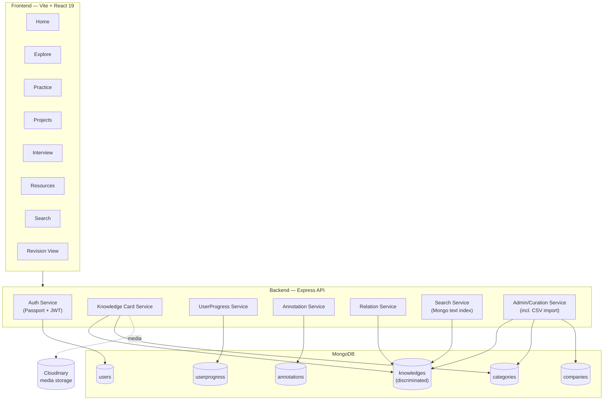

# 03 — Software Requirements Specification (SRS)

**Document:** DevAtlas SRS
**Standard:** Structured after IEEE 830-1998
**Status:** Baseline v1.0 (MVP scope)
**Owner:** Engineering
**Related documents:** `01-vision.md`, `02-personas.md` (if present), `06-database-design.md`, `07-api-design.md`, `08-auth-design.md`, `12-frontend-architecture.md`

---

## 1. Introduction

### 1.1 Purpose

This document specifies the functional and non-functional requirements for **DevAtlas**, a personal-first, community-capable "Developer Operating System." It is written for the engineers building and reviewing DevAtlas (frontend, backend, QA) and for any future contributor who needs an authoritative statement of *what the system must do*, independent of *how it is currently implemented*. Where an implementation decision is already fixed (tech stack, schema strategy), this document states it as a constraint rather than re-deriving it — the "how" for data and API shape lives in `06-database-design.md` and `07-api-design.md`.

### 1.2 Scope

DevAtlas is a single web application (desktop-first, responsive) in which a software engineer learns, revises, documents, and connects everything they know — concepts, DSA problems, interview questions, and project case studies — as one unified content model called a **Knowledge Card**. The product is explicitly:

- **A knowledge engine, not a note app.** Content is structured, typed, and interlinked, not freeform pages.
- **A knowledge engine, not a gamified habit tracker.** There are no streaks, XP, badges, levels, or vanity charts anywhere in this specification.
- **Personal-first, community-capable.** V1 ships with a single canonical content library curated by admins and consumed/personalized by users. Multi-tenant "bring your own content" or public authoring by regular users is out of scope for this SRS (see §1.4).

This SRS covers the MVP release: authentication, the Knowledge Card engine (concept/DSA/interview/project types), navigation (Home, Explore, Practice, Projects, Interview, Resources, Search), personal state (bookmarks/favorites/pins/notes/revision), highlighting/annotation, relations graph, admin authoring and CSV bulk import, and the non-functional envelope (performance, security, scalability, reliability) required to run this in production for a small-to-mid-sized user base.

### 1.3 Definitions, Acronyms, and Abbreviations

| Term | Definition |
|---|---|
| **Knowledge Card** | The single, universal content object in DevAtlas. Every concept, DSA problem, interview question, and project case study is a Knowledge Card distinguished only by its `type`. |
| **Card Type** | The discriminator value on a Knowledge Card: `concept`, `dsa`, `interview`, or `project`. |
| **Category** | A taxonomy node (e.g., "JS", "SQL", "OS") used to organize cards inside Explore. Categories are hierarchical (self-referencing parent), never top-level navigation. |
| **Relation** | A typed, directed edge between two Knowledge Cards (e.g., `depends_on`, `prerequisite`). The set of all relations forms the knowledge graph. |
| **UserProgress** | Per-user, per-card personal state: bookmark, favorite, pin, personal note, revision level/history, mastery signal. Never mutates canonical card content. |
| **Annotation** | A per-user text highlight (with optional inline note) anchored to a specific span of rendered content on a Knowledge Card. |
| **Revision Queue** | The aggregated, cross-type view of all cards a user has marked for revision, ordered by a leveled re-queue algorithm (see §2.2, §4.6). |
| **Visualization** | A diagram attached to a card's Visualization section — either static (Mermaid, server-rendered from stored markup) or interactive (React Flow, admin-authored draggable node/edge graph). |
| **Discriminator** | MongoDB/Mongoose pattern used for the `knowledges` collection: one base schema, type-specific fields injected via Mongoose discriminators keyed on `type`. |
| **JWT** | JSON Web Token. DevAtlas issues its own short-lived access token and longer-lived refresh token after OAuth login. |
| **OAuth** | Open standard for federated login. DevAtlas supports Google and GitHub as the *only* identity providers. |
| **RTK Query** | Redux Toolkit's data-fetching/caching layer; the mandated client-side data layer for all server communication. |
| **ApiResponse / ApiError** | The two canonical backend response envelopes. Every API response, success or failure, uses one of these shapes (see §5.6, `07-api-design.md`). |
| **Admin** | A user with elevated privileges to author/curate canonical Knowledge Cards and manage taxonomy, companies, and users. Granted only via database/seed script. |
| **MVP** | Minimum Viable Product — the release scope covered by this SRS. |

### 1.4 References

- `docs/01-vision.md` — product vision, positioning, non-goals
- `docs/06-database-design.md` — full MongoDB schema, discriminator field maps, indexes
- `docs/07-api-design.md` — full REST endpoint catalogue, request/response contracts
- `docs/08-auth-design.md` — OAuth + JWT cookie flow, refresh/rotation, RBAC
- `docs/12-frontend-architecture.md` — routing, state, component structure
- IEEE Std 830-1998, *Recommended Practice for Software Requirements Specifications* (structural template only; this document is not a formal IEEE submission)

### 1.5 Overview

Section 2 describes DevAtlas at a product level (perspective, functions, user classes, constraints, environment). Section 3 through 5 enumerate functional requirements by module, each with a stable `FR-xxx` identifier for traceability into test plans and PRs. Section 6 covers non-functional requirements (performance, security, scalability, reliability, maintainability, availability). Section 7 states constraints and assumptions. Section 8 gives per-module acceptance criteria.

---

## 2. Overall Description

### 2.1 Product Perspective

DevAtlas is a new, self-contained system — it is not an add-on or module of an existing product. It replaces, for its target user, a fragmented personal stack of: a notes app (Notion/Obsidian) for concepts, a separate DSA tracker (spreadsheet or LeetCode lists), a separate interview-prep document, and separate READMEs for project write-ups. DevAtlas's central architectural bet is that **all four of those artifacts are the same underlying object** — a Knowledge Card — differentiated only by type-specific fields and by which navigation surface (Explore vs. Practice vs. Interview vs. Projects) queries into the same `knowledges` collection with a type filter.

DevAtlas is a client-server web application: a Vite/React single-page application communicating over a REST API (JSON, `ApiResponse`/`ApiError` envelope) with an Express/MongoDB backend. There is no native mobile client in this scope; the frontend is responsive but designed desktop-first, since deep reading/annotation is the primary use case.

### 2.2 Product Functions (Summary)

At a high level, DevAtlas provides:

1. **Federated authentication** via Google or GitHub OAuth only, with DevAtlas-issued JWT session cookies.
2. **A unified Knowledge Card engine** — one content model, one rendering skeleton, four types (concept, DSA, interview, project).
3. **Six content-facing navigation surfaces** — Home, Explore, Practice, Projects, Interview, Resources — plus Search, all reading from the same underlying cards with different filters/framings.
4. **Personal state and revision** — bookmark, favorite, pin, personal note, and a leveled (forgot/shaky/confident) revision re-queue, aggregated into one Revision view, without any streak/XP/badge mechanic.
5. **In-place reading annotation** — color-coded highlights with optional notes, persisted per user, per card.
6. **A typed relation graph** connecting cards to each other, rendered as a "Related Topics" section and (for select cards) an interactive graph visualization.
7. **Admin authoring & curation** — canonical card CRUD, taxonomy/category management, company tagging, bulk CSV import for DSA questions, user role management.
8. **Search** — full-text search with facet filters (type, category, difficulty, company) across all card types.

### 2.3 User Classes and Characteristics

DevAtlas has exactly two roles. There is no self-serve upgrade path between them.

| Class | Description | Technical proficiency | Typical goals | Access level |
|---|---|---|---|---|
| **User** (default role) | Software engineers/students using DevAtlas to learn, revise, and prep. The overwhelming majority of accounts. | High (the product's own audience is developers) but *not* assumed to be DevAtlas-familiar on day one. | Read cards, annotate/highlight, bookmark/favorite/pin, track personal revision, browse projects and interview prep, search. | Full read on all published canonical content; full CRUD on their own `userprogress` and `annotations` documents only. No write access to canonical `knowledges`, `categories`, or `companies`. |
| **Admin** | A small, trusted set of content curators/maintainers (product owner, a handful of contributing engineers). Granted via DB/seed script only — **there is no admin signup or self-promotion flow**. | High; expected to understand Markdown, Mermaid syntax, and the card schema. | Author and maintain canonical Knowledge Cards, manage taxonomy (categories), manage companies list, bulk-import DSA questions via CSV, moderate/manage user accounts (role, ban/disable). | Everything a User can do, plus full CRUD on canonical `knowledges`, `categories`, `companies`, and read/role-management access on `users`. Admins do **not** see other users' `userprogress` or `annotations` content (privacy boundary — see §5.5, FR-SEC-06). |

There is no "guest"/anonymous role for MVP: reading a Knowledge Card requires an authenticated session (see §7.3, Constraint C-3, and NFR discussion in §6.3). This is a deliberate simplification — public/anonymous browsing is future scope.

### 2.4 Operating Environment

- **Client runtime:** Evergreen desktop browsers — Chrome, Edge, Firefox, Safari (last 2 major versions). Minimum viewport 1024px for full layout fidelity; responsive down to 375px with graceful reflow (single-column card layout, collapsed nav).
- **Client framework:** Vite 8 + React 19 SPA (not Next.js — no server-side rendering in MVP). React Router v7 for client-side routing. Redux Toolkit + RTK Query for state and data fetching. Tailwind CSS v4 (CSS variables, oklch neutral palette) with shadcn/base-nova components on `@base-ui/react`. `next-themes` for light/dark, driven by a `.dark` class plus `prefers-color-scheme`. Framer Motion (`motion` package) for transitions. `react-markdown` + `remark-gfm` + rehype syntax highlighting for rendering card body content. `@xyflow/react` for interactive visualizations, `mermaid` for static diagrams.
- **Server runtime:** Node.js (ESM, `"type": "module"`), Express, deployed as a stateless HTTP service (horizontally scalable — no in-memory session state; auth state lives in signed JWT cookies).
- **Database:** MongoDB (single replica set minimum for production; Mongoose ODM). `knowledges` collection uses Mongoose discriminators keyed on `type`.
- **Media storage:** Cloudinary (images, and card-attached media). Uploads flow through local disk (Multer, `backend/public/temp` scratch dir) then to Cloudinary, with local temp file deletion post-upload.
- **Auth provider dependency:** Google OAuth 2.0 and GitHub OAuth apps (external dependency — see §7.3 Constraints).
- **Network:** HTTPS only in any non-local environment; cookies are `Secure`, `httpOnly`, `SameSite=Lax` (see `08-auth-design.md` for full cookie policy).

---

## 3. Functional Requirements — Authentication & Authorization

| ID | Requirement |
|---|---|
| **FR-AUTH-01** | The system shall allow a user to initiate login via Google OAuth 2.0. |
| **FR-AUTH-02** | The system shall allow a user to initiate login via GitHub OAuth (passport-github2). |
| **FR-AUTH-03** | The system shall NOT provide any email/password registration or login mechanism, under any route, at any time. |
| **FR-AUTH-04** | On successful OAuth callback, the system shall create a `User` document on first login (auto-provisioning) or match an existing user by verified provider email, then issue a DevAtlas-signed short-lived JWT access token and a longer-lived refresh token, both set as `httpOnly`, `Secure` cookies. |
| **FR-AUTH-05** | The system shall persist a hash of the current refresh token on the `User` document to support server-side revocation (logout, forced sign-out). |
| **FR-AUTH-06** | The system shall provide a token refresh endpoint that, given a valid refresh cookie, issues a new access token (rotating the refresh token per `08-auth-design.md` policy) without requiring re-authentication with the OAuth provider. |
| **FR-AUTH-07** | The system shall provide a logout action that invalidates the refresh token server-side and clears both auth cookies. |
| **FR-AUTH-08** | The system shall reject any request to a protected route with an expired or missing access token with a `401` `ApiError`, distinct from a `403` for role-forbidden requests. |
| **FR-AUTH-09** | The system shall enforce a `role` enum of exactly `["user", "admin"]` on every `User` document, defaulting to `"user"` on creation, with no API path capable of setting `role: "admin"` on oneself or another account. |
| **FR-AUTH-10** | The system shall expose an authenticated "current user" endpoint returning profile (name, avatar, email, role, joined date) sourced from the OAuth provider on first login. |
| **FR-AUTH-11** | If a future release allows linking multiple OAuth providers to one account, the system shall always require at least one linked provider to remain — an "unlink last provider" request shall be rejected with a `409` `ApiError`. Multi-provider linking itself is out of scope for MVP (single provider per account at signup). |

---

## 4. Functional Requirements — Knowledge Card Engine

### 4.1 Card Model & Rendering

| ID | Requirement |
|---|---|
| **FR-CARD-01** | The system shall model all learnable content as a single `Knowledge Card` entity in the `knowledges` collection, discriminated by a `type` field with allowed values `concept`, `dsa`, `interview`, `project`. Field-level schema is authoritative in `06-database-design.md`. |
| **FR-CARD-02** | The system shall render every Knowledge Card, regardless of type, through the identical page skeleton, in this fixed order: **Header** (Title, Tags, Difficulty, Read Time, Last Updated) → **TLDR** → **Deep Explanation** → **Visualization** → **Code Examples** → **Interview Questions** → **Mistakes** → **Resources** → **Related Topics**. |
| **FR-CARD-03** | The system shall render a card section as absent/collapsed (not as an empty placeholder) when that type does not populate it, while preserving the section order for all sections that do have content. |
| **FR-CARD-04** | The system shall render card body content (TLDR, Deep Explanation, Mistakes, Resources) from stored Markdown via `react-markdown` + `remark-gfm`, with fenced code blocks syntax-highlighted by language. |
| **FR-CARD-05** | The system shall display a computed or admin-set **Read Time** (minutes) and a **Last Updated** timestamp in the card header. |
| **FR-CARD-06** | The system shall display a **Difficulty** badge (`easy` / `medium` / `hard`, or type-appropriate equivalent) in the card header when set. |
| **FR-CARD-07** | The system shall render the **Visualization** section as either a static Mermaid diagram (server-stored diagram source, client-rendered) or an interactive React Flow node/edge diagram (admin-authored layout, user pan/zoom/drag at view time; user's node positions are not persisted in MVP — layout resets to admin-authored default on reload). |
| **FR-CARD-08** | The system shall render **Interview Questions** embedded within the card as a list of question/answer blocks tied to that card's content — not as a separate flashcard object — each optionally linkable to the dedicated Interview module. |
| **FR-CARD-09** | The system shall render **Related Topics** as a list of typed relation links (see §4.7) grouped or labeled by relation type, each navigable to the related card. |
| **FR-CARD-10** | The system shall support tagging a card with one or more free-text/controlled tags in addition to its Category assignment, both used for filtering and search. |
| **FR-CARD-11** | The system shall support attaching zero or more media assets (diagrams, screenshots) to a card via Cloudinary-hosted URLs. |

### 4.2 Type-Specific Fields

| ID | Requirement |
|---|---|
| **FR-CARD-12** | For `type: "concept"` cards, the system shall support the base skeleton with no additional required fields beyond those in §4.1 (e.g., "Promise", "JWT", "Morris Traversal"). |
| **FR-CARD-13** | For `type: "dsa"` cards, the system shall additionally support: problem statement, constraints, examples (input/output), one or more solution approaches each with time/space complexity, and links to external judges (e.g., LeetCode number/URL) where available. |
| **FR-CARD-14** | For `type: "interview"` cards, the system shall additionally support: associated company tags (ref. `companies` collection), role/level tags (e.g., "SDE-2", "Frontend"), and a canonical answer body, while remaining renderable through the same skeleton. |
| **FR-CARD-15** | For `type: "project"` cards, the system shall additionally support structured case-study sections (Overview, Architecture, Database, Auth, Real-time, Cloud Media, Notifications, Deployment, Problems Faced, Lessons Learned) rendered within the Deep Explanation region, where each named technical block (e.g., "Authentication") supports an inline deep-link relation to the matching concept card (e.g., the JWT card) via `implements` or `used_in` relation types. |
| **FR-CARD-16** | The system shall allow a `project` card's Architecture block to embed a React Flow or Mermaid diagram identically to §4.1 FR-CARD-07. |

### 4.3 Categories & Taxonomy

| ID | Requirement |
|---|---|
| **FR-CAT-01** | The system shall model `Category` as a self-referencing collection (optional `parent` ref) supporting at least 2 levels of nesting (e.g., Frontend → JS → Closures), with room for deeper nesting where curation requires it. |
| **FR-CAT-02** | The system shall seed/maintain a fixed top-level category set including at minimum: Frontend, Backend, DSA, Database, OS, CN, AI, System Design, Projects, Interview, Misc. |
| **FR-CAT-03** | The system shall require every Knowledge Card to belong to exactly one primary Category (additional tags, §4.1 FR-CARD-10, are supplementary and unlimited). |
| **FR-CAT-04** | The Explore module shall render Categories as a browsable hierarchy (not top-level nav — Categories are a filter/browse dimension inside Explore only). |

### 4.4 Relations Graph

| ID | Requirement |
|---|---|
| **FR-REL-01** | The system shall support typed, directed relations between any two Knowledge Cards using exactly the relation types: `related_to`, `depends_on`, `used_in`, `implements`, `alternative`, `prerequisite`, `example_of`, `part_of`, `referenced_by`. |
| **FR-REL-02** | The system shall allow admins to create, edit, and delete relations between cards through the admin authoring interface, including selecting the relation type per edge. |
| **FR-REL-03** | The system shall render a card's outgoing (and, where meaningful, incoming) relations in its **Related Topics** section, grouped by relation type. |
| **FR-REL-04** | The system shall prevent a card from declaring a relation to itself (`self-reference` rejected with `400` `ApiError`). |
| **FR-REL-05** | The system shall support querying "all cards that declare `prerequisite` of card X" (inverse lookup) to power both Related Topics and any future graph visualization. |

### 4.5 Search

| ID | Requirement |
|---|---|
| **FR-SRCH-01** | The system shall provide a global Search surface, reachable from top-level nav, that full-text searches across Title, Tags, TLDR, and Deep Explanation fields of all Knowledge Cards using MongoDB weighted text indexes. |
| **FR-SRCH-02** | The system shall support facet filters on search results for: card `type`, `category`, `difficulty`, and `company` (for interview-tagged content). |
| **FR-SRCH-03** | The system shall return search results ranked by MongoDB text score, with facet filters applied as a query-time `$match` prior to scoring. |
| **FR-SRCH-04** | The system shall debounce live search-as-you-type requests client-side (target: 300ms) to avoid redundant API calls. |
| **FR-SRCH-05** | Atlas Search / Elasticsearch-grade relevance (fuzzy match, typo tolerance, synonym expansion) is explicitly out of scope for MVP search; this is documented as a known limitation, not a defect. |

### 4.6 Personal State & Revision

| ID | Requirement |
|---|---|
| **FR-PROG-01** | The system shall allow a user to toggle **Bookmark** on any Knowledge Card, persisted in `userprogress` keyed by `(user, knowledge)`, without mutating the canonical card. |
| **FR-PROG-02** | The system shall allow a user to toggle **Favorite** on any Knowledge Card, independent of Bookmark state. |
| **FR-PROG-03** | The system shall allow a user to **Pin** a card for priority surfacing on their Home view, with a reasonable cap (e.g., 10 pinned cards) enforced to preserve the "no clutter" reading experience. |
| **FR-PROG-04** | The system shall allow a user to attach a personal free-text **Note** to any card, private to that user, editable and deletable at any time, stored in `userprogress` (not in `annotations`, which is span-anchored — see §4.7). |
| **FR-PROG-05** | The system shall allow a user to mark any card **for revision**, initializing a revision state on that `userprogress` document. |
| **FR-PROG-06** | The system shall support three revision self-assessment inputs — **forgot**, **shaky**, **confident** — recorded each time a user reviews a card from the Revision queue. |
| **FR-PROG-07** | The system shall re-queue a reviewed card using a leveled interval scheme (not literal SM-2): `forgot` resets the card to the shortest re-surface interval (e.g., next day), `shaky` sets a medium interval (e.g., 3–4 days), `confident` sets a longer interval (e.g., 7–14 days) and, after repeated `confident` reviews, progressively longer intervals up to a cap, at which point the card is considered mastered and stops auto-resurfacing until manually re-marked. |
| **FR-PROG-08** | The system shall aggregate all cards a user has marked for revision — regardless of `type` — into a single **Revision** view, sorted by next-due date ascending, with overdue items visually distinguished. |
| **FR-PROG-09** | The system shall NOT implement or display streaks, XP, points, badges, levels, or any gamification affordance anywhere in the Revision view or elsewhere in the product. |
| **FR-PROG-10** | The system shall allow a user to remove a card from their revision set at any time without deleting their notes/highlights/bookmark on that card. |
| **FR-PROG-11** | The system shall record a lightweight revision history (timestamp + self-assessment) per `userprogress` document sufficient to compute the next-due date, without surfacing it as a "streak" or vanity chart to the user (internal/debug use only, or a simple factual "last reviewed" timestamp is permitted). |

### 4.7 Reading Experience — Highlights & Annotations

| ID | Requirement |
|---|---|
| **FR-ANNOT-01** | The system shall allow a user to select a span of rendered text on a Knowledge Card and apply a color-coded highlight (minimum 4 colors) to that span. |
| **FR-ANNOT-02** | The system shall allow a user to optionally attach a short inline note to a highlighted span. |
| **FR-ANNOT-03** | The system shall persist each highlight/annotation in the `annotations` collection keyed by `(user, knowledge, anchor)`, where `anchor` is a stable positional reference (e.g., block index + character offset, or a text-quote anchor) resilient to minor whitespace changes but not required to survive a full content rewrite of that block. |
| **FR-ANNOT-04** | The system shall re-render a user's own highlights/notes automatically whenever they revisit a card they previously annotated, with no action required to "load" annotations. |
| **FR-ANNOT-05** | The system shall allow a user to edit or delete their own highlight/annotation. |
| **FR-ANNOT-06** | The system shall scope all annotations strictly to the owning user — no other user (including admins, per FR-SEC-06) can view another user's highlights or notes through any product surface. |
| **FR-ANNOT-07** | If the underlying card content is edited by an admin such that a stored anchor can no longer be resolved, the system shall gracefully drop the highlight's visual rendering (log/soft-orphan the annotation record) rather than error the page render. |

---

## 5. Functional Requirements — Navigation Modules, Admin, and Platform

### 5.1 Home

| ID | Requirement |
|---|---|
| **FR-HOME-01** | The system shall present, on Home, the current user's pinned cards, due/overdue revision items, and recently viewed cards — factual, personally-relevant surfaces only (no vanity stats, no streak counters). |
| **FR-HOME-02** | The system shall allow navigation from Home directly into any surfaced card or into the Revision view. |

### 5.2 Explore

| ID | Requirement |
|---|---|
| **FR-EXP-01** | The system shall present Explore as a Category-driven browse surface across all card types (primarily `concept`, but not type-restricted), using the hierarchy from §4.3. |
| **FR-EXP-02** | The system shall support filtering within Explore by Category, tag, difficulty, and card type simultaneously. |
| **FR-EXP-03** | The system shall support both a grid/list card view and, where curated, a category-level landing page summarizing its child topics. |

### 5.3 Practice

| ID | Requirement |
|---|---|
| **FR-PRAC-01** | The system shall present Practice as the DSA-focused surface, listing `type: "dsa"` cards filterable by difficulty, category (e.g., Arrays, Graphs, DP), company tag, and completion/bookmark state. |
| **FR-PRAC-02** | The system shall render each DSA card through the standard skeleton (§4.1), with the Code Examples section showing solution approach(es) and the Interview Questions section (where populated) showing related conceptual follow-ups. |
| **FR-PRAC-03** | The system shall allow a user to mark a DSA card as solved/attempted, persisted in `userprogress`, without this becoming a streak or points mechanic. |

### 5.4 Projects

| ID | Requirement |
|---|---|
| **FR-PROJ-01** | The system shall present Projects as a listing of `type: "project"` cards, each opening into the full case-study skeleton described in §4.2 FR-CARD-15. |
| **FR-PROJ-02** | The system shall render every technical block within a project case study (e.g., Authentication, Real-time, Deployment) with at least one deep-link relation to the corresponding concept card when such a card exists in the taxonomy. |

### 5.5 Interview

| ID | Requirement |
|---|---|
| **FR-INT-01** | The system shall present Interview as a dedicated module aggregating `type: "interview"` cards plus surfacing embedded interview-question blocks from `concept`/`dsa`/`project` cards, filterable by company and role/level tag. |
| **FR-INT-02** | The system shall cross-link every interview item back to its source Knowledge Card (the concept, DSA problem, or project it was embedded in), reinforcing the "one engine" model rather than duplicating content as standalone flashcards. |
| **FR-INT-03** | The system shall NOT persist stored Q&A "flashcard" objects as a separate content type; all interview content is either a full `type: "interview"` Knowledge Card or an embedded question block on another card type (§4.1 FR-CARD-08). |

### 5.6 Resources

| ID | Requirement |
|---|---|
| **FR-RES-01** | The system shall present Resources as a curated, admin-maintained list of external links/references (books, courses, docs) organized by Category, distinct from the per-card "Resources" section (§4.1) which is card-scoped. |

### 5.7 Admin & Content Authoring

| ID | Requirement |
|---|---|
| **FR-ADM-01** | The system shall provide an admin-only authoring interface to create, edit, publish/unpublish, and delete Knowledge Cards of any type. |
| **FR-ADM-02** | The system shall provide an admin-only bulk import for `type: "dsa"` cards via CSV upload, validating required columns (title, difficulty, category, statement, at minimum) and reporting per-row success/failure in the response rather than failing the whole batch atomically. |
| **FR-ADM-03** | The system shall provide admin CRUD over the `Category` taxonomy, including reparenting nodes. |
| **FR-ADM-04** | The system shall provide admin CRUD over the `Company` list used for interview tagging. |
| **FR-ADM-05** | The system shall provide an admin user-management view: list users, view role, promote/demote role, and disable/re-enable an account. Admins cannot self-demote if doing so would leave zero admins in the system (reject with `409` `ApiError`). |
| **FR-ADM-06** | The system shall provide admin CRUD over relations between cards (§4.4). |
| **FR-ADM-07** | The system shall version-stamp every canonical card edit with an `updatedAt` timestamp and (recommended, non-blocking for MVP) an editor identity, surfaced as "Last Updated" per FR-CARD-05. |
| **FR-ADM-08** | The system shall restrict every admin-only endpoint at the middleware layer (role check on the verified JWT), returning `403` `ApiError` for any authenticated non-admin request, in addition to any UI-level hiding of admin controls. |
| **FR-ADM-09** | The system shall NOT expose any endpoint allowing a user to elevate their own role, directly or indirectly (e.g., via a generic "update profile" endpoint that accidentally accepts a `role` field). |

### 5.8 Platform / Cross-Cutting

| ID | Requirement |
|---|---|
| **FR-PLAT-01** | Every API response, success or error, shall conform to the `ApiResponse` (`statusCode`, `success: true`, `message`, `data`) or `ApiError` (`statusCode`, `message`, `errors[]`, `success: false`) envelope — no endpoint may return a bare/unwrapped JSON body. |
| **FR-PLAT-02** | Every mutating controller shall be wrapped in `asyncHandler` such that thrown/rejected errors are forwarded to centralized error-handling middleware rather than crashing the process or leaking stack traces to the client in production. |
| **FR-PLAT-03** | Media upload endpoints shall accept a file via Multer to local disk (`backend/public/temp`), upload to Cloudinary, then delete the local temp file on both success and failure paths. |
| **FR-PLAT-04** | The system shall support light and dark theme, user-toggleable, persisted client-side, defaulting to OS preference (`prefers-color-scheme`) on first visit. |
| **FR-PLAT-05** | The system shall not introduce brand color, gradients, or glow/neon visual effects anywhere in the UI — the visual language is restricted to the neutral oklch grayscale palette already defined in `frontend/src/index.css` (enforced at design-review level, not machine-testable, but stated here as a binding product requirement). |

---

## 6. Non-Functional Requirements

### 6.1 Performance Requirements

| ID | Requirement |
|---|---|
| **NFR-PERF-01** | 95th-percentile API response time for single-document reads (card fetch by slug/id, current-user profile) shall be ≤ 300ms under nominal load (excluding cold-start/cold-cache). |
| **NFR-PERF-02** | 95th-percentile API response time for list/search endpoints (Explore listing, Search, Practice listing) with facet filters shall be ≤ 600ms for result sets up to 10,000 matching documents, assuming appropriate compound/text indexes exist per `06-database-design.md`. |
| **NFR-PERF-03** | Initial client bundle (first meaningful paint of Home) shall achieve Largest Contentful Paint ≤ 2.5s on a simulated "Fast 3G / mid-tier laptop" Lighthouse profile. |
| **NFR-PERF-04** | Card detail pages shall be code-split from the admin authoring bundle and from `@xyflow/react`/`mermaid` rendering code, lazy-loaded only when a Visualization section is present, to avoid penalizing text-only cards. |
| **NFR-PERF-05** | Annotation create/update calls shall be optimistically applied in the client (RTK Query optimistic update) so highlight rendering feels instantaneous (< 50ms perceived), with server confirmation reconciling in the background. |
| **NFR-PERF-06** | CSV bulk import (FR-ADM-02) shall process at least 500 DSA rows within 30 seconds server-side, streaming/batching writes rather than loading the full result set into a single unbounded array before responding. |

### 6.2 Scalability Requirements

| ID | Requirement |
|---|---|
| **NFR-SCALE-01** | The Express API shall be stateless (no in-process session storage) so that it can be horizontally scaled behind a load balancer by running additional Node instances, with auth state carried entirely in signed JWT cookies. |
| **NFR-SCALE-02** | The `knowledges` collection shall be designed (per `06-database-design.md`) to remain performant to at least 100,000 documents with the discriminator pattern, supported by compound indexes on `(type, category)`, `(type, difficulty)`, and a weighted text index for search. |
| **NFR-SCALE-03** | The `userprogress` and `annotations` collections, which grow with (users × cards), shall be indexed on `(user, knowledge)` as a compound unique/lookup key to keep personal-state reads O(1) regardless of total user count. |
| **NFR-SCALE-04** | Media assets shall be served from Cloudinary's CDN, not from the application server, so that image/diagram bandwidth does not scale with API server load. |
| **NFR-SCALE-05** | Search is explicitly scoped to MongoDB text indexes for MVP (§4.5 FR-SRCH-05); the system shall be architected (search calls isolated behind a `SearchService` interface) such that swapping to Atlas Search/Elasticsearch later does not require changes to calling controllers — this is a stated future-scalability seam, not an MVP deliverable. |

### 6.3 Security Requirements

| ID | Requirement |
|---|---|
| **NFR-SEC-01** | All authentication shall occur exclusively via Google and GitHub OAuth 2.0 (Passport strategies); the system shall never store or accept a user-chosen password. |
| **NFR-SEC-02** | JWT access and refresh tokens shall be stored only in `httpOnly`, `Secure`, `SameSite=Lax` cookies — never in `localStorage`/`sessionStorage`, never returned in a JSON response body. |
| **NFR-SEC-03** | Refresh tokens shall be stored server-side only as a hash (never plaintext) on the `User` document, enabling revocation on logout or suspected compromise. |
| **NFR-SEC-04** | Every mutating endpoint shall validate the caller's role server-side (middleware-enforced), independent of any client-side UI gating; role checks shall never trust a client-supplied role/claim outside the verified JWT signature. |
| **NFR-SEC-05** | All user-supplied Markdown (personal notes, admin-authored card body) shall be sanitized at render time to prevent stored XSS — `react-markdown` shall be configured without `dangerouslySetInnerHTML`/raw-HTML passthrough for user-originated content; admin-authored canonical content may permit a stricter allow-listed HTML subset if needed for diagrams, reviewed at PR time. |
| **NFR-SEC-06** | A user's `userprogress` and `annotations` documents shall be readable and writable only by that user — enforced at the query layer (always scoped by authenticated `user` id from the JWT, never by client-supplied user id) — with **no admin bypass**, since these are explicitly personal, not canonical, data. |
| **NFR-SEC-07** | All state-changing requests (POST/PUT/PATCH/DELETE) shall be protected against CSRF given the cookie-based auth model — via `SameSite=Lax` cookies plus a double-submit CSRF token or equivalent on unsafe methods called from non-simple contexts (per `08-auth-design.md`). |
| **NFR-SEC-08** | All admin CSV import and media upload inputs shall be validated for MIME type/extension and size limits before processing; uploaded files shall never be executed or served from a path reachable as application code. |
| **NFR-SEC-09** | Passwords are never applicable (NFR-SEC-01), but all secrets (OAuth client secrets, JWT signing keys, Cloudinary API secret, MongoDB connection string) shall be supplied via environment variables, never committed to the repository. |
| **NFR-SEC-10** | The system shall apply rate limiting on authentication endpoints (OAuth callback, refresh) and on search/list endpoints to mitigate abuse and scraping of the canonical content library. |
| **NFR-SEC-11** | All cross-origin requests shall be restricted via an explicit CORS allow-list (the deployed frontend origin(s) only), with credentials mode enabled only for that allow-list. |

### 6.4 Reliability Requirements

| ID | Requirement |
|---|---|
| **NFR-REL-01** | The system shall not lose a user's committed annotation, note, or revision-state write once the API has returned a `2xx` success response — writes are acknowledged to MongoDB before the response is sent. |
| **NFR-REL-02** | A failure in the Visualization rendering (malformed Mermaid source, React Flow layout error) shall degrade to a visible "diagram unavailable" state within that section only, and shall never crash or blank the rest of the card page (error boundary isolation). |
| **NFR-REL-03** | A failure/timeout in the Cloudinary upload step shall roll back cleanly (local temp file still deleted, no orphaned partial media reference persisted on the card), and shall return a clear `ApiError` to the admin uploader. |
| **NFR-REL-04** | The centralized Express error-handling middleware shall catch all unhandled promise rejections/exceptions from `asyncHandler`-wrapped controllers and respond with a well-formed `ApiError` rather than a raw 500 HTML stack trace, in all environments. |
| **NFR-REL-05** | Token refresh (FR-AUTH-06) shall be safe under concurrent requests from multiple browser tabs (no more than one refresh rotation "wins" per refresh token; racing tabs receive a valid session rather than being logged out due to a refresh race). |

### 6.5 Availability Requirements

| ID | Requirement |
|---|---|
| **NFR-AVAIL-01** | The production API and database shall target 99.5% monthly uptime (≈ 3.6 hours/month allowable downtime), appropriate for a personal-productivity tool rather than a transactional/financial system. |
| **NFR-AVAIL-02** | Planned maintenance (schema migrations, dependency upgrades) shall be performed in low-traffic windows and shall not require deleting or invalidating existing user sessions unless the JWT signing key itself is rotated. |
| **NFR-AVAIL-03** | The MongoDB deployment shall run as a replica set (minimum 3-node, or managed Atlas equivalent) in production to survive single-node failure without data loss or full outage. |

### 6.6 Maintainability Requirements

| ID | Requirement |
|---|---|
| **NFR-MAINT-01** | All backend controllers shall consistently use the existing `ApiError`/`ApiResponse`/`asyncHandler` utilities (§5.6 FR-PLAT-01/02) — no ad hoc response shapes — so that error handling and client-side unwrapping logic (RTK Query base query) remain uniform across the entire API surface. |
| **NFR-MAINT-02** | The Knowledge Card schema shall remain a single base schema with Mongoose discriminators (never four independent collections) so that cross-type features (search, relations, revision, annotations) continue to operate against one collection without per-type special-casing at the query layer. |
| **NFR-MAINT-03** | All four card types shall share one React page-skeleton component, with type-specific sections implemented as swappable/conditional sub-components — not four separate page implementations — so that a layout change (§4.1) is made once. |
| **NFR-MAINT-04** | New relation types, if ever added beyond the fixed set in FR-REL-01, shall require only a schema enum change and admin-UI dropdown update, not a data migration of existing relation documents. |
| **NFR-MAINT-05** | Environment-specific configuration (API base URL, OAuth client IDs, Cloudinary cloud name) shall be centralized in environment variables / a single config module per app, not scattered as inline literals. |

---

## 7. Constraints and Assumptions

### 7.1 Constraints

- **C-1 (Stack lock-in):** Frontend is Vite + React 19 with React Router v7, Redux Toolkit + RTK Query, Tailwind v4, shadcn/base-nova on `@base-ui/react`, Framer Motion, react-markdown/remark-gfm, `@xyflow/react`, and mermaid. Backend is Node ESM + Express + Mongoose/MongoDB with Passport (Google + GitHub only) and Cloudinary. These are fixed for MVP; this SRS does not entertain alternative frameworks.
- **C-2 (No password auth, ever):** The product deliberately excludes email/password login as a design decision, not a deferred feature. No requirement in this document may be satisfied by adding one.
- **C-3 (Authenticated-only reading):** MVP requires a logged-in session to read any Knowledge Card content; there is no anonymous/public browsing mode.
- **C-4 (Single canonical library):** Only admins author canonical content in MVP; there is no user-submitted-content or peer-review workflow. "Community-capable" describes future roadmap, not MVP scope.
- **C-5 (No gamification, permanently):** Streaks, XP, coins, badges, levels, and vanity analytics are out of scope by product philosophy, not by current prioritization — no future phase of this SRS lineage should reintroduce them without a deliberate philosophy change documented in `01-vision.md`.
- **C-6 (One page skeleton):** All card types must fit the nine-section skeleton (§4.1); a card type requiring a fundamentally different layout is a signal to reconsider whether it belongs in the `Knowledge Card` model at all, not a reason to add tabs/alternate layouts.
- **C-7 (MongoDB text search only):** Elasticsearch/Atlas Search integration is explicitly deferred; search relevance quality is bounded by what MongoDB weighted text indexes can deliver in MVP.

### 7.2 Assumptions

- **A-1:** Target users already have a Google or GitHub account; requiring OAuth is not an adoption blocker for a developer-tool audience.
- **A-2:** Initial content volume is admin-curated and will grow incrementally (tens to low-thousands of cards in year one), not bulk-ingested from a third-party corpus at launch (CSV import is for DSA problem sets specifically, not general content migration).
- **A-3:** The user base for MVP is small-to-mid scale (hundreds to low-thousands of MAU), consistent with the "personal-first" framing; NFR-SCALE and NFR-AVAIL targets are set accordingly and are not designed for viral/consumer-scale traffic.
- **A-4:** A small number of trusted individuals will hold the admin role; admin UX can therefore favor completeness/power over hand-holding (e.g., Markdown/Mermaid authored directly, not via a WYSIWYG abstraction) in MVP.
- **A-5:** Desktop is the primary reading context (long-form technical content, code, diagrams); mobile responsiveness is required for graceful access, not optimized as the primary experience in MVP.
- **A-6:** Cloudinary's free/starter tier is sufficient for MVP media volume; cost-scaling of media storage is a later operational concern, not a v1 design constraint.

---

## 8. Acceptance Criteria by Module

### 8.1 Authentication
- A user with no prior DevAtlas account can complete Google OR GitHub OAuth and land on Home with a valid session (access + refresh cookies set) within one round trip to the provider.
- No route, form, or API endpoint anywhere in the product accepts a password.
- An expired access token is transparently refreshed via the refresh cookie without the user noticing (no forced re-login) as long as the refresh token is valid and unused elsewhere.
- Logging out on one device does not log out other active sessions unless the user explicitly chose "sign out everywhere" (if offered) — otherwise only the current refresh token is revoked.
- A non-admin account can never reach an admin-only route or receive a `2xx` from an admin-only endpoint.

### 8.2 Knowledge Card Engine
- Opening any card of any of the four types renders the same nine-section skeleton in the same order; sections with no content are omitted, not shown empty.
- A `dsa` card displays complexity-annotated solution approaches in Code Examples; a `project` card displays all populated case-study blocks with at least the Authentication block deep-linking to a concept card when one exists in taxonomy.
- Switching light/dark theme does not shift layout or introduce any color outside the neutral oklch palette.
- A card with a malformed Mermaid source renders the rest of the page normally with a contained "diagram unavailable" notice in the Visualization section only.

### 8.3 Explore / Practice / Projects / Interview / Resources / Search
- Explore lists categories at the correct hierarchy depth and never surfaces a Category as a top-level nav item.
- Practice filters DSA cards correctly by any single filter and by combinations of difficulty + category + company simultaneously.
- Interview module surfaces both dedicated `interview` cards and embedded interview-question blocks from other types, each cross-linking back to its source card, with zero standalone flashcard objects in the data model.
- Search returns relevant results ranked above irrelevant ones for at least the seeded/representative query set used in QA, and facet filters narrow result counts monotonically (never increase count when a filter is added).

### 8.4 Personal State & Revision
- Bookmark/Favorite/Pin/Note toggles persist across logout/login and across devices for the same account.
- Marking a card `forgot` schedules it sooner than marking it `confident`, verifiable by comparing `nextDueAt` before/after the assessment call.
- The Revision view never displays a streak counter, point total, badge, or percentage-complete gamified metric — only factual due/overdue state.
- Removing a card from revision preserves its bookmark, note, and highlights.

### 8.5 Annotations
- A highlight created on a card is visible on next page load for the same user and invisible to any other test account viewing the same card.
- Editing the underlying card's paragraph structure does not crash the page for a user with a stale annotation anchor; the orphaned highlight simply does not render.

### 8.6 Relations Graph
- Creating a `prerequisite` relation from card B to card A makes A discoverable both from B's Related Topics and via the inverse lookup (cards that list B as depending on/requiring A), per FR-REL-05.
- Attempting to relate a card to itself is rejected with a `400 ApiError` and no document is written.

### 8.7 Admin & Curation
- A CSV of 500 well-formed DSA rows imports successfully within the NFR-PERF-06 time bound, and a CSV with 10 malformed rows among 500 imports the 490 valid rows and reports the 10 failures individually rather than aborting the whole batch.
- Demoting the last remaining admin account is rejected with a `409 ApiError`.
- Every admin mutation is rejected for a `user`-role JWT at the middleware layer even if the request is crafted directly against the API (not just hidden in the UI).

### 8.8 Platform / Non-Functional
- Every API response observed in QA (success and error paths) conforms to the `ApiResponse`/`ApiError` envelope with no exceptions.
- No secret (OAuth client secret, JWT signing key, Cloudinary secret, Mongo URI) appears in client-side bundles or repository history.
- p95 latency targets in §6.1 are met under a representative load test (e.g., k6/Artillery script) covering card read, search, and annotation-write endpoints prior to production sign-off.

---

*End of document. For data model detail, see `06-database-design.md`. For endpoint-level contracts, see `07-api-design.md`. For the OAuth/JWT cookie lifecycle in full, see `08-auth-design.md`.*
