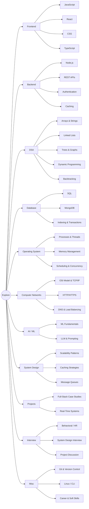
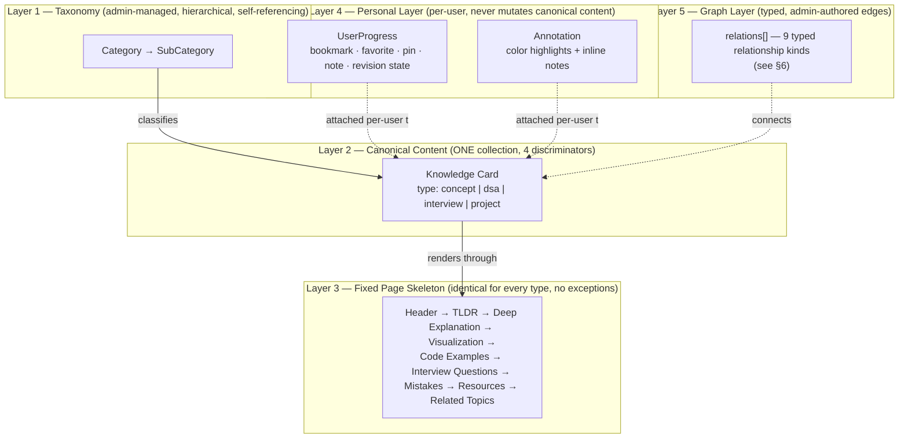
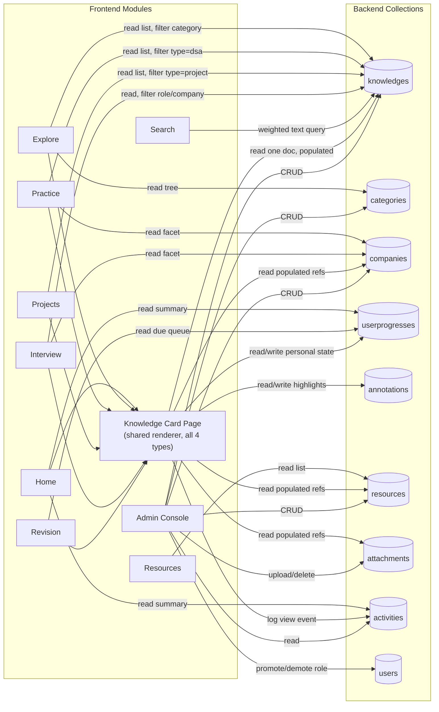
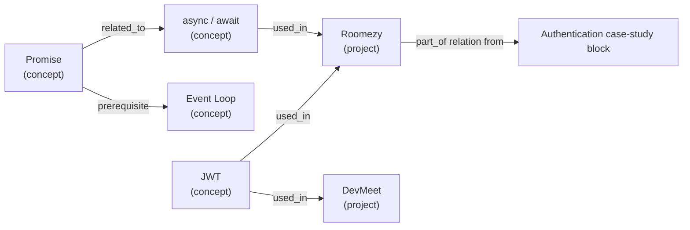

# 04 — Information Architecture

> Defines *how DevAtlas is navigated and organized*, not *how it's stored* (`06-database-design.md`) or *what ships* (`02-prd.md`). Every diagram here should be read as the map a user (or an admin) actually clicks through, and every category/entity named here maps 1:1 onto the schema in `06-database-design.md` — this document does not introduce new fields or collections, only the navigable structure around them.

## 1. IA Principles

1. **Top-level nav = activities, not storage.** The seven primary destinations (Home, Explore, Practice, Projects, Interview, Resources, Search) mirror what an engineer is *doing* — browsing a subject, drilling DSA, reading a case study, prepping for a role, searching cold. None of them is a folder.
2. **Explore is subject-first; Practice/Projects/Interview are type-first.** Both are lenses over the exact same `knowledges` collection, just filtered differently — see §3 for why `DSA`, `Projects`, and `Interview` legitimately exist as *both* a Category (inside Explore) and a top-level nav destination without being a duplicate system.
3. **Revision is a view, not a destination in the primary nav.** Per the core philosophy, revision is personal state layered on cards, not a sixth "module" competing with Explore/Practice/etc. It lives one click away from Home and behind a persistent header icon — see §2.
4. **Every leaf node is the same page shape.** Regardless of which module a user arrives from, drilling into any card lands on the identical Knowledge Card skeleton (Header → TLDR → Deep Explanation → Visualization → Code Examples → Interview Questions → Mistakes → Resources → Related Topics), defined in `01-product-vision.md` §3. IA diagrams below all terminate at that one page type.

---

## 2. Full Site Navigation Tree

```mermaid
flowchart TD
    Root(["devatlas app"]) --> Login["/login — Continue with Google / Continue with GitHub\n(no email/password form exists)"]
    Root --> Shell["Authenticated App Shell\nheader: logo · 7 primary nav items · global search · revision icon · avatar menu"]

    Shell --> Home["Home  ·  /"]
    Shell --> Explore["Explore  ·  /explore"]
    Shell --> Practice["Practice  ·  /practice"]
    Shell --> Projects["Projects  ·  /projects"]
    Shell --> Interview["Interview  ·  /interview"]
    Shell --> Resources["Resources  ·  /resources"]
    Shell --> Search["Search  ·  /search"]

    Home --> H1["Continue Learning\n(userprogress: status=in_progress)"]
    Home --> H2["Revision Due\n(top N, links out to /revision)"]
    Home --> H3["Recently Viewed\n(activities: action=viewed)"]
    Home --> H4["Recently Updated\n(canonical knowledges, updatedAt desc)"]

    Explore --> ExGrid["Category grid — 11 top-level categories\n(see §3)"]
    ExGrid --> ExSub["SubCategory list\ne.g. Frontend > JavaScript"]
    ExSub --> Card["Knowledge Card  ·  /card/:slug\n(same skeleton for all 4 types)"]

    Practice --> PrFilter["Filters: pattern · difficulty · company ·\ncategory · attempted status"]
    PrFilter --> PrList["DSA question list (type=dsa)"]
    PrList --> Card

    Projects --> PjList["Project case study list (type=project)"]
    PjList --> Card
    Card -->|"each technical block\n(Auth, DB, Real-time...) deep-links"| Card

    Interview --> IvFilter["Filters: role · company"]
    IvFilter --> IvList["Aggregated interview-relevant cards\n(concept + dsa + interview types)"]
    IvList --> Card

    Resources --> ReList["Resource list, grouped by kind\n(official_docs/article/video/book/...)"]
    ReList -->|opens| ExtSite(["external URL, new tab"])

    Search --> SrBar["Cross-type query"]
    SrBar --> SrResults["Results + facets:\ncategory · type · difficulty · company"]
    SrResults --> Card

    Shell --> RevIcon["Revision icon (header, persistent)"]
    RevIcon --> RevView["/revision\nfilters: Due Now · Favorites · Pinned · In Progress"]
    RevView --> Card

    Shell --> Avatar["Avatar menu"]
    Avatar --> Profile["/profile"]
    Avatar --> Settings["/settings — theme, linked OAuth accounts"]
    Avatar --> AdminEntry["/admin  (admin role only)"]
    Avatar --> Logout["Logout — revokes refresh token"]

    AdminEntry --> AdDash["Admin Dashboard\n(content-gap signals, recent activity)"]
    AdminEntry --> AdAuthor["Knowledge Authoring\n(single type-adaptive form)"]
    AdminEntry --> AdCSV["DSA CSV Bulk Import"]
    AdminEntry --> AdCat["Category Taxonomy CRUD"]
    AdminEntry --> AdCo["Company Taxonomy CRUD"]
    AdminEntry --> AdUsers["User & Role Management"]
    AdminEntry --> AdActivity["Activity / Audit Log"]
```

**Why Revision isn't primary nav item #8:** the reference IA fixes the primary nav at exactly seven activity-based destinations. Revision is deliberately *not* a peer of Explore/Practice — it's a cross-cutting view over state attached to cards that live in those other six modules. Placing it in the header as a persistent icon (like a "reading list" affordance) rather than a tab keeps the primary nav honest about what it is: content modules, not a state dashboard.

---

## 3. Category / SubCategory Hierarchy

Explore's taxonomy is a self-referencing `Category` tree (see `06-database-design.md` §3). The reference IA fixes eleven top-level categories; DevAtlas's UI actively surfaces two levels (Category → SubCategory), though the schema doesn't cap depth.

### 3.1 Why `DSA`, `Projects`, and `Interview` appear as Categories *and* as top-level nav

This looks like duplication until you separate the two axes DevAtlas organizes content along:

- **Category = subject.** "This card is *about* DSA" (its taxonomy placement).
- **Type / module = activity.** "This card is a DSA-*type* card, browsed via the Practice activity."

Most `dsa`-type cards sit under the `DSA` category, most `project`-type cards under `Projects`, and interview-tagged content under `Interview` — but the two axes can diverge on purpose: a `concept` card like "Consistent Hashing" lives under the `System Design` category yet is heavily featured in the `Interview` module because it's tagged for that purpose via `content.interviewQuestions[]` and `companies[]`, not because its category changed. Category answers "where do I browse this by subject"; the Practice/Projects/Interview modules answer "show me everything relevant to this activity, regardless of subject." Both read the same `knowledges` collection with different filters — see `07-api-design.md` for the exact query shapes.

### 3.2 DSA `pattern` is a facet, not a subcategory

`Two Pointers`, `Sliding Window`, and `Morris Traversal` are **not** Category nodes. They're values of the `pattern` field on the `dsa` discriminator (`06-database-design.md` §4.3). Practice filters by Category/SubCategory (subject area, e.g. "Trees & Graphs") *and* by `pattern` (technique, e.g. "Two Pointers") simultaneously — collapsing pattern into the Category tree would force one DSA question into an arbitrary single technique-category when many problems legitimately span two (e.g. a sliding-window problem over a hash map).

### 3.3 Sample topics per SubCategory

| Category | SubCategory | Sample Knowledge Cards (title — type) |
|---|---|---|
| Frontend | JavaScript | Closures — concept; Event Loop — concept; Promise — concept; `async`/`await` — concept |
| Frontend | React | Reconciliation & Fiber — concept; `useEffect` Cleanup — concept; Controlled vs Uncontrolled Inputs — concept |
| Frontend | CSS | CSS Specificity — concept; Flexbox vs Grid — concept |
| Backend | Node.js | Event Loop (libuv) — concept; Streams & Backpressure — concept |
| Backend | Authentication | JWT — concept; OAuth 2.0 Authorization Code Flow — concept; Session vs Token Auth — concept |
| Backend | Caching | Cache Invalidation Strategies — concept; Redis TTL Patterns — concept |
| DSA | Trees & Graphs | Morris Traversal — dsa; Detect Cycle in a Directed Graph — dsa; Lowest Common Ancestor — dsa |
| DSA | Dynamic Programming | 0/1 Knapsack — dsa; Longest Common Subsequence — dsa; Kadane's Algorithm — dsa |
| DSA | Arrays & Strings | Two Sum — dsa; Sliding Window Maximum — dsa |
| Database | SQL | Database Normalization (1NF–3NF) — concept; ACID Properties — concept |
| Database | MongoDB | Aggregation Pipeline — concept; Compound Indexes — concept |
| Operating System | Processes & Threads | Deadlock — concept; Mutex vs Semaphore — concept |
| Operating System | Memory Management | Virtual Memory & Paging — concept |
| Computer Networks | HTTP/HTTPS | TCP Three-Way Handshake — concept; HTTP/1.1 vs HTTP/2 — concept |
| Computer Networks | DNS & Load Balancing | DNS Resolution — concept; Load Balancing Algorithms — concept |
| AI / ML | ML Fundamentals | Gradient Descent — concept; Overfitting vs Underfitting — concept |
| AI / ML | LLM & Prompting | Transformer Attention — concept; Embeddings — concept |
| System Design | Scalability Patterns | Consistent Hashing — concept; CAP Theorem — concept; Rate Limiter Design — concept |
| Projects | Full-Stack Case Studies | Roomezy — project; DevMeet — project |
| Interview | System Design Interview | Design a URL Shortener — interview; Design a Rate Limiter — interview |
| Interview | Behavioral / HR | Tell Me About Yourself — interview |
| Misc | Git & Version Control | Git Rebase vs Merge — concept |
| Misc | Linux / CLI | Common Linux Commands — concept |

---

## 4. Content Hierarchy

Five layers stack on top of each other for every piece of content in DevAtlas. Layers 1–3 are canonical (admin-authored, shared); layers 4–5 are where personalization and the graph live.

The key discipline this hierarchy enforces: nothing in Layer 4 or 5 is a new content *type* — Revision has no schema of its own (it's a projection of Layer 4 state), and the graph has no page of its own (it's an edge set rendered as a section within Layer 3). This is the same "one engine" rule from `01-product-vision.md` applied to structure, not just data.

---

## 5. Full Entity List

One line of purpose per entity. Full field-level schemas live in `06-database-design.md`; cardinalities and the "why" behind each relationship live in `05-entity-relationship-diagram.md`.

| Entity | Purpose |
|---|---|
| **User** | An authenticated person (OAuth-only via Google/GitHub); carries role (`user`/`admin`) and profile info. |
| **Category** | A node in Explore's self-referencing subject taxonomy (e.g. Frontend → JavaScript). |
| **Company** | A named employer (Google, Amazon, ...) usable as a tag/facet on DSA and Interview content. |
| **Knowledge** | THE core content object — a concept, DSA question, interview topic, or project case study, all one collection distinguished by `type`. |
| **Knowledge (concept)** | Discriminator for a plain learning topic (Promise, JWT, Normalization). No extra fields beyond base. |
| **Knowledge (dsa)** | Discriminator adding pattern, complexity, constraints, hints — a DSA practice question. |
| **Knowledge (interview)** | Discriminator adding target role and an optional canonical project example — a standalone interview-prep topic. |
| **Knowledge (project)** | Discriminator adding case-study fields (architecture, decisions, lessons) — a Roomezy-style project write-up. |
| **UserProgress** | Per-(user, card) personal state: bookmark, favorite, pin, status, personal notes, revision level/history. Never mutates the canonical card. |
| **Annotation** | A single per-user text highlight (+ optional inline note) on a rendered card's TLDR or Explanation block. |
| **Resource** | An external learning link (docs, article, video, book, ...) reusable across many cards. |
| **Attachment** | A Cloudinary-hosted media reference (image/video/raw) used in card content or project galleries. |
| **Activity** | A lightweight, mostly-TTL'd audit/feed row (viewed, created, updated, published, bookmarked, revised) powering "Recently Viewed" and admin audit trails. |

Nine physical collections (`users`, `categories`, `companies`, `knowledges`, `userprogresses`, `annotations`, `resources`, `attachments`, `activities`); the four `Knowledge` rows above are discriminator *views* of the one `knowledges` collection, not separate collections.

---

## 6. Module Relationships

Which frontend module reads or writes which collection. Every module that lets a user drill into a single card routes through the shared **Knowledge Card Page** renderer rather than each module independently knowing how to render a card — this is what keeps the "one skeleton" rule enforceable at the code level, not just the design level.

---

## 7. Knowledge Graph Relation Types

Relations are directional, typed edges authored by admins and stored as `relations[]` on the *source* `Knowledge` document (`06-database-design.md` §4.1). A card's **Related Topics** section (the last block of every skeleton) renders both:

- **Outbound edges** — relations authored directly on this document.
- **Inbound edges** — other documents whose `relations[]` point at this one, found via the `{ "relations.knowledge": 1 }` index, displayed with an inverted label so the relationship still reads naturally from this card's point of view.

| Type | Meaning (source → target) | Inverse label shown on target's page | Example |
|---|---|---|---|
| `related_to` | General, symmetric association | `related_to` | Promise ↔ async/await |
| `depends_on` | Source only makes sense once target is understood | "required by" | React Hooks depends_on Closures |
| `used_in` | Target concept is applied inside source's context | "uses" | JWT used_in Roomezy |
| `implements` | Source is a concrete realization of target's abstract pattern | "implemented by" | QuickSort implements Divide and Conquer |
| `alternative` | Source and target solve the same problem differently | `alternative` | REST alternative GraphQL |
| `prerequisite` | Source should be learned before target | "builds on this" | Recursion prerequisite Dynamic Programming |
| `example_of` | Source is a concrete instance of target's general category | "has example" | Two Sum example_of Hashing |
| `part_of` | Source is a structural component of target | "contains" | Authentication Module part_of Roomezy |
| `referenced_by` | Lightweight backlink — target casually mentions source without a strong structural edge | "references" | Big-O Notation referenced_by Morris Traversal |

`referenced_by` deliberately exists as the "weak tie" edge: `depends_on`/`prerequisite` are reserved for structural learning-order relationships, so a foundational, high-fan-in card like "Big-O Notation" isn't forced into a `prerequisite` edge from every algorithm card that mentions complexity in passing.

### 7.1 Worked example — Promise → Roomezy

Read left to right: a user reading the **Promise** card sees `async/await` as a related topic; reading **async/await**, they see it's `used_in` **Roomezy**, and clicking through lands on the Roomezy project card — specifically its Authentication or Real-time technical block, which itself deep-links back to concept cards like **JWT**. This is the mechanic that turns "reading my own project" into revision, per `01-product-vision.md` §3: the graph is a small number of typed edges, but composed, it produces multi-hop navigation (concept → concept → project → concept) without any full-text search or manual "see also" curation.

On the **JWT** card specifically, the Related Topics section shows two *inbound* `used_in` edges (from Roomezy and from DevMeet) rendered as "used in: Roomezy, DevMeet" — evidence of exactly the kind of cross-project reuse the graph is designed to surface, since JWT is a single canonical card even though it backs multiple case studies.
