# 05 — Entity Relationship Diagram

> This document covers **relationships and cardinality only**. Field-level schema (types, defaults, validation, indexes) is owned by `06-database-design.md` and is not repeated or redesigned here — attributes shown below are trimmed to whatever is needed to justify a relationship, nothing more. Where this document and `06-database-design.md` appear to disagree, `06-database-design.md` wins; this document is a relationship map drawn *from* that schema, not an independent source of truth.

## 1. Reading this diagram: MongoDB is not relational

Two conventions below exist purely to make an ER diagram legible for a document database, and both are called out explicitly so they aren't mistaken for physical joins:

1. **Discriminators are the same physical document, not a joined table.** `KNOWLEDGE_CONCEPT` / `KNOWLEDGE_DSA` / `KNOWLEDGE_INTERVIEW` / `KNOWLEDGE_PROJECT` are drawn as separate boxes related 1‑to‑0..1 to `KNOWLEDGE` purely to show *which fields apply to which type*. At the database level there is exactly one `knowledges` collection and one document per card — Mongoose's discriminator key `type` selects which extra fields are valid on that single document, no `$lookup`/join ever happens to assemble it.
2. **`relations[]` and other reference arrays are embedded, not junction collections.** `KNOWLEDGE_RELATION`, and the M:N edges to `COMPANY`/`RESOURCE`/`ATTACHMENT`, are modeled as associative entities because that's the clearest way to draw an M:N relationship — but physically they are arrays of `ObjectId` refs embedded on the `Knowledge` document (see `06-database-design.md` §1, "no junction/pivot collections"). There is no `knowledge_relations` or `knowledge_companies` collection in MongoDB.

Everywhere else (User, Category, UserProgress, Annotation, Resource, Attachment, Activity, Company), the boxes below are real, physical collections.

---

## 2. Full ER Diagram

```mermaid
erDiagram
    USER {
        ObjectId id PK
        string name
        string email UK
        string avatarUrl
        string role "user or admin"
        string refreshTokenHash
        boolean isActive
        datetime lastLoginAt
    }

    CATEGORY {
        ObjectId id PK
        string name
        string slug UK
        ObjectId parent FK "self-reference, null = top-level"
        string icon
        int order
    }

    COMPANY {
        ObjectId id PK
        string name
        string slug UK
        string logoUrl
    }

    KNOWLEDGE {
        ObjectId id PK
        string title
        string slug UK
        string type "concept or dsa or interview or project"
        ObjectId category FK
        string_array tags
        string difficulty
        string status
        int readTimeMinutes
        ObjectId author FK
        ObjectId lastEditedBy FK
        int viewCount
    }

    KNOWLEDGE_CONCEPT {
        ObjectId id PK "same _id as KNOWLEDGE"
        string note "no additional fields beyond base"
    }

    KNOWLEDGE_DSA {
        ObjectId id PK "same _id as KNOWLEDGE"
        string pattern
        string complexityTime
        string complexitySpace
        string externalUrl
    }

    KNOWLEDGE_INTERVIEW {
        ObjectId id PK "same _id as KNOWLEDGE"
        string role
        ObjectId realProjectExampleRef FK
    }

    KNOWLEDGE_PROJECT {
        ObjectId id PK "same _id as KNOWLEDGE"
        string tagline
        string_array techStack
        string repoUrl
        string demoUrl
    }

    KNOWLEDGE_RELATION {
        ObjectId sourceKnowledge FK
        ObjectId targetKnowledge FK
        string relationType "1 of 9 enum kinds"
    }

    USERPROGRESS {
        ObjectId id PK
        ObjectId user FK
        ObjectId knowledge FK
        boolean isBookmarked
        boolean isFavorite
        boolean isPinned
        string status
        string personalNotes
        int revisionLevel
        datetime revisionNextAt
    }

    ANNOTATION {
        ObjectId id PK
        ObjectId user FK
        ObjectId knowledge FK
        string block "tldr or explanation"
        string quote
        int startOffset
        int endOffset
        string color
        string note
    }

    RESOURCE {
        ObjectId id PK
        string title
        string url
        string kind
        ObjectId addedBy FK
    }

    ATTACHMENT {
        ObjectId id PK
        string url
        string publicId
        string resourceType
        ObjectId uploadedBy FK
    }

    ACTIVITY {
        ObjectId id PK
        ObjectId user FK
        string action
        ObjectId knowledge FK "nullable"
        datetime createdAt
    }

    %% ---- Authorship ----
    USER ||--o{ KNOWLEDGE : "authors (author)"
    USER ||--o{ KNOWLEDGE : "last edited (lastEditedBy)"

    %% ---- Taxonomy ----
    CATEGORY ||--o{ CATEGORY : "parent of"
    CATEGORY ||--o{ KNOWLEDGE : "classifies"

    %% ---- Discriminators (same physical doc — see §1) ----
    KNOWLEDGE ||--o| KNOWLEDGE_CONCEPT : "discriminator: type=concept"
    KNOWLEDGE ||--o| KNOWLEDGE_DSA : "discriminator: type=dsa"
    KNOWLEDGE ||--o| KNOWLEDGE_INTERVIEW : "discriminator: type=interview"
    KNOWLEDGE ||--o| KNOWLEDGE_PROJECT : "discriminator: type=project"
    KNOWLEDGE_INTERVIEW }o--o| KNOWLEDGE : "realProjectExampleRef\n(points to a project-type card)"

    %% ---- Knowledge graph (embedded, modeled as edge entity — see §1) ----
    KNOWLEDGE ||--o{ KNOWLEDGE_RELATION : "sources"
    KNOWLEDGE ||--o{ KNOWLEDGE_RELATION : "targeted by"

    %% ---- Tagging (M:N, embedded ref arrays) ----
    KNOWLEDGE }o--o{ COMPANY : "tagged with"
    KNOWLEDGE }o--o{ RESOURCE : "links to"
    KNOWLEDGE }o--o{ ATTACHMENT : "embeds media"

    %% ---- Personal state (associative entities) ----
    USER ||--o{ USERPROGRESS : "has personal state via"
    KNOWLEDGE ||--o{ USERPROGRESS : "has personal state from"
    USER ||--o{ ANNOTATION : "writes"
    KNOWLEDGE ||--o{ ANNOTATION : "is highlighted in"

    %% ---- Attribution / audit ----
    USER ||--o{ RESOURCE : "adds (addedBy)"
    USER ||--o{ ATTACHMENT : "uploads (uploadedBy)"
    USER ||--o{ ACTIVITY : "performs"
    KNOWLEDGE ||--o{ ACTIVITY : "is subject of"
```

---

## 3. Relationship rationale

### 3.1 `User` → `Knowledge` (author / lastEditedBy) — two separate 1:N relationships

One user authors many cards; one user last-edits many cards. These are kept as **two distinct foreign keys** rather than one, because they answer different questions with different lifetimes: `author` is a fact fixed at creation ("who originally wrote this"), while `lastEditedBy` is mutable and updates on every subsequent edit. Collapsing them into a single field would destroy original-author attribution the moment a second admin fixes a typo — a real scenario given the product's multi-admin curator model (`01-product-vision.md` §8, Persona 3). Both are simple 1:N (one user → many cards); no card has more than one author or more than one "last editor" at a time.

### 3.2 `Category` self-reference (parent) — 1:N, nullable

One category has many child subcategories; every non-root category has exactly one parent. Nullable `parent` marks the eleven top-level roots (Frontend, Backend, DSA, ...). This is what makes Explore's tree renderable with a single recursive query instead of a hardcoded depth, and lets the taxonomy grow deeper than two levels later without a schema migration — even though the UI only actively surfaces two levels today (`04-information-architecture.md` §3).

### 3.3 `Category` → `Knowledge` — 1:N, not M:N

Every card belongs to **exactly one** category. This is a deliberate constraint, not a limitation: a card's category is its primary subject placement for tree-based browsing in Explore, and that placement must be unambiguous or the tree stops being a tree. Cards that are legitimately relevant to more than one subject area (a DSA card that's also heavily interview-relevant) express that through `tags[]`, `companies[]`, and the `relations[]` graph instead of multi-category membership — keeping Explore's navigation a clean hierarchy while still allowing rich cross-cutting discovery elsewhere.

### 3.4 `Knowledge` ↔ discriminator subtypes — 1:0..1, four times

Each `Knowledge` document has zero-or-one of each subtype view, but in practice exactly one is populated (whichever matches its `type`). Modeled as four separate relationships purely for diagram clarity — see §1. This is why `type` is a discriminator key and not a free-text field: Mongoose enforces that `dsa`-only fields (`pattern`, `complexity`) simply don't exist on a `concept` document, rather than existing-but-null, which keeps the collection honest about what data is actually expected per type.

### 3.5 `Knowledge (interview)` → `Knowledge` (`realProjectExampleRef`) — optional many-to-one self-link

An interview-type card may point to at most one "real project example" (e.g., a system-design interview card pointing at Roomezy); a single project card can be the example for many different interview cards. This is intentionally a **dedicated field**, not just another `relations[]` edge, because it fills one specific, structured UI slot in the Interview module ("this is the project this question is grounded in") that the admin authoring form and the interview list view need to query directly and cheaply — whereas `relations[]` remains the general-purpose, open-ended graph mechanism for everything else. It targets the base `Knowledge` collection (not the `KNOWLEDGE_PROJECT` box specifically) because Mongoose refs aren't discriminator-aware; the UI convention (not a schema constraint) is that this ref should point at a `type: "project"` document.

### 3.6 `Knowledge` ↔ `Knowledge` via `KNOWLEDGE_RELATION` — self-referencing M:N with a typed attribute

This is the knowledge graph itself. A card can be the *source* of many outbound edges and the *target* of many inbound edges from other cards — a genuine many-to-many self-join. It's modeled as an edge entity (rather than a plain M:N line) because the relationship itself carries data: `relationType`, one of the nine enum kinds in `04-information-architecture.md` §7. Physically this is `Knowledge.relations[]`, an embedded array on the *source* document (see §1) — chosen over a physical join collection because the dominant read pattern (render one card's Related Topics) needs zero extra queries when relations are embedded, and the one query that does need the reverse direction (inbound edges) is served by the `{ "relations.knowledge": 1 }` index rather than a second collection.

### 3.7 `Knowledge` ↔ `Company` — M:N

Many DSA/interview cards are tagged with many companies ("Two Sum" tagged Google, Amazon, Meta; "Google" tags hundreds of cards). Embedded as a ref array on `Knowledge.companies[]` rather than a junction collection, because rendering a card's company chips is the hot path and "all cards for Company X" is still servable off an index on that array — the inverse direction doesn't need its own stored list on `Company`.

### 3.8 `Knowledge` ↔ `Resource` — M:N

A resource (e.g., the MDN Promise docs) is frequently linked from many cards; a card typically links several resources. `Resource` is kept as its own collection specifically *because* of this M:N shape — embedding resource details directly into every linking card would duplicate `title`/`kind`/`description` for the same URL N times and desync the moment one copy is edited (see `06-database-design.md` §7).

### 3.9 `Knowledge` ↔ `Attachment` — M:N in schema, effectively 1:N in practice

An attachment (Cloudinary media ref) is embedded via `Knowledge.attachments[]` (and, for `project`-type cards, also `project.gallery[]`, which references the same `Attachment` collection). The schema permits one attachment to be reused across multiple cards, but the product convention is that each upload is authored for and owned by one card — the M:N cardinality exists for schema flexibility (e.g., reusing a shared architecture diagram across a project and its related concept card), not because reuse is the common case.

### 3.10 `User` ↔ `Knowledge` via `UserProgress` — the personal-state associative entity

This is the textbook case for an associative/junction entity: `User` and `Knowledge` have a many-to-many relationship ("many users have state on many cards"), and that relationship carries substantial data of its own (bookmark, favorite, pin, status, personal notes, revision level/history) that belongs to neither endpoint alone. A compound **unique index on `(user, knowledge)`** (`06-database-design.md` §11) collapses that M:N down to *at most one row per pair* — so structurally it's a junction table, but semantically each (user, card) combination has exactly 0 or 1 `UserProgress` document. This is also precisely why personal state can never live as an embedded array on `User` (would force scanning a user's entire history to check one card) or on `Knowledge` (would make canonical content mutate on every bookmark, violating the canonical/personal separation in `01-product-vision.md` §3). `UserProgress` rows are created lazily on first interaction, not pre-seeded — avoiding an O(users × cards) blow-up.

### 3.11 `User` ↔ `Knowledge` via `Annotation` — associative, but NOT unique per pair

Structurally the same shape as `UserProgress` (both `User` and `Knowledge` have a 1:N relationship into `Annotation`), but with a critical difference: **no uniqueness constraint** on `(user, knowledge)`. A single user can create many separate highlights on the same card (different quotes, different offsets, different colors) — each `Annotation` document is one highlight *event*, not one aggregated state per pair. This contrast (`UserProgress` = one row per pair; `Annotation` = many rows per pair) is the clearest illustration of why they're two collections instead of one "personal stuff" bucket: they have fundamentally different cardinality contracts with the same two parent entities.

### 3.12 `User` → `Resource` (`addedBy`) and `User` → `Attachment` (`uploadedBy`) — 1:N

Straightforward attribution: one user adds many resources; one user uploads many attachments. `uploadedBy` on `Attachment` is required (not nullable) because Cloudinary usage is a real storage/cost center — every media asset must trace back to an actor for admin cleanup and abuse tracing, even though MVP media authoring is admin-only in practice.

### 3.13 `User` → `Activity` (1:N) and `Knowledge` → `Activity` (1:N, nullable)

One user performs many activity events; one card is the subject of many activity events. `Activity.knowledge` is nullable by design — every action type shipped in MVP (`viewed`, `created`, `updated`, `published`, `bookmarked`, `revised`, `commented_note`) happens to reference a card today, but the field is deliberately optional so a future non-content action (e.g., a role promotion event) doesn't require a schema change to fit the same audit collection.

---

## 4. Cardinality summary

| Relationship | Cardinality | Enforced by |
|---|---|---|
| User —authors→ Knowledge | 1:N | `Knowledge.author` required ref |
| User —last edits→ Knowledge | 1:N | `Knowledge.lastEditedBy` optional ref |
| Category —parent of→ Category | 1:N, self-ref | `Category.parent` nullable ref |
| Category —classifies→ Knowledge | 1:N | `Knowledge.category` required ref |
| Knowledge —discriminates→ {Concept,Dsa,Interview,Project} | 1:0..1 ×4 | Mongoose discriminator key `type` (mutually exclusive) |
| Knowledge(interview) —example→ Knowledge(project) | N:0..1 | `realProjectExampleRef` optional ref |
| Knowledge ↔ Knowledge (relations graph) | M:N, self-ref, typed | embedded `relations[]` + `relationType` enum |
| Knowledge ↔ Company | M:N | embedded `companies[]` ref array |
| Knowledge ↔ Resource | M:N | embedded `resources[]` ref array |
| Knowledge ↔ Attachment | M:N (practically 1:N) | embedded `attachments[]` / `project.gallery[]` ref arrays |
| User ↔ Knowledge (personal state) | M:N via UserProgress, unique per pair | compound unique index `{user,knowledge}` |
| User ↔ Knowledge (highlights) | M:N via Annotation, NOT unique per pair | no uniqueness constraint |
| User —adds→ Resource | 1:N | `Resource.addedBy` optional ref |
| User —uploads→ Attachment | 1:N | `Attachment.uploadedBy` required ref |
| User —performs→ Activity | 1:N | `Activity.user` required ref |
| Knowledge —subject of→ Activity | 1:N, nullable | `Activity.knowledge` optional ref |

All foreign keys above are Mongoose `ObjectId` refs resolved via `.populate()` at read time — there are no database-level foreign-key constraints (MongoDB doesn't enforce them), so referential integrity on delete is a soft-delete discipline (`isDeleted`/`deletedAt` on `Category`/`Knowledge`/`Company`/`Resource`) rather than cascading deletes, per `06-database-design.md` §0.3 and NFR-6 in `02-prd.md`.
