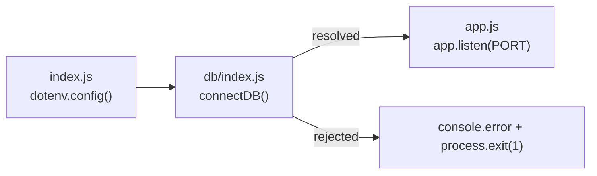
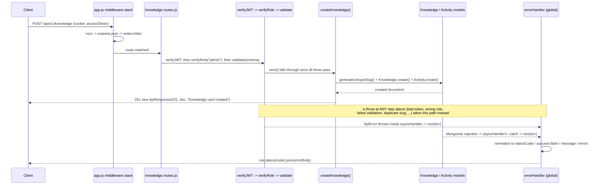
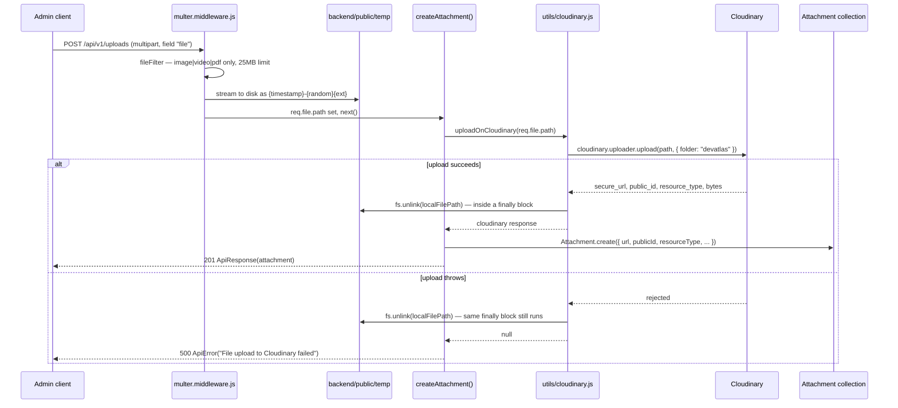

# 08 — Backend Architecture

> Companion to `06-database-design.md` (schema field design), `07-api-design.md` (the wire contract), `15-security-design.md` (auth threat model, RBAC matrix, rate-limit tiers, secrets handling), and `16-performance-design.md` (indexing/caching). This document owns one thing: **where backend code lives and how a request moves through it.** Everything below describes `backend/src` as it exists today, plus a small number of explicitly-labeled recommended additions.

## 1. Folder Structure

DevAtlas's backend is **layered by technical concern at the top level, sliced by feature/resource inside each layer**. Every layer folder has exactly one file per resource, and that file is named identically across layers — given a resource name you always know which files touch it, without a per-feature folder to dig through:

```
backend/
├── public/
│   └── temp/                      # multer scratch dir — §7. Only .gitkeep is committed; contents are transient.
├── src/
│   ├── config/
│   │   ├── passport.js            # Google + GitHub Strategy registration — §4
│   │   └── env.js                 # not yet present — recommended fail-fast env check, §8
│   ├── db/
│   │   └── index.js               # the one mongoose.connect() call
│   ├── constants.js                # every enum, shared by Mongoose schemas AND Zod validators
│   ├── models/                     # knowledge.model.js, user.model.js, userProgress.model.js, ...
│   ├── controllers/                # knowledge.controller.js, auth.controller.js, ...
│   ├── routes/                     # knowledge.routes.js, auth.routes.js, ...
│   ├── middlewares/
│   │   ├── auth.middleware.js      # verifyJWT, attachUserIfPresent, verifyRole — §6
│   │   ├── validate.middleware.js  # Zod-schema gate
│   │   ├── multer.middleware.js    # disk storage + MIME/size filter — §7
│   │   ├── rateLimiter.middleware.js
│   │   └── error.middleware.js     # the single global errorHandler — §9
│   ├── services/
│   │   └── csvImport.service.js    # see §7's callout / 19-coding-standards.md §3 for the extraction rule
│   ├── validators/                 # knowledge.validator.js, category.validator.js, ...
│   ├── utils/                      # apiError, apiResponse, asyncHandler, cloudinary, pagination, slugify, tokens
│   ├── seed/
│   │   └── seed.js                 # taxonomy seed + one-time admin promotion (npm run seed)
│   ├── app.js                      # the Express app: middleware stack + router mounting — §2
│   └── index.js                    # entrypoint: dotenv.config() → connectDB() → app.listen() — §2, §8
```

Twelve resources exist today, each with the same shadow across layers: `auth`, `user`, `category`, `company`, `knowledge`, `resource`, `upload` (→ `Attachment`), `search`, `progress`, `annotation`, `dashboard`, `activity`. `knowledge` is the only one with no per-type model file of its own — its four sub-types (`concept`, `dsa`, `interview`, `project`) are Mongoose discriminators declared in the one `knowledge.model.js`, not four separate model files (`06-database-design.md` §4).

### 1.1 Folder responsibilities

| Folder | Owns | Never contains |
|---|---|---|
| `config/` | Third-party SDK/strategy setup that runs once at boot | Route handlers, business logic |
| `db/` | The single `mongoose.connect()` call | Schema definitions |
| `models/` | Schemas, discriminators, indexes, schema methods | Query logic driven by request params — that's the controller's job |
| `controllers/` | Reads `req`, calls the model/service, shapes the `ApiResponse` | Route paths, middleware wiring |
| `routes/` | `Router()` instances: path + verb + middleware chain + controller reference | Any actual logic — a route file should read like a table |
| `middlewares/` | Cross-cutting request-pipeline concerns reused across many routers | Resource-specific business rules |
| `services/` | Multi-step workflows too heavy for a controller, or logic reused by 2+ controllers | Trivial CRUD — that stays in the controller |
| `validators/` | Zod input schemas, one create/update pair per writable resource | Response shaping |
| `utils/` | Stateless helpers and thin third-party wrappers, zero DevAtlas business rules | Anything that imports a Mongoose model — no `utils/*.js` file does today; keep it that way |

File-naming rules for each layer (camelCase vs kebab-case, singular vs plural) are specified in `19-coding-standards.md` §1 — this document only fixes *where* things live, not what they're called.

## 2. Application Composition — `index.js` → `app.js`

Boot is split across two files on purpose: `index.js` is the only file with side effects (load env, connect to Mongo, bind a port); `app.js` builds and exports a plain Express app with no side effects, which makes it importable by tooling without opening a real DB connection or port.



`app.js` assembles one fixed middleware stack, in this order, before any router is reached:

| Order | Middleware | Why here |
|---|---|---|
| 1 | `cors({ origin: CORS_ALLOWED_ORIGINS, credentials: true })` | Must run before anything could short-circuit a response, so preflight is always answered |
| 2 | `express.json({ limit: "16kb" })` | Populates `req.body` for every downstream handler; JSON-only parsing also happens to be a CSRF mitigation (`15-security-design.md` §8) |
| 3 | `express.urlencoded({ extended: true, limit: "16kb" })` | Rarely hit (the API is JSON-first) but keeps a stray form-encoded body from erroring |
| 4 | `express.static("public")` | Serves nothing sensitive — `public/temp` is a write-only scratch area, never a read path |
| 5 | `cookieParser()` | Must run before `verifyJWT` anywhere downstream reads `req.cookies` |
| 6 | `passport.initialize()` | No `passport.session()` mounted — DevAtlas never uses cookie-session state, only stateless JWT (§4, §5) |
| 7 | `morgan("dev")` | Gated to `NODE_ENV === "development"` only |
| 8 | per-router rate limiter + router, e.g. `app.use("/api/v1/knowledge", readLimiter, knowledgeRouter)` | Twelve mounts, one per resource — tier *assignment* is `15-security-design.md` §7's call, this file just wires it |
| 9 | `errorHandler` | Registered **last, unconditionally** — Express recognizes it as error-handling middleware purely by its 4-argument signature `(err, req, res, next)`, and it only ever sees errors from middleware/routers registered above it |

## 3. Request Lifecycle

Every request — read or write — passes through the same shape: **route match → middleware chain → controller → model/service → `ApiResponse`**, with a single global catch net for anything that throws along the way. The middleware chain itself is conditional per route: `verifyJWT`/`verifyRole` appear on anything that isn't public, `validate` appears on anything that mutates, `multer` appears only on the two multipart routes (`/uploads`, `/knowledge/import/dsa-csv`).



Every controller and every custom middleware that can `throw` (`verifyJWT`, `verifyRole`, `validate`, every controller function) is wrapped in `asyncHandler` (`backend/src/utils/asyncHandler.js`). That wrapper is the entire reason no controller in this codebase ever needs a `try/catch`: it resolves the handler's promise and routes any rejection straight to `next(err)`, which Express then walks forward to the first 4-argument middleware — always `errorHandler`.

| Failure point | Status | Thrown by |
|---|---|---|
| Missing / invalid / expired access token | 401 | `verifyJWT` |
| Valid session, wrong role | 403 | `verifyRole("admin")` |
| Body fails its Zod schema | 400 | `validate(schema)` |
| Duplicate unique key (e.g. slug race) | 409 | `errorHandler`, normalizing Mongo error code `11000` |
| Anything else unhandled | 500 | `errorHandler` fallback |

## 4. Authentication — Passport OAuth Strategy Wiring

`backend/src/config/passport.js` registers exactly two strategies — `passport-google-oauth20` and `passport-github2` — and nothing else. **There is no `LocalStrategy` import anywhere in the codebase.** This isn't enforced by a runtime guard; it's enforced by omission, which is the correct way to guarantee a "no password, ever" product decision can't quietly regress later — there's no dead code path to accidentally re-enable.

Both strategies are registered with `session: false`, and `passport.session()` is never mounted (§2) — Passport's only job here is to run the OAuth handshake and hand back a resolved `profile`. DevAtlas's own JWT layer (§5) owns everything about "is this request authenticated," not Passport.

Both strategies funnel into one shared `findOrCreateOAuthUser`, which resolves a profile to a `User` document through three branches, tried in this order:

1. **Exact match** — a `User` already has this exact `(provider, providerId)` pair inside `providers[]` → return it.
2. **Email match, different provider** — a `User` exists with this email but signed up (or previously linked) via the *other* provider → push the new `{ provider, providerId }` onto `providers[]` and save. This is what lets one person log in with Google today and GitHub tomorrow and land on the same account, same `UserProgress`, same everything.
3. **No match at all** — create a brand-new `User` with `role: "user"` (the schema default — there is no self-serve path to `"admin"`, ever; see `06-database-design.md` §2 and `seed/seed.js`).

```mermaid
sequenceDiagram
    participant B as Browser
    participant API as auth.routes.js
    participant PP as passport strategy
    participant G as Google or GitHub
    participant U as User collection

    B->>API: GET /api/v1/auth/google (full page navigation)
    API->>G: passport.authenticate redirects to provider consent screen
    G-->>B: user approves
    B->>API: GET /api/v1/auth/google/callback?code=...
    API->>PP: passport.authenticate exchanges code for profile
    PP->>U: findOrCreateOAuthUser(provider, providerId, email, ...)
    alt existing user, same provider
        U-->>PP: matched user
    else existing user, email match, other provider
        U->>U: providers.push({provider, providerId}); save
        U-->>PP: linked user
    else no match
        U->>U: User.create({...})
        U-->>PP: new user
    end
    PP-->>API: req.user = user
    API->>API: oauthCallback(): issueTokens(user), set cookies
    API-->>B: redirect to FRONTEND_URL/auth/callback
```

Route split: `GET /auth/google` and `GET /auth/github` are the redirect-*out* legs (`passport.authenticate(strategy, { scope, session:false })` with no second handler needed — Passport itself issues the redirect to the provider). `GET /auth/google/callback` and `GET /auth/github/callback` are the redirect-*back* legs, where `passport.authenticate` runs a second time and resolves `req.user` synchronously so the route's second handler (`oauthCallback`) can run.

## 5. JWT Issuance, Refresh & Rotation

DevAtlas mints its **own** access/refresh JWT pair immediately after every successful OAuth callback — the Google/GitHub token never leaves that one callback handler. Responsibility is split cleanly across three files:

| File | Responsibility |
|---|---|
| `utils/tokens.js` | Pure primitives: `generateAccessToken`, `generateRefreshToken`, `hashToken` (sha256), and `issueTokens(user)`, which signs both, persists `sha256(refreshToken)` onto `User.refreshTokenHash`, and returns the two raw tokens |
| `controllers/auth.controller.js` | Orchestration: `oauthCallback` calls `issueTokens` on login and sets both cookies; `refreshAccessToken` verifies the incoming refresh cookie, compares its hash against `User.refreshTokenHash`, and re-issues on match; `logout` nulls `refreshTokenHash` server-side, not just clearing cookies |
| `models/user.model.js` | `refreshTokenHash` is the only server-side session record — a `select: false` field, so it never rides along on a normal `User.findById` |

The mechanics in one sentence: **the access token is stateless and short-lived, the refresh token is the only thing DevAtlas can actually revoke, and it revokes by hash comparison, not by a token blocklist.** The full rotation-on-use sequence, the reuse-detection response (why a hash mismatch nulls the whole session instead of failing quietly), and the known concurrent-tab-refresh race are already fully specified in `15-security-design.md` §4 — this document doesn't re-derive that, it only names which file owns which part of the mechanism, above.

`verifyJWT` (`middlewares/auth.middleware.js`) reads `req.cookies.accessToken` first, falling back to an `Authorization: Bearer` header only for future non-browser clients — the web SPA never populates that header itself (`15-security-design.md` §4).

## 6. Role-Based Access Control — Middleware Composition

Three middleware functions in `auth.middleware.js` cover every authorization need in the API, and they compose by simple ordering — there is no separate policy/permission engine:

- **`verifyJWT`** — throws `401` if there's no valid access token or the resolved user is deactivated (`isActive: false`). Sets `req.user`.
- **`attachUserIfPresent`** — same token check, but never throws; sets `req.user` if present, otherwise moves on. Used on routes whose response shape changes slightly for a logged-in caller without requiring login (e.g. `GET /knowledge` includes draft cards for an admin caller, published-only for everyone else).
- **`verifyRole(...roles)`** — a factory, not a middleware itself. `verifyRole("admin")` returns a middleware that throws `403` unless `req.user.role` is in the allow-list. **Must run after `verifyJWT`** — it trusts `req.user` to already exist and throws a generic `401` itself if it doesn't, but relying on that fallback is a bug smell, not a feature; always pair them explicitly.

Two composition patterns are both in active use, chosen per router by whether *every* route needs a session:

```js
// Every route needs a session — guard once at the router level
// (progress.routes.js, annotation.routes.js, dashboard.routes.js, user.routes.js, activity.routes.js)
router.use(verifyJWT);
router.get("/bookmarks", getBookmarks);
router.patch("/:knowledgeId", validate(updateProgressSchema), updateProgress);
```

```js
// Router mixes public reads with admin writes — guard per-route instead
// (category.routes.js, company.routes.js, knowledge.routes.js, resource.routes.js)
router.get("/", getCategories);                                  // public
router.post("/", verifyJWT, verifyRole("admin"), validate(createCategorySchema), createCategory);
```

**Route declaration order is load-bearing.** Express matches routes top-to-bottom, and a `:paramName` segment matches *anything*, including a literal path another route meant to own. `progress.routes.js` declares `/revision/due`, `/bookmarks`, `/pinned`, and `/favorites` **before** `/:knowledgeId` — reversed, a request for `/api/v1/progress/bookmarks` would hit the `:knowledgeId` handler with `knowledgeId="bookmarks"` instead. The same reasoning puts `/me` before `/:id` in `user.routes.js`. Rule: **every static-segment route must be declared before any dynamic-segment route it could collide with, in the same router.**

The full per-resource RBAC matrix — which of the twelve resources allow anonymous reads, which require any authenticated user, which are admin-only — is `15-security-design.md` §3; this section owns the *mechanism*, that section owns the *map*.

## 7. File Upload Pipeline — Multer → Cloudinary

Every upload follows the same two-hop shape: **multer writes to local disk first, then a controller/service pushes that local file to Cloudinary and deletes the local copy — unconditionally, success or failure.** `backend/public/temp` (kept in git via `.gitkeep` only) is the shared scratch directory for both consumers of this pipeline:

1. **Generic attachments** (`POST /api/v1/uploads`) — any authenticated user, one file, persisted as its own `Attachment` document (used for project-card gallery images, admin-authored diagrams, etc.).
2. **DSA CSV bulk import** (`POST /api/v1/knowledge/import/dsa-csv`) — admin-only; the file is parsed and discarded, never sent to Cloudinary (see the divergence below).



The `finally` block inside `uploadOnCloudinary` is the whole point of this design: whichever branch executes, the temp file never survives the request. `deleteFromCloudinary(publicId)` is the mirror operation, called from `deleteAttachment` before the `Attachment` document itself is removed — Cloudinary storage never outlives the DB record that points to it.

**The CSV path diverges right after multer, on purpose.** `importDsaCsvHandler` hands `req.file.path` straight to `services/csvImport.service.js`, which streams the file through `csv-parse`, builds `Knowledge` documents row by row, and unlinks the temp file itself as soon as parsing finishes — it never touches Cloudinary, because a CSV is a one-time input, not a media asset anyone needs a persistent URL for afterward. This is the concrete instance of the service-extraction rule in `19-coding-standards.md` §3: a workflow with real multi-step logic (streaming parse, per-row partial-success accounting) earns its own file; a single Cloudinary round-trip (`createAttachment`) does not.

The MIME allow-list and size ceiling are enforced in `multer.middleware.js` before a byte is fully buffered; the full validation rationale (why 25MB, why that MIME regex) lives in `15-security-design.md` §6.

## 8. Environment Configuration

`dotenv.config()` runs exactly once, in `index.js`, before anything else executes — `app.js` and every module it imports read `process.env` directly at call time, with no centralized config object today. That's a deliberate simplification for a codebase this size, not an oversight, but it does mean a missing variable currently fails at the *first request that needs it* (e.g. a missing `CLOUDINARY_API_SECRET` fails the first upload, not boot) rather than at startup.

**Recommended addition — fail fast at boot, not on first use** (`backend/src/config/env.js`, not yet in the repo):

```js
const REQUIRED = [
    "MONGODB_URI", "ACCESS_TOKEN_SECRET", "REFRESH_TOKEN_SECRET",
    "GOOGLE_CLIENT_ID", "GOOGLE_CLIENT_SECRET",
    "GITHUB_CLIENT_ID", "GITHUB_CLIENT_SECRET",
    "CLOUDINARY_CLOUD_NAME", "CLOUDINARY_API_KEY", "CLOUDINARY_API_SECRET",
];

export const assertRequiredEnv = () => {
    const missing = REQUIRED.filter((key) => !process.env[key]);
    if (missing.length) {
        throw new Error(`Missing required env vars: ${missing.join(", ")}`);
    }
};
```

Call it from `index.js` immediately after `dotenv.config()`, before `connectDB()` — a misconfigured deploy should never come up "successfully" and then 500 on the first real request.

### 8.1 Required variables

Names and formats only — no real secret values appear in this document. Fill actual values into `backend/.env` (gitignored; `15-security-design.md` §11 owns rotation/sensitivity guidance for each):

| Variable | Required | Format | Consumed by |
|---|---|---|---|
| `MONGODB_URI` | yes | `mongodb+srv://<user>:<pass>@<cluster>` — **no DB name suffix**, `db/index.js` appends `/${DB_NAME}` itself | `db/index.js` |
| `PORT` | no (default `8000`) | integer | `index.js` |
| `NODE_ENV` | yes | `development` \| `production` | `app.js`, `error.middleware.js`, `constants.js` |
| `CORS_ALLOWED_ORIGINS` | yes in production | comma-separated origins, e.g. `https://devatlas.app,https://www.devatlas.app` | `app.js` |
| `GOOGLE_CLIENT_ID`, `GOOGLE_CLIENT_SECRET` | yes | from a Google Cloud Console OAuth client | `config/passport.js` |
| `GOOGLE_CALLBACK_URL` | yes | `http://localhost:8000/api/v1/auth/google/callback` (dev) — must exactly match the console's registered redirect URI | `config/passport.js` |
| `GITHUB_CLIENT_ID`, `GITHUB_CLIENT_SECRET` | yes | from a GitHub OAuth App | `config/passport.js` |
| `GITHUB_CALLBACK_URL` | yes | `http://localhost:8000/api/v1/auth/github/callback` (dev) | `config/passport.js` |
| `ACCESS_TOKEN_SECRET`, `REFRESH_TOKEN_SECRET` | yes | long random strings, **must differ from each other** | `utils/tokens.js` |
| `ACCESS_TOKEN_EXPIRY`, `REFRESH_TOKEN_EXPIRY` | no (default `15m` / `30d`) | any `ms`-package-compatible string | `utils/tokens.js` |
| `CLOUDINARY_CLOUD_NAME`, `CLOUDINARY_API_KEY`, `CLOUDINARY_API_SECRET` | yes | from the Cloudinary dashboard | `utils/cloudinary.js` |
| `FRONTEND_URL`, `FRONTEND_URL_PROD` | yes | `http://localhost:5173` / `https://devatlas.app` | `constants.js` → OAuth-success redirect target |
| `VAPID_PUBLIC_KEY`, `VAPID_PRIVATE_KEY` | reserved | web-push keypair | **not wired to any route or dependency yet** — present in `.env` for forward compatibility only; there is no `web-push` package installed and no notification controller anywhere in this codebase today |
| `ADMIN_EMAIL` | no, seed-only | `you@example.com` | `seed/seed.js`, set inline when running `npm run seed` — not a persistent server variable |

Frontend has zero secrets by construction — `apiSlice.js` calls a relative `/api/v1`, never an absolute host, so there's no API-URL environment variable to leak client-side either (`15-security-design.md` §11 covers this in more depth).

## 9. Logging & Error Handling

**`asyncHandler` is the mechanism, `errorHandler` is the policy.** Every controller and every custom middleware that can fail is wrapped in `asyncHandler`, which guarantees any rejected promise reaches `next(err)`; `errorHandler` (`middlewares/error.middleware.js`) is the single place registered to receive it (§2, §3).

`errorHandler`'s normalization, in order:

1. **Already an `ApiError`** (thrown explicitly by a controller/middleware) → used as-is.
2. **Anything else** → wrapped into a new `ApiError`, with `statusCode` taken from `error.statusCode` if the underlying error set one, else `400` for a Mongoose `ValidationError`, else `500`.
3. **Mongo duplicate-key error** (`error.code === 11000`) → re-wrapped as `409`, with a message naming the offending field(s) — this is what turns a raw Mongo error into the same `ApiError` shape as everything else, so no client-side special-casing is needed for "duplicate slug."
4. `stack` is attached to the JSON response **only** when `NODE_ENV === "development"` — never leaked to a production client.

Request logging is `morgan("dev")`, gated to development only (§2). Production request/error logging — mounting a structured `morgan` format in production, and having `errorHandler` actually `console.error` server-side before responding, which it doesn't today in any environment — is tracked as a specific, already-scoped item in `15-security-design.md` §12; this document's job stops at describing the mechanism that gap sits inside, not re-auditing it.

## 10. Adding a New Resource — Worked Checklist

Every resource added since the original four (`auth`, `knowledge`, `category`, `user`) followed the same steps. Use this when the thirteenth resource shows up:

1. **`constants.js`** — add any new enum the resource needs, so Mongoose and Zod can both import the same list — never inline it twice.
2. **`models/<name>.model.js`** — schema with `{ timestamps: true }`, soft-delete fields if this is canonical content (`19-coding-standards.md` §4), `mongoose.model("Name", schema)` as a named export.
3. **`validators/<name>.validator.js`** — `create<Name>Schema` / `update<Name>Schema` Zod pair.
4. **`controllers/<name>.controller.js`** — `asyncHandler`-wrapped handlers; business logic stays inline unless it meets the service-extraction bar (§7 above; `19-coding-standards.md` §3).
5. **`routes/<name>.routes.js`** — wire `verifyJWT` → `verifyRole` → `validate` → (`upload.single` if applicable) → controller, static segments before dynamic ones (§6).
6. **`app.js`** — mount the router behind the right rate-limit tier (`15-security-design.md` §7 picks the tier).
7. **Update the docs that are the actual contract** — `07-api-design.md` (endpoints) and `06-database-design.md` (schema) — before or alongside the code, not after. The matching RTK Query slice (`frontend/store/api/<name>Api.js`) is then a mechanical translation of step 7's contract, not a design decision of its own.
