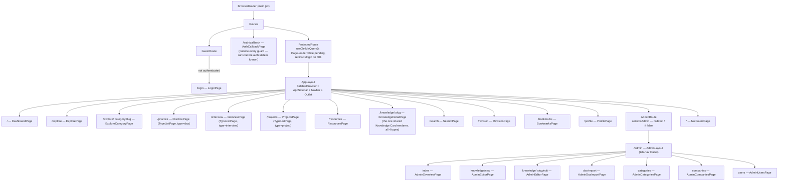
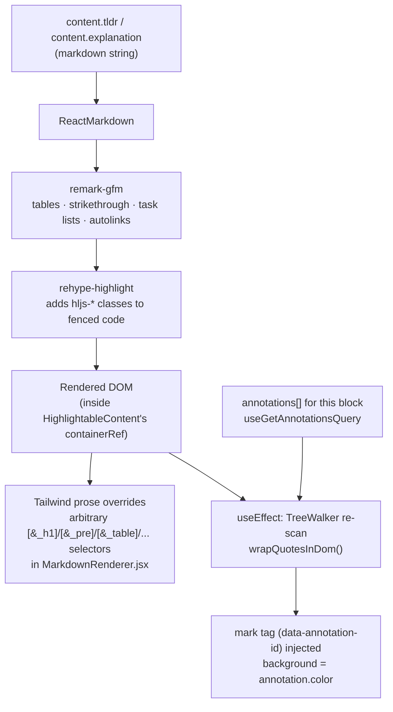

# 09 — Frontend Architecture

> Defines *how the Vite/React app is organized and wired together* — folder structure, routing, state management, theming mechanics, animation, content rendering, and failure/loading handling. Component-level inventory (props, composition) lives in `10-component-library.md`; the actual design tokens live in `11-design-system.md`; what each screen contains lives in `14-wireframes.md`. This document describes the codebase as it exists today (`frontend/`) and calls out, explicitly labeled, the small number of places where the target architecture isn't built yet.

## 0. Scope & Related Documents

- **Navigation model** (why these 7 nav items, why Revision isn't one of them) → `04-information-architecture.md`
- **Data contracts** (`Knowledge` discriminators, `UserProgress`, `Annotation` shapes) → `06-database-design.md`
- **API contracts** (routes, envelope, pagination shape) → `07-api-design.md`
- **Component inventory** (props, which `ui/*.jsx` each composes) → `10-component-library.md`
- **Design tokens, typography, color, dark mode values** → `11-design-system.md`
- **Auth/cookie/JWT mechanics** → `15-security-design.md`
- **Caching, code-splitting budget, index plan** → `16-performance-design.md`

This document is the architectural "how" that the other frontend docs assume.

---

## 1. Repository Layout

### 1.1 Top-level shape

```
frontend/
├── components/              # @/components — reusable UI, NOT route-aware
│   ├── ui/                  # shadcn primitives (base-nova style, @base-ui/react) — generated, not hand-edited
│   ├── layout/               # app chrome: AppLayout, AppSidebar, Navbar, SearchPalette, Theme{Provider,Toggle}
│   ├── knowledge/             # the Knowledge Card feature surface (rendering + personal-state controls)
│   ├── admin/                 # admin-authoring-only form primitives
│   └── shared/                 # generic, feature-agnostic atoms (PageHeader, PageLoader, icons)
├── lib/                      # @/lib — framework-agnostic helpers, no JSX
│   ├── utils.js                # cn() — clsx + tailwind-merge
│   ├── apiHelpers.js            # unwrap / transformError / toQueryString — the RTK Query envelope contract
│   └── iconMap.js                # resolveIcon() — kebab-case Category.icon → lucide component
├── hooks/                    # @/hooks — cross-cutting React hooks
│   └── use-mobile.js           # useIsMobile() (shadcn sidebar breakpoint hook)
├── store/                    # @/store — Redux Toolkit + RTK Query (see §3)
│   ├── index.js
│   ├── api/                    # one file per backend resource, all injected into one apiSlice
│   └── slices/                  # hand-written reducers — currently just authSlice
├── components.json           # shadcn CLI config (style: base-nova, baseColor: neutral, iconLibrary: lucide)
├── jsconfig.json             # baseUrl "." + paths "@/*" → "./*" (editor/IntelliSense mirror of the Vite alias)
├── vite.config.js            # '@' alias, /api dev proxy → localhost:8000, @tailwindcss/vite plugin
├── public/                   # static assets served as-is (favicon.svg, icons.svg)
└── src/                      # @/src — app entry + routing + route-level containers ONLY
    ├── main.jsx                 # StrictMode > Redux Provider > ThemeProvider > TooltipProvider > BrowserRouter > App
    ├── App.jsx                  # the entire <Routes> tree (see §2)
    ├── routes/                  # route guards: ProtectedRoute, AdminRoute, GuestRoute
    ├── pages/                   # one file per route, composes components/* — no business logic of its own
    │   └── admin/                 # admin sub-routes (AdminLayout + 6 pages)
    └── assets/                  # unused default Vite template assets
```

### 1.2 The `@/*` alias, and why components/lib/hooks/store sit at repo root

`vite.config.js` resolves `'@'` to the **`frontend/` project root itself** (`fileURLToPath(new URL('.', import.meta.url))`, evaluated from `frontend/vite.config.js`), mirrored in `jsconfig.json` (`baseUrl: "."`, `paths: { "@/*": ["./*"] }`) for editor tooling. That single alias decision is why `components/`, `lib/`, `hooks/`, and `store/` live as siblings of `src/`, not nested inside it: `@/components/knowledge/KnowledgeCard`, `@/store/api/knowledgeApi`, `@/lib/utils` all resolve one directory below `frontend/`, while `@/src/pages/DashboardPage` explicitly walks into `src/`. This isn't an accident of scaffolding — the shadcn CLI (`components.json`'s `aliases` block: `components → @/components`, `ui → @/components/ui`, `lib → @/lib`, `hooks → @/hooks`) generates directly into these root-level folders, so keeping `store/` at the same level keeps "everything the shadcn generator and everything the state layer own" at one predictable depth, and reserves `src/` for exactly one job: **routing**.

### 1.3 Domain-ownership rule — where a new file goes

| A new file is... | Goes in |
|---|---|
| A generic, product-unaware UI primitive (another shadcn part) | `components/ui/` — added via the shadcn CLI against `components.json`, **never** hand-forked. If a primitive needs product-specific behavior, wrap it in `knowledge/`, `admin/`, or `shared/` — don't edit the primitive. |
| Anything that renders or acts on a Knowledge Card (any of the 4 types) or its personal state (bookmark/note/highlight/revision) | `components/knowledge/` |
| Anything only the admin-authoring surface needs (CSV import UI, repeatable form-row editors, taxonomy pickers) | `components/admin/` |
| App chrome: shell, nav, global search, theme switching | `components/layout/` |
| A generic, feature-agnostic atom with zero Knowledge/admin/layout opinion (a page title block, a spinner, a brand SVG icon) | `components/shared/` |
| A route-level container for exactly one URL, composing the above | `src/pages/` (or `src/pages/admin/`) |
| Local-only state/logic for one complex page that has no business leaking into the shared component tree | `src/features/<name>/` — **not created yet**; first legitimate candidate is a multi-step state machine for the DSA CSV import wizard (`src/features/dsa-import/useImportWizard.js`), colocated with `pages/admin/AdminDsaImportPage.jsx`. Don't create `src/features/` preemptively for simple pages — `pages/*.jsx` composing `components/*` is sufficient for every route today. |

This is what "feature-based" means concretely in this codebase: features are organized by **domain folder under `components/`** (`knowledge/`, `admin/`), not by a `src/features/*` tree — `src/` stays thin and routing-only. `pages/TypeListPage.jsx` is the clearest illustration of the payoff: `PracticePage`, `InterviewPage`, and `ProjectsPage` are three-line wrappers around one shared `TypeListPage` pinned to a different `type` filter, because Practice/Interview/Projects are the same `KnowledgeFilterBar` + `KnowledgeGrid` composition reading the same `knowledges` collection — exactly the "one engine, not four systems" rule from `01-product-vision.md`, enforced at the component level, not just the schema level.

### 1.4 `frontend/src` — entry, pages, route guards only

- **`main.jsx`** — the provider stack, outside-in: `StrictMode` → Redux `Provider` → `ThemeProvider` (next-themes) → `TooltipProvider` (base-ui, so any component can use `Tooltip` without wrapping itself) → `BrowserRouter` → `App`.
- **`App.jsx`** — the full route tree (§2). Every page is a static top-level import today (no lazy-loading yet — see §2.5).
- **`routes/`** — three guard components (`GuestRoute`, `ProtectedRoute`, `AdminRoute`), each a layout route (renders `<Outlet/>`), not a wrapper-per-page. Composing guards as nested layout routes means a new protected page is one `<Route>` line, never a new `if (isAuthed)` check copy-pasted into the page itself.
- **`pages/*.jsx`** — a page owns exactly: reading `useParams`/`useSearchParams`, calling the RTK Query hooks it needs, and arranging `components/*` around the result. `KnowledgeDetailPage.jsx` is the largest page (it lays out the fixed 9-block skeleton) but still contains no fetching logic beyond `useGetKnowledgeBySlugQuery` — every block it renders is a `components/knowledge/*` component.

---

## 2. Routing

### 2.1 Router mode: declarative, not the data router

React Router v7 (`react-router-dom@7`) ships two APIs: the **data router** (`createBrowserRouter` + route `loader`/`action`) and the **declarative router** (`<BrowserRouter>` + `<Routes>`/`<Route>`, what `main.jsx`/`App.jsx` already use). DevAtlas stays on the declarative router **by design, not by omission**: RTK Query already owns fetching, caching, invalidation, and loading/error state for every piece of server data (§3). Adopting route `loader`s would create a second, competing data-fetching mechanism with its own cache that has to be kept in sync with RTK Query's — two sources of truth for the same `knowledges` collection. The declarative router's only job here is matching a URL to a component tree; RTK Query hooks inside that component tree do the rest. Revisit this only if a future requirement needs data *before* first paint in a way `isLoading` + `PageLoader` can't express (e.g. SSR) — not on the strength of "v7 supports it."

### 2.2 Route tree



| Path | Page | Guard chain |
|---|---|---|
| `/login` | `LoginPage` | `GuestRoute` (bounces authenticated users to `/`) |
| `/auth/callback` | `AuthCallbackPage` | none — lands here straight off the OAuth redirect, before any guard could know the auth state |
| `/` | `DashboardPage` | `ProtectedRoute` → `AppLayout` |
| `/explore`, `/explore/:categorySlug` | `ExplorePage`, `ExploreCategoryPage` | same |
| `/practice`, `/interview`, `/projects` | `TypeListPage` pinned per-page to `type=dsa\|interview\|project` | same |
| `/resources` | `ResourcesPage` | same |
| `/knowledge/:slug` | `KnowledgeDetailPage` | same |
| `/search` | `SearchPage` | same |
| `/revision`, `/bookmarks`, `/profile` | — | same |
| `/admin/*` | `AdminLayout` + 6 sub-pages | `ProtectedRoute` → `AdminRoute` → `AppLayout` |
| `*` | `NotFoundPage` | `ProtectedRoute` → `AppLayout` (see note below) |

### 2.3 Guard composition pattern

All three guards are **layout routes** (`<Route element={<Guard/>}>` wrapping children, the guard renders `<Outlet/>` on success) rather than a HOC or a per-page hook — this is what keeps `App.jsx` the single source of truth for "what requires auth" instead of scattering `if (!user) return <Navigate/>` across pages:

- **`ProtectedRoute`** calls `useGetMeQuery()`. RTK Query dedupes this against every other place `useGetMeQuery` is called in the tree (Navbar, GuestRoute) into one in-flight request — mounting the guard doesn't cost an extra round-trip. `isLoading` → `PageLoader`; `isError` (401) → `<Navigate to="/login"/>`.
- **`AdminRoute`** is nested *inside* `ProtectedRoute`'s subtree, so it never has to re-check authentication — it only reads `selectIsAdmin` off the already-hydrated `auth` slice and redirects to `/` if false. Never render an admin-only affordance (nav link, button) without also gating the route it points to this way — the API enforces `verifyRole("admin")` server-side regardless, but a client-side gate avoids a confusing flash-then-redirect for non-admins.
- **`GuestRoute`** is the mirror image for `/login` — `isLoading` renders nothing (not `PageLoader`; a full-page spinner on `/login` before we even know if we need `/login` is unnecessary motion), authenticated users bounce to `/`.

### 2.4 Naming note: `/knowledge/:slug`

`04-information-architecture.md`, `12-user-flows.md`, `13-ux-flows.md`, and `14-wireframes.md` refer to the shared card destination conceptually as "the Card page" (and use `/card/:slug` as shorthand in a couple of diagrams). The implemented route — and the one every RTK Query hook, every `<Link>`, and the backend's `GET /api/v1/knowledge/:slug` agree on — is **`/knowledge/:slug`**. Same destination, same fixed 9-block skeleton; treat "`/card/:slug`" in the other docs as that same route referred to by role rather than path.

### 2.5 Code-splitting plan (target — not yet implemented)

`App.jsx` currently statically imports every page. That's fine at the current page count, but `16-performance-design.md` §4 already specifies the intended chunk boundaries (core shell / card detail / visualization / admin authoring). The migration is mechanical and route-tree-preserving — convert the relevant `<Route element={<X/>}>` entries to React Router v7's route-level `lazy()`:

```js
// target shape — knowledge detail and the whole /admin subtree become their own chunks
<Route
  path="/knowledge/:slug"
  lazy={() => import("@/src/pages/KnowledgeDetailPage")}
/>
<Route path="/admin" lazy={() => import("@/src/pages/admin/AdminLayout")}>
  {/* children unchanged */}
</Route>
```

Wrap `<Routes>` (or, once migrated, the lazy route elements) in `<Suspense fallback={<PageLoader/>}>` — see §8. `mermaid`/`@xyflow/react` are a separate chunk boundary *inside* `KnowledgeDetailPage`, not a route boundary — that split is a dynamic `import()` inside `VisualizationBlock`/`MermaidDiagram`/`FlowDiagram`, gated by the same `IntersectionObserver` viewport check `16-performance-design.md` §4 specifies, so a text-only `concept` card never downloads either library.

---

## 3. State Management — Redux Toolkit + RTK Query

### 3.1 Store shape

```js
// store/index.js
{
  auth: { user: User | null, status: "idle" | "authenticated" | "unauthenticated" },
  api: { queries: {...}, mutations: {...}, subscriptions: {...}, ... }  // apiSlice.reducerPath === "api"
}
```

Two reducers, deliberately. `setupListeners(store.dispatch)` is called once in `store/index.js`, turning on `refetchOnFocus`/`refetchOnReconnect` globally — a backgrounded tab self-heals its cache on refocus with zero per-query configuration.

### 3.2 The one rule: RTK Query owns server state, slices own ephemeral client state

**There is no second data-fetching mechanism anywhere in this frontend** — no ad hoc `useEffect` + `fetch`, no SWR, no React Query. If a component needs anything that lives in MongoDB, it calls an RTK Query hook. `authSlice` is the only hand-written reducer, and it earns its existence by being a *derived convenience cache*, not an independent data source — it never dispatches its own thunk. It's populated entirely by `extraReducers` matchers against RTK Query's own lifecycle actions:

```js
// store/slices/authSlice.js — populated by RTK Query's own actions, never fetched independently
builder
  .addMatcher(authApi.endpoints.getMe.matchFulfilled, (state, action) => { state.user = action.payload; state.status = "authenticated"; })
  .addMatcher(authApi.endpoints.getMe.matchRejected, (state) => { state.user = null; state.status = "unauthenticated"; })
  .addMatcher(authApi.endpoints.logout.matchFulfilled, (state) => { state.user = null; state.status = "unauthenticated"; })
  .addMatcher(userApi.endpoints.updateMe.matchFulfilled, (state, action) => { state.user = action.payload; });
```

Why this exists instead of just calling `useGetMeQuery()` everywhere: `selectCurrentUser`/`selectIsAdmin`/`selectAuthStatus` are plain, synchronous selectors usable in places that shouldn't subscribe to the full query lifecycle just to read a role check (`AdminRoute`, `AppSidebar`'s conditional Admin link) — without duplicating the `getMe` network call, since it's still the same RTK Query cache entry underneath.

**When a new plain slice *is* justified:** only for client-only UI state that (a) must be read from a component that didn't trigger it and (b) has no server representation. Two legitimate future candidates, named here so the pattern doesn't get reinvented differently later: a `ui` slice for the sidebar's user-collapsed preference if it needs to persist across sessions independent of `next-themes`/localStorage, or a multi-step wizard's current-step index (which would more likely live as local `useState` in a `src/features/` hook per §1.3, not Redux, unless another route genuinely needs to read it). **Theme is not in Redux at all** — it's owned entirely by `next-themes` (localStorage + the `.dark` class), by design (§4.1).

### 3.3 API slice organization

One root `apiSlice` (`store/api/apiSlice.js`) declares `reducerPath: "api"`, the shared `fetchBaseQuery`, and every tag type up front. Every feature file below calls `apiSlice.injectEndpoints(...)` — one cache, one middleware, one `credentials: "include"` config point. This maps close to 1:1 onto `backend/src/routes/*.routes.js`:

| `store/api/*.js` | Backend route file | Tag types | Representative hooks |
|---|---|---|---|
| `authApi.js` | `auth.routes.js` | `Me` | `useGetMeQuery`, `useLogoutMutation`, `useRefreshMutation` |
| `userApi.js` | `user.routes.js` | `Me`, `User` | `useUpdateMeMutation`, `useListUsersQuery`, `useUpdateUserRoleMutation`, `useUpdateUserStatusMutation` |
| `knowledgeApi.js` | `knowledge.routes.js` | `Knowledge`, `KnowledgeList` | `useGetKnowledgeListQuery`, `useGetKnowledgeBySlugQuery`, `useGetRelatedKnowledgeQuery`, `useCreateKnowledgeMutation`, `usePublishKnowledgeMutation`, `useImportDsaCsvMutation` |
| `categoryApi.js` | `category.routes.js` | `Category` | `useGetCategoryTreeQuery`, `useGetCategoriesQuery`, `useGetCategoryBySlugQuery` |
| `companyApi.js` | `company.routes.js` | `Company` | `useGetCompaniesQuery` |
| `resourceApi.js` | `resource.routes.js` | `Resource` | `useGetResourcesQuery`, `useCreateResourceMutation` |
| `uploadApi.js` | `upload.routes.js` | *(none — write-only, no cached list to invalidate)* | `useUploadFileMutation` |
| `progressApi.js` | `progress.routes.js` | `Progress`, `ProgressList`, `Dashboard` | `useGetProgressQuery`, `useUpdateProgressMutation`, `useSubmitRevisionMutation`, `useMarkForRevisionMutation`, `useGetDueForRevisionQuery`, `useGetBookmarksQuery`, `useGetPinnedQuery`, `useGetFavoritesQuery` |
| `annotationApi.js` | `annotation.routes.js` | `Annotation` | `useGetAnnotationsQuery`, `useCreateAnnotationMutation`, `useUpdateAnnotationMutation`, `useDeleteAnnotationMutation` |
| `searchApi.js` | `search.routes.js` | *(none — results are always-fresh, not cached across queries)* | `useLazySearchQuery`, `useGetRecentSearchesQuery` |
| `dashboardApi.js` | `dashboard.routes.js` | `Dashboard` | `useGetDashboardQuery` |
| **not yet created** — `activityApi.js` | `activity.routes.js` | `Activity` *(not yet declared in `apiSlice`'s `tagTypes`)* | — |

**Gap:** `backend/src/routes/activity.routes.js` (`GET /activities/me`, `GET /activities/knowledge/:id` per `07-api-design.md` §12) has no frontend consumer yet. The Admin "Activity / Audit Log" destination named in `04-information-architecture.md` §2 isn't wired to a page or store slice. Dashboard's own `recentActivity[]` (see the gap noted in `10-component-library.md`'s Timeline entry) comes bundled inside `dashboardApi`'s aggregated payload, not from this route. When `activityApi.js` is built, it follows the identical `injectEndpoints` pattern in the table above — no new architecture needed, just the file.

### 3.4 The `apiHelpers.js` contract — mandatory for every endpoint

Every backend response is an `ApiResponse`/`ApiError` envelope (`{ statusCode, success, message, data }` / `{ success:false, message, errors }` — fixed contract, see `07-api-design.md` §0). `lib/apiHelpers.js` is what keeps that envelope from leaking into components:

```js
export const unwrap = (response) => response.data;
export const transformError = (response) => ({
  status: response.status,
  message: response.data?.message || "Something went wrong",
  errors: response.data?.errors || [],
});
export const toQueryString = (params = {}) => { /* builds "?a=1&b=2", drops null/undefined/"" */ };
```

**Rule:** every `builder.query`/`builder.mutation` in every `store/api/*.js` file sets `transformResponse: unwrap` and `transformErrorResponse: transformError`. A component reading `error.message` or `data.items` should never need to know an `ApiResponse` wrapper exists. List endpoints additionally share the pagination shape from `07-api-design.md` §0 (`{ items, page, limit, total, totalPages }`) unwrapped the same way — `KnowledgeGrid`, `TypeListPage`, `SearchPage` all destructure `data.items`/`data.totalPages` directly.

### 3.5 Tag invalidation

Headline rule: **tags are per-item, not per-collection.** `knowledgeApi.js`'s `getKnowledgeList` provides `{type:"Knowledge", id: slug}` for every item *plus* the collection-level `"KnowledgeList"` tag; a single-card edit invalidates only that card's cache entry and the list tag, leaving every other open card's cache warm. The full mechanics — including the deliberate `progressApi` → `Dashboard` cross-feature tag fan-out (so a revision submission doesn't leave a stale `revisionDueCount` on screen) and where optimistic updates are and aren't used — are documented in `16-performance-design.md` §5.1 and not repeated here; that section is authoritative for cache tuning, this one is authoritative for *where the files live*.

### 3.6 `baseQuery` — silent reauth on 401

`apiSlice.js` wraps a plain `fetchBaseQuery({ baseUrl: "/api/v1", credentials: "include" })` in a `baseQueryWithReauth` function: on any 401, it calls `POST /auth/refresh` (single retry, no loop) and retries the original request exactly once before giving up. A mid-session access-token expiry (15 min TTL) now resolves silently instead of discarding a still-valid refresh token and dropping the user to `/login`. The backend refresh endpoint verifies-and-reissues an access token only — it does not rotate the refresh token on every use (`15-security-design.md` §4) — so there's nothing for concurrent refresh calls to race on the server; see below for what the dedup here is actually for now.

```js
// store/api/apiSlice.js — shipped shape
const rawBaseQuery = fetchBaseQuery({ baseUrl: "/api/v1", credentials: "include" });

let refreshPromise = null;

const baseQueryWithReauth = async (args, api, extraOptions) => {
  let result = await rawBaseQuery(args, api, extraOptions);
  const isRefreshCall = typeof args === "object" && args.url === "/auth/refresh";
  if (result.error?.status === 401 && !isRefreshCall) {
    // Several queries can 401 at once when the token expires — share one
    // in-flight refresh instead of firing one /auth/refresh call per query.
    // Not a correctness fix (the backend doesn't rotate on refresh, so a
    // second concurrent call would just succeed redundantly, not fail) —
    // this is purely to avoid the wasted duplicate round-trips.
    refreshPromise ??= rawBaseQuery({ url: "/auth/refresh", method: "POST" }, api, extraOptions).finally(() => {
      refreshPromise = null;
    });
    const refreshed = await refreshPromise;
    if (refreshed.data) {
      result = await rawBaseQuery(args, api, extraOptions); // retry the original call exactly once
    }
    // refresh itself failed (refresh token also expired/revoked) — the
    // original 401 propagates unchanged; ProtectedRoute's useGetMeQuery
    // sees isError and redirects, same as before this wrapper existed.
  }
  return result;
};
```

The in-flight dedup (`refreshPromise`) is an efficiency measure, not what makes concurrent refreshes safe — several queries commonly fire close together on a page mount, and without it they'd each independently call `/auth/refresh`. Since the backend doesn't rotate the refresh token on a refresh (`15-security-design.md` §4), every one of those calls would still succeed on its own; the dedup just collapses them into one network round-trip instead of several redundant ones. This is the only change to `apiSlice.js` itself; every injected endpoint file is unaffected since they all go through `builder.query`/`builder.mutation` against the same `baseQuery` reference regardless of what's inside it.

---

## 4. Theming Architecture

### 4.1 Mechanism

```js
// components/layout/ThemeProvider.jsx
<NextThemesProvider attribute="class" defaultTheme="system" enableSystem disableTransitionOnChange>
```

`next-themes` toggles a `.dark` class on `<html>` (not a `data-theme` attribute) because `frontend/src/index.css` defines dark overrides under a `.dark { }` selector, matched via Tailwind's `@custom-variant dark (&:is(.dark *));`. `defaultTheme="system"` + `enableSystem` means a first-time visitor gets the OS preference; `disableTransitionOnChange` suppresses a global CSS-transition flash when the user explicitly flips the toggle. `ThemeToggle.jsx` guards against hydration mismatch with a `mounted` flag (next-themes can't know the resolved theme before the client mounts) — render a neutral placeholder button, not a guess, until then.

### 4.2 Token system architecture (values live in `11-design-system.md`)

Colors are CSS custom properties on `:root` (light) and `.dark` (dark overrides), re-exposed to Tailwind v4 utility classes via a `@theme inline { --color-background: var(--background); ... }` block — this is why `bg-background`, `text-foreground`, `border-border` etc. exist as utilities at all; nothing in `tailwind.config.*` declares them (there is no `tailwind.config.js` — `components.json`'s `tailwind.config: ""` reflects that Tailwind v4's CSS-first config is used exclusively). **`11-design-system.md` is authoritative for every token value and documents a real class-vs-media-query dark-mode inconsistency already present in `index.css` — read it before adding any new color-dependent component.**

### 4.3 The "no gradient / no glow" constraint, enforced

This is a product requirement (`01-product-vision.md`), not a taste preference, and it has concrete implications for how components are built:

- No component may introduce a new saturated/brand color variable outside the existing neutral oklch set without a product decision recorded elsewhere — "it needs to pop" is not a justification for a new CSS variable.
- No `box-shadow` with color, no `filter: drop-shadow` glow, no `background: linear-gradient(...)`/`radial-gradient(...)` anywhere in product UI. Elevation is communicated by `border` + a border-color shift on hover (`hover:border-foreground/20`), not by shadow-as-decoration — see every card component in `10-component-library.md` §2 for the pattern, applied identically across the codebase today.
- Meaning is conveyed by type weight, spacing, and a lucide icon — never by introducing a color. `TypeBadge`/`DifficultyBadge` are the reference examples: type is icon + label inside a neutral `outline` badge, difficulty is a plain `secondary` badge with text, not a green/yellow/red traffic light.

### 4.4 The narrow, deliberate color exceptions

Three categories of code carry actual color, and all three are content/data semantics, not brand decoration — don't extend any of them to UI chrome:

- **`--destructive`** (a red oklch hue, both themes) — the one universally-accepted functional exception for delete/error/mistake affordances (`Badge variant="destructive"` on `InterviewQuestionsList`'s `commonMistakes`, form validation states).
- **Highlight colors** (`HighlightableContent.jsx`'s `COLORS = { yellow, green, blue, pink }`) and **Mermaid's `themeVariables`** (`MermaidDiagram.jsx`) are hardcoded hex, deliberately outside the token system — highlight colors are *user-chosen annotation semantics* (the same reason a real highlighter has four colors), and Mermaid's theming API doesn't consume CSS variables. Both are flagged with their own gaps in `11-design-system.md` (Mermaid specifically never re-themes for dark mode today) — fix targets, but not a precedent for adding color anywhere else.
- **Code block syntax highlighting** (`--code-editor-*` variables in `index.css`, a VS Code Dark+ palette, applied via the `.hljs-*` rules and consumed by `CodeBlock.jsx`) — fixed dark colors regardless of page theme, the same convention GitHub/VS Code docs/most technical sites use. A fenced code block is content, not chrome, and real syntax color is what "reads like a code editor" actually means; this is the one place the grayscale rule doesn't apply at all, by design, not an oversight. See `11-design-system.md` §2.8.

---

## 5. Animation Strategy (Framer Motion)

The installed package is `framer-motion` (`package.json`, imported as `from "framer-motion"` — the library is also distributed/marketed upstream as "Motion," but this repo's dependency and every import site use the `framer-motion` name, so that's what new code should use too). One precedent already exists: `LoginPage.jsx`'s card (`opacity 0→1`, `y: 8→0`, `duration: 0.3, ease: "easeOut"`) — that scale and easing is the house style for every "reveal" below, not a one-off.

### 5.1 What animates

| Element | Motion | Trigger | Notes |
|---|---|---|---|
| Route content | fade + 4px y-translate, ~180ms ease-out | Route change | `AnimatePresence mode="wait"` wrapping the routed child inside `AppLayout`'s `<main>`, keyed by `location.pathname`. Not yet implemented — `AppLayout.jsx` renders a bare `<Outlet/>` today. |
| Auth card | fade + 8px y-translate, 300ms ease-out | Mount | Already implemented (`LoginPage.jsx`) |
| Knowledge card grid | staggered children, fade + 8px up, ~30ms stagger | **First** mount of a result set only | Gate on RTK Query's `isLoading` (true first fetch), never `isFetching` (background refetch/refocus) — re-triggering the stagger on every 60s cache refresh reads as jittery, not lively |
| Highlight color-swatch toolbar | scale 0.95→1 + fade, ~120ms | Text selection appears/dismisses | Candidate for extraction into its own `HighlightToolbar` component — see `10-component-library.md` §4 |
| Visualization container | fade-in, ~200ms | `IntersectionObserver` mount (perf-gated, `16-performance-design.md` §4) | Animates the *container* only — Mermaid's SVG is static output, React Flow owns its own drag physics; neither gets wrapped in `motion.*` internally |
| Revision result buttons (Forgot/Shaky/Confident) | none | — | Deliberately instant — a recall-honesty action shouldn't carry decorative delay |

### 5.2 What explicitly does NOT get animated

- **Sidebar icon-collapse** — already CSS-driven (`ui/sidebar.jsx`: `transition-[width] duration-200 ease-linear`). Wrapping it in Framer Motion would double-animate and fight the primitive's own timing; leave it alone.
- **Accordion (Interview Questions), Dialogs, Command palette, Dropdown/Popover, Tooltip, Toasts** — every one of these is a base-ui-backed shadcn primitive (`accordion.jsx`, `dialog.jsx`, `command.jsx` → `dialog.jsx`, `dropdown-menu.jsx`, `tooltip.jsx`, `sonner.jsx`) that already owns its own open/close presence animation. Don't re-wrap.
- **Dashboard stat numbers** — no count-up/odometer animation. Per the product's no-gamification rule, `stats.totalCardsViewed` etc. are plain numbers in a `Badge`, not a metric to make exciting.
- **No celebratory motion anywhere** — no confetti on publish, no success animation on completing a revision. There is nothing in this product shaped like a streak or an achievement, so there is nothing to celebrate with motion either.
- **No parallax, no scroll-jacking, no auto-playing/looping animation.** Nothing on screen moves unless a user action triggered it.
- **No skeleton shimmer beyond Tailwind's stock `animate-pulse`** on `ui/skeleton.jsx` — that's a CSS utility class, not a Framer concern; don't reimplement it.

### 5.3 Reduced motion

Wrap the two first-mount reveal cases (route transition, card-grid stagger) with Framer's `useReducedMotion()` and collapse to an opacity-only, near-zero-duration transition when it returns `true`. This is the only place reduced-motion handling matters in this app — everything in §5.2 is either instant or owned by a primitive that already respects `prefers-reduced-motion` on its own.

---

## 6. Markdown & Content Rendering Pipeline

Every long-form field on a `Knowledge` doc (`content.tldr`, `content.explanation`, `content.mistakes[].explanation`, `content.interviewQuestions[].idealAnswer`, every `project` case-study note field) is stored as a markdown string and rendered through exactly one pipeline — there is no second markdown renderer anywhere in the app.



### 6.1 `MarkdownRenderer`

`react-markdown` + `remark-gfm` + `rehype-highlight`, styled entirely through Tailwind's arbitrary-descendant-selector syntax (`[&_h1]:...`, `[&_pre]:...`) rather than a `@tailwindcss/typography` plugin — this keeps every prose rule co-located in one component file and pegged to the same design tokens as the rest of the app (`bg-[var(--code-bg)]`, `border-border`) instead of a generic third-party prose scale. `rehype-highlight`'s output classes are themed once in `index.css` (`.hljs`, `.hljs-keyword`, etc.) using a real VS Code Dark+ palette (`--code-editor-*` variables, fixed dark regardless of page theme) — see `11-design-system.md` §2.8 for the exact rule mapping and why this is the one deliberate exception to the grayscale rule. `MarkdownRenderer` passes `components={{ pre: CodeBlock }}` to `ReactMarkdown`, so every fenced code block — including one an admin drops in mid-paragraph via `MarkdownField`'s toolbar (§6.4) — gets the editor treatment, not just the ones already flowing through `CodeExamplesList`. This is the single component every block on the Knowledge Card skeleton routes through, directly or via `HighlightableContent`.

### 6.2 Highlight / annotation overlay and re-anchoring strategy

`HighlightableContent.jsx` wraps `MarkdownRenderer` for exactly the two blocks the schema allows highlighting on (`tldr`, `explanation` — `06-database-design.md` §6's `block` enum). It does **not** touch the markdown source; it re-walks the *rendered* DOM after `ReactMarkdown` commits, using `document.createTreeWalker` to find the first text node containing each annotation's `quote` string and wrapping that range in a `<mark data-annotation-id>` via `Range.surroundContents`. This runs in a `useEffect` keyed on `[blockAnnotations, content]`, strictly after render — annotation injection is a post-render DOM pass, not part of the markdown AST.

**Why quote-text matching, not stored offsets:** `Annotation.startOffset`/`endOffset` exist in the schema (`06-database-design.md` §6) as a *reserved* best-effort primary key for a future more-precise re-anchoring pass, but the current `HighlightableContent` implementation doesn't read them at all — it anchors purely by `quote` text match. That's a deliberate trade-off: text matching survives content that's been lightly re-rendered or re-fetched (offsets into a live DOM are fragile the moment anything above the quote reflows), at the cost of two known limitations worth being explicit about:

1. **Duplicate substrings anchor to the first occurrence only** — if a block contains the same sentence twice, both instances get whichever the `TreeWalker` finds first. Offsets, if implemented, would disambiguate this.
2. **A highlight silently stops re-appearing if an admin edit changes the surrounding text enough that `quote` no longer appears verbatim** — the annotation row still exists in the DB (visible in the "highlights on this block" chip list at the bottom of `HighlightableContent`), it just won't re-anchor into the prose until the user re-selects it, since `indexOf` finds no match. This is accepted as a rare-edge-case cost of admin content edits, not silently fixed by falling back to offsets today.

### 6.3 `CodeBlock` — the editor-style fenced-block renderer

`CodeBlock.jsx` (`components/knowledge/CodeBlock.jsx`) is `MarkdownRenderer`'s `pre` override: a language label, a copy-to-clipboard button, and the `--code-editor-*` VS Code Dark+ palette (§6.1). It has one special case worth knowing about — a ` ```mermaid ` fenced block renders as a live `MermaidDiagram` instead of code text. That single branch is what makes a mermaid diagram embeddable *inline, anywhere* inside a markdown field (§6.4), not just via the one dedicated `content.visualization` field `VisualizationBlock` renders separately.

`CodeExamplesList.jsx` still renders each `{label, language, code}` example by re-serializing it into a fenced markdown string and feeding it through `MarkdownRenderer` — a stylistic characteristic, not a gap anymore: because `CodeBlock` now exists and is wired into that same pipeline, this round-trip gets the identical editor treatment (copy button, real colors) for free. It has not been refactored to call `CodeBlock` directly with structured props; there's no known reason it needs to be.

### 6.4 `MarkdownField` — inline media embedding for admins

`components/admin/MarkdownField.jsx` wraps a `Textarea` with a small toolbar (Image, Diagram) and a Write/Preview toggle, used on every field `MarkdownRenderer` actually renders on the public side: `content.tldr`, `content.explanation`, `content.mistakes[].explanation`, `content.interviewQuestions[].idealAnswer`, the `dsa` `approach` field, the `project` architecture/database/api/deployment notes, and `challenges[].description`. `RepeatableRows` gained a `type: "markdown"` field-config option for the ones nested inside repeatable rows (mistakes, interview questions, challenges).

- **Image** uploads via the existing `useUploadFileMutation` (Cloudinary, `POST /uploads`) and inserts `` at the cursor using the native `HTMLTextAreaElement.setRangeText` API — chosen over manual `selectionStart`/`selectionEnd` splicing + `requestAnimationFrame` cursor restoration because it updates the DOM value and places the cursor in one call, synchronously, with no timing race against React's re-render.
- **Diagram** inserts a ` ```mermaid ` fence template at the cursor; the admin edits the diagram source in place and can switch to Preview to see it render live via the same `CodeBlock` → `MermaidDiagram` path §6.3 describes — there is no separate preview renderer.
- The `Textarea` stays mounted (just visually hidden via a `hidden` class) while in Preview mode specifically so its ref and cursor position survive the tab switch — conditionally unmounting it would drop the ref exactly when a toolbar click needs it.

This is additive to, not a replacement for, the single dedicated `content.visualization` field (§ below on `VisualizationBlock`) — that field is still the one "headline" diagram shown in its own section; `MarkdownField` is for anything else, anywhere in the text.

---

## 7. Error Boundaries

**None exist in the codebase today** — there is no `componentDidCatch`/`ErrorBoundary` anywhere under `frontend/`. This is a real gap, not a documented-and-accepted omission.

Two different failure tiers are handled two different ways, and it's important they stay separate:

- **Data/fetch errors** are handled locally, per component, via RTK Query's own `{ data, error, isLoading, isError }` — this is the primary mechanism and it already works everywhere (`AdminEditorPage.jsx`'s `toast.error(error.message)` on a failed mutation, `KnowledgeGrid`'s `Empty` state on a zero-result response). RTK Query errors are never thrown to bubble into a React error boundary.
- **Render-phase errors** (a null-deref from an unexpected API shape, a bad prop, a third-party library throwing during render) have no net today. **Target:** a single class component `AppErrorBoundary` (new file, `components/shared/ErrorBoundary.jsx` — must be a class component, React error boundaries have no hook equivalent) with a plain fallback (`shared/ErrorFallback.jsx`: "Something went wrong" + a reload button, plus the error's stack trace shown only when `import.meta.env.DEV`).

**Placement:** wrap the `<Outlet/>` inside `AppLayout`'s `<main>`, not the whole `<App/>` at `main.jsx`. A boundary at the true root would blank the sidebar and navbar along with the broken page on any render error; wrapping just the routed content keeps `AppSidebar`/`Navbar` alive so a user can navigate away from whatever broke. A second, root-level boundary above `AppLayout` itself is cheap insurance for a render error in the shell chrome specifically, but the inner one is what matters for day-to-day resilience.

```jsx
// target shape inside AppLayout.jsx
<main className="flex-1 overflow-y-auto">
  <div className="mx-auto w-full max-w-5xl px-6 py-8">
    <AppErrorBoundary fallback={<ErrorFallback />}>
      <Outlet />
    </AppErrorBoundary>
  </div>
</main>
```

---

## 8. Loading & Suspense Strategy

Three loading states, used consistently by every page already built — new pages should follow the same three, not invent a fourth:

| RTK Query state | Meaning | Current UI treatment |
|---|---|---|
| `isLoading` | First fetch, no cached data yet | Full-page/section `PageLoader` (centered `Spinner`) — used by `ProtectedRoute`, `KnowledgeDetailPage`, `DashboardPage`, `AdminEditorPage` |
| `isFetching` (and `isLoading: false`) | Background refetch, stale data still present | Keep rendering the existing data; at most `aria-busy` on the container (`KnowledgeGrid` does exactly this) — never swap to a spinner and cause layout jank on a refocus refetch |
| List-shaped `isLoading` | First fetch of a grid/list | `Skeleton` blocks sized to the *final* layout's exact grid dimensions (`KnowledgeGrid`, `ExplorePage` both render `Array.from({length:N}).map(<Skeleton className="h-32 rounded-xl"/>)`), not a single generic spinner — this is what avoids layout shift when data lands |

**React `Suspense` is not used for data fetching in this app.** RTK Query hooks are consumed the classic way (`{data, isLoading, isFetching, isError}`), not via `useSuspenseQuery` — adopting Suspense-for-data would mean restructuring every page around Suspense *and* Error boundaries together for marginal benefit at this app's scale, and is an explicit non-goal. `Suspense` is reserved for exactly one job here: the `React.lazy()`/route `lazy()` code-splitting boundaries from §2.5 — wrap those with `<Suspense fallback={<PageLoader/>}>` so a chunk download shows the same loader a slow query would.

**Zero-result states** use `ui/empty.jsx` (`Empty`/`EmptyHeader`/`EmptyMedia`/`EmptyTitle`/`EmptyDescription`/`EmptyContent`) — already the standard in `KnowledgeGrid`, `DashboardPage`, `NotFoundPage`. This is for *page/section-level* "loaded successfully, nothing to show" — a form row's inline "Nothing added yet" microcopy (`RepeatableRows.jsx`) is a different scale of empty state and stays a plain `<p>`, not a full `Empty` block.

---

## 9. Summary Checklist for New Features

- Server data → an RTK Query endpoint in `store/api/`, injected into the one `apiSlice`, using `unwrap`/`transformError`. Never a hand-written slice, never a bare `fetch`.
- New component → placed by the domain-ownership table in §1.3; never hand-edit `components/ui/*`.
- New color → almost certainly no. If it's genuinely needed, it's a product decision for `11-design-system.md`, not a local CSS variable.
- New animation → check §5.1/§5.2 first; most interactive primitives already animate themselves.
- New long-form text field → renders through `MarkdownRenderer`, highlightable fields wrap in `HighlightableContent`.
- New list/grid → `Skeleton` sized to the final layout on `isLoading`, `Empty` on zero results, `aria-busy` (not a spinner swap) on `isFetching`.
- New route → one `<Route>` line inside the correct guard in `App.jsx`; consider whether it belongs behind `ProtectedRoute` and/or `AdminRoute`.
