# 12 — User Flows

> Step-by-step, decision-point-level flows for DevAtlas's core journeys. Companion to `docs/04-information-architecture.md` (navigation map), `docs/06-database-design.md` (schema), and `docs/07-api-design.md` (endpoints) — this document doesn't redefine any of those, it walks through how a real session moves across them. Screen-level state machines (loading/empty/error) live in `docs/13-ux-flows.md`; low-fidelity layouts live in `docs/14-wireframes.md`.

## 0. Conventions

### 0.1 Access model — reconciling "public" API routes with an authenticated-only product

`docs/03-srs.md` §7.1 (C-3) is explicit: **MVP has no anonymous/public browsing mode.** Every route in the authenticated app shell — Home, Explore, Practice, Projects, Interview, Resources, Search, Revision, Profile, Settings, Admin — requires a valid session. The only two unauthenticated screens in the entire product are `/login` and the `/auth/callback` bounce page.

This sits next to `docs/07-api-design.md`'s note that `GET /knowledge`, `GET /knowledge/:slug`, and `GET /search` are marked `public*` at the route layer. That's not a contradiction to design around — it's intentional layering: the **API** doesn't hard-require auth on those specific reads (forward-compatible plumbing for the Phase 4 "public read-only graph browsing" vision in `01-product-vision.md` §6), but the **v1 frontend never routes an unauthenticated visitor anywhere that would exercise that capability.** Every flow below except Flow 1 therefore assumes an already-authenticated user; a session guard (see Flow 1, step 12) is the single gate every other flow passes through before step 1 even starts.

### 0.2 Route reference

| Route | Screen | Auth |
|---|---|---|
| `/login` | OAuth login screen | public |
| `/auth/callback` | Post-OAuth landing (hydrates session, redirects) | public |
| `/` | Home (Dashboard) | required |
| `/explore`, `/explore/:categorySlug`, `/explore/:categorySlug/:subCategorySlug` | Explore — category grid → subcategory → topic list | required |
| `/practice` | DSA Dashboard | required |
| `/projects` | Projects list | required |
| `/interview` | Interview module | required |
| `/resources` | Resources module | required |
| `/search` | Search | required |
| `/card/:slug` | Knowledge Card page — shared renderer, all 4 discriminator types | required |
| `/revision` | Revision (tabs: Due Now · Favorites · Pinned · In Progress) — reached via the persistent header Revision icon, not a top-nav item | required |
| `/profile` | Profile (tabs: Overview · Bookmarks · Activity) | required |
| `/settings` | Settings | required |
| `/admin` | Admin Dashboard | admin |
| `/admin/knowledge/new`, `/admin/knowledge/:id/edit` | Admin Knowledge Editor | admin |
| `/admin/import/dsa-csv` | Admin CSV Import | admin |
| `/admin/categories`, `/admin/companies`, `/admin/users`, `/admin/activity` | Admin taxonomy / user / audit screens | admin |

### 0.3 Reading the diagrams

Flowcharts use rounded nodes for screens/pages, rectangles for system actions, and diamonds for decision points. Sequence diagrams are used where the client/server/third-party handshake matters more than the screen sequence (OAuth, annotation persistence).

---

## 1. OAuth Login (Google or GitHub)

**Actor:** Any unauthenticated visitor (e.g. Krishna, first visit).
**Preconditions:** None — this is the one flow reachable with no session.
**Trigger:** Visitor navigates to any DevAtlas URL.

**Steps**

1. Browser requests any DevAtlas route. The SPA's route guard checks Redux auth state; if unauthenticated (no hydrated user), it redirects to `/login` regardless of what was originally requested (the original path is *not* preserved as a post-login redirect target in v1 — every login lands on Home, keeping the guard logic trivial).
2. `/login` renders two buttons: "Continue with Google" and "Continue with GitHub." No email/password fields exist anywhere on this screen or any other screen, ever.
3. Krishna clicks "Continue with Google." This is a full page navigation (`window.location`), not an XHR — `GET /api/v1/auth/google`.
4. Backend's Passport `google` strategy redirects the browser to Google's OAuth consent screen.
5. **Decision — Krishna approves or denies the consent screen:**
   - **Denies / closes the tab:** Google redirects back with an error param → backend redirects to `FRONTEND_URL/login?error=oauth_denied` → `/login` shows an inline banner "Sign-in was cancelled" and both buttons remain available for retry.
   - **Approves:** Google redirects to `GET /api/v1/auth/google/callback?code=...`.
6. Backend exchanges the code for a verified Google profile (email, name, avatar, `sub`).
7. **Decision — account matching (§2 `06-database-design.md`):**
   - Match found on `providers.provider="google" AND providers.providerId=<sub>"` → this is a returning user, proceed to step 8.
   - No provider match, but `email` matches an existing `User` (e.g. Krishna signed up via GitHub previously) → the Google provider is appended to that user's `providers[]` array (account linking by verified email), proceed to step 8.
   - No match at all → a new `User` document is created: `role: "user"` (default, never settable by this flow), `providers: [{provider:"google", providerId:<sub>}]`, profile fields copied from the OAuth profile.
8. **Decision — is the (matched or newly created) account active?**
   - `isActive: false` (admin-deactivated) → backend does **not** issue tokens; redirects to `FRONTEND_URL/login?error=account_disabled` → `/login` shows "This account has been disabled. Contact an administrator."
   - `isActive: true` → continue.
9. Backend issues a short-lived JWT access token and a longer-lived refresh token, sets both as `httpOnly`, `Secure`, `SameSite=Lax` cookies, persists `sha256(refreshToken)` as `refreshTokenHash` on the `User` doc, updates `lastLoginAt`.
10. Backend responds `302` to `FRONTEND_URL/auth/callback`.
11. `/auth/callback` mounts and immediately calls `GET /api/v1/auth/me` to hydrate the Redux auth slice (user profile + role) from the cookie that was just set — the frontend never parses or trusts a JWT client-side, it only ever asks the backend "who am I."
12. **Decision — did `/me` succeed?**
    - Success → Redux auth state populated, client-side redirect to `/` (Home).
    - Failure (e.g. third-party-cookie blocking edge case in an embedded browser) → redirect to `/login?error=session`, banner: "We couldn't start your session — check that cookies are allowed for this site."
13. On every subsequent request, RTK Query's `baseQuery` relies on the browser auto-attaching cookies. On a `401`, `baseQuery` transparently calls `POST /auth/refresh` once and retries the original request; if the refresh also fails (expired/reused/revoked refresh token), Redux auth state is cleared and the user is bounced to `/login` — no forced re-login happens while the refresh token is still valid, per `03-srs.md` acceptance criterion 8.1.

**Alternate / error paths**

- GitHub follows the identical shape via `/auth/github` → `/auth/github/callback` (Passport `github` strategy); everything from step 6 onward is provider-agnostic.
- Refresh-token reuse (a revoked token replayed, e.g. from a stolen cookie) is treated as a security event: the backend nulls `refreshTokenHash` server-side, forcing a full re-login on every device, not just the offending one.

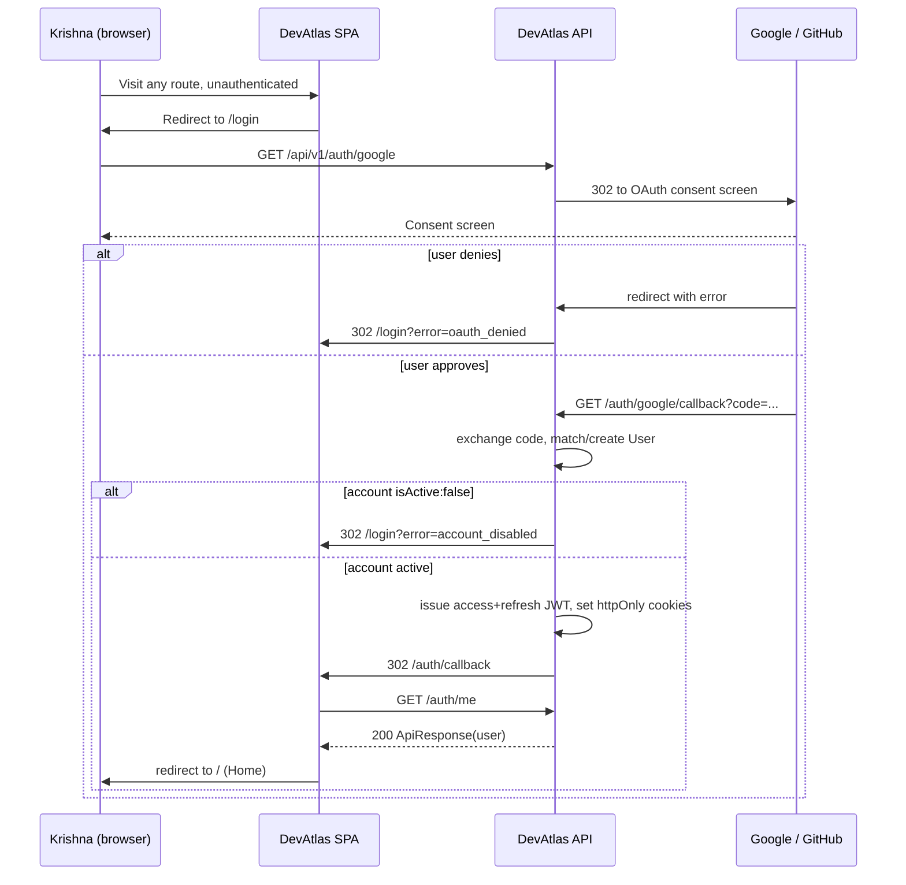

---

## 2. Learn a New Topic

**Actor:** Meera, wants to understand "Event Loop" and doesn't know the exact card title going in.
**Preconditions:** Authenticated session.

**Steps**

1. From Home, Meera clicks **Explore** in the top nav.
2. Explore landing fetches `GET /api/v1/categories?tree=true` and renders the 11 top-level category tiles (Frontend, Backend, DSA, Database, Operating System, Computer Networks, AI/ML, System Design, Projects, Interview, Misc).
3. Clicks the **Frontend** tile → `GET /categories/frontend` (children) → subcategory tiles render: JavaScript, React, CSS, TypeScript.
4. Clicks **JavaScript** → topic list view: `GET /knowledge?category=javascript&sort=title&page=1&limit=20`.
5. **Decision — list is long:** Meera applies a difficulty filter chip ("beginner"); this re-fetches with `&difficulty=beginner` and re-renders the list region only (rest of the screen — breadcrumb, category header — stays static).
6. Scans rows (type icon, title, tags, difficulty badge, read time, updated date) and finds "Event Loop." Clicks it.
7. Client navigates to `/card/event-loop` → `GET /knowledge/event-loop`. Backend increments `viewCount` and fires an `Activity(action:"viewed")` write fire-and-forget (doesn't block the response).
8. Card renders the fixed skeleton: Header (title/tags/difficulty/read time/updated) → TLDR → Deep Explanation → Visualization → Code Examples → Interview Questions → Mistakes → Resources → Related Topics.
9. **First-view side effect:** since this is Meera's first open of this card, the backend lazily creates a `UserProgress` row and sets `status: "in_progress"` (a best-effort `PATCH` fired alongside the view) — this is what makes Home's "Continue Learning" rail meaningful without requiring an explicit "start" action. `status` only ever advances to `"completed"` via an explicit "Mark as Completed" control in the personal rail; it never happens silently.
10. Meera reads TLDR, then the Deep Explanation. Reaching Visualization, the card's `content.visualization.kind` is `"flow"` — she pans/drags the React Flow diagram to explore the microtask-vs-macrotask relationship. This interaction is view-time only: per `03-srs.md` FR-CARD-07, dragged node positions are **not** persisted — the diagram resets to the admin-authored layout on next load.
11. Scrolls through Code Examples (syntax-highlighted, copy button per block) and Interview Questions (embedded question/answer pairs, not a separate quiz).
12. Reaches Related Topics: sees `prerequisite: Call Stack` and `related_to: Microtask Queue`.
13. **Decision:** Meera either stops here (passive read, `status` stays `in_progress`), or clicks a Related Topics chip — this continues into **Flow 9**.

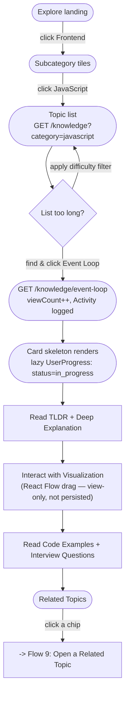

---

## 3. Search, then Read a Card

**Actor:** Krishna, knows the exact term "JWT."
**Preconditions:** Authenticated session.

**Steps**

1. Krishna clicks **Search** in the top nav (or the persistent quick-search field in the header, which routes to the same `/search` screen with the typed query preloaded).
2. `/search` mounts with no `q` yet → fetches `GET /search/recent` and shows recent-search chips (capped 10, stored on `User.recentSearches`) instead of a spinner — this is an **Idle** state, distinct from a "no results" state.
3. Types "jwt." Input is debounced 300ms, then `GET /api/v1/search?q=jwt&page=1&limit=20`.
4. **Decision — results empty?**
   - Empty → empty state: "No results for 'jwt'" + a link back to Explore. (Not the case here.)
   - Results found → list renders with a facet sidebar built from the response's `facets` block, e.g. `{ concept: 1, interview: 2, project: 0, dsa: 0 }` shown as filter chips with live counts.
5. Krishna clicks the `type=concept` facet chip to narrow straight to the canonical JWT concept card, filtering out the two `interview`-type results that also matched "jwt."
6. Clicks the "JWT" result → `POST /search/recent` fires fire-and-forget (appends "jwt" to the capped recent list) → client navigates to `/card/jwt`.
7. Card fetch + render proceeds exactly as **Flow 2, steps 7–9** (view increment, lazy `in_progress`, fixed skeleton).

**Alternate / error paths**

- A broader query like "auth" returns cards across multiple types (concept + interview + project). Selecting the "Roomezy" project result instead continues into **Flow 10**.
- Search request fails (network/5xx) → the query stays in the input (nothing is lost), an inline error region replaces the results list with a "Retry" button — see `13-ux-flows.md` §4 for the full state treatment.

```mermaid
flowchart TD
    A(["/search — Idle\nrecent searches shown"]) -->|type "jwt", 300ms debounce| B(["GET /search?q=jwt"])
    B --> C{"Any results?"}
    C -->|no| D(["Empty state:\n'No results for jwt'"])
    C -->|yes| E(["Results + facet chips\nfacets: {concept:1, interview:2}"])
    E -->|apply type=concept facet| F(["Narrowed results"])
    F -->|click JWT result| G(["POST /search/recent (fire-and-forget)"])
    G --> H(["/card/jwt renders — Flow 2 steps 7-9"])
```

---

## 4. Add a Personal Note

**Actor:** Meera, reading "Database Normalization," wants a private note.
**Preconditions:** Authenticated, viewing a card.

**Steps**

1. Every card page has a personal utility rail alongside (not inside) the canonical content skeleton — desktop: a right-side rail; mobile: a sticky bottom action bar expanding into a bottom sheet (see `13-ux-flows.md` §10). It holds Bookmark/Favorite/Pin toggles, Status, a Notes field, and Mark-for-Revision — this rail is explicitly **not** part of the fixed Header→...→Related Topics skeleton, since that skeleton is canonical, shared content, and the rail is 100% personal state.
2. Meera clicks into the **Notes** textarea and types: "Remember: 3NF removes transitive dependencies."
3. Autosave fires on a 1.5s debounce after typing stops: `PATCH /api/v1/progress/:knowledgeId` `{ personalNotes: "..." }`. This upserts — if Meera has never interacted with this card before, the `UserProgress` row is lazily created here.
4. **Decision — save result:**
   - Success → a small inline "Saved" indicator with a relative timestamp appears next to the field; no toast (toasts are reserved for explicit user actions, not autosave confirmations).
   - Failure (network) → inline "Couldn't save — retrying," exponential-backoff retry, and the unsaved text is buffered to `localStorage` as a last-resort safety net so a closed tab never silently loses a note mid-retry.
5. The note is private: never visible to other users, and per `03-srs.md` NFR-SEC-06 / FR-ANNOT-06, not visible to admins through any product surface either.
6. Meera navigates away. Returning to the same card later, `GET /progress/:knowledgeId` pre-populates the Notes field from the persisted value.
7. Notes are per-card only in v1 — there is no cross-card "all my notes" aggregation view; the note lives exactly where its context lives, consistent with the product's anti-flashcard philosophy.

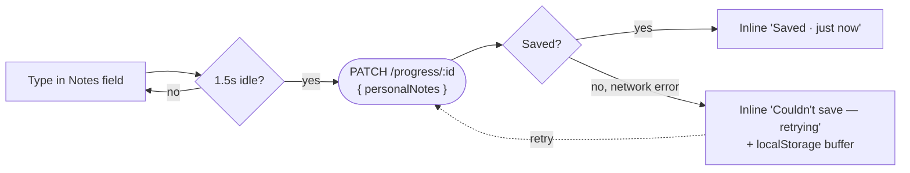

---

## 5. Highlight / Annotate While Reading

**Actor:** Krishna, reading the Deep Explanation of "Promise," wants to mark up a sentence.
**Preconditions:** Authenticated, viewing a card.

**Steps**

1. Highlighting is only supported inside the TLDR and Deep Explanation blocks — the two values of the `Annotation.block` enum (`06-database-design.md` §6). Code Examples, Mermaid/React Flow visualizations, and Mistakes/Resources are not span-selectable in this sense.
2. Krishna selects a span of rendered text (mouse drag, or Shift+Arrow for keyboard users — required for `02-prd.md` NFR-4 accessibility).
3. A floating toolbar appears above the selection: four color swatches (yellow/green/blue/pink) and a note icon.
4. **Decision:**
   - Clicks a color swatch directly → highlight is created immediately with that color and no note.
   - Clicks the note icon → a small popover textarea opens; Krishna types a note, confirms → highlight + note are created together in one request.
5. The frontend computes `quote` (the exact selected text) and `startOffset`/`endOffset` (character offsets within that block's rendered plain text), then calls `POST /api/v1/annotations` `{ knowledge, block, quote, startOffset, endOffset, color, note? }`.
6. The highlight renders immediately as an inline `<mark>` (optimistic UI), reconciled with the server-assigned `_id` when the response returns.
7. On any later visit, `GET /annotations?knowledge=<id>` is fetched alongside the card and re-applied automatically — no "load my highlights" action exists, they simply appear:
   - **Primary anchor:** `startOffset`/`endOffset` against the current rendered block.
   - **Fallback:** if offsets no longer line up (the admin lightly edited that paragraph), the frontend searches for the literal `quote` text within the block and re-anchors there.
   - **Orphaned:** if neither resolves (the block was substantially rewritten), the highlight is not rendered inline — per `03-srs.md` FR-ANNOT-07 the page still renders normally, and the orphaned highlight is listed in the personal rail as "1 highlight couldn't be placed" with its original quoted text, non-destructively kept in the database.
8. Clicking an existing highlight reopens the floating toolbar, letting Krishna change its color or note (`PATCH /annotations/:id`) or delete it (`DELETE /annotations/:id`).
9. Highlights are strictly per-user — invisible to every other account, including admins, on every surface.

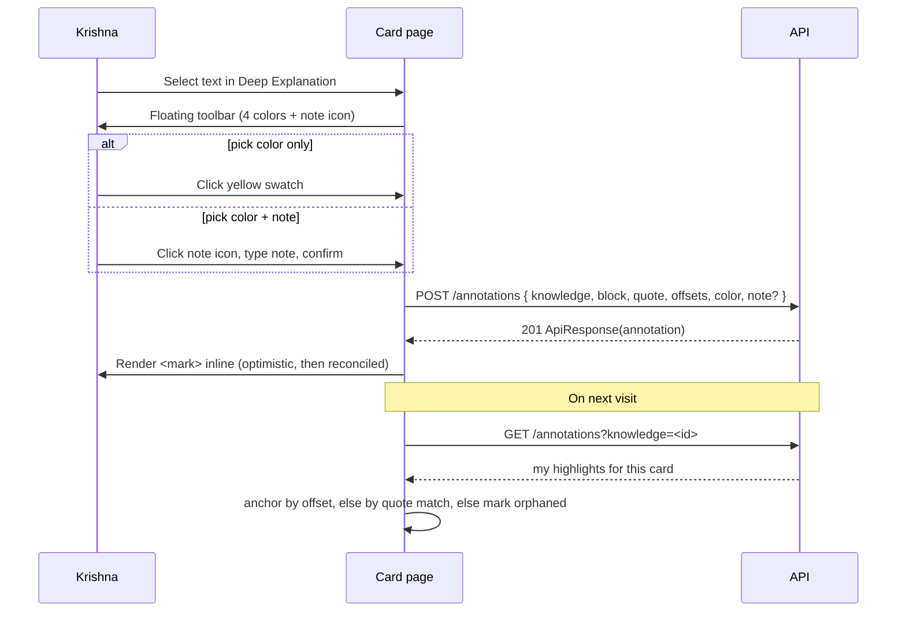

---

## 6. Admin: Upload an Attachment

**Actor:** Arjun, authoring/editing "Consistent Hashing," wants to insert a diagram image into the explanation.
**Preconditions:** Authenticated, `role: "admin"`, inside the Admin Knowledge Editor (see Flow 13).

**Steps**

1. Next to the Deep Explanation markdown textarea, Arjun clicks **"Upload Image"** (the same control exists on a project's gallery dropzone for `type:"project"` cards).
2. Native file picker opens; Arjun selects a PNG diagram export.
3. **Decision — client-side validation:** file type must be image/png, image/jpeg, image/webp, or image/svg+xml, and under a 10MB cap. Fails → inline error before any network call, form otherwise untouched.
4. Passes validation → `POST /api/v1/uploads` as `multipart/form-data`, field `file`, `resourceType: "image"` hint.
5. Backend: Multer writes the file to `backend/public/temp` (scratch disk) → controller streams/uploads it to Cloudinary → **on both success and failure**, the local temp file is deleted in a `finally` block (no orphaned disk writes, ever) → on success, an `Attachment` doc is created (`url`, `publicId`, `resourceType`, `format`, `bytes`, `uploadedBy`) and returned.
6. **Decision — Cloudinary upload fails** (network/quota): backend still deletes the local temp file, returns an `ApiError` (e.g. `502`). Frontend shows an inline "Upload failed — try again," and the rest of Arjun's in-progress form state (everything typed so far) is untouched — the failure is scoped to just this one upload attempt.
7. On success, the frontend inserts `` into the markdown textarea at the cursor (for an inline explanation image) or appends the returned Attachment's id to `gallery[]` (project cards).
8. Arjun continues editing and eventually saves the card (`POST`/`PATCH /knowledge`), which persists the *reference*. The Attachment document itself is already durable as of step 5 — a browser crash between upload and card-save loses only the unsaved markdown reference, not the uploaded asset (an intentionally accepted, low-stakes cost of decoupling upload from save; periodic "unused media" cleanup is future scope, not designed further here).
9. Deleting media happens from a "Manage Media" panel (`DELETE /uploads/:id`): Cloudinary asset destroyed by `publicId`, then the `Attachment` doc. If the attachment is still referenced by a published card's content, the delete is blocked with a warning rather than silently breaking the image link, consistent with the "never orphan a reference" spirit of `02-prd.md` NFR-6.

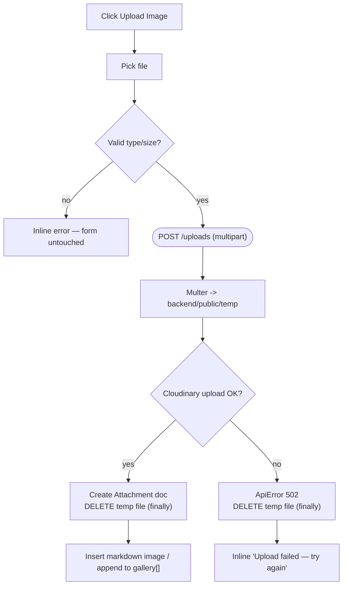

---

## 7. Bookmark / Favorite / Pin

**Actor:** Any authenticated user, either on a card page or from a list row's overflow menu (Explore, Search, Practice, Projects, Interview).
**Preconditions:** Authenticated.

**Steps**

1. Three independent, non-exclusive boolean toggles are available wherever a card is rendered as a full page (header actions) or as a summary row (compact icon buttons): **Bookmark** (save for later), **Favorite** (personally high-value), **Pin** (small, fast-access set — surfaced on Home and the Revision page's Pinned tab).
2. A click optimistically flips the icon's filled/unfilled state, then fires `PATCH /api/v1/progress/:knowledgeId` `{ isBookmarked: true }` (or `isFavorite`/`isPinned`) — lazily creating the `UserProgress` row if this is the user's first personal action on the card.
3. **Decision — Pin specifically:** per `03-srs.md` FR-PROG-03, Pin is capped at 10 to preserve a deliberately uncluttered quick-access surface. Attempting an 11th pin is rejected client-side before the request fires, with an inline message: "You've pinned 10 cards — unpin one to add another," and a shortcut to open the Pinned tab.
4. **Decision — request fails** (Bookmark/Favorite, or a Pin under the cap): the icon reverts to its prior state and a small inline error appears ("Couldn't update — check your connection"). No silent inconsistency between what's shown and what's persisted.
5. State is reflected everywhere the card appears: its own header, every list row across Explore/Practice/Projects/Interview/Search, Home's Pinned rail, and the Revision page's Favorites/Pinned tabs.
6. Un-bookmarking/un-favoriting/un-pinning is the same toggle in reverse — no confirmation dialog, since it's low-stakes and instantly reversible.

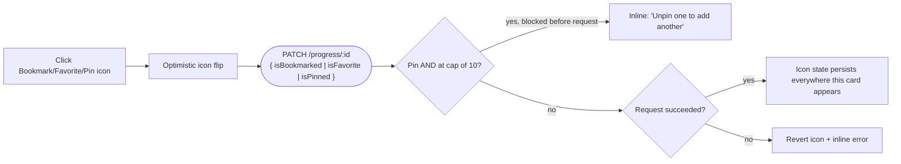

---

## 8. Mark for Revision, then Complete a Revision Session

**Actor:** Krishna, building a systematic pre-interview revision habit.
**Preconditions:** Authenticated.

### 8a — Marking a card for revision

1. On any card, in the personal rail, Krishna toggles **"Mark for Revision."**
2. `PATCH /progress/:knowledgeId/revision/mark` `{ marked: true }` sets `revision.isMarkedForRevision = true`. A freshly marked card hasn't been graded yet, so `revision.nextRevisionAt` defaults to "now" — it's immediately due, not queued into the future.
3. The card now appears in the Revision page's **Due Now** tab.

### 8b — Running a revision session

4. Krishna opens the persistent **Revision** icon in the header (not a top-nav item — see `04-information-architecture.md` §2 for why) → `/revision`.
5. The page loads with four tabs: **Due Now**, **Favorites**, **Pinned**, **In Progress**. Due Now fetches `GET /progress/revision/due` (`nextRevisionAt <= now`), ordered most-overdue-first.
6. **Decision — Due Now is empty:**
   - Krishna has never marked anything → empty state: "Mark cards for revision as you read them," linking to Explore.
   - Krishna has marked cards but none are currently due → a reassuring, factual state: "You're caught up — next review: <date> for <n> cards," pulled from the soonest `nextRevisionAt` across the full marked set. (Not the case here — cards are due.)
7. Krishna clicks **"Start Session."** This does **not** open a stripped-down quiz UI — per the product's "no separate flashcard object" rule, a revision session is just reading the real `/card/:slug` page again, with a persistent rating control pinned in the personal rail.
8. Krishna reads/skims the card as needed (the full skeleton is available, nothing is hidden to force recall-testing).
9. Rates confidence via three buttons in the rail: **forgot / shaky / confident**.
10. `POST /progress/:knowledgeId/revision` `{ result }`. Backend applies the interval table from `06-database-design.md` §5:

    | Result | Level | Next interval |
    |---|---|---|
    | `forgot` | reset to 0 | +1 day |
    | `shaky` | `max(level-1, 0)` | +3 days |
    | `confident` | `min(level+1, 4)` | +7/14/30/60/90 days by level |

    The rating is appended to `revision.history`.
11. Frontend auto-advances to the next due card in the session queue (a "Skip" control is also available). Each rating is persisted the moment it's submitted, so exiting mid-session mid-queue loses nothing — there is deliberately no "unsaved session progress" confirmation dialog, because there's nothing unsaved.
12. When the queue empties: **"All caught up"** completion state, showing a plain factual count ("Reviewed 7 cards") — not a score, streak, or badge, per `02-prd.md` NFR-8 / `03-srs.md` FR-PROG-09.
13. Returning to the Revision landing re-fetches Due Now, now reflecting the freshly pushed-out `nextRevisionAt` values.

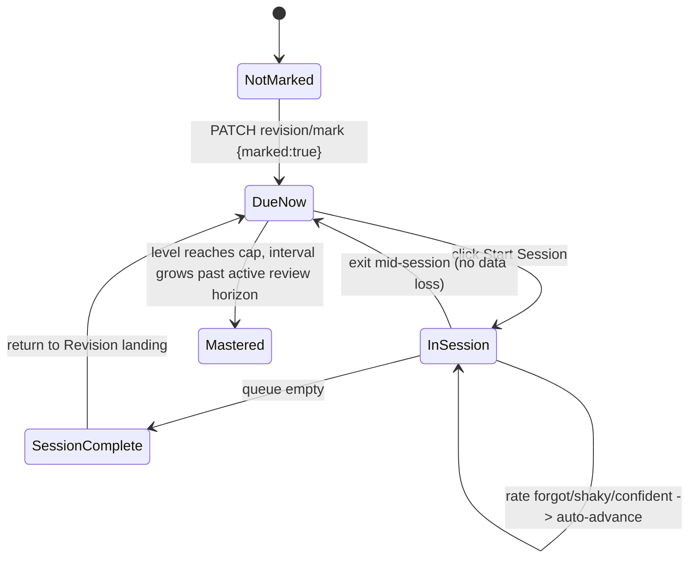

---

## 9. Open a Related Topic

**Actor:** Any user, at the bottom of a card, in the Related Topics section.
**Preconditions:** Authenticated, currently reading a card (arrived via any other flow).

**Steps**

1. The Related Topics section is populated from `GET /knowledge/:slug/related`, which resolves `relations[]` into summary cards grouped by `relationType`, and also surfaces inbound edges (other cards that point *at* this one) with an inverted label — see `04-information-architecture.md` §7.
2. Each relation renders as a compact chip: title, type badge, difficulty, and the relationship label (e.g. "Prerequisite: Call Stack," or on JWT's own page, "Used in: Roomezy, DevMeet").
3. User clicks a chip, e.g. "Prerequisite: Call Stack."
4. Client navigates to `/card/call-stack` — the same shared card renderer regardless of which type the target is (a `concept` card linking to a `dsa` card, or a `project` card linking to a `concept` card, all resolve to the identical component).
5. New card fetch + render proceeds as **Flow 2, steps 7–9**. Browser history push means the Back button returns to the originating card; scroll position restoration is handled by React Router's default `ScrollRestoration`, not bespoke code.
6. **Decision — target has since been unpublished/soft-deleted:** this branch never reaches the user — `GET /knowledge/:slug/related` filters out non-published targets server-side, so Related Topics never renders a dead link in the first place.
7. This can chain indefinitely (Related Topic → its own Related Topics → ...), which is the core graph-navigation experience. v1 deliberately does not build a "trail of visited cards" breadcrumb on top of this — browser back/forward is sufficient, and a first-class visual graph explorer is explicitly v2 (`02-prd.md` §9).

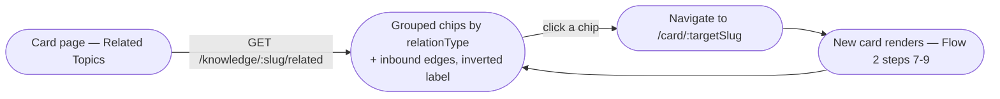

---

## 10. Open a Project Case Study

**Actor:** Meera, wants to see how "Roomezy" was engineered.
**Preconditions:** Authenticated.

**Steps**

1. From the top nav, Meera clicks **Projects** → `GET /knowledge?type=project&sort=-createdAt`.
2. Landing renders each `type:"project"` card as a case-study tile: title, tagline, tech-stack chips, cover image (if a gallery `Attachment` exists).
3. Clicks **"Roomezy"** → `/card/roomezy` (same unified route as every other card type).
4. **Composition rule (important, since the PRD names case-study blocks that the fixed skeleton itself doesn't have dedicated sections for):** the project discriminator's fields (`architectureNotes`, `databaseNotes`, `apiNotes`, `deploymentNotes`, `challenges[]`, `decisions[]`, `lessonsLearned[]`, `improvements[]`) are composed by a project-specific renderer into the single **Deep Explanation** region, in a fixed sub-order — Overview → Architecture → Database → Auth → Real-time → Cloud Media → Notifications → Deployment → Problems → Lessons. This preserves "one long page, no tabs" (`03-srs.md` C-6) while still delivering the Roomezy-style case-study structure the PRD requires.
5. Meera reads the Auth subsection and sees an inline deep-link: "This project uses JWT for stateless session auth →" — rendered from a `relations[]` entry (`relationType: "used_in"`, target: the JWT concept card) that the admin authoring form inserted as an inline anchor at that exact point in the prose, in addition to it appearing again, summarized, in the Related Topics section at the bottom.
6. Clicking that inline link continues into **Flow 9**.
7. Scrolling to Visualization: project cards commonly use an admin-authored React Flow diagram (services/DB/client boxes with edges) for the architecture, since that's the explicit "architecture flows" use case React Flow was chosen for — Mermaid remains available for simpler, static diagrams.
8. At the Resources section, Meera notices `repoUrl`/`demoUrl` are **not** listed there — they render as a small link row alongside the Header/TLDR (a project subtitle bar), since the Resources section is reserved for admin-attached external *learning* resources (the `Resource` collection), not the project's own repo/demo links.
9. Meera can bookmark, favorite, pin, note, and mark-for-revision the project card exactly like any other card (Flows 4/7/8) — no personalization behavior is special-cased for `type:"project"`.

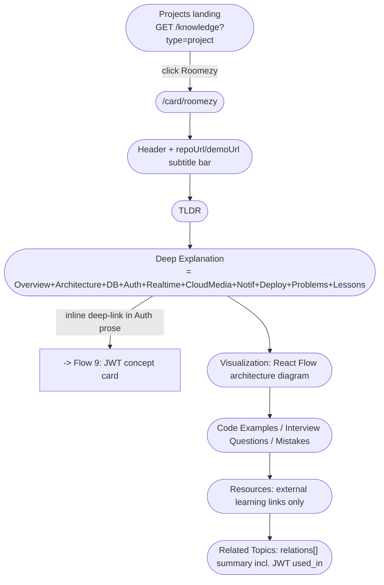

---

## 11. Solve a DSA Question and Add a Personal Approach/Notes

**Actor:** Krishna, practicing the Two Pointers pattern.
**Preconditions:** Authenticated.

**Steps**

1. From the top nav, clicks **Practice** → DSA Dashboard (`GET /knowledge?type=dsa`), with a stat header (counts by difficulty) and filter chips: pattern, difficulty, category, company, and completion/bookmark state.
2. Applies the pattern filter "Two Pointers," clicks **"Container With Most Water."**
3. Card loads (`type: dsa`) — header/meta row shows `pattern`, `complexity.time`/`complexity.space`, `constraints`, and an `externalUrl` link out to LeetCode. TLDR restates the problem briefly.
4. Deep Explanation teaches the **pattern**, not just this one problem — per FR-CARD-13/`06-database-design.md` §4.3, this is what lets the understanding transfer to unseen problems.
5. `hints[]` are progressively revealed ("Show hint 1," "Show hint 2," ...) rather than dumped all at once.
6. **The "no solution by default" rule:** `approach` (strategy-level prose, e.g. "shrink the window from whichever side is shorter") renders inline, but any full coded solution living in `content.codeExamples` stays collapsed behind an explicit **"Show Solution"** click (`06-database-design.md` §4.3.1) — so skimming the page never accidentally spoils it.
7. Krishna attempts the problem externally (LeetCode via `externalUrl`, or on paper) — DevAtlas has no in-browser code runner/judge in v1, explicitly deferred (`02-prd.md` §9).
8. Returns, clicks **"Show Solution"** to compare his approach against the canonical one.
9. In the personal rail, sets **Status → Completed** explicitly (unlike concept cards, DSA problems have a meaningful gap between "opened it" (`in_progress`, set automatically on first view) and "actually solved it" (`completed`, always a manual action)).
10. Adds `personalNotes` ("used two pointers from both ends, forgot to skip when height is 0 initially") and a `personalMistakes[]` entry ("initially tried brute-force O(n²), missed the pointer-shrink invariant") — same `PATCH /progress/:knowledgeId` mechanism as Flow 4.
11. If the pattern still felt shaky, marks it for revision (Flow 8a) so it resurfaces.
12. The card's own Interview Questions section carries pattern-specific follow-ups (e.g. "how would you extend this to k pointers?") — read in place, reinforcing embedded-not-isolated interview prep.

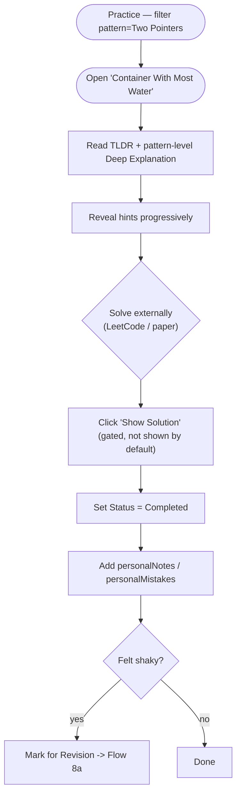

---

## 12. View Company-wise DSA Questions

**Actor:** Krishna, prepping specifically for an Amazon interview.
**Preconditions:** Authenticated.

**Steps**

1. From the DSA Dashboard (or the Interview module — the same `companies[]` field on the base `Knowledge` schema powers both), Krishna opens the company filter and types "ama..." → typeahead against `GET /companies?q=ama...`.
2. Selects **Amazon** → `GET /knowledge?type=dsa&company=amazon&sort=-updatedAt`. The stat header updates to an aggregation-backed view (`06-database-design.md` §12): "42 questions · 12 easy / 22 medium / 8 hard."
3. **Decision — zero questions for that company** (sparse taxonomy on a newer company tag): empty state "No DSA questions tagged Amazon yet," with a link back to the unfiltered Practice list — never a dead end. (Not the case here.)
4. Krishna narrows further with the difficulty chip ("medium") and/or a pattern chip — facets combine with AND semantics between distinct facet types, per `07-api-design.md`'s query param conventions.
5. Rows render in the same shape as the general DSA Dashboard, including the user's own solved/bookmark state icons pulled from `UserProgress`.
6. Clicking a question continues into **Flow 11** from step 3 onward.
7. Because `companies[]` lives on the base schema (not the `dsa` discriminator alone), the identical **Amazon** filter, opened instead from the Interview module's company picker, surfaces DSA questions *and* interview-tagged concept/interview cards in one company-scoped view — the taxonomy reuse this buys is the whole point of putting `companies` on the base schema rather than duplicating it per type.

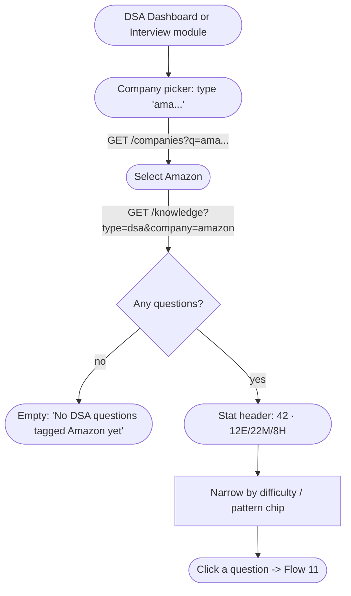

---

## 13. Admin: Author a New Knowledge Card

**Actor:** Arjun (admin), authoring "Consistent Hashing" from scratch.
**Preconditions:** Authenticated, `role: "admin"`.

**Steps**

1. Arjun navigates to `/admin`. Client-side, the route is guarded by `role === "admin"` on hydrated auth state — this is UX-only; every admin endpoint independently enforces `verifyRole("admin")` server-side, so the client guard is never the actual security boundary.
2. From the Admin Dashboard, clicks **"New Knowledge Card"** → a type-select step: `concept` / `dsa` / `interview` / `project` (segmented control). This choice determines which discriminator-specific fields appear next, and per FR-ADM-01/`07-api-design.md`, `type` becomes **immutable** the moment the card is created.
3. The form shell renders sections mirroring the schema (authoring-optimized order, distinct from the reading skeleton's order): **Basics** (title → live slug preview, category, tags, difficulty, status) → **Content** (TLDR, Deep Explanation — markdown editor with a live split-pane preview) → **Visualization** (kind: none/mermaid/flow; mermaid gets a raw-source textarea with live-rendered preview, flow gets an embedded React Flow canvas editor) → **Code Examples** (repeatable label/language/code rows) → **Interview Questions** (repeatable question/idealAnswer/followUps/commonMistakes rows) → **Mistakes** (repeatable title/explanation rows) → **Resources** (attach existing or create new) → **Relations** (typed-edge builder: search for a target card, pick one of the 9 `relationType` values, add — directional and admin-authored only, per `03-srs.md` FR-REL-01/02) → **Companies** (multi-select) → the type-specific block last (e.g. for `dsa`: pattern/complexity/constraints/externalUrl/approach/hints).
4. Arjun fills Basics; the slug live-generates from title but stays editable until first publish, after which it's immutable (re-slugging a published card is blocked). Uniqueness is checked via a debounced lookup with inline feedback before submit.
5. **Decision — self-relation attempt:** if Arjun tries to relate this card to itself while building the Relations block, the client blocks it before submit (and the server independently rejects it with `400` per FR-REL-04 if somehow bypassed).
6. Saves as **Draft** at any point (`POST /knowledge` with `status:"draft"`) — no publish-readiness validation blocks a draft save; drafts can be incomplete.
7. **Preview:** Arjun toggles "Preview," which renders the in-progress form data through the *actual* `KnowledgeCardLayout` component used in production (fed unsaved form state) — there is no separate, potentially-divergent preview renderer.
8. When ready, clicks **Publish** → `POST /knowledge/:id/publish`.
9. **Decision — publish validation:**
   - Fails (e.g. missing title/TLDR/explanation/category) → `422` with field-level `errors[]`, surfaced inline on the exact form sections that are incomplete, not a generic toast. Publish is blocked until fixed.
   - Passes → `status: "published"`, an `Activity(action:"published")` entry is logged, the card becomes publicly visible/searchable within the app.
10. Arjun can return anytime and `PATCH /knowledge/:id` — editing a published card does not unpublish it; `lastEditedBy`/`updatedAt` update and an `Activity(action:"updated")` entry is appended for the audit trail (`02-prd.md` NFR-9).
11. Deleting (`DELETE /knowledge/:id`) is a soft delete, blocked/warned if the card is a target of other cards' `relations[]` — mirroring the same "never silently orphan a reference" guard `Category` deletion already has (NFR-6).

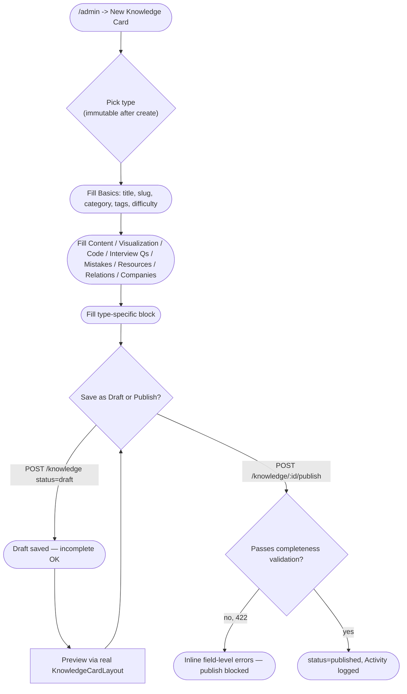

---

## 14. Admin: Bulk CSV Import DSA Questions

**Actor:** Arjun, has a 200-row spreadsheet of DSA questions to seed.
**Preconditions:** Authenticated, `role: "admin"`.

**Steps**

1. From `/admin/import/dsa-csv`, Arjun downloads the provided CSV template (a static asset from the screen, not hand-derived) — columns match the flattened `dsa` shape: `title, category, pattern, difficulty, tags, complexity_time, complexity_space, constraints, external_url, approach, hints, companies` (list-valued columns delimited within the cell).
2. Prepares the CSV in a spreadsheet tool, exports it, and drags it onto the import dropzone.
3. **Decision — client-side pre-check:** file must be `.csv` and under a sane size cap (e.g. 5MB); rejected before any upload if not.
4. `POST /api/v1/knowledge/import/dsa-csv` as `multipart/form-data`, field `file`.
5. Backend streams and parses row by row. For each row: validates required fields present, `difficulty` is a valid enum value, `category` resolves to an existing `Category` slug, and `companies` slugs resolve to existing `Company` docs (unknown company slugs are **flagged as a row-level warning, not auto-created** — Company creation stays an explicit admin action elsewhere, keeping taxonomy curated). A row that passes creates a `Knowledge` doc with `type:"dsa", status:"draft"` — **imported rows land as drafts, never auto-published**, so Arjun reviews before anything goes live.
6. **Decision — whole-file parse failure** (not valid CSV, or headers don't match the template): a single top-level `ApiError` (`422`) is returned *before* any row processing begins — the frontend shows "This file isn't a valid CSV / doesn't match the template," distinct from (and not confusable with) a report showing `created: 0`.
7. On a structurally valid file, the response (still `200` — a partial-success report is not itself an error, per `07-api-design.md` §5 and `03-srs.md` FR-ADM-02) is: `{ created: 187, skipped: 13, errors: [{row: 14, reason: "difficulty must be one of easy|medium|hard"}, ...] }`.
8. The UI renders an import report: a summary stat row (created/skipped counts) plus a scrollable table of per-row errors (row number, reason), so Arjun can fix exactly those 13 rows in the source spreadsheet.
9. **Re-import behavior:** since `slug` is derived from `title` and must be unique, re-uploading rows whose titles already exist surfaces as `409`-style per-row failures in the same `errors[]` report (not a crash and not silent duplication) — Arjun corrects the offending rows and re-runs the import with just those.
10. **Decision — Arjun wants the imported drafts live:** v1 has no bulk-publish endpoint (not in `07-api-design.md`'s surface). Arjun navigates to the Knowledge list filtered `status=draft&type=dsa`, spot-checks a sample, and publishes each individually via Flow 13 step 8-9 — this is stated explicitly to avoid implying a bulk-publish action that doesn't exist.

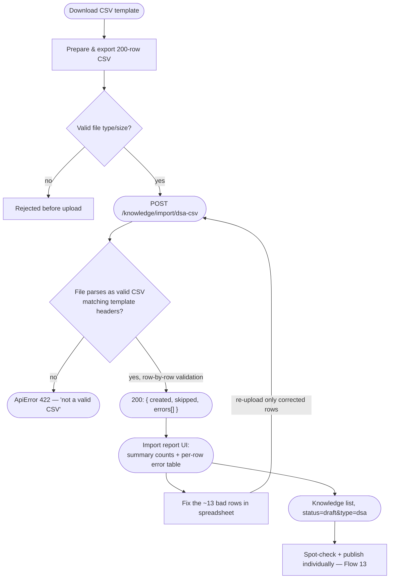

---

## 15. Admin: Promote a User to Admin

**Actor:** Arjun (existing admin), promoting Krishna after he joins the content-curation team.
**Preconditions:** Authenticated, `role: "admin"`. (Day-zero bootstrap note: the very first admin account can only come from a DB write or seed script — per FR-AUTH-09/`02-prd.md` FR-11, there is no endpoint that can create the first admin, by design. This flow covers the steady-state, endpoint-driven path that exists once at least one admin already does.)

**Steps**

1. Arjun navigates to `/admin/users` → `GET /users?q=&role=&isActive=&page=1&limit=20`, a searchable/filterable user table (name, email, avatar, role badge, `isActive`, joined date, last login).
2. Searches "krishna" → finds his row, `role: "user"`.
3. Clicks the row action **"Promote to Admin."**
4. A confirmation dialog appears. This is one of the few flows in the product with an explicit confirm step — role changes are consequential and not something the promoted user can undo themselves, unlike the reversible-by-anyone toggles in Flow 7.
5. Confirms → `PATCH /api/v1/users/:id/role` `{ role: "admin" }`.
6. **Decision — last-admin guard:** if this action were instead a *demotion* that would leave zero admins in the system, the backend rejects it with `409 ApiError` ("At least one admin must remain") — per `03-srs.md` FR-ADM-05 / acceptance criterion 8.7. (Not applicable to a promotion, but this same endpoint enforces it on the reverse action.)
7. On success, Krishna's `User.role` flips to `"admin"`. Auditability (`02-prd.md` NFR-9) is satisfied without inventing a new `Activity.action` enum value: an `Activity` doc is written with the existing `action:"updated"`, `knowledge: null` (the field is optional, not required, per `06-database-design.md` §10), and `meta: { entity: "User", targetUserId, field: "role", from: "user", to: "admin" }`, `user` set to Arjun (the actor) — this fits the schema exactly as documented rather than contradicting it.
8. **Authorization takes effect immediately, not on next login:** `verifyJWT`/`verifyRole` middleware re-reads `role` and `isActive` fresh from the `User` document on every request rather than trusting a claim baked into the JWT at issuance — the JWT only proves *identity*, not *authorization level*. This means a promotion (or, more importantly, a demotion) is enforced on Krishna's very next API call, not after his access token happens to expire and refresh.
9. There is no notification system in v1 (no email/push, by product decision) — Krishna's only signal is that Admin-only nav (`/admin`) becomes visible the next time his frontend re-hydrates auth state via `GET /auth/me`.
10. Demotion is the identical flow in reverse — same confirmation dialog, same `PATCH /users/:id/role { role: "user" }` call, same last-admin guard applied in the direction that actually matters for it.

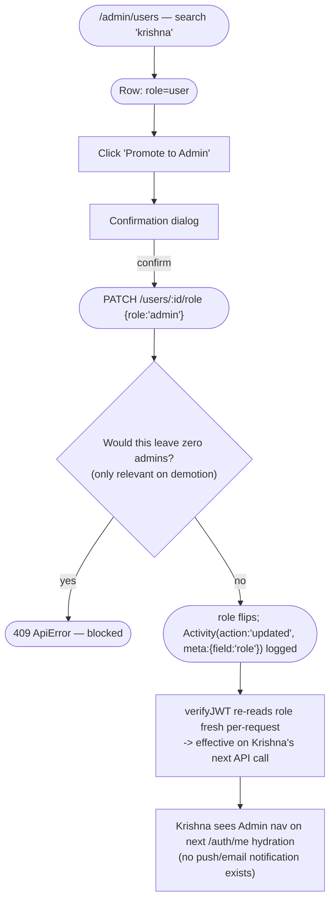
