# 13 — UX Flows

> Screen-level state machines: what state each module's screen can be in, what event moves it to another state, and exactly what renders in that state. This is deliberately **not** `12-user-flows.md` (actor-driven journeys that walk across many screens) and **not** `14-wireframes.md` (what a given state looks like, box by box) — it's the layer between them: the finite set of states a screen legally occupies, independent of who's using it or what it's drawn with. Route ownership and the navigation tree are `04-information-architecture.md`'s job; this document assumes that map and describes what happens *inside* each destination on it.

Scope is exactly the eight modules named in this document's brief — Dashboard, Explore, Practice, Search, Interview, Projects, Revision, Profile/Settings — plus the App Shell chrome those eight modules all live inside. The Knowledge Card page's own render states (view increment, lazy `UserProgress` creation, Visualization error-boundary isolation) are already specified in `12-user-flows.md` Flow 2 and are not re-derived here; this document treats "hand off to `/card/:slug`" as a terminal transition out of every module below.

---

## 0. Conventions

### 0.1 The state vocabulary

Every dynamic region in every module below is described using exactly this vocabulary — it's defined once here and referenced by name everywhere else in this document instead of being re-explained per module.

| State | Meaning | RTK Query signal |
|---|---|---|
| **Idle** | Screen mounted, no query has fired yet — reserved for the one screen that waits on input before it has anything to ask for (Search, §4) | no query issued yet, or `skip: true` |
| **Loading (cold)** | First fetch for the current parameter combination; nothing cached to show yet | `isLoading: true` |
| **Refining (warm)** | A filter/sort/tab/page changed and a re-fetch is in flight, but the previous result set is still on screen | `isFetching: true`, `isLoading: false`, prior `data` still defined |
| **Loaded** | 2xx response, ≥1 item | `isSuccess`, `data.items.length > 0` |
| **Empty** | 2xx response, 0 items — a successful query that legitimately found nothing, never conflated with Error | `isSuccess`, `data.items.length === 0` |
| **Error** | Request failed — network, timeout, or 5xx | `isError` |
| **Not Found** | A single-resource route (category slug, card slug) resolved to a 404 — distinct from Error because it is never retryable | `isError`, `error.status === 404` |

### 0.2 Four rules that hold in every module below

1. **Cold vs. warm loading never share a widget.** Loading (cold) renders `Skeleton` blocks shaped like the eventual content — tile-shaped for grids, row-shaped for lists, never a centered `Spinner` — because a skeleton reserves the real layout footprint and a spinner-then-pop-in causes visible reflow. Refining (warm) never re-skeletons a region that already has content: the prior rows stay fully visible and interactive, with a thin indeterminate progress line as the only signal. `Spinner` (the small primitive) is reserved for field- or button-level pending states — a Save button mid-request, the Notes autosave indicator (§10) — never for a full region.
2. **Shell-stable refetching.** Every module below splits into a *shell* (breadcrumb, category header, filter bar, tabs — anything independent of the result set) and a *region* (the list/grid, which owns its own Loading/Refining/Empty/Error state). Changing a filter, switching a tab, or paging never remounts the shell — only the region re-runs. This is what makes filtering feel instant instead of like a page reload, and it's the same behavior `12-user-flows.md` Flow 2 step 5 describes informally as "re-renders the list region only."
3. **Empty and Error share one visual primitive, never one identity.** Both use the same `Empty` component shape (icon + title + description + optional action) rather than two bespoke components, but they are never visually ambiguous: Empty uses a neutral icon (inbox/search-style) and an action that moves the user *forward* (clear a filter, browse elsewhere); Error uses an alert-triangle icon and an action that repeats the *same* request (Retry). Icon and action always disambiguate them, since users skim icon shape before reading copy.
4. **Not Found is a third thing, not Error's retry-flavored cousin.** A bad slug will never resolve itself on retry, so Not Found always renders a static "this doesn't exist" state with a link to a known-good screen and **never** a Retry control — offering Retry on a 404 would be actively misleading. Within this document's eight modules, Not Found is only reachable through Explore's slug-addressed routes (§2); the Knowledge Card page's own Not Found treatment belongs to that page, not to any module that links into it.

---

## 1. Dashboard (Home)

Route `/` (`12-user-flows.md` §0.2). The entire screen is served by one aggregated call, `GET /dashboard` (`07-api-design.md` §11) — six rails, one loading boundary, no per-rail network round trip.

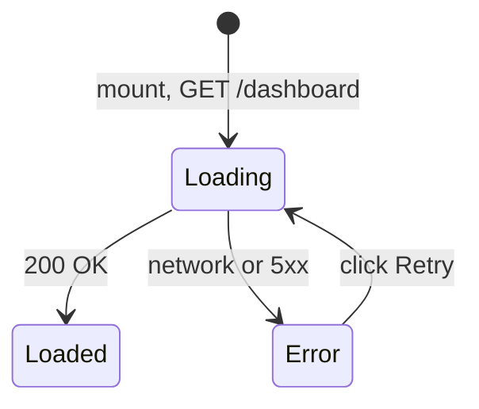

**Loading (cold).** Six rail-shaped `Skeleton` regions matching the eventual grid (a title bar plus 3-4 card-shaped blocks per rail). There is no Refining state on this screen — Dashboard has no user-adjustable filters, so every visit is a fresh cold load.

**Empty is per-rail, not whole-page** — the response is a single 200 whose six sub-arrays can each independently be empty:

| Rail | Empty condition | Treatment |
|---|---|---|
| Continue Learning | no `UserProgress` with `status: "in_progress"` | rail omitted from the layout entirely |
| Revision Due | no card has `nextRevisionAt <= now` | rail omitted, *unless* the user has marked cards at all but none are currently due — then a single factual line replaces it: "Next revision: `<date>` · Go to Revision" |
| Recently Viewed | no `viewed` Activity yet | rail omitted |
| Pinned | `isPinned` count is 0 | rail omitted |
| Recent Activity | no Activity rows yet | rail omitted |
| Recently Updated | canonical `knowledges` content | structurally never empty post-seed — see below |

Rails are omitted outright rather than rendered with their own "nothing here yet" placeholder card, except the reassuring Revision Due case above. A first-run Dashboard with five stacked "nothing here" placeholders would be exactly the low-signal clutter the product philosophy argues against (`01-product-vision.md` §13) — an omitted rail reads as "this feature will appear once you use it," not as a broken page.

**New-user case.** Because Recently Updated always has canonical content once the library is seeded, a brand-new account's Dashboard is never a blank page even when all five personal rails are empty simultaneously — it renders Recently Updated plus one inline banner ("You haven't explored any topics yet — start with Explore," linking to `/explore`) instead of a page that looks sparse or broken on day one.

**Error.** Since the whole page is one request, a failure blanks the entire content region below the static greeting header — full-page `Empty`-primitive block, alert-triangle icon, "Couldn't load your dashboard," Retry. There is no partial-failure case to design for; §0.2 rule 3 covers the icon/copy choice.

---

## 2. Explore (Knowledge Browsing)

Routes `/explore`, `/explore/:categorySlug`, `/explore/:categorySlug/:subCategorySlug` (`12-user-flows.md` §0.2). Three composed screens sharing one breadcrumb shell.

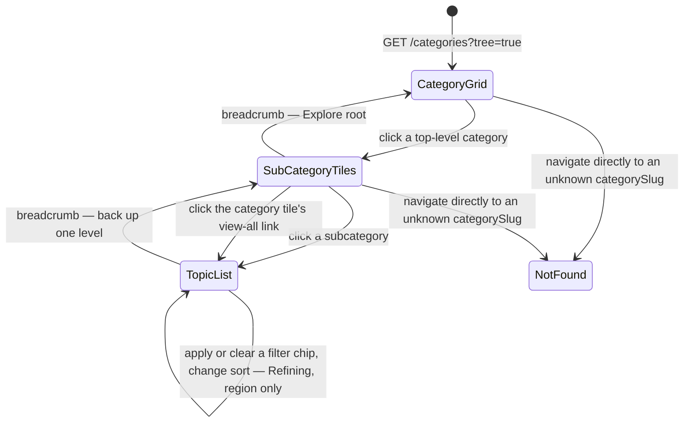

**CategoryGrid / SubCategoryTiles.** Loading (cold): tile-shaped skeletons (11 at the root, matching `06-database-design.md` §3's seeded top level). Empty essentially doesn't occur at the root — the 11 top-level categories are seeded, not user-created. It can occur one level down: a SubCategory with zero non-deleted children *and* zero directly-attached cards simply isn't rendered as a tile on its parent grid at all, rather than rendered as a clickable dead end — an admin-curation gap should never be user-visible as a broken tile. Error: inline `Empty`-primitive block replacing the grid, Retry.

**TopicList** is the one genuinely dynamic region in Explore, and it follows the full vocabulary from §0.1:

| State | Treatment |
|---|---|
| Loading (cold) | 8-12 row-shaped skeletons under a static breadcrumb + category header (shell-stable per §0.2 rule 2) |
| Refining | existing rows stay visible and interactive, dimmed, thin top progress line — per `12-user-flows.md` Flow 2 step 5 |
| Empty — filtered | filters applied but matched nothing: "No topics match these filters" + "Clear filters" action. Implies the user's own input should change. |
| Empty — content gap | category has zero published cards at all: "No topics published in `<Category>` yet" + link back to the Explore root. Implies a curation gap, not user error — hence a different action than the filtered case even though both are technically "Empty." |
| Error | inline, region-scoped — breadcrumb, category header, and filter bar remain live; Retry re-issues the same filtered query |
| Not Found | `/explore/:badSlug` resolves to no category → "This category doesn't exist" + link to Explore root, no Retry (per §0.2 rule 4) |

---

## 3. Practice (DSA)

Route `/practice` (`12-user-flows.md` §0.2). Reads `GET /knowledge?type=dsa` (`07-api-design.md` §5), with an additional company-scoped mode (`12-user-flows.md` Flow 12).

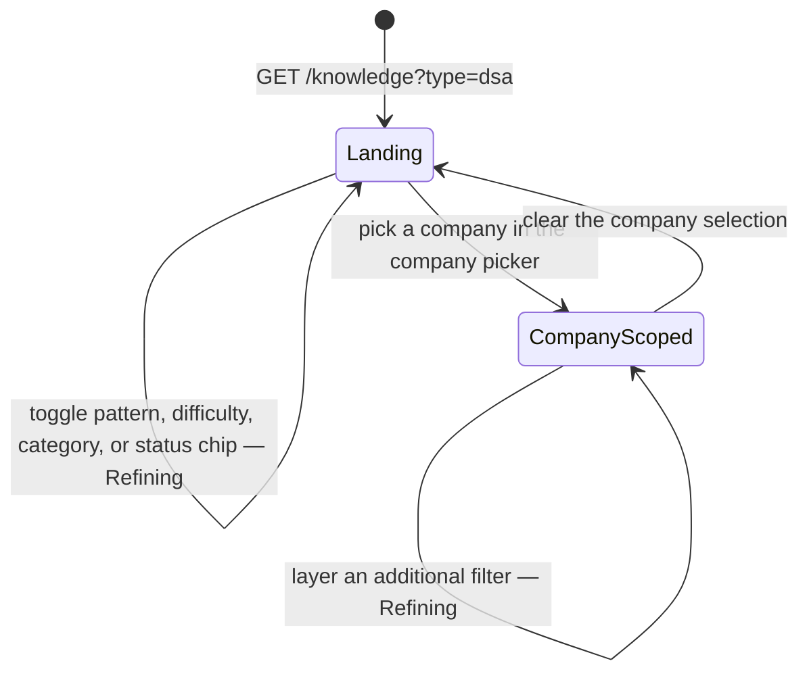

The stat header ("X easy / Y medium / Z hard") and the row list resolve together off the same filtered query rather than as two independently-timed requests — there is exactly one Loading/Refining boundary covering both, not a header that finishes before or after the rows.

| State | Treatment |
|---|---|
| Loading (cold) | number-shaped skeletons in the stat header ("`--` easy / `--` medium / `--` hard") alongside row skeletons, resolving together |
| Refining | stat header numbers crossfade to the new counts in place (no skeleton flash); rows use the standard dim + progress-line treatment |
| Empty — filtered | filters matched nothing: "No questions match these filters" + Clear filters |
| Empty — company-scoped | selected company has zero tagged questions: "No DSA questions tagged `<Company>` yet" + link back to the unfiltered list — verbatim the case walked through in `12-user-flows.md` Flow 12 step 3 |
| Empty — content gap | no DSA content published at all (early-launch edge case): "No DSA questions published yet" — distinguishable copy, since this is a signal for an admin, not a filter the user chose |
| Error | region-scoped inline Retry; stat header and rows fail together since they share one request |

---

## 4. Search

Route `/search` (`12-user-flows.md` §0.2). The only module with a genuine pre-query state, since it's the one screen that has nothing to show until the user gives it something to look for.

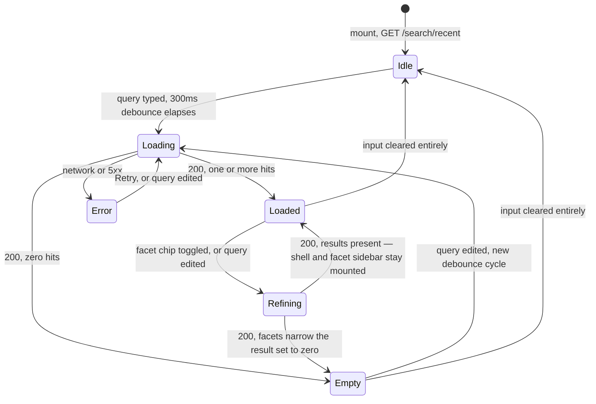

| State | Treatment |
|---|---|
| Idle | not a blank screen: up to 10 recent-search chips render as tappable shortcuts (`User.recentSearches`, `07-api-design.md` §8). An account that has never searched shows a short prompt instead ("Search across every concept, DSA question, project, and interview topic") with no chips — Idle's own empty sub-case, distinct from the results-Empty state below it |
| Loading (cold) | a handful of row-shaped skeletons under the search bar; the facet sidebar is skeleton-blocked too rather than left showing stale counts from the previous query |
| Loaded | results list + facet sidebar built from the response's `facets` block (`07-api-design.md` §8), e.g. counts per `type` |
| Refining | facet counts update in place; result rows use the standard dim + progress-line treatment — narrowing by a facet must feel like filtering, not re-searching, per `12-user-flows.md` Flow 3 step 5 |
| Empty | "No results for `'<query>'`" + link back to Explore; the facet sidebar collapses rather than showing every facet at zero, since an all-zero facet list is noise once the answer is already "nothing" |
| Error | query text is preserved in the input under all circumstances — never cleared by a failed request; the results region shows the standard Error treatment. If the screen was still Idle when the recent-searches fetch itself failed, that's a much lower-stakes, silent failure: the chip row is simply omitted, no Alert, since recent searches are a convenience, not the primary content |

---

## 5. Interview

Route `/interview` (`12-user-flows.md` §0.2). Aggregates `type: "interview"` cards with interview-tagged `concept`/`dsa`/`project` cards into one list (`04-information-architecture.md` §6).

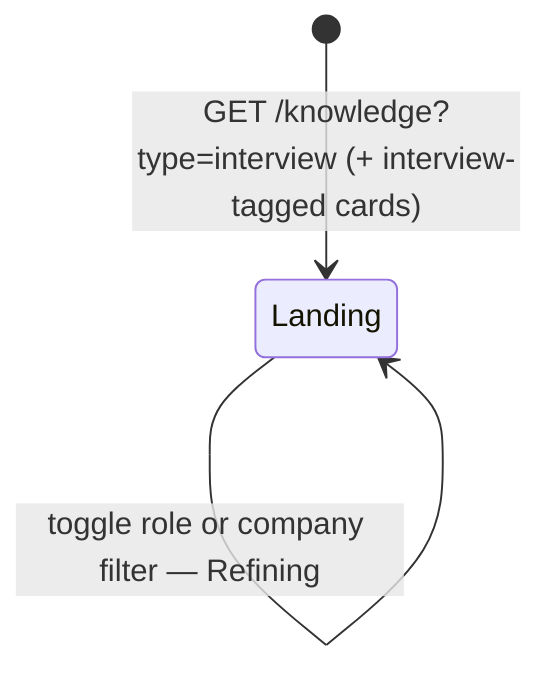

| State | Treatment |
|---|---|
| Loading (cold) | row skeletons; role-grouped section headers render as skeleton bars too, so the grouping structure doesn't pop in after the rows do |
| Refining | standard dim + progress-line treatment on the affected group(s) |
| Empty — narrow combination | no content for a specific role+company pair: "No interview content tagged `<Company>` · `<Role>` yet" |
| Empty — filtered generally | "No results — try removing a filter" |
| Error | region-scoped inline Retry |

Unlike Practice/Explore, a Loaded Interview list is a genuine *union* across three underlying card types rendered as one flat, type-badge-annotated list — a standalone interview topic can sit directly beside a `concept` card surfacing its embedded `content.interviewQuestions[]`. This doesn't add a new state, but the row template must accommodate both shapes without a visual seam between them.

---

## 6. Projects

Route `/projects` (`12-user-flows.md` §0.2). The simplest module in this document — no facet filters exist here at all; `12-user-flows.md` Flow 10 step 1 issues a single unfiltered, sorted query, and that's the whole surface.

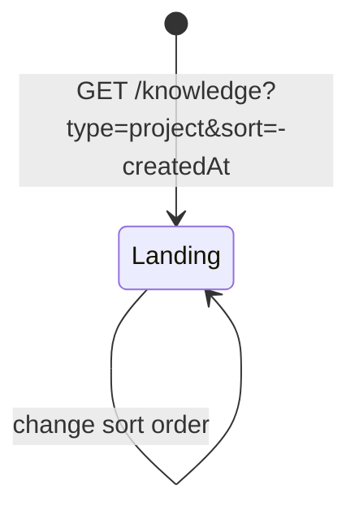

| State | Treatment |
|---|---|
| Loading (cold) | 2-3 wide card-shaped skeletons (cover-image block + title + tech-stack chip row) — visually heavier than a Practice/Explore row skeleton, since project tiles are cover-image-forward |
| Empty | "No project case studies published yet" — no "clear filters" action exists to offer, since there's nothing to clear. This is the one module where Empty and "zero content exists yet" are effectively the same case rather than two distinguishable sub-cases |
| Error | standard region-scoped Retry — with no filter shell to keep stable, "region" and "screen" are nearly synonymous for this module |

---

## 7. Revision

Route `/revision`, reached via the persistent header Revision icon (§9), not a top-nav item (`04-information-architecture.md` §2). One view — the due queue — not the four-tab layout an earlier draft of this doc specified; Favorites/Pinned moved to their own Saved hub instead (§7b), keeping "what needs reviewing right now" and "things I've saved for later" as two distinct mental models rather than tabs of one screen.

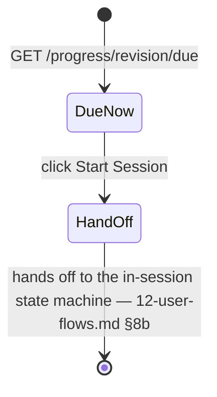

This document owns the Revision *landing* screen's states; the in-session mechanics (rating a card, auto-advance, session completion) are a separate concern already fully state-diagrammed in `12-user-flows.md` §8, and are not redrawn here.

| State | Treatment |
|---|---|
| Loading | cold skeleton rows |
| Never marked anything | "Mark cards for revision as you read them" + link to Explore |
| Caught up | nothing currently due: "You're caught up — next review in `<relative time>`" (plus a card count when more than one is queued for that same moment), sourced from the `nextUp` field `GET /progress/revision/due` returns whenever its `items` list is empty — a plain factual statement, never a congratulatory badge or streak-style graphic (`02-prd.md` NFR-8) |
| Has due cards | one card per row, each with its own inline rating controls (see below) — not a separate "session" screen |
| Error | standard region-scoped Retry |

Each due card's rating controls (`RevisionControls`) show the *actual* next interval next to each button before it's clicked — e.g. "Forgot · 10m", "Shaky · 1d", "Confident · 14d" — computed from the card's current level internally, so the result of pressing a button is never a surprise. The underlying `level` (0–4) that drives this is never itself displayed as a number, progress bar, or "Level X" indicator anywhere in the UI — `03-srs.md` FR-PROG-09 permanently bans displaying levels/streaks/scores, and an earlier draft of this feature that added a "Level X of 5" text label was corrected specifically for that reason; only the resulting interval is shown, never the level. Submitting a rating shows a toast confirming when the card will resurface, and the sidebar's Revision nav item carries a live due-count badge.

---

## 7b. Saved (Bookmarks / Favorites / Pinned)

Route `/bookmarks` (sidebar label "Saved"), reached from the persistent sidebar, not the top nav. Three independent toggles — Bookmark, Favorite, Pin — set from any card's own page, surfaced here as three tabs, each grouped into sections by card type (Concept / DSA / Interview / Project) rather than one flat list.

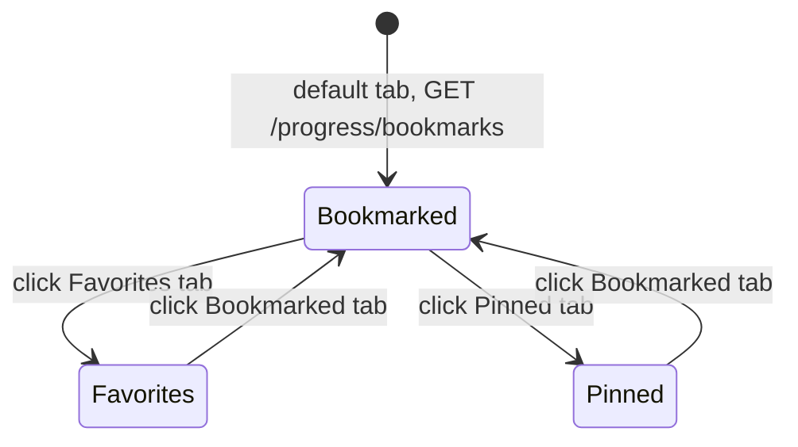

| State | Treatment |
|---|---|
| Tab-switch loading | each tab fetches independently; a first-time visit to a tab within the session shows a skeleton, a returning visit shows cached data immediately |
| Bookmarked — empty | "Nothing bookmarked yet" + pointer to use the toolbar on a card's own page |
| Favorites — empty | "Nothing favorited yet" + same pointer |
| Pinned — empty | "Nothing pinned yet" + same pointer |
| Has items | grouped into labeled sections by type, each section only rendered if it has at least one item; every card gets a small remove (×) action that un-toggles it without navigating away |
| Error | scoped to whichever tab is active, independent per tab |

The three toggles are intentionally not explained by icon alone — a small info affordance next to the tabs clarifies the distinction (bookmark = quick save, favorite = the ones worth pointing someone else to, pin = keep it on the Dashboard), since three separate "save" mechanics are not self-evident on first use.

---

## 8. Profile & Settings

Routes `/profile` (tabs: Overview, Bookmarks, Activity) and `/settings` — two separate routes, not two tabs of one screen (`12-user-flows.md` §0.2).

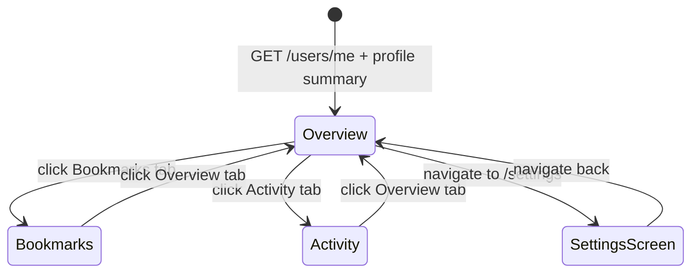

**Profile.** The profile header (avatar, name, headline, bio, social links) is a small skeleton block that must resolve before anything else on the page is meaningful — unlike every other Loading case in this document, this one *is* full-page-blocking, because a profile page without its own identity header has nothing worth showing underneath it. Bookmarks and Activity are ordinary region-scoped tabs beneath that header:

| State | Treatment |
|---|---|
| Header Loading | full-page skeleton block (avatar circle + text lines) |
| Header Error | full-page `Empty`-primitive, alert-triangle icon, Retry — nothing else on the page renders without it |
| Bookmarks — empty | "You haven't bookmarked anything yet" + link to Explore |
| Activity — empty | "No activity yet — this fills in as you read and revise" |
| Bookmarks / Activity — error | scoped to that tab only, per §0.2 rule 2 — the profile header above it stays intact |

**Settings.** Grouped into Appearance, Account details, Linked Accounts, and Sessions. Each editable group (Account details) reuses the autosave state machine from `12-user-flows.md` Flow 4 step 4 — Idle → Saving (`Spinner` in the field) → Saved (inline "Saved · just now," no toast) → Error (inline retry) — per field group, not per keystroke. Two deliberate exceptions:

- **Appearance (theme)** has no Saving state at all — the toggle is applied instantly and persisted client-side (`03-srs.md` FR-PLAT-04), with no server round trip to wait on.
- **Linked Accounts** is read-only display only — which of Google/GitHub is currently linked — with no "link another provider" control anywhere on the screen. User-initiated multi-provider linking is explicitly out of MVP scope (`03-srs.md` FR-AUTH-11); the account-linking-by-verified-email that does happen (`12-user-flows.md` Flow 1 step 7) is a login-time side effect the user never triggers directly from Settings.
- **Sessions → "Sign out of all devices"** is a destructive, consequential action gated behind a confirmation dialog, mirroring the promote-to-admin confirmation in `12-user-flows.md` Flow 15 step 4 — confirming nulls `refreshTokenHash` server-side and immediately ends every session including the current tab's, redirecting to `/login`.

---

## 9. App Shell & Mobile Navigation

DevAtlas's persistent chrome is a left `Sidebar` (`frontend/components/ui/sidebar.jsx`, built on `@base-ui/react`) carrying the logo, the seven primary nav items, and the avatar/account menu, paired with a slim top bar (rendered inside `SidebarInset`) carrying the breadcrumb/page title, the global Search trigger, and the Revision icon. This is how `04-information-architecture.md` §2's shell node — "header: logo · 7 primary nav items · global search · revision icon · avatar menu" — is concretely assigned to real chrome: that diagram names everything that belongs to the persistent shell as a set, and this section is where the set gets split between a vertical Sidebar and a top bar, matching the actual component already generated in the repo.

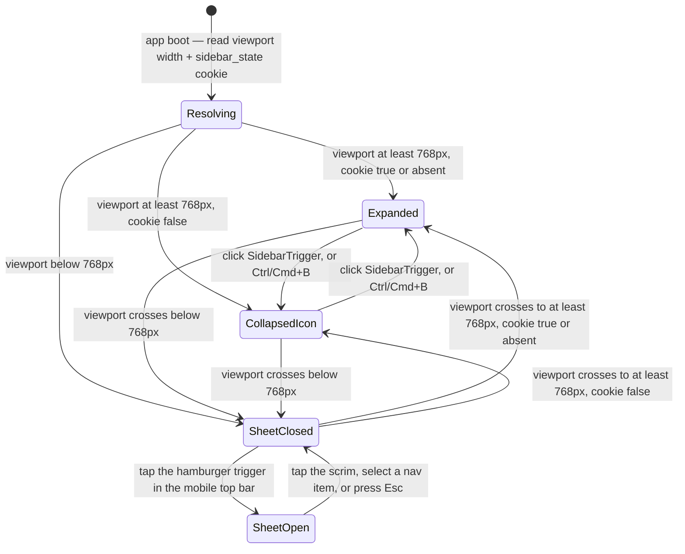

| Breakpoint | State | Visible chrome | Persistence |
|---|---|---|---|
| ≥768px (desktop/tablet) | Expanded | full 16rem rail — icon + label per nav item, avatar + name in the footer | `sidebar_state` cookie, 7-day max-age |
| ≥768px | CollapsedIcon | 3.5rem icon-only rail, tooltips reveal labels on hover; content area gains the reclaimed width | same cookie |
| <768px (mobile) | SheetClosed | no persistent rail — a slim top bar (hamburger trigger, page title, Search icon, Revision icon) is the only chrome | not persisted, always starts closed on a fresh mobile load |
| <768px | SheetOpen | ~18rem off-canvas drawer over a scrim, identical nav content to desktop Expanded | ephemeral, closes on navigation |

**Deliberate differences from desktop, not omissions:**

- Mobile has exactly two rail states — closed and open — never an icon-collapsed middle state. There's no persistent rail on a touch-width viewport to collapse *to*; it's either fully off-canvas or fully open.
- Crossing the breakpoint live (resizing near the boundary, rotating a tablet) re-resolves from the `sidebar_state` cookie rather than remembering "was open" — a Sheet left open mid-resize doesn't ghost into a desktop Expanded rail; state re-derives cleanly from the cookie every time the breakpoint is crossed.
- The keyboard shortcut only toggles Expanded ↔ CollapsedIcon on desktop; on mobile the identical shortcut toggles SheetOpen ↔ SheetClosed instead, since the toggle handler branches on the same viewport check driving the table above.

**What moves where on mobile**, since seven nav items no longer fit a horizontal strip:

- Nav items and the avatar/account menu move into the Sheet — identical content to desktop's Sidebar, just off-canvas instead of persistent.
- The global Search trigger and the Revision icon **stay persistent in the mobile top bar** rather than being buried inside the Sheet — collapsing either behind an extra tap would contradict the explicit design intent behind Revision's placement (`04-information-architecture.md` §2: "a persistent icon... not a tab") and would tax Search, the product's fastest path into any card, on exactly the device where an extra tap costs the most.
- Search's desktop keyboard-shortcut trigger becomes a plain tap target on mobile (no shortcut hint shown), opening the full-screen `/search` route rather than a floating command palette.

---

## 10. Personal Utility Rail — Responsive Behavior

Every Knowledge Card page carries the personal-state rail introduced structurally in `12-user-flows.md` Flow 4 step 1 (Bookmark/Favorite/Pin, Status, Notes, Mark-for-Revision). This section owns that rail's collapse/expand mechanics specifically — a distinct state machine from both the App Shell (§9) and the card's own canonical content.

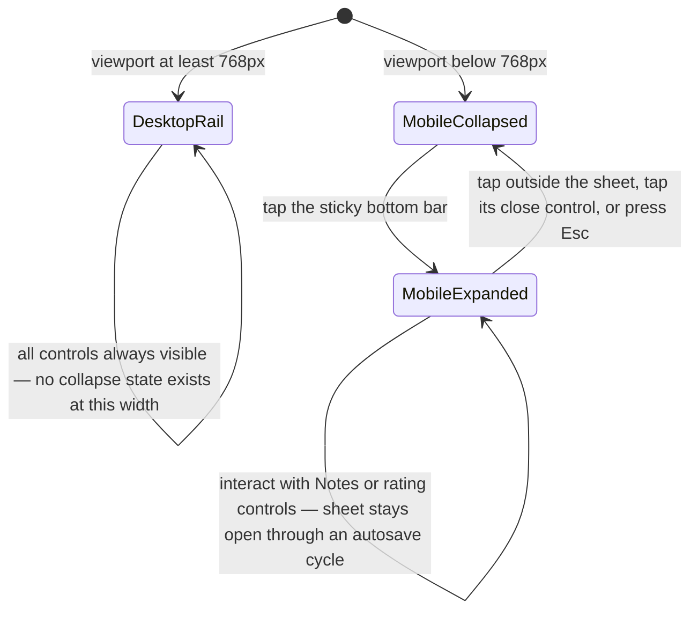

- **Desktop (≥768px):** a right-side rail alongside the content column, always fully visible. Its data arrives with the same `GET /progress/:knowledgeId` call the card page already fires on mount (`07-api-design.md` §9), so the rail has no independent Loading/Empty/Error worth diagramming — failures here reuse the field-level Saving → Saved → Error pattern from `12-user-flows.md` Flow 4 step 4, scoped per control, not per rail.
- **Mobile (<768px):** collapses to a slim bar pinned to the viewport bottom, showing icon-state summaries only (filled/unfilled bookmark, favorite, pin icons, a small revision-due badge). Tapping it expands upward into a bottom `Sheet`/`Drawer` holding the full control set — Notes textarea, Status selector, and the forgot/shaky/confident rating buttons when the card is being read as part of a revision session (`12-user-flows.md` §8b).
- The collapsed bar never hides entirely while scrolling a long card — unlike a scroll-triggered hide-on-scroll-down header, personal actions must stay one tap away throughout the read, consistent with desktop being the primary reading context and mobile being a graceful-access, not primary, context (`03-srs.md` A-5).
- Autosave inside the expanded sheet follows the identical debounce/retry contract as desktop (`12-user-flows.md` Flow 4) — saving does not force the sheet closed, so a user can keep typing or rating across several autosave cycles in one expanded session.

---

Visual layout for every state named above — where the skeleton rows sit, how wide the facet sidebar is, what the collapsed mobile bar looks like — is `14-wireframes.md`'s job, not this document's.
