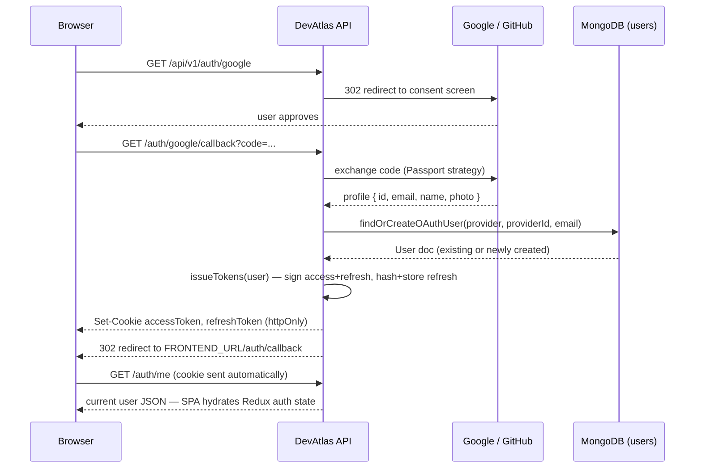
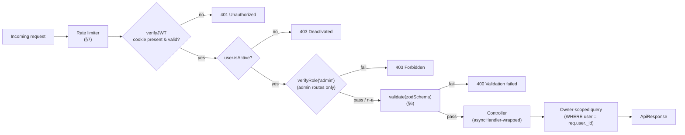
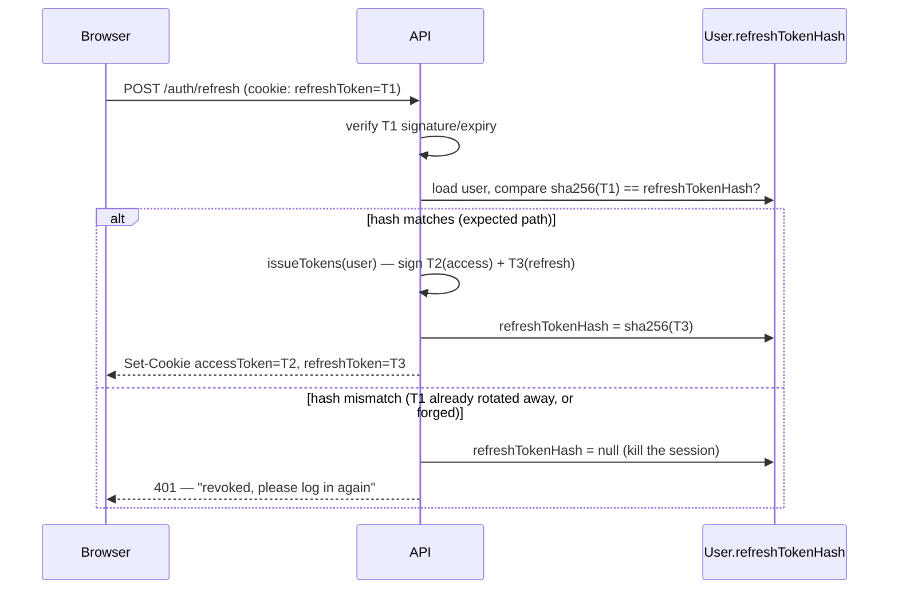
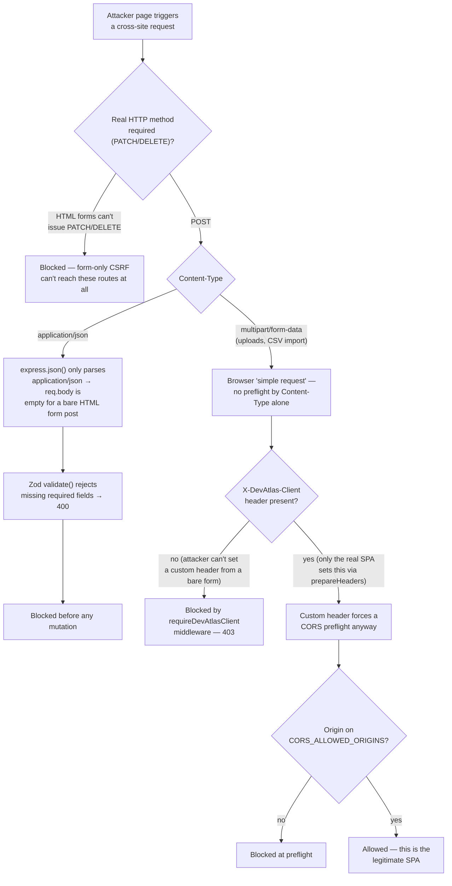

# 15 — Security Design

> Authoritative contract for authentication, authorization, and data-protection mechanics across DevAtlas. Implements the requirement-level baseline in `03-srs.md` §6.3 (NFR-SEC-01…11) and governs `backend/src/middlewares`, `backend/src/config/passport.js`, `backend/src/utils/tokens.js`, and the cookie/header behavior of `frontend/store/api/apiSlice.js`. Where this document calls out a difference between the design and the current code, it's marked as an explicit **Gap** with a concrete fix — everything else describes the fixed, load-bearing design. If a `Gap` and the code ever disagree going forward, close the gap; don't quietly re-scope this doc to match an accident of the current implementation.

## 1. Security Posture at a Glance

DevAtlas is a personal-first knowledge tool for a small-to-mid user base (`03-srs.md` Assumption A-3), not a financial or multi-tenant SaaS system — the controls below are sized for that reality: real (OAuth-verified) identity, no passwords anywhere, a small trusted admin cohort, and the two things actually worth protecting are **account takeover** (someone else's OAuth-derived session) and **canonical content integrity** (someone unauthorized mutating a Knowledge Card everyone reads).

| Asset | Primary risk | Primary defense |
|---|---|---|
| User identity / session | Cookie theft (XSS), CSRF, refresh-token replay | `httpOnly` cookies, sanitized rendering, rotation + reuse detection (§4) |
| Canonical `Knowledge` content | Unauthorized/accidental admin mutation, stored XSS served to every reader | Route + field-level RBAC (§3), render-time sanitization (§9) |
| Personal data (`userprogress`, `annotations`) | Cross-user read/write, i.e. seeing someone else's private notes | Always scoped by JWT-derived `user` id, **no admin bypass** (§3) |
| Availability | Scraping, credential-stuffing-shaped abuse against OAuth callback/refresh | Rate limiting (§7) |
| Secrets (OAuth/JWT/Cloudinary/Mongo) | Leakage into git history or client bundle | `.env` discipline (§11) |

---

## 2. Authentication — Google + GitHub OAuth only, no password ever

DevAtlas never collects, stores, or checks a password. This isn't a missing feature — it's `[[ADR-0003]]` (`06-database-design.md` §2), and it's enforced structurally: `User` has no `password`/`passwordHash` field, and `/auth/google/callback` and `/auth/github/callback` are the **only two routes in the entire API that issue tokens** (`07-api-design.md` §1). There is no `/register` or `/login` endpoint that accepts a request body.



**Account resolution logic** (`backend/src/config/passport.js`, `findOrCreateOAuthUser`): match by `(providers.provider, providers.providerId)` first; if no match, fall back to matching by verified `email` and **link** the new provider onto that existing account (`user.providers.push(...)`); otherwise create a brand-new `User`. This is what makes "sign in with Google today, GitHub tomorrow, same account" work without a manual account-linking UI. Linking trusts the email the provider hands back in the OAuth profile — both Google (`profile.emails[0].value`) and GitHub (via the `user:email` scope) return provider-verified addresses, so DevAtlas never links two accounts on an unverified claim.

If a provider returns no email at all (rare, but GitHub allows a fully private email address), `findOrCreateOAuthUser` falls back to a synthetic `${provider}-${providerId}@devatlas.local` address so account creation never hard-fails — this is safe specifically *because* there's no password/email-login path that could be confused by a synthetic address; it only ever needs to satisfy the `email` uniqueness index.

**Session model:** Passport strategies run with `session: false` (`auth.routes.js`) — Passport is used purely for the OAuth handshake (code exchange, profile fetch), not for session management. DevAtlas's own JWT issuance (§4) is the actual session mechanism.

**Deactivation:** `User.isActive` (default `true`). `verifyJWT` throws `403` for a deactivated account on every subsequent request (`auth.middleware.js`) — deactivation takes effect on the account's very next request, it doesn't require waiting out the access-token TTL, since the check reloads the user doc from DB on every call rather than trusting a stale JWT claim.

**No self-serve admin signup.** `role` defaults to `"user"`; the only way to become `"admin"` is `backend/src/seed/seed.js` run with `ADMIN_EMAIL=you@example.com` (DB/seed-script only, per the product's fixed role model) or a direct `PATCH /users/:id/role` by an existing admin. There is no code path where a client request can set its own role.

---

## 3. Authorization & RBAC

Two roles, enforced at two layers: **route-level** (can you call this endpoint at all) and **field-level** (of what you sent, what's actually allowed to persist).

### 3.1 Route-level

`verifyJWT` (validates the access token, loads `req.user`) composes with `verifyRole("admin")` (checks `req.user.role`) as ordered middleware on every router — never a controller-internal `if` check, so the same two lines guard every admin route identically:

```js
router.post("/", verifyJWT, verifyRole("admin"), validate(createKnowledgeSchema), createKnowledge);
```

| Resource | Read | Write |
|---|---|---|
| `Knowledge` (published) | public (`attachUserIfPresent` — admins additionally see drafts) | admin only |
| `Category`, `Company`, `Resource` | public | admin only |
| `UserProgress`, `Annotation` | owner only (`req.user._id`, always) | owner only |
| `User.role` / `User.isActive` | admin (list) | admin only |
| `Attachment` (delete) | — | owner **or** admin |
| `Activity` (own feed) | owner only | system-written, not client-writable |
| `Activity` (per-card audit trail) | admin only | system-written |

**`verifyRole` never trusts a client-supplied claim** — it reads `req.user.role`, and `req.user` was populated by `verifyJWT` from a **freshly reloaded** DB document (`User.findById(decoded._id)`), not from the JWT payload directly. A JWT's embedded `role` claim is only ever used to *mint* the token at issuance time; every authorization decision on every request re-reads the current DB role. This is what makes role changes (promotion, demotion, deactivation) take effect immediately rather than only after the old JWT expires.



### 3.2 Field-level

Two independent mechanisms, layered:

1. **Zod schemas are allow-lists, not just type checks.** `validate.middleware.js` does `req[source] = result.data` — Zod strips unrecognized keys by default (no `.passthrough()` anywhere in `backend/src/validators`), so a client cannot smuggle `author`, `viewCount`, `isDeleted`, `slug`, or `refreshTokenHash` into a request body; those fields simply don't exist in `result.data` regardless of what was POSTed. This is the primary mass-assignment guard and it runs **before** any controller logic.
2. **Discriminator field whitelisting.** `knowledge.controller.js`'s `pickBaseFields`/`pickTypeFields` (against `BASE_FIELDS`/`TYPE_FIELD_WHITELIST`) additionally ensures a `type: "concept"` submission can't smuggle `pattern`/`hints` (dsa-only fields) onto the doc even though Zod's `createKnowledgeSchema` declares every type's fields as optional (it has to, since one schema serves all four types) — the controller is the second gate that maps "optional in the schema" down to "actually valid for *this* `type`."

**No admin bypass on personal data.** `UserProgress` and `Annotation` queries are unconditionally filtered by `{ user: req.user._id }` — there is no admin-only route that reads another user's notes, highlights, or revision history. This is a deliberate product stance (`03-srs.md` NFR-SEC-06), not an oversight: personal annotations are the one place DevAtlas asks users to be candid ("I still don't get this"), and that only works if it's genuinely private, full stop, from every role.

---

## 4. JWT Strategy

| | Access token | Refresh token |
|---|---|---|
| Payload | `{ _id, email, role }` | `{ _id }` only |
| Secret | `ACCESS_TOKEN_SECRET` | `REFRESH_TOKEN_SECRET` (**different** secret — a leaked access-token secret alone can't forge a refresh token) |
| Default TTL | `15m` (`ACCESS_TOKEN_EXPIRY`) | `10d` (`REFRESH_TOKEN_EXPIRY`) |
| Transport | `httpOnly` cookie only | `httpOnly` cookie only |
| Server-side record | none (stateless) | sha256 hash on `User.refreshTokenHash` |

The refresh token deliberately carries **no `role` claim** — every refresh reloads the `User` doc and mints a brand-new access token from current DB state, so `role` never goes stale for longer than one access-token TTL (≤15 minutes) even for a session that never explicitly refreshes (the old token just expires and re-auth is required).

**Rotation-on-use + reuse detection** (`auth.controller.js` → `refreshAccessToken`, `backend/src/utils/tokens.js`):



A mismatch means either a forged token, or a **stolen, already-used** refresh token being replayed — the legitimate client already rotated past it. Either way the only safe response is to null `refreshTokenHash` and force a full re-login, which also logs out the legitimate holder — an intentional trade-off (a false-positive forces one extra OAuth round-trip; a false-negative would let a stolen token keep working indefinitely).

> **Partially mitigated — concurrent-refresh race.** `03-srs.md` NFR-REL-05 requires that racing refresh calls never spuriously log a user out. The common case is now fixed client-side: `09-frontend-architecture.md` §3.6's `apiSlice.js` wrapper shares a single in-flight `/auth/refresh` call (a module-level `refreshPromise`) across every query that 401s around the same moment, so the several RTK Query calls a page mount typically fires no longer each independently race the backend's rotate-on-use guard — only one refresh actually happens per real expiry, within one tab. **Still open:** that `refreshPromise` is a JS module-level variable, scoped to one tab's own execution context — it does nothing for two genuinely separate *tabs* both deciding to refresh within the same request window, which can still both read the same (still-matching) `refreshTokenHash`, both pass the check, and race on the Mongo write, silently invalidating whichever tab's cookie lost. That tab's *next* refresh then looks exactly like reuse and revokes the whole session. The backend-side fix for that specific case is unchanged from before: keep the immediately-previous hash alongside the current one (`previousRefreshTokenHash` + a short, e.g. 30s, grace expiry) and accept either during that window before falling through to reuse-revocation. Scoped as a small, additive follow-up to `tokens.js`/`User`, not a redesign.

**Storage discipline (`03-srs.md` NFR-SEC-02):** both tokens live *only* in `httpOnly` cookies — never `localStorage`, never in a JSON response body (`GET /auth/me` returns the `User` doc, never the tokens). `httpOnly` means client-side JavaScript — including any XSS payload that ever slipped past §9 — categorically cannot read either token; this is the backstop behind every other control in this document.

`verifyJWT` also accepts `Authorization: Bearer <token>` as a fallback (`auth.middleware.js`). This exists solely for future non-browser clients (a CLI, a native app, Postman during development) — the web SPA never stores a token anywhere it could put in that header, so this fallback doesn't reopen the XSS-token-theft vector for the actual product surface.

**Logout is real revocation**, not just cookie deletion: `POST /auth/logout` nulls `refreshTokenHash` server-side *and* clears both cookies — even if a copy of the old refresh cookie survived client-side somehow, it fails the hash check on its next use.

---

## 5. Cookie Strategy

```js
// backend/src/constants.js
export const COOKIE_OPTIONS = {
  httpOnly: true,
  secure: process.env.NODE_ENV === "production",
  sameSite: process.env.NODE_ENV === "production" ? "none" : "lax",
};
```

| Environment | `secure` | `sameSite` | Why |
|---|---|---|---|
| Development | `false` | `lax` | Vite dev server (`:5173`) is plain HTTP; `Secure` cookies would be silently dropped |
| Production | `true` | `none` | Frontend and API are assumed to be genuinely cross-site (see §5.2) |

### 5.1 Why `Lax` is sufficient in development

Frontend (`:5173`) and backend (`:8000`) are different **ports** but the same **host** (`localhost`) — and cookies are scoped by host, not by port (RFC 6265 has no concept of port in cookie matching). A cookie set while the browser is on `localhost:8000` (which happens for real during the OAuth callback leg, since Google/GitHub redirect the browser directly to the backend, bypassing the Vite proxy) is still sent on subsequent requests to `localhost:5173`, because it's the same host — and same-host requests are same-*site* by definition, so even `SameSite=Lax` (or `Strict`) carries the cookie fine. Separately, the SPA's own API calls in dev go through Vite's `server.proxy` (`frontend/vite.config.js`, `/api → http://localhost:8000`), so from the *browser's* perspective those `fetch` calls never leave `localhost:5173` at all — same-origin, not just same-site.

### 5.2 Why production needs `None` — and the domain-scoping decision

`03-srs.md` NFR-SEC-02 states the cookie baseline as `SameSite=Lax`. That's DevAtlas's dev-mode posture exactly. Production relaxes to `None` because the default assumed deployment topology is a **split-domain** one — frontend on a static host (e.g. `https://devatlas.app` on Vercel/Netlify), backend on a separate platform (e.g. `https://api.devatlas-backend.onrender.com` on Render/Railway) — which are genuinely different registrable domains, not subdomains of one apex. Under `SameSite=Lax`, a cross-site `fetch`/XHR (which is exactly what every RTK Query call is) simply never attaches the cookie — auth would appear to work for the OAuth-redirect leg (a top-level navigation, which `Lax` does allow) and then silently break on the very first `GET /auth/me` call. `None` (with `Secure` mandatory alongside it) is the minimum required for the cookie-based auth model to function at all on that topology — it is not a weaker choice made carelessly, and §8 (CSRF Posture) exists specifically to compensate for what `None` gives up.

**Domain scoping.** `COOKIE_OPTIONS` sets no explicit `Domain` attribute, which makes both cookies **host-only**, bound exactly to the API's own hostname. That's correct as-is: only the API ever reads `req.cookies`, so there's nothing to share. **If** DevAtlas is later deployed under one purchased apex with both services as subdomains (`app.devatlas.dev` / `api.devatlas.dev`), the stronger move is to switch to `Domain=.devatlas.dev` + `SameSite=Lax` — same-site subdomains can share a cookie via an explicit `Domain` while getting `Lax`'s categorically tighter cross-site behavior back. That's a deployment-topology decision, not a code change to make speculatively now; it's recorded here as the trigger for revisiting §5's defaults.

| Cookie | `httpOnly` | `Secure` | `SameSite` | `maxAge` | `Domain` |
|---|---|---|---|---|---|
| `accessToken` | yes | prod only | `lax` dev / `none` prod | 15 min | host-only |
| `refreshToken` | yes | prod only | `lax` dev / `none` prod | 10 days | host-only |

---

## 6. Input Validation

**Boundary:** every mutating route validates `req.body` (occasionally `req.query`/`req.params`) against a Zod schema in `backend/src/validators` via the shared `validate(schema, source)` middleware, *before* the controller runs:

```js
// validate.middleware.js
export const validate = (schema, source = "body") => (req, res, next) => {
  const result = schema.safeParse(req[source]);
  if (!result.success) throw new ApiError(400, "Validation failed", errors);
  req[source] = result.data;   // reassignment = the allow-list (§3.2)
  next();
};
```

Every `POST`/`PATCH` route in `backend/src/routes` pairs `validate(...)` with its matching schema — there is no route that hands raw `req.body` straight to Mongoose. Zod also does the useful boring work: type coercion, enum membership (`KNOWLEDGE_TYPES`, `RELATION_TYPES`, `HIGHLIGHT_COLORS`, …, all sourced from `backend/src/constants.js` so the validator and the Mongoose schema enum can never drift independently), and required-field enforcement — a raw cross-site form submission (§8) fails here before it can mutate anything.

**File uploads** go through `multer.middleware.js` instead of Zod: a MIME allow-list (`^(image|video)\/|^application\/pdf$`) and a 25MB `fileSize` limit, enforced *before* the file is even fully buffered to `backend/public/temp`. `uploadOnCloudinary`'s `finally` block deletes the local temp file unconditionally — success or failure — so a rejected/failed upload never leaves an orphaned file on disk (`03-srs.md` NFR-REL-03).

**CSV bulk import** (`csvImport.service.js`) streams via `csv-parse` (never a naive `split(",")`, so quoted fields containing commas can't corrupt row boundaries), validates row-by-row inside a `try/catch`, and reports partial success (`{ created, skipped, errors: [{row, reason}] }`) rather than aborting the whole batch on one bad row — matches `03-srs.md` §8.7's acceptance criterion exactly. Unknown category slugs reject that row; unknown company slugs are skipped silently (a DSA question without a company tag is still a valid card; a DSA question with no category isn't).

> **Gap — JSON body size limit too small for its own content model.** `app.js` sets a single global `express.json({ limit: "16kb" })`. A Knowledge Card's `content.explanation` is long-form Markdown, often paired with multiple `codeExamples`, a full `interviewQuestions[]` set, and possibly `mermaidSource` — routinely well over 16KB for a genuinely deep card, meaning `createKnowledge`/`updateKnowledge` would reject legitimate admin authoring with a generic body-too-large error. **Recommended fix:** tighten the *global* default (16KB is actually a good DoS-hygiene ceiling for the many small routes — annotations, progress toggles, category CRUD) and add a per-route override ahead of the two knowledge write routes only:
> ```js
> router.post("/", verifyJWT, verifyRole("admin"), express.json({ limit: "3mb" }), validate(createKnowledgeSchema), createKnowledge);
> ```
> 3MB is generous for pure text/JSON (millions of characters) while still bounding worst-case payload size for the one route shape that legitimately needs it.

> **Gap — malformed `:id`/`:slug` params surface as `500`, not `400`.** `error.middleware.js` special-cases Mongoose `ValidationError` into a `400`, but not `CastError` (thrown when `findOne({ _id: "not-an-objectid" })` runs). A client hitting `PATCH /knowledge/not-a-real-id` today gets a raw `500`. **Recommended fix:**
> ```js
> const statusCode = error.statusCode ||
>   (["ValidationError", "CastError"].includes(error.name) ? 400 : 500);
> ```

---

## 7. Rate Limiting

Four tiers (`rateLimiter.middleware.js`), mounted per-router in `app.js`, all a 15-minute sliding window via `express-rate-limit`:

| Tier | Limit | Routers | Why |
|---|---|---|---|
| `authLimiter` | 20 / 15 min | `/auth/*` | OAuth callback + refresh are the highest-value target (session issuance) — tightest tier even though there's no password to brute-force |
| `uploadLimiter` | 30 / 15 min | `/uploads` | Every accepted request costs disk I/O + a Cloudinary API call (real, metered cost) |
| `readLimiter` | 300 / 15 min | `/categories`, `/companies`, `/knowledge`, `/resources`, `/search` | Generous — browsing/searching is the core product loop and must never feel throttled |
| `writeLimiter` | 600 / 15 min | `/users`, `/progress`, `/annotations`, `/dashboard`, `/activities` | Authenticated, low-cost-per-call, mostly single-document upserts |

(`07-api-design.md` §13 owns the endpoint→tier *mapping*; this section owns the *why* and the implementation mechanics behind it.) `standardHeaders: true` emits `RateLimit-*` response headers (so a future client could proactively back off), `legacyHeaders: false` drops the deprecated `X-RateLimit-*` set. Exceeding a limit returns a `429` already shaped as an `ApiError` (`{ statusCode: 429, success: false, message, errors: [], data: null }`), consistent with the rest of the API — no special-cased error format to handle client-side.

> **Gap — every tier is keyed by IP only, even the "per-user" ones.** `makeLimiter` sets no `keyGenerator`, so `express-rate-limit` defaults to `req.ip` for all four tiers. That's correct for `authLimiter`/`readLimiter` (routes reachable by anonymous callers, where IP is the only identity available) but not for `uploadLimiter`/`writeLimiter`, which are meant to be per-user — and can't be as currently wired anyway, since each limiter is mounted in `app.js` *before* the router's own `verifyJWT` runs, so `req.user` doesn't exist yet at limiter time. **Recommended fix** — a cheap, best-effort **decode** (not a full verify; no DB hit, so it's fine to run ahead of `verifyJWT`) purely for bucketing:
> ```js
> const keyGenerator = (req) => {
>   try {
>     const decoded = jwt.decode(req.cookies?.accessToken || "");
>     if (decoded?._id) return String(decoded._id);
>   } catch { /* fall through */ }
>   return req.ip;
> };
> ```
> A forged/expired token just falls back to IP-bucketing — the real authorization decision still happens downstream in `verifyJWT`, so this can't be used to bypass anything, only to key the counter more fairly.

> **Required production config — `trust proxy`.** Production sits behind a platform load balancer/reverse proxy. Without `app.set("trust proxy", 1)` in `app.js`, Express sees every request as coming from the proxy's own IP, and the IP-keyed limiters above collapse into one shared bucket for *all* users — the first heavy user throttles everyone. This must be set before the rate limiters are mounted.

---

## 8. CSRF Posture

DevAtlas's mutating endpoints are more resistant to classic CSRF than they might look at first glance, *because* of choices made elsewhere — this section explains why, names the one real gap, and closes it.



1. **Real HTTP methods are a free win.** `PATCH`/`DELETE` routes (most of the API's mutations — progress toggles, annotation edits, admin CRUD) simply cannot be triggered by a plain HTML `<form>`, which only supports `GET`/`POST`. Nothing to defend there.
2. **JSON-only body parsing kills form-based CSRF on the `POST` routes.** `express.json()` parses `application/json` only. A bare cross-site `<form method="post">` can only send `application/x-www-form-urlencoded`, `multipart/form-data`, or `text/plain` — none of which `express.json()` will parse — so `req.body` arrives empty, and the Zod `validate` middleware rejects it (missing required fields) before a single document is touched. This is a side effect of the API's JSON-body convention, not a bolted-on defense, which is exactly why it's durable.
3. **The one real gap: `multipart/form-data` uploads.** `POST /uploads` and `POST /knowledge/import/dsa-csv` accept `multipart/form-data`, which the Fetch/CORS spec classifies as a "simple" content type — a bare cross-site HTML form *can* submit one without triggering a CORS preflight, and in production (`SameSite=None`, §5) the victim's cookies would ride along. The blast radius is real: for the CSV route specifically, it's admin-only, so the scenario is "trick a logged-in *admin's* browser into importing an attacker-authored CSV" — a genuine content-integrity risk, not just an annoyance.
4. **Chosen mitigation: a required custom header, not a stateful CSRF token.** Every mutating request from the DevAtlas SPA carries a static header:
   ```js
   // frontend/store/api/apiSlice.js
   fetchBaseQuery({
     baseUrl: "/api/v1",
     credentials: "include",
     prepareHeaders: (headers) => headers.set("X-DevAtlas-Client", "web"),
   });
   ```
   ```js
   // backend — mounted globally in app.js, after cors(), before routers
   export const requireDevAtlasClient = (req, res, next) => {
     if (["GET", "HEAD", "OPTIONS"].includes(req.method)) return next();
     if (req.get("X-DevAtlas-Client") !== "web") {
       throw new ApiError(403, "Missing client verification header");
     }
     next();
   };
   ```
   Custom headers are **not** part of the CORS "simple request" allow-list — adding one forces a preflight on *every* mutating request, including multipart ones, and the preflight only succeeds if `Origin` is on `CORS_ALLOWED_ORIGINS` (§10). A bare HTML form literally cannot add a custom header, so this one middleware closes the multipart gap for free.
5. **Why not a classic double-submit CSRF token (Django/Rails-style)?** That pattern solves "an attacker can get a victim's browser to submit *our own* server-rendered form." DevAtlas has no server-rendered forms — the only client is the SPA, which already round-trips every mutation through `fetchBaseQuery`. A stateful token would add a fetch-and-store round trip (and its own storage question — a non-`httpOnly` cookie, most likely, since the SPA needs to *read* it to echo it back) for protection the custom-header check already provides more simply. It would be complexity solving a problem this architecture doesn't have.
6. **Why this is genuinely sufficient given OAuth-only + JWT:** there's no password-based "login CSRF" vector (an attacker can't forge a request into *their own* Google consent screen and have it authenticate as the victim); the JSON convention plus strict `Content-Type` parsing removes form-based CSRF from every `PATCH`/`DELETE` and JSON-`POST` route; and the custom header removes it from the remaining `multipart` routes. `SameSite=None` in production is what makes the API reachable cross-site *at all* — CORS + the header check, not `SameSite`, are doing the actual CSRF-blocking work there, which is the correct division of labor once `SameSite` has been deliberately relaxed for functional reasons.

> **Operational hazard to guard explicitly.** `app.js`'s CORS config is `origin: allowedOrigins.length ? allowedOrigins : true` — if `CORS_ALLOWED_ORIGINS` is ever left unset in production, `cors` reflects *any* requesting origin as allowed, and combined with `credentials: true` + `SameSite=None` cookies, every defense in this section that routes through "does the preflight pass" silently stops working. **`CORS_ALLOWED_ORIGINS` must be a hard startup requirement in production** — fail fast rather than silently falling back:
> ```js
> if (process.env.NODE_ENV === "production" && !process.env.CORS_ALLOWED_ORIGINS) {
>   throw new Error("CORS_ALLOWED_ORIGINS is required in production");
> }
> ```

---

## 9. XSS Prevention

Two distinct content surfaces render Markdown, and both matter even though their blast radius differs:

- **Admin-authored canonical content** (`content.tldr`, `content.explanation`, `mistakes[].explanation`, `interviewQuestions[].idealAnswer`, every `project` case-study field) — rendered to **every** reader of that card. A single compromised or careless admin session here is stored XSS against the entire user base.
- **User-authored personal content** (`UserProgress.personalNotes`/`personalMistakes`, `Annotation.note`) — rendered back only to the same user today, so the immediate blast radius is self-XSS (low severity). It's still sanitized identically, on principle: rendering code shouldn't need a "but this one's safe" special case, and any future feature that surfaces personal notes to anyone else (a support/admin view, a "share my notes" export) would silently inherit real stored-XSS otherwise.

**Rendering pipeline rule:** `react-markdown` + `remark-gfm` + `rehype-highlight`, and **never `rehype-raw`, never `dangerouslySetInnerHTML`, for any DevAtlas-sourced content.** `react-markdown` parses Markdown to an AST and renders it as real React elements — by default, raw HTML embedded in the Markdown source is *not* executed into the DOM; that protection only disappears the moment `rehype-raw` is added to the plugin chain. If a future admin need genuinely requires embedded layout (e.g. a two-column comparison block), solve it with a dedicated Markdown extension/shortcode component reviewed at PR time — never by opening raw-HTML passthrough for the entire card body just to unblock one use case.

**Link scheme allow-listing.** Markdown autolinks (`[text](url)`) should be rendered through a custom link component (or `urlTransform`) that only permits `http:`, `https:`, and `mailto:` schemes — a stored `[click me](javascript:...)` in a personal note or (worse) an admin card is a classic bypass some default renderer configurations miss. This is a one-time, cheap guard at the `<a>` renderer, not a per-content sanitization pass.

**Mermaid must run in `strict` mode:**
```js
mermaid.initialize({ startOnLoad: false, securityLevel: "strict" });
```
`content.visualization.mermaidSource` is admin-authored text that gets parsed into an SVG and executed in every reader's browser — Mermaid has historically shipped XSS via `click` node interactions and tooltip HTML when `securityLevel` is `"loose"`. `"strict"` sanitizes label HTML and disables script-URI click bindings. `"loose"` is never acceptable for DevAtlas's content model, even though the author is "trusted" (an admin account can still be phished/compromised, and the payload would then hit every reader, not just the admin).

**React Flow (`content.visualization.flow`, stored as `Schema.Types.Mixed`)** deserves the same discipline specifically *because* it's a free-form JSON blob: any custom node renderer that displays a node's `label` must route that text through the same sanitized-Markdown/plain-text path as the rest of the card, never a `dangerouslySetInnerHTML` shortcut taken because "it's just JSON from our own DB." Storage safety (it came from MongoDB) is not render safety (it originated as admin-typed free text) — that conflation is exactly where XSS bugs get introduced in fields like this.

**Why sanitize at render time, not at write time, for MVP:** all authoring is Markdown-only by product decision (`03-srs.md` A-4 — "Markdown/Mermaid authored directly, not via a WYSIWYG abstraction"), and Markdown source text is inert until rendered — there's no HTML being persisted to sanitize on the way in. If a WYSIWYG/rich-HTML authoring mode is ever added later, that's the trigger to add a server-side `sanitize-html` pass on write as a second layer (defense in depth for a fundamentally different content shape) — adding it preemptively now would sanitize a format (HTML) DevAtlas doesn't actually store.

**Backstops, in order:** even a Markdown-pipeline mistake (someone adds `rehype-raw` in a future PR) is caught by (1) `httpOnly` cookies (§4) meaning stolen-cookie exfiltration isn't possible regardless, and (2) a `Content-Security-Policy` header restricting `script-src` to `'self'` — recommended addition via `helmet` (not currently a backend dependency; add it) — a network-level backstop behind the render-time sanitization.

---

## 10. CORS

```js
// backend/src/app.js
const allowedOrigins = (process.env.CORS_ALLOWED_ORIGINS || "").split(",").map(o => o.trim()).filter(Boolean);
app.use(cors({ origin: allowedOrigins.length ? allowedOrigins : true, credentials: true }));
```

`credentials: true` must be set on **both** sides of every cross-origin call — the server's `cors()` config *and* the client's `fetchBaseQuery({ credentials: "include" })` (`frontend/store/api/apiSlice.js`) — or the cookie simply won't be attached/accepted. When `origin` is an explicit array (the intended production shape), the `cors` package automatically echoes back the *matching* requesting origin as `Access-Control-Allow-Origin` (never `*`, which is spec-disallowed alongside `credentials: true` anyway) — this is what lets multiple legitimate origins (e.g. a production domain and its Vercel preview-deploy URLs) share one allow-list.

**Dev vs. prod, concretely:**

| | Origins in play | CORS engages? |
|---|---|---|
| Dev — SPA's own API calls | Browser only ever talks to `localhost:5173` (Vite proxy forwards server-side) | No — same-origin from the browser's perspective |
| Dev — OAuth redirect legs | Google/GitHub redirect straight to `localhost:8000` | N/A — full-page navigation, not a CORS-governed fetch |
| Prod — every RTK Query call | `https://devatlas.app` (example) → `https://api.devatlas-backend.onrender.com` | Yes — must be on `CORS_ALLOWED_ORIGINS` |

**Production env var discipline:** `CORS_ALLOWED_ORIGINS` must be an explicit, exact, comma-separated scheme+host list —
```
CORS_ALLOWED_ORIGINS=https://devatlas.app,https://www.devatlas.app
```
never a wildcard, never left empty (see the startup-assertion recommendation in §8). `FRONTEND_URL` / `FRONTEND_URL_PROD` (used for the OAuth-success `res.redirect`, not for CORS) should match the same set for consistency, but are a separate env var on purpose — one governs "who can call the API with credentials," the other governs "where does the OAuth callback send the browser next."

---

## 11. Secrets & Environment Configuration

Every value the backend needs lives in `backend/.env` (gitignored — confirmed in `backend/.gitignore`: `.env`, `.env.test`, `.env.production` are all excluded) and is read exclusively via `process.env`, never hardcoded (`03-srs.md` NFR-MAINT-05 / NFR-SEC-09).

| Variable | Sensitivity | Notes |
|---|---|---|
| `ACCESS_TOKEN_SECRET`, `REFRESH_TOKEN_SECRET` | **Secret** | Must be long, random, and *different from each other* (§4) |
| `GOOGLE_CLIENT_SECRET`, `GITHUB_CLIENT_SECRET` | **Secret** | Rotated via each provider's own console; rotation here doesn't require touching JWT secrets |
| `MONGODB_URI` | **Secret** | Embeds DB credentials. `db/index.js` logs only `connection.host` on connect, never the URI — correct existing practice, keep it that way |
| `CLOUDINARY_API_SECRET` | **Secret** | Pairs with the API key to sign upload requests |
| `CLOUDINARY_CLOUD_NAME`, `CLOUDINARY_API_KEY` | Config (treat as secret anyway) | Not independently exploitable without the API secret, but still env-only, never in client code |
| `VAPID_PRIVATE_KEY` | **Secret** | Web Push signing key — server-only |
| `VAPID_PUBLIC_KEY` | **Public by design** | Ships to the client for push subscription — the *only* value in this table that's meant to leave the server; don't reflexively treat it as equally sensitive as its private counterpart |
| `GOOGLE_CALLBACK_URL`, `GITHUB_CALLBACK_URL` | Config | Must exactly match each provider's registered redirect URI |
| `FRONTEND_URL`, `FRONTEND_URL_PROD`, `CORS_ALLOWED_ORIGINS` | Config | See §10 |
| `NODE_ENV`, `PORT` | Config | Standard |
| `ACCESS_TOKEN_EXPIRY`, `REFRESH_TOKEN_EXPIRY` | Config | Defaults (`15m`/`10d`) apply if unset |

> **Gap — no `.env.example` is committed.** Only `backend/.env` (real, gitignored values) exists; there's no placeholder template, so onboarding a second contributor means reverse-engineering key names from `constants.js`/controllers. **Fix:** commit `backend/.env.example` with every key above present and empty/placeholder-valued (`ACCESS_TOKEN_SECRET=changeme`), so `.env` setup is copy-then-fill rather than guesswork.

**Frontend has no secrets by construction.** Vite only exposes `VITE_`-prefixed variables to the client bundle, and DevAtlas's frontend doesn't define any — `apiSlice.js` calls a relative `/api/v1` base URL, not an absolute one, so there's no API-host env var to accidentally leak client-side either. This isn't an oversight to "fix later" — it's a deliberate simplification that removes an entire class of "secret baked into a public JS bundle" mistakes at the source.

**Deployment secret storage:** platform-native env var UI (Render/Railway/Vercel) or a real secrets manager if DevAtlas ever grows past solo/small-team scale — never baked into a Docker image layer or build arg, never echoed in CI logs (mask/redact in the CI provider's settings if any pipeline ever prints env for debugging).

---

## 12. Logging

`morgan("dev")` request logging is gated to `NODE_ENV === "development"` only (`app.js`). Two consequences worth being explicit about:

> **Gap — production has zero request logging today.** No `morgan` (or equivalent) instance is mounted for `NODE_ENV === "production"`. **Recommended fix:** mount a compact, structured format in production too — e.g. `morgan("combined")` (or a JSON format) writing to `stdout`. This deliberately does *not* mean standing up a separate logging service: at DevAtlas's scale (`03-srs.md` A-3), platform hosts (Render/Railway) already capture and retain `stdout`, which is sufficient — the fix is "log something," not "adopt new infra."

> **Gap — `error.middleware.js` never logs server-side, in any environment.** It correctly includes `stack` in the JSON response *only* in development (never leaking a stack trace to a client in prod — good, keep that), but it never calls `console.error`/a logger regardless of environment — today the only server-side error visibility anywhere in the codebase is two explicit `console.error` calls inside `cloudinary.js`. A production `500` currently leaves **zero trace**. **Fix:** log unconditionally inside the handler, before shaping the response:
> ```js
> console.error(`[${req.method} ${req.originalUrl}]`, error);
> ```

**What must never be logged, in any environment:** raw cookie values, the `Authorization` header, request bodies for any `/auth/*` route, or JWTs/refresh tokens in plaintext anywhere — only `sha256(refreshToken)` is ever persisted (on `User.refreshTokenHash`), and that hash itself has no reason to appear in logs either.

---

## 13. Audit Logs — who changed which Knowledge Card

This is already substantially implemented, not a new system to design: the `activities` collection (`06-database-design.md` §10) **is** the audit log, by explicit MVP decision (`06-database-design.md` §13: no full content-versioning, `lastEditedBy` + `activities` is sufficient for a single-curator-scale admin cohort).

- `createKnowledge`, `updateKnowledge`, `publishKnowledge` each write an `Activity({ user: req.user._id, action: "created" | "updated" | "published", knowledge: doc._id })` (`knowledge.controller.js`) — actor, action, target, timestamp.
- `Knowledge.lastEditedBy` is stamped directly on the document too (belt-and-suspenders): `activities` gives full history, `lastEditedBy` gives O(1) "who touched this last" for display without a lookup.
- Surfaced via `GET /activities/knowledge/:id` (admin-only, `07-api-design.md` §12) and the Admin **Activity / Audit Log** screen (`04-information-architecture.md` §2, `AdActivity` node).
- **Scope, deliberately:** actor + action + target + timestamp — **not** a field-level before/after diff. That's the same MVP trade-off `06-database-design.md` already made explicitly for versioning; if forensic "what exactly changed" is ever needed, it's a content-versioning feature (flagged there as future scope), not something to bolt onto `activities` as a workaround.
- `viewed` activity rows TTL-expire after 180 days (`activity.model.js`'s `partialFilterExpression`); `created`/`updated`/`published` never expire — the collection's growth is bounded to the audit-meaningful subset, by design.

> **Gap — RBAC changes aren't audited yet.** `updateUserRole` and `updateUserStatus` (`user.controller.js`) mutate `role`/`isActive` directly and write **no** `Activity` entry — meaning "who promoted this user to admin, and when" currently has no audit trail at all, which is a real gap for the one action category that most directly expands the attack surface. **Recommended fix** — additive, not a redesign: extend `ACTIVITY_ACTIONS` (`constants.js`) with `"role_changed"` / `"status_changed"`, and fire one on each mutation using the existing `meta: Mixed` field the `Activity` schema already has for exactly this shape:
> ```js
> await Activity.create({
>   user: req.user._id, action: "role_changed", knowledge: null,
>   meta: { targetUser: user._id, from: oldRole, to: user.role },
> });
> ```

---

## 14. Backup Strategy (MongoDB)

`03-srs.md` NFR-AVAIL-03 requires a replica set (or managed-Atlas equivalent) for availability; backups are the separate, complementary concern of recovering from *data* loss (bad migration, accidental bulk delete, corrupted write) that replication alone doesn't protect against — a replica just faithfully copies a mistake to every node.

**Primary recommendation — if hosted on Atlas M10+:** enable Atlas's continuous cloud backups (point-in-time recovery). This is the lowest-effort, highest-reliability option and should be the default the moment budget allows a paid tier.

> **Constraint to plan around:** Atlas's free/shared tiers (`M0`/`M2`/`M5`) do **not** include backup snapshots at all. If DevAtlas launches on a free tier (plausible for a personal-first MVP), backups must be handled independently — treat this as a hard requirement, not an edge case, until/unless the deployment moves to `M10+`.

**Fallback / self-managed path (assume this is the actual MVP path):** a nightly scheduled job (platform cron, or a scheduled GitHub Actions workflow) running:
```bash
mongodump --uri="$MONGODB_URI" --gzip --archive=devatlas-$(date +%F).gz
```
uploaded to a dedicated, cheap object-storage bucket — **Cloudflare R2 recommended specifically for its zero egress fees**, which matters here because a restore (pulling the archive back down) is exactly the operation you don't want metered against you during an incident. **Cloudinary is not a backup target** — it's optimized for media delivery, not archival blobs; keep the concerns separate.

**Retention:** 7 daily + 4 weekly rolling snapshots — enough to recover from "someone fat-fingered a bulk update three days ago" without unbounded storage growth.

**Scope:** one atomic dump of the whole `devatlas` database (all nine collections together), not per-collection — `Knowledge.relations[]`, `UserProgress.knowledge`, and every other cross-collection ref are only consistent when restored as a single point-in-time snapshot. `activities`' short-lived `viewed` rows add negligible size and don't need special-casing out.

**Restore drills are the actual deliverable, not the dump itself.** An untested backup is a hypothesis. Commit to a concrete cadence: **quarterly**, restore the latest archive into a scratch MongoDB instance and verify the app boots against it and a spot-checked `Knowledge` doc round-trips correctly (relations resolve, discriminator fields intact).

**Encryption:** Atlas encrypts data at rest by default, and `mongodb+srv://` connection strings negotiate TLS in transit by default — no additional configuration needed for either, just don't disable them when tuning a connection string. Secrets themselves (§11) are explicitly out of scope for *this* backup process — they live in the deployment platform's env store, not the database.

---

## 15. Pre-Production Security Checklist

Every gap flagged above, in one place — treat this as the go-live gate:

- [ ] `CORS_ALLOWED_ORIGINS` is set to an explicit, non-empty list in production (§8, §10) — add the startup assertion.
- [ ] `X-DevAtlas-Client` header check (`requireDevAtlasClient`) is mounted globally and the frontend's `prepareHeaders` sets it (§8).
- [ ] `app.set("trust proxy", 1)` is set before rate limiters (§7).
- [ ] Rate limiters use a decode-based `keyGenerator` for `uploadLimiter`/`writeLimiter` (§7).
- [ ] `express.json` body limit is raised specifically for the two knowledge write routes (§6).
- [ ] `error.middleware.js` special-cases `CastError` into `400` and unconditionally `console.error`s server-side (§6, §12).
- [ ] Production request logging is enabled (§12).
- [ ] `ACTIVITY_ACTIONS` covers role/status changes, and `user.controller.js` writes them (§13).
- [ ] `mermaid.initialize({ securityLevel: "strict" })` is set before any diagram render (§9).
- [ ] `helmet` is added with a `script-src 'self'` CSP (§9).
- [ ] `backend/.env.example` is committed with every key from §11 present (empty/placeholder values).
- [ ] A backup job (Atlas continuous, or the `mongodump`→R2 cron) is actually running, not just documented — and one restore drill has been performed at least once before go-live (§14).
- [ ] `ACCESS_TOKEN_SECRET` ≠ `REFRESH_TOKEN_SECRET`, both long/random, generated fresh for production (never reused from a local `.env`) (§11).
