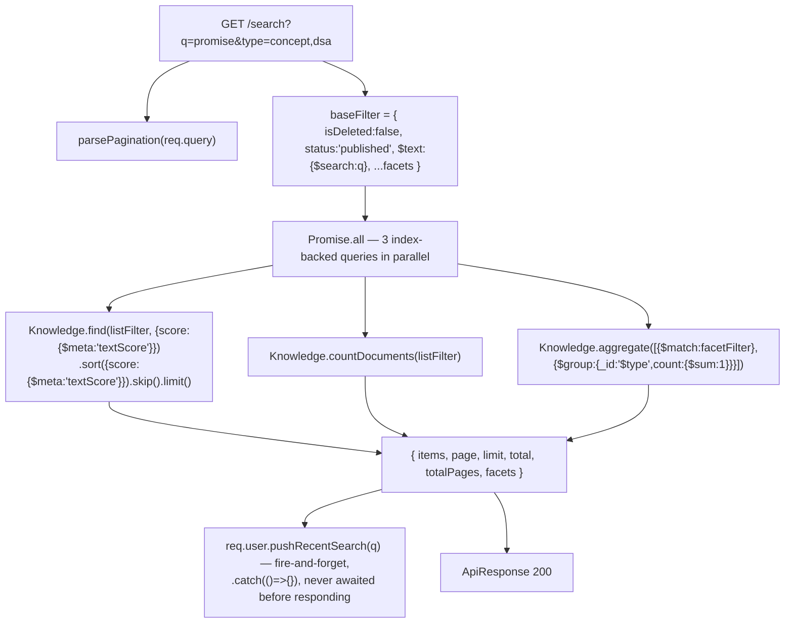
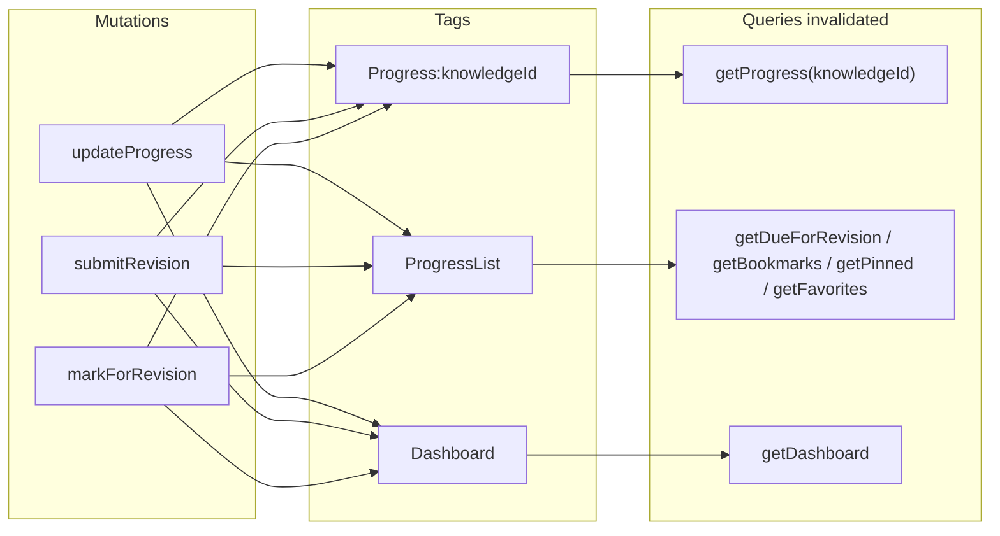
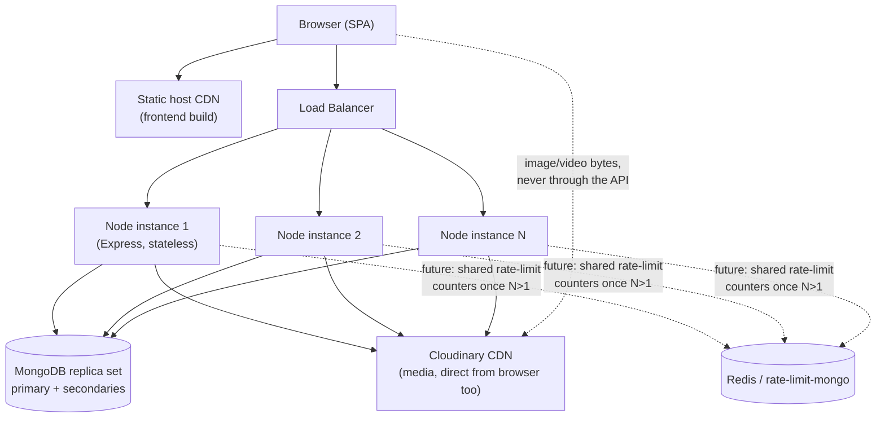

# 16 — Performance Design

> Authoritative contract for query, caching, and scaling mechanics across DevAtlas. Builds on the schema/index inventory owned by `06-database-design.md` and the list/pagination envelope owned by `07-api-design.md` — this document explains *why* those choices perform well and *how* the client (RTK Query) and server (Express/Mongo) cooperate to hit the budgets in `03-srs.md` §6.1–6.2 (NFR-PERF-01…06, NFR-SCALE-01…05). Where current code falls short of the budget, it's marked **Gap** with a concrete fix, same convention as `15-security-design.md`.

## 1. The Budget This Document Is Designed to Hit

| Target (`03-srs.md`) | Requirement |
|---|---|
| NFR-PERF-01 | p95 ≤ 300ms for single-document reads (card by slug, `/auth/me`) |
| NFR-PERF-02 | p95 ≤ 600ms for list/search with facets, up to 10,000 matching docs |
| NFR-PERF-03 | Home LCP ≤ 2.5s on simulated Fast 3G |
| NFR-PERF-04 | Card detail code-split from admin bundle and from `mermaid`/`@xyflow/react`, lazy-loaded only when a Visualization is present |
| NFR-PERF-05 | Annotation writes feel < 50ms (optimistic client update) |
| NFR-PERF-06 | CSV import: ≥ 500 DSA rows in ≤ 30s, streamed/batched |
| NFR-SCALE-01/02/03 | Stateless API; `knowledges` performant to 100k docs; `(user, knowledge)` O(1) lookups |
| NFR-SCALE-04 | Media served from Cloudinary CDN, not the app server |

Everything below is organized around *how* DevAtlas hits these numbers, not a restatement of them.

---

## 2. Search Optimization



**Weighted text index** (`knowledge.model.js`):
```js
knowledgeSchema.index(
  { title: "text", tags: "text", "content.tldr": "text", "content.explanation": "text" },
  { weights: { title: 10, tags: 5, "content.tldr": 3, "content.explanation": 1 }, name: "knowledge_text_search" }
);
```
The weight ordering is a relevance decision, not an arbitrary default: a query matching a card's **title** is almost always the card the user wants (searching "promise" should surface the *Promise* card above one that merely mentions "promise" once in a paragraph of a different card's `explanation`), so `title` outweighs `explanation` 10:1. `tags` sits above `tldr` because tags are curated, high-signal keywords an admin deliberately attached; `explanation` is the deepest, noisiest field and correctly carries the least weight.

**Three queries, one round trip, in parallel** (`search.controller.js`): the ranked page of results, the total count for pagination, and the type-facet breakdown all run inside a single `Promise.all`, each hitting the same compound filter (facet counts use `facetFilter`, which is `baseFilter` *without* the `type` narrowing, so the returned counts represent "how many of each type would match if you cleared the type filter" — which is what lets the UI render facet chips with counts *without* a second round-trip). All three are served by the same text/compound index, so the p95 for `/search` is bounded by the slowest of three parallel index-backed operations, not their sum.

**Recent searches ride along for free.** `User.pushRecentSearch(q)` (capped array, push-and-trim to 10) is called on the already-loaded `req.user` and saved with `.catch(() => {})` — deliberately fire-and-forget. Personalization bookkeeping must never hold up the response the user is actually waiting on.

**Why MongoDB `$text` and not Atlas Search/Elasticsearch for v1** (already the fixed decision — `06-database-design.md`, `03-srs.md` NFR-SCALE-05): it accepts real, named trade-offs — no fuzzy/typo tolerance, no synonym expansion, relevance tuning limited to the four field weights above. What keeps swapping engines later cheap is that **`search.controller.js` is the only call site that ever builds a `$text` query** — no other controller reaches for text search independently. Keep that invariant true going forward: any new search-shaped feature routes through this controller (or a shared `SearchService` extracted from it), never a second inline `$text` call elsewhere.

---

## 3. Pagination, Filtering & Sorting Conventions

One shared implementation, used identically by every list endpoint (`backend/src/utils/pagination.js`):

```js
export const parsePagination = (query) => {
  const page = Math.max(parseInt(query.page, 10) || 1, 1);
  const limit = Math.min(Math.max(parseInt(query.limit, 10) || DEFAULT_PAGE_SIZE, 1), MAX_PAGE_SIZE);
  return { page, limit, skip: (page - 1) * limit };
};
export const buildPaginatedResponse = (items, total, page, limit) => ({
  items, page, limit, total, totalPages: Math.max(Math.ceil(total / limit), 1),
});
```
`DEFAULT_PAGE_SIZE = 20`, `MAX_PAGE_SIZE = 100`. Every list controller (`knowledge`, `search`, `progress` bookmarks/pinned/favorites/due, `users`, `activities`) calls these two functions and returns the identical `{ items, page, limit, total, totalPages }` envelope — one utility, not eight reimplementations, which is exactly what keeps client-side pagination UI (`frontend/store/api`) generic too.

**Offset (`skip`) pagination is the deliberate choice, not an oversight.** Cursor/keyset pagination exists to solve *deep* pagination at large scale, where `skip(50000)` forces Mongo to walk and discard 50,000 index entries. At DevAtlas's target scale (`03-srs.md` NFR-SCALE-02: ~100k `knowledges` docs total, across *all four types combined*, `MAX_PAGE_SIZE` capped at 100), realistic pagination depth stays shallow — a user paging through a filtered DSA list isn't clicking to page 500. `skip`-based pagination is the right tool below that threshold and meaningfully simpler to reason about (stateless page numbers vs. opaque cursors). The one place this would start to matter is unfiltered, deep pagination into `GET /knowledge` at the full 100k-doc ceiling — flagged here as the concrete trigger for a future `_id`-after keyset cursor, not something to build speculatively now.

**Filtering → index mapping** (`knowledge.controller.js`'s `buildFilter`; full index inventory in §7):

| Query param | Filter shape | Served by |
|---|---|---|
| `type` (repeatable) | `{ type: { $in: [...] } }` | `{type,status,category}` compound (leading key) |
| `status` (admin only) | equality | same compound |
| `category` | equality | same compound (trailing key) |
| `tags` (comma-separated) | `{ tags: { $all: [...] } }` | `tags` multikey index |
| `company` | equality | `companies` index |
| `pattern` (dsa) | equality | none dedicated — see §7.3 |

One Mongo characteristic worth knowing here: `$all` on a multikey index (`tags`) efficiently uses the index for the *first* element of the array via index bounds, then filters remaining elements in-memory against the already-narrowed candidate set — this is fine at DevAtlas's per-type document counts (a few thousand, not millions, sharing `type:"concept"`), but it's why `tags` isn't a magic bullet for arbitrarily large tag-intersection queries; it's a Mongo characteristic, not a DevAtlas-specific bug.

> **Gap — `sort` isn't validated against its documented allow-list.** `getKnowledgeList` does `const sort = req.query.sort || "-createdAt"` and passes the raw string straight to `.sort(sort)`. `07-api-design.md` §5 documents the allowed values as `-createdAt|title|-viewCount|difficulty`, but nothing enforces that — a client can pass `?sort=someUnindexedField`, silently forcing an in-memory sort on the result set instead of an indexed one (this is not an injection risk — Mongoose's `.sort(string)` doesn't evaluate arbitrary code — just a silent perf cliff and a minor contract violation). **Fix**, a small allow-list guard alongside `parsePagination`:
> ```js
> const SORTABLE = new Set(["createdAt", "title", "viewCount", "difficulty"]);
> const parseSort = (raw = "-createdAt") =>
>   SORTABLE.has(raw.replace(/^-/, "")) ? raw : "-createdAt";
> ```

---

## 4. Lazy Loading & Code Splitting

React Router v7's route-level `lazy()` loaders are the split boundary — not ad hoc `React.lazy` scattered per-component. Three concrete boundaries, matching `03-srs.md` NFR-PERF-04 verbatim for the second one:

| Chunk | Contents | Loaded when |
|---|---|---|
| **Core shell** | Router, RTK Query `apiSlice`, shadcn primitives, nav | Always (app-shell bundle) |
| **Card detail** | `react-markdown` + `remark-gfm` + `rehype-highlight`, the one shared Knowledge Card page skeleton | Any `/card/:slug` navigation |
| **Visualization** | `mermaid` + `@xyflow/react` | Only inside a card whose `content.visualization.kind !== "none"` — a text-only concept card never pays this cost |
| **Admin authoring** | Admin form, CSV import UI, taxonomy CRUD | Only under `/admin/*`, and only reachable for `role === "admin"` sessions to begin with |

List/summary routes (Home, Explore grid, Practice list, Search results) render only the summary projection fields (`title, slug, type, category, difficulty, tags, readTimeMinutes` — `knowledge.controller.js`'s `SUMMARY_FIELDS`, never the full `content` blob) and therefore never need the Markdown/Visualization chunks at all — those only load once a user actually drills into a card.

**Images:** every `` sourced from a Cloudinary `Attachment` gets native `loading="lazy" decoding="async"`, plus explicit `width`/`height` to reserve layout space and avoid CLS (see §6 for the one schema change this depends on). Above-the-fold images (a card's hero image, if any) should skip `loading="lazy"` — lazy-loading the very first thing in the viewport just delays it.

**Visualization mount, not just chunk load, is viewport-gated.** Downloading the `mermaid`/`@xyflow/react` chunk once a card has a visualization section is necessary but not sufficient — actually *rendering* a large diagram (Mermaid layout computation, React Flow's initial fit-view) is real CPU/paint cost that shouldn't happen for a reader who never scrolls that far. Mount the visualization component behind an `IntersectionObserver` (render a lightweight placeholder until the section nears the viewport), independent of when its JS chunk finished downloading.

**List virtualization is explicitly *not* recommended for MVP.** Every list endpoint caps at `MAX_PAGE_SIZE = 100` server-side (§3); rendering up to 100 summary-projection cards (a handful of text fields each, no Markdown) is well within a plain-render budget on any modern device. Virtualization (`react-window`/`virtua`) is named here as a deferred option, with a concrete trigger: only revisit it if pagination is ever replaced by an infinite-scroll UX that accumulates many pages into one DOM tree.

---

## 5. Caching

### 5.1 Client — RTK Query is the only cache

One `apiSlice` (`frontend/store/api/apiSlice.js`), every feature area injecting endpoints into it (`knowledgeApi`, `progressApi`, `searchApi`, …) — one cache, one middleware, `credentials: "include"` on the shared `fetchBaseQuery`. `setupListeners(store.dispatch)` (`frontend/store/index.js`) turns on `refetchOnFocus`/`refetchOnReconnect` globally, so a stale background tab self-heals on refocus without any per-query wiring. There is no second data-fetching mechanism anywhere in the frontend (no ad hoc `useEffect`+`fetch`, no SWR/React Query) — this is the mandated single data layer, and every performance property below (dedup, invalidation, optimistic updates) depends on that being true everywhere.

**Tag granularity is deliberately per-item, not per-collection:**
```js
providesTags: (result) => result
  ? [...result.items.map((k) => ({ type: "Knowledge", id: k.slug })), "KnowledgeList"]
  : ["KnowledgeList"],
```
Updating *one* card invalidates only that card's `{type:"Knowledge", id: slug}` entry plus the list tag — every other cached card detail stays warm. A single blanket `"Knowledge"` tag (the naive alternative) would blow away every open card's cache on any admin edit anywhere, which is exactly the over-invalidation this pattern avoids.

**Cross-feature tag fan-out is intentional, not accidental coupling:**
```js
// progressApi.js — updateProgress / submitRevision / markForRevision, all three:
invalidatesTags: (result, error, { knowledgeId }) => [
  { type: "Progress", id: knowledgeId }, "ProgressList", "Dashboard",
],
```
`Dashboard` is in that list because the dashboard's `revisionDueCount` and `continueLearning` are *derived from the same `UserProgress` rows* these mutations just changed — omitting `Dashboard` here wouldn't just be a missed optimization, it would leave a **stale** revision-due count on screen after a user just submitted a revision. This tag fan-out is a correctness property first, a performance one second.



**`keepUnusedDataFor` should not be uniform.** RTK Query's 60s default is a reasonable middle ground, but two endpoint families deviate in opposite directions:

- **Longer** for `getCategories`/`getCompanies` (`categoryApi.js`, `companyApi.js`) — admin-curated taxonomy that changes on the order of "occasionally," not per-minute. Refetching the full category tree every 60s of tab inactivity is pure waste; set `keepUnusedDataFor: 3600`.
- **Shorter** for `search` — new cards publish, existing ones get edited, and a stale search result list is far more visibly *wrong* to a user than a stale category dropdown. Leave this near the default, or lower.

**Optimistic updates are scoped to exactly two mutation families, not applied blanket.** `onQueryStarted` + `updateQueryData` optimism belongs on (1) **annotation create** — a highlight must feel instant on text selection, directly implementing NFR-PERF-05's <50ms target, and (2) **bookmark/favorite/pin toggles** — a header icon flipping state on click shouldn't wait a round trip. **Revision submission is deliberately *not* optimistic** — the server computes a new `level`/`nextRevisionAt` from a small state machine (§8), and the client has no business predicting that outcome; it stays a normal await-then-invalidate mutation. Optimism is a targeted tool for perceptibly-instant UI feedback on state the client can trivially predict, not a default applied everywhere.

### 5.2 Server — deliberately no Redis for MVP

DevAtlas's hot reads are already index-covered single-collection lookups (§7) at a document count (`03-srs.md` NFR-SCALE-02: ~100k `knowledges`) that comfortably fits in MongoDB's own WiredTiger in-memory working-set cache — a Redis layer in front of that would mostly be caching what Mongo is already serving from RAM. Adding one now would be solving a problem DevAtlas doesn't have yet, at the cost of a new stateful dependency (and, per §10, a new thing every horizontally-scaled instance would need to share).

**Concrete trigger to revisit:** if `GET /knowledge` or `GET /search` p95 latency measurably exceeds the NFR-PERF-02 budget under real production load (not synthetic/local testing), *or* a genuinely hot, expensive-to-compute endpoint gets added (e.g. a cross-user leaderboard/trending view) — not "add caching because caching is generally good."

**HTTP-level caching headers are currently unset anywhere**, and most of the API is correctly uncacheable that way (`Dashboard`, `Progress`, `/auth/me` are all per-user and personalized — caching those at the HTTP layer would be a data-leak risk, not a perf win). The gap is on the genuinely public, unauthenticated GET routes: `GET /categories` and a published `GET /knowledge/:slug` could safely carry `Cache-Control: public, max-age=30-60` to let a browser/CDN cache shave latency on repeat visits *before* RTK Query's in-memory cache even gets a chance to run (i.e., on a cold tab). Small, currently-unimplemented addition, scoped only to the routes that are actually public and non-personalized.

---

## 6. Image & Video Optimization (Cloudinary)

Upload pipeline performance framing (validation/temp-file lifecycle is `15-security-design.md`'s concern; this is about delivery speed): `uploadOnCloudinary` uploads into a flat `devatlas` folder today — recommend sub-foldering by purpose (`devatlas/knowledge`, `devatlas/avatars`) purely for asset organization/moderation, no performance effect either way.

**Delivery-time transformations are computed from the URL, not stored** — Cloudinary derives resized/re-encoded variants on request from the one uploaded master asset:

| Preset | Transformation string | Used for |
|---|---|---|
| Thumbnail | `f_auto,q_auto,w_320` | Card list/grid previews |
| Gallery | `f_auto,q_auto,w_1200` | Project case-study gallery, full-bleed images |
| Avatar | `f_auto,q_auto,w_96,h_96,c_fill,g_face` | User/admin avatars |

`f_auto` serves AVIF/WebP automatically based on the requesting browser's `Accept` header (falling back to JPEG/PNG), `q_auto` picks perceptually-tuned compression rather than a fixed quality number — both are free wins requiring zero server-side work, just URL construction on the frontend. Client `` tags should build `srcset`/`sizes` from these three presets rather than shipping one fixed-size master image to every viewport.

**Video** gets the equivalent treatment: `vc_auto` for codec auto-selection, plus a generated poster frame (`so_0` — still frame at the start offset, as a `.jpg`) so a project case study's embedded demo clip shows a thumbnail in list views without pulling any video bytes until the reader actually presses play.

> **Gap — `Attachment` doesn't store `width`/`height`, so the client can't reserve layout space.** `attachment.model.js` persists `url, publicId, resourceType, format, bytes, uploadedBy` — no dimensions. Cloudinary's upload response (`uploadOnCloudinary`'s `result`) already includes `width`/`height` alongside the `bytes`/`format` fields already being read — this is a zero-extra-cost addition:
> ```js
> // attachment.model.js
> width: { type: Number, default: null },
> height: { type: Number, default: null },
> // upload.controller.js — createAttachment
> Attachment.create({ ..., width: result.width, height: result.height });
> ```
> Without stored dimensions, the frontend can't set `` ahead of load, which means every content image contributes to Cumulative Layout Shift — a real Core Web Vital, and specifically one NFR-PERF-03's LCP budget cares about (a shifting layout delays/invalidates the LCP measurement itself).

---

## 7. Database Indexing Plan

Ground truth for index *definitions* is `06-database-design.md` §11 — this section maps each one to the query it exists to serve, so "can this index be dropped" always has a citable answer, and calls out the one addition MVP actually needs.

### 7.1 `users`
| Index | Serves |
|---|---|
| `{ email: 1 }` unique | Login upsert-by-email, uniqueness constraint |
| `{ "providers.provider": 1, "providers.providerId": 1 }` unique, sparse | `findOrCreateOAuthUser`'s primary lookup (`config/passport.js`) |

### 7.2 `categories` / `companies`
| Index | Serves |
|---|---|
| `{ slug: 1 }` unique (both) | `GET /categories/:slug`, `GET /companies` lookups, admin CRUD |
| `{ parent: 1, order: 1 }` (categories) | `buildTree`'s per-level filter+sort (`category.controller.js`) |

### 7.3 `knowledges` — the workhorse collection
| Index | Serves |
|---|---|
| `{ slug: 1 }` unique | `GET /knowledge/:slug` — the single most latency-sensitive read (NFR-PERF-01) |
| `{ type: 1, status: 1, category: 1 }` | `getKnowledgeList`'s default filter shape — `status` is in *every* non-admin request, `type`/`category` are the next-most-common narrowing |
| `{ tags: 1 }` (inline `index:true`) | Tag filtering (`$all`), §3 |
| `{ companies: 1 }` | Practice's company filter |
| `{ "relations.knowledge": 1 }` | `GET /knowledge/:slug/related` reverse-lookup-shaped queries |
| weighted text index | Search, §2 |

> **Required addition — `{ type: 1, difficulty: 1, status: 1 }`.** `03-srs.md` NFR-SCALE-02 names `(type, difficulty)` as a required compound explicitly, and `04-information-architecture.md`'s Practice filter set (`PrFilter`: "pattern · difficulty · company · category · attempted status") confirms **difficulty is a standalone Practice filter, independent of category** — "show me all beginner DSA questions across every category" doesn't share a useful prefix with `{type,status,category}` once `category` is omitted from the query. This isn't speculative — it's a documented MVP filter combination without index coverage today. Add it alongside the existing compound.

**Deferred, with a concrete trigger, not "later" left vague:** a dedicated `{ type: 1, pattern: 1 }` compound for Practice's pattern filter. `dsa`-typed documents are one slice of the shared `knowledges` collection, and even an unindexed `pattern` scan runs only over the subset already narrowed by `{type,status,...}` — at MVP data volumes (low thousands of DSA questions) that's a small scan, not a real cost. Add the compound only once the published `dsa` corpus exceeds roughly **5,000 documents** — a concrete numeric trigger, not a "someday."

**Index count/write-cost trade-off, stated explicitly:** `knowledges` is approaching six indexes plus the text index. Every additional index adds write-path cost (each `Knowledge.save()` updates all of them). That trade-off is correct *here specifically* because this collection's write cadence is "occasional admin authoring," while its read cadence is "every page view, every list, every search" — a collection with this read:write ratio should lean hard toward more read-serving indexes; the same call would be wrong for a high-write-frequency collection.

### 7.4 `userprogresses`
| Index | Serves |
|---|---|
| `{ user: 1, knowledge: 1 }` unique | The core per-user-per-card lookup — NFR-SCALE-03's O(1) guarantee |
| `{ user: 1, "revision.isMarkedForRevision": 1, "revision.nextRevisionAt": 1 }` | `getDueForRevision`'s exact filter shape — fully index-covered, no in-memory filtering |
| `{ user: 1, isBookmarked: 1 }` / `{ user: 1, isPinned: 1 }` | `getBookmarks` / `getPinned` |

### 7.5 `annotations`, `resources`, `attachments`
| Index | Serves |
|---|---|
| `{ user: 1, knowledge: 1 }` (annotations) | "my highlights on this card" |
| `{ addedBy: 1 }` / `{ uploadedBy: 1 }` | Ownership-scoped listing, delete-authorization checks |

### 7.6 `activities`
| Index | Serves |
|---|---|
| `{ user: 1, createdAt: -1 }` | "My activity" feed, Dashboard's recent-activity slice |
| `{ createdAt: 1 }`, TTL 180d, `partialFilterExpression: { action: "viewed" }` | Bounds collection growth to the non-audit-meaningful subset only |

The TTL index is a *background* sweep (MongoDB's TTL monitor runs roughly every 60 seconds), so `expireAfterSeconds` is a lower bound on when a `viewed` row disappears, not an exact deadline — fine for this use case, since nothing depends on precise expiry timing.

---

## 8. Aggregation Pipeline Use Cases

**Implemented today:**

1. **Dashboard's `totalRevisionsDone` stat** (`dashboard.controller.js`):
   ```js
   UserProgress.aggregate([
     { $match: { user: userId } },
     { $project: { revisionCount: { $size: "$revision.history" } } },
     { $group: { _id: null, total: { $sum: "$revisionCount" } } },
   ]);
   ```
   `$size` on the embedded `revision.history` array is the count — there's no separate denormalized counter that `submitRevision`'s `$push` would otherwise have to keep in lockstep. One source of truth, no drift risk.

2. **Search facets** (§2) — a `$group by type` aggregation run in parallel with the main query, not a separate round trip.

**Correctly *not* an aggregation:** the revision-due count (`getDueForRevision`, Dashboard's `revisionDueCount`) is a plain `UserProgress.countDocuments({...})` against the fully-covering compound index in §7.4 — worth stating explicitly, because "due count" sounds like it wants a pipeline, and reaching for `$facet`/`$group` here would be strictly worse than the index-covered count that's already in place. The simplest tool that's still index-covered wins.

**Designed but not yet wired to a route** — DSA "Company Wise Questions" stat header, named in `06-database-design.md` §12:
```js
Knowledge.aggregate([
  { $match: { type: "dsa", status: "published", isDeleted: false, companies: companyId } },
  { $group: { _id: "$difficulty", count: { $sum: 1 } } },
]);
```
Flagging this here as the target shape for whichever controller ends up implementing the Practice-by-company stat header, so it lands on the pre-designed pipeline rather than reinventing one.

**Explicitly out of scope for this document:** the admin "content-gap" view (categories below a card-count threshold) is named in `06-database-design.md` §12 as future scope, not MVP — not designed further here, consistent with that.

**`allowDiskUse` is not needed at current scale** — every aggregation above is either scoped to one user (`UserProgress` pipelines) or a small `$group` over an already-`$match`-narrowed subset (facets, company-wise stats); none of these spill to disk. The one shape that *would* eventually warrant considering it is a future cross-*all-users* admin analytics aggregation — noted here only as a forward pointer, not a current concern.

---

## 9. Compression

`compression` (gzip) is not currently a backend dependency — add it, mounted early in `app.js` (after `cors()`, before routers), with a sensible size floor:
```js
app.use(compression({ threshold: "1kb" }));
```
Skipping tiny responses avoids spending CPU compressing payloads where the gzip framing overhead roughly cancels the savings.

**What this actually helps:** JSON list/search responses — `title`, `slug`, `type`, `category`, repeated key names and enum-shaped string values across 20-100 items compress very well. **What it doesn't touch:** Cloudinary-hosted media, which the browser fetches directly from Cloudinary's own domain — Express never proxies those bytes, so there's nothing for this middleware to do there (§6 already covers media compression, at the CDN layer, which is the correct layer for it).

**Brotli is deliberately left to the hosting platform's edge, not hand-rolled in Node.** Brotli's compression ratio beats gzip but at meaningfully higher CPU cost — worth paying at a CDN/edge layer with dedicated hardware for it, not per-request inside the API process competing with actual request handling. Most platform hosts (Vercel, Cloudflare-fronted deployments, etc.) already brotli-compress at the edge automatically for static assets; `compression`'s gzip is the guaranteed baseline that works regardless of which platform ends up serving the API, and is cheap enough to run inline safely.

**Frontend static assets (the Vite build output) are not Express's concern at all** — DevAtlas's split deployment means the SPA bundle is served by whatever static host/CDN fronts the frontend (Vercel/Netlify/Cloudflare Pages), which handles its own compression independently. `compression` in `app.js` only ever applies to API JSON responses.

---

## 10. Scalability Path



**Stateless API tier.** No server-side session store — auth state is carried entirely in JWT cookies (§4 of `15-security-design.md`), so any instance can serve any request; this is what makes "add another Node process behind the LB" a valid scale-out move with zero sticky-session configuration (NFR-SCALE-01).

> **Gap to close before actually running >1 instance:** `express-rate-limit`'s default store is **in-process memory** (`rateLimiter.middleware.js` uses no custom `store`). Each instance would track independent counters, so a client could get up to `limit × instanceCount` requests through before any single instance's bucket trips — the limiter silently gets weaker exactly when horizontal scaling makes abuse resistance more important. **Non-issue at current single-instance MVP scale** (`03-srs.md` A-3) — explicitly deferred, not built preemptively — but the fix (`rate-limit-redis` or `rate-limit-mongo` as a shared store) has a precise trigger: the day a second Node instance goes live.

Also required at that point: `app.set("trust proxy", 1)` (covered in `15-security-design.md` §7) so `req.ip` reflects the real client behind the LB rather than the LB itself.

**MongoDB scaling, in order of actual need:**
1. **Replica set first** — primarily an availability lever (NFR-AVAIL-03: survive single-node failure), not primarily a performance one.
2. **Read-preference tuning** (optional lever, not required at MVP scale) — routing slightly-stale-tolerant reads (Dashboard's "recently updated," a non-critical list) to secondaries to spread read load, once/if primary load ever justifies it.
3. **Sharding — named for completeness, not because it's a live concern.** DevAtlas's own scale ceiling (NFR-SCALE-02: ~100k `knowledges` documents) fits comfortably in a single replica set's working set; sharding solves problems at a document/traffic scale well beyond what this product's stated assumptions (`03-srs.md` A-3: hundreds to low-thousands of MAU) anticipate. If it were ever needed, `category` or a hashed `_id` on `knowledges` would be the shard-key candidates — recorded here so the option is documented, not designed further.

**Mongoose connection pooling** — `db/index.js` currently calls `mongoose.connect(uri)` with no explicit `maxPoolSize` (Mongoose's own default is 100 per process). Fine for one instance; worth setting explicitly once running multiple instances, so total connections against MongoDB (`instances × maxPoolSize`) stay under the hosting tier's connection ceiling (shared/low-end Atlas tiers cap total connections in the low hundreds):
```js
await mongoose.connect(`${process.env.MONGODB_URI}/${DB_NAME}`, { maxPoolSize: 50 });
```

**CDN for media** is already in place by design (Cloudinary, NFR-SCALE-04) — the browser fetches image/video bytes directly from Cloudinary's domain, so media bandwidth scales completely independent of API server capacity, at any instance count. **CDN for the frontend build** is the equivalent story on the static-asset side — any static host with a CDN in front (Vercel/Netlify/Cloudflare Pages) serves HTML/JS/CSS independent of the API tier too. Between the two, the only thing that ever actually needs horizontal API scale-out is request/response JSON handling and database queries — which is exactly what §7-§9 are optimized for.

---

## 11. Verifying the Budget

Numbers in §1 are only real once measured. `03-srs.md` §8.8 already names the acceptance bar: a representative load test (k6/Artillery) covering card-read, search, and annotation-write endpoints, run prior to production sign-off, confirming p95 targets under realistic concurrency — not local single-request `curl` timing, which tells you nothing about index contention or connection-pool saturation under load. Re-run the same script after any change to §7's index set or §5's caching layer — this document's job is to make the *next* engineer's p95 regression traceable to a specific section here, not to a mystery.
