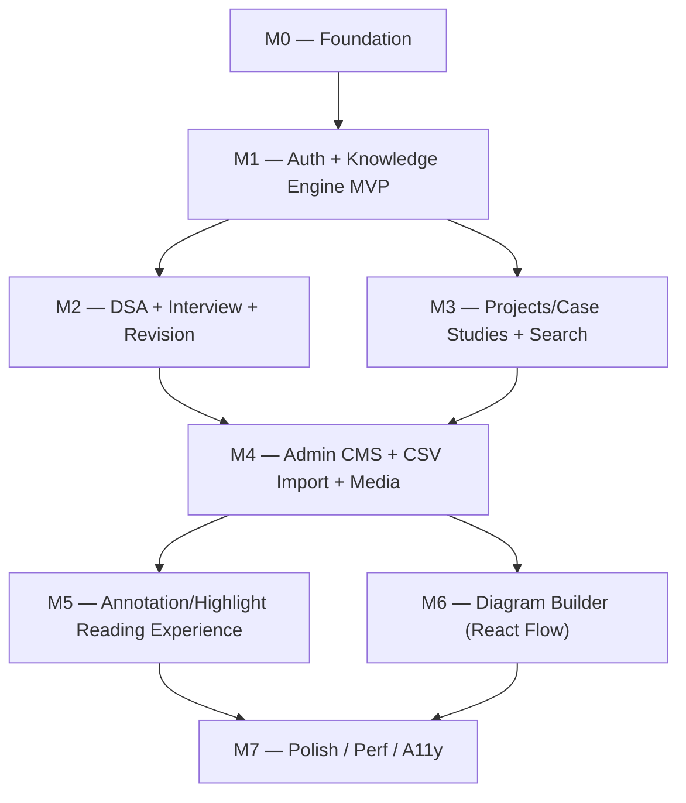

# 17 — Development Roadmap

> Milestone-based build sequence for DevAtlas, from an empty repository to a production-ready v1. Companion to `02-prd.md` (what ships in MVP) and `03-srs.md` (the requirement IDs each milestone discharges) — this document owns *the order things get built in and why*, not what they do once built (`06-database-design.md`, `07-api-design.md`, `08-backend-architecture.md`, `09-frontend-architecture.md`) or how well they perform/how secure they are once built (`15-security-design.md`, `16-performance-design.md` — both of which this roadmap's final milestone exists specifically to close out).
>
> **A note on current repo state.** Substantial scaffolding already exists at the time of writing — all twelve backend resources have models/controllers/routes/validators, and the frontend has its full route tree, component shells, and RTK Query store. This document is not a status tracker for that work; `08-backend-architecture.md`, `09-frontend-architecture.md`, `15-security-design.md`, and `16-performance-design.md` are the authoritative sources for what's implemented versus what's a named **Gap** today. What this document fixes is the *sequence* — the order the remaining gaps and any future rebuild should be tackled in, and the reference for scoping a sprint, onboarding a new contributor, or judging how much of the system a given PR advances.

## 1. Sequencing Principles

Three rules govern the milestone order below, stated up front because they're the answer to "why is X in M4 and not M1":

1. **Engine before UI polish.** The discriminator-based `Knowledge` model (`06-database-design.md` §4) and its read path have to exist and be proven correct before any effort goes into animation timing, code-splitting boundaries, or diagram-authoring UX. A beautifully polished page over the wrong data model is wasted work; a plain, unstyled page over the right one is a milestone.
2. **Auth before anything role-gated.** Every admin feature from M4 onward assumes `verifyJWT`/`verifyRole("admin")` (`08-backend-architecture.md` §6) already exists and is trustworthy. Building admin CRUD before real auth exists means either running with no protection during development — a habit that has a way of surviving into production — or building the auth-gating twice. Auth ships in M1, first, deliberately fused with the content engine rather than sequenced after it.
3. **Read paths before write/admin paths.** A reader-only version of a module should work end-to-end before its authoring counterpart is built — partly because most real usage *is* reading (a small trusted admin cohort per `03-srs.md` §2.3, versus every user), and partly because good authoring UI needs real rendered content to be designed against. There is no way to build a sane DSA admin form before you know what a well-formed `dsa` card looks like once rendered.

Every milestone below also states its own **Dependencies** — read those as hard gates, not suggestions. M4 (Admin CMS) in particular depends on M1, M2, *and* M3, because an admin needs to author all four discriminator types and their relations, not just `concept` cards.

## 2. Complexity Scale

Rough sizing for a single senior engineer or a 2-3 person team (per `03-srs.md` A-4's assumed admin/build cohort size) — not a formal estimate, a relative planning signal:

| Size | Meaning | Rough shape |
|---|---|---|
| **S** | A handful of focused files, low design risk, mechanical | days, not weeks |
| **M** | One complete feature vertical slice (schema → API → UI) | about a week |
| **L** | Multiple interacting subsystems, or one genuinely novel UI/algorithm | two to three weeks |
| **XL** | A milestone that's a small project in its own right, and/or carries the roadmap's highest-risk decisions | four-plus weeks |

## 3. Milestone Dependency Graph

M2 and M3 both depend only on M1 and not on each other — a two-person team can genuinely split them in parallel. M5 and M6 are similarly independent of each other once M4 lands. Everything converges on M7, which is defined entirely as remediation against gaps the earlier milestones knowingly deferred.

## 4. Milestone Summary

| # | Milestone | Objective in one line | Complexity |
|---|---|---|---|
| M0 | Foundation | Stand up the repo, tooling, and empty-shell app both sides of the stack build on | M |
| M1 | Auth + Knowledge Engine MVP | Log in via OAuth, read a real Knowledge Card through the fixed skeleton | XL |
| M2 | DSA + Interview + Revision | Filtered module lenses over `knowledges`, plus personal state and the revision re-queue | L |
| M3 | Projects/Case Studies + Search | Project case-study rendering, the relations graph made visible, cross-type search | L |
| M4 | Admin CMS + CSV Import + Media | The authoring surface every card, category, company, and relation in the system depends on | XL |
| M5 | Annotation/Highlight Reading Experience | Per-user text highlighting and inline notes on rendered content | M |
| M6 | Diagram Builder (React Flow) | Interactive + static diagram rendering and admin authoring for the Visualization section | L |
| M7 | Polish / Perf / A11y | Close every deferred gap; make the system production-honest | L |

---

## M0 — Foundation

**Objective.** Produce an empty-but-correct shell on both sides of the stack: the fixed backend response contract, database connection, base taxonomy models, and a themed, routed, but dataless frontend shell. No feature work — nothing in M0 is user-facing — because everything from M1 onward assumes this scaffolding is already right, and it's the most expensive place in the whole roadmap to get wrong. A middleware-order mistake or a path-alias mistake here gets copy-pasted into every file written after it.

**Deliverables**
- Backend process skeleton: `index.js` (`dotenv.config()` → `assertRequiredEnv()` fail-fast check, per `08-backend-architecture.md` §8 → `connectDB()` → `app.listen`), `db/index.js`, `app.js`'s fixed middleware stack in its documented order (`08-backend-architecture.md` §2) — even though most routers it mounts don't exist yet.
- The `ApiResponse` / `ApiError` / `asyncHandler` trio (`backend/src/utils`) and the global `error.middleware.js`, built before a single controller exists — every controller written from M1 onward assumes this contract with zero exceptions (`19-coding-standards.md` §2).
- `backend/.env.example` committed alongside `backend/.env` from day one — this is cheaper to never let lapse than to retrofit once five more environment variables have accreted (the gap `15-security-design.md` §11 flags if left too late).
- `constants.js` started (empty-but-structured — enums get added as each resource lands, never inlined directly into a schema or validator, per `19-coding-standards.md` §4).
- `User`, `Category`, `Company` schemas — structure only, no OAuth wiring, no auth logic yet. These three exist first because `Knowledge.category` and `Knowledge.author` are both required refs; the base `Knowledge` schema in M1 literally cannot be written without them.
- Frontend: Vite + React 19 scaffold, Tailwind v4 CSS-variable setup with the neutral oklch palette and the `.dark` class (no gradients/glow from day one, per `01-product-vision.md` principle 8 — not retrofitted later), Geist Variable font, shadcn CLI init (`components.json`, base-nova style, `@base-ui/react`), `next-themes` wired per `09-frontend-architecture.md` §4.1.
- The `@` alias resolved to the `frontend/` project root in both `vite.config.js` and `jsconfig.json` (`09-frontend-architecture.md` §1.2), with `components/`, `lib/`, `hooks/`, `store/` created at that root — empty but present, so no later PR has to decide where shadcn output or store files belong.
- React Router v7 installed, `App.jsx`'s route tree stubbed with placeholder pages and no guards yet (nothing to guard — auth doesn't exist until M1), `AppLayout` shell (`AppSidebar` + `Navbar`) rendering the seven primary nav items as real links to stub pages.
- Redux Toolkit store initialized: the one `apiSlice` with zero injected endpoints, `setupListeners` wired.
- Vite dev proxy (`/api` → `localhost:8000`), so frontend and backend are already talking to each other before there's anything real to fetch.
- `seed/seed.js` skeleton, even if its only job today is seeding the eleven top-level categories from `04-information-architecture.md` §3.

**Dependencies.** None — this is the root of the graph.

**Estimated Complexity.** M. Low logical risk (there's no business logic yet), but every decision here — middleware order, the `@` alias target, the folder layout — is expensive to unwind once M1 onward has written hundreds of imports against it, so it isn't S.

**Suggested Development Order**
1. Backend process skeleton (`index.js` → `db/index.js` → empty `app.js`) — confirm `npm run dev` connects to MongoDB before writing anything else.
2. `utils/` trio + `error.middleware.js` — the contract, before the first controller that depends on it.
3. `config/env.js`'s fail-fast check + `constants.js` placeholder.
4. `User` / `Category` / `Company` schemas (no logic).
5. Frontend scaffold: Tailwind v4 + dark mode + shadcn init + Geist font.
6. `@` alias + the `components/lib/hooks/store` folder layout — settle this before the first hand-written component, not after.
7. React Router v7 skeleton + `AppLayout` chrome + empty Redux store.
8. End-to-end smoke check: a stub page fetches something trivial through the dev proxy and renders it, proving the two halves of the stack are actually wired together.

---

## M1 — Auth + Knowledge Engine MVP

**Objective.** Ship the first genuinely real vertical slice: a user logs in via Google or GitHub, lands in the authenticated shell, and reads a real, seeded Knowledge Card — of any of the four types — rendered through the fixed nine-block skeleton. This is the milestone that proves DevAtlas's two hardest architectural bets actually hold: OAuth-only auth with DevAtlas's own JWT cookies (`20-adr.md` ADR-0003 / ADR-0004), and the discriminator-based Knowledge Card as one engine, four types (`20-adr.md` ADR-0001). Everything in M2 through M7 is additive on top of what this milestone proves; nothing downstream can de-risk it retroactively.

**Deliverables**
- `knowledge.model.js` — the full base schema **and all four discriminators** (`concept`, `dsa`, `interview`, `project`) in one file, per `06-database-design.md` §4, plus the `slug` / `{type,status,category}` indexes. Built completely now, even though DSA-specific UI doesn't land until M2 and project case-study UI doesn't land until M3 — retrofitting a discriminator onto a base schema that's already live with published documents and indexes is exactly the migration this architecture exists to avoid, so it's cheaper to design the full shape once, up front.
- `resource.model.js`, `attachment.model.js` — schema only. The upload pipeline that populates `Attachment` is M4; `Knowledge.resources[]` / `attachments[]` just need somewhere valid to point in the meantime.
- `config/passport.js` (Google + GitHub strategies, `session: false`), `findOrCreateOAuthUser`'s three-branch resolution, `utils/tokens.js` (`issueTokens`, `hashToken`), `auth.controller.js` (`oauthCallback`, `refreshAccessToken`, `logout`, `me`), `auth.routes.js`, the cookie strategy (`COOKIE_OPTIONS`) per `15-security-design.md` §5.
- `auth.middleware.js`: `verifyJWT`, `attachUserIfPresent`, and the `verifyRole(...)` factory — build `verifyRole` now even though no route calls `verifyRole("admin")` until M4. It's a few lines alongside `verifyJWT`, and every downstream milestone assumes it already exists and is tested.
- `knowledge.controller.js` **read paths only** — `getKnowledgeList`, `getKnowledgeBySlug`, `getRelatedKnowledge` (the last can safely return an empty list until M3 seeds real edges). Write paths (`create`/`update`/`publish`/`delete`) are explicitly out of scope for M1 — see the read-before-write principle in §1.
- `seed/seed.js` extended with real content: categories plus a small hand-authored set covering all four types (at minimum one `concept`, one `dsa`, one `interview`, one `project`). An empty database makes this milestone impossible to actually verify, so seeding real content is the test fixture, not optional polish.
- Frontend: `authApi.js`, `authSlice.js` (matcher-populated, never independently fetched, per `09-frontend-architecture.md` §3.2), `GuestRoute` / `ProtectedRoute` guards, `LoginPage`, `AuthCallbackPage`.
- `knowledgeApi.js` read endpoints, `KnowledgeDetailPage.jsx` plus the `components/knowledge/*` skeleton components: header (title/tags/difficulty/readTime/updated), `MarkdownRenderer` (react-markdown + remark-gfm + rehype-highlight) rendering TLDR/Explanation, `CodeExamplesList`, `InterviewQuestionsList` (render-only), `Mistakes`, `Resources`, `RelatedTopics` (render-only against whatever `getRelatedKnowledge` returns, even if that's usually empty this early).
- The Visualization section's layout slot exists and renders a clean empty state for `kind: "none"` — actual Mermaid/React Flow rendering is M6, but the skeleton must be genuinely fixed and complete from this milestone on, per `01-product-vision.md`'s "same skeleton, no exceptions" principle. Adding a ninth section later would be exactly the kind of layout exception the product explicitly forbids.
- A minimal Explore path (category grid → filtered list → card) — the first non-trivial navigation route, since a `/knowledge/:slug` page with no organic way to reach it isn't a demoable milestone.

**Dependencies.** M0.

**Estimated Complexity.** XL. This is, without qualification, the largest milestone in the roadmap. OAuth + JWT cookie mechanics (rotation, hashing, httpOnly/CORS/CSRF interplay — `15-security-design.md` §2–§8 in full) is intricate in its own right, and the discriminator schema plus rendering pipeline is the single architectural bet the entire product is built on. Treat any pressure to compress this milestone's timeline as pressure worth resisting.

**Suggested Development Order**
1. `Knowledge` base schema + all four discriminators + indexes — the data model has to exist before anything can read or write it.
2. Seed script: categories + a handful of hand-authored cards, one per type. Develop against real content, not empty collections.
3. `knowledge.controller.js` read endpoints — build and verify with curl/Postman against the seeded data *before* any frontend code touches them, so a schema mistake is caught before it's baked into UI assumptions.
4. Passport config + `auth.controller.js` / `routes.js` / `middleware.js` + cookie issuance — independently testable via the real OAuth redirect flow before the frontend consumes any of it.
5. Frontend `apiSlice` + `authApi` + `authSlice` + route guards — prove `/auth/me` round-trips correctly and `ProtectedRoute` gates on a real logged-in session.
6. `KnowledgeDetailPage` + the skeleton components, consuming seeded content through `knowledgeApi`. This is the milestone's payoff step — do it after auth and reads are both independently proven, not in parallel with them.
7. Minimal Explore (category grid → list → card) as the first real path into a card, since users don't arrive at content by typing slugs.

---

## M2 — DSA + Interview + Revision

**Objective.** Light up Practice and Interview as filtered lenses over the same `knowledges` collection — proving `04-information-architecture.md` §3.1's "category is subject, module is activity" distinction actually works end to end — and ship `UserProgress`-backed personal state plus the leveled revision re-queue: the first genuinely personal, per-user data anywhere in the product.

**Deliverables**
- `userProgress.model.js` (`06-database-design.md` §5) + its unique `{user, knowledge}` compound index.
- `progress.controller.js` / `routes.js` / `validator.js`: bookmark/favorite/pin/notes upsert, revision submit (`forgot`/`shaky`/`confident` → the level/interval table), revision-mark toggle, and the due/bookmarks/pinned/favorites list endpoints — with static route segments (`/revision/due`, `/bookmarks`, `/pinned`, `/favorites`) declared **before** `/:knowledgeId` in the router, per `19-coding-standards.md` §6's correctness rule, not a style preference.
- `progressApi.js`, with optimistic updates scoped to exactly the bookmark/favorite/pin toggle family (`16-performance-design.md` §5.1) — revision submission stays a normal await-then-invalidate mutation, since the server computes the next interval and the client has no business predicting it.
- `RevisionControls.jsx` (forgot/shaky/confident — deliberately unanimated, per `09-frontend-architecture.md` §5.1's "a recall-honesty action shouldn't carry decorative delay"), `PersonalNotes.jsx`, and bookmark/favorite/pin affordances wired into the card header built in M1.
- `TypeListPage.jsx` (the shared list component) plus `PracticePage` / `InterviewPage` as thin `type`-pinned wrappers over it — `ProjectsPage`'s wrapper is built here too, mechanically, even though its case-study rendering isn't built until M3; the list-page pattern itself is a M2 concern.
- `KnowledgeFilterBar.jsx`: pattern/difficulty/company/category/attempted-status for Practice; role/company for Interview.
- `company.model.js` / `controller.js` / `routes.js` **read path only** (`GET /companies`) — write/admin CRUD is M4, but Practice and Interview's filter bars need something real to query now.
- `RevisionPage.jsx` — the aggregated due-queue view.
- A first, minimal `dashboard.controller.js` / `dashboardApi.js` / `DashboardPage.jsx`. Home is one of the seven primary nav destinations and depends entirely on `UserProgress`/`Activity` existing, so there's no reason to leave it a stub for another five milestones once this one lands.

**Dependencies.** M1 (needs authenticated users and published Knowledge Cards to attach progress to).

**Estimated Complexity.** L. The revision state machine and its cache-invalidation fan-out — a revision mutation has to invalidate `Progress`, `ProgressList`, *and* `Dashboard` tags together (`16-performance-design.md` §5.1), or the due-count on Home goes stale — are the genuinely tricky parts; the filter-bar UI is comparatively mechanical once the list-page pattern exists.

**Suggested Development Order**
1. `UserProgress` model + indexes.
2. `progress.controller.js` — the revision level/interval table is close to a pure function; get it right and testable in isolation before wiring it behind a route.
3. `progress.routes.js`, static-before-dynamic.
4. `progressApi.js` and its tag design — get the `Progress` / `ProgressList` / `Dashboard` invalidation graph correct here; it's load-bearing for every later milestone that touches personal state.
5. Header affordances (`RevisionControls`, `PersonalNotes`, bookmark/favorite/pin icons) wired into the M1 `KnowledgeDetailPage`.
6. `TypeListPage` + `KnowledgeFilterBar` + `PracticePage` / `InterviewPage`.
7. `RevisionPage`.
8. Minimal `dashboard.controller.js` + `DashboardPage`, wiring Home's four sections (`04-information-architecture.md` §2: Continue Learning, Revision Due, Recently Viewed, Recently Updated).

---

## M3 — Projects/Case Studies + Search

**Objective.** Ship the `project` discriminator's full case-study rendering — the Roomezy shape — with its technical blocks deep-linking into concept cards, and MongoDB weighted-text search with facets. This is the milestone that proves the relations graph does real cross-module navigational work (`04-information-architecture.md` §7.1's worked Promise → Roomezy example) rather than sitting in the schema unused.

**Deliverables**
- The `relations[]` **write path** on `knowledge.controller.js` — self-reference rejected with `400` (`03-srs.md` FR-REL-04) — even though the full admin relation-editor UI doesn't land until M4. Some way to author real edges (a minimal endpoint exercised via seed script or Postman is enough) has to exist before this milestone can be demoed at all.
- `GET /knowledge/:slug/related` (outbound relations plus the inbound reverse-lookup via the `{"relations.knowledge":1}` index) + `RelatedTopics.jsx`, grouped by relation type with the inverse-label mapping from `04-information-architecture.md` §7.
- `search.controller.js` / `routes.js`: the weighted text index, the three-query `Promise.all` pattern (ranked results, count, type-facet `$group`) per `16-performance-design.md` §2.
- `searchApi.js` (`useLazySearchQuery`), `SearchPage.jsx`, `SearchPalette.jsx` (header quick-search, same hook, thinner UI). `User.recentSearches` capped array + `GET`/`POST /search/recent`.
- Project case-study rendering: the Architecture/Database/Auth/Real-time/Cloud Media/Notifications/Deployment/Problems/Lessons sub-sections inside Deep Explanation (`06-database-design.md` §4.5), `ProjectsPage.jsx`'s full detail rendering (the list-wrapper itself already exists from M2).
- Seed content: at least one fully-authored project card (Roomezy) with real `used_in` / `implements` edges pointing at concept cards seeded in M1 — this milestone's entire point is unverifiable without a real, clickable graph.

**Dependencies.** M1 (Knowledge read paths, discriminators, `KnowledgeDetailPage`). Does not depend on M2, though it reuses M2's filter-bar/list-page patterns for search facet chips.

**Estimated Complexity.** L. Search relevance tuning and the facet-count semantics (counts must reflect "if the type filter were cleared," per `16-performance-design.md` §2 — an easy thing to get subtly wrong) are sharper-edged than they look; the relations inverse-lookup and case-study rendering are more mechanical once the pattern is set.

**Suggested Development Order**
1. `relations[]` write path + self-reference rejection.
2. `GET /knowledge/:slug/related` + `RelatedTopics.jsx`.
3. Weighted text index + `search.controller.js`'s three-query pattern.
4. `searchApi.js` + `SearchPage` + facet chips.
5. `SearchPalette` (reuses the same hook — a thin follow-on, not new design work).
6. Project case-study rendering, done **last** in this milestone on purpose, so it can be developed and demoed as the proof of steps 1–2 (a real Roomezy card with real authored edges), rather than built in parallel with the graph machinery it depends on.

---

## M4 — Admin CMS + CSV Import + Media

**Objective.** Build the authoring surface the entire content library depends on: the unified type-adaptive Knowledge form, relation authoring, Category/Company taxonomy CRUD, DSA CSV bulk import, and the Multer → Cloudinary media pipeline. Deliberately sequenced *after* M1–M3's read paths, not before, so admin authoring is built against a rendering pipeline already proven correct, not designed speculatively against a page that doesn't exist yet.

**Deliverables**
- `verifyRole("admin")` actually mounted on write routes now — the middleware has existed since M1, this is where it starts being exercised — across `knowledge`, `category`, `company`, `resource`.
- `knowledge.controller.js` write paths: create/update/publish/delete, `pickBaseFields` / `pickTypeFields` discriminator whitelisting (`15-security-design.md` §3.2 — the second gate behind Zod's own allow-list stripping), the re-slug guard on published cards.
- `AdminEditorPage.jsx` — the single type-adaptive form (type locks after create), including a relation-editor sub-form (source/target/relationType) since M3 only shipped the *read* side of relations.
- `category.controller.js` write path + `AdminCategoriesPage.jsx` (CRUD + reparent); `company.controller.js` write path + `AdminCompaniesPage.jsx` (read path shipped in M2).
- `resource.controller.js` / `routes.js` + the attach-to-card flow.
- `utils/cloudinary.js` (`uploadOnCloudinary` / `deleteFromCloudinary`, `finally`-block temp cleanup — `08-backend-architecture.md` §7), `multer.middleware.js` (MIME allow-list, 25MB ceiling), `upload.controller.js` / `routes.js`, `uploadApi.js`.
- `csvImport.service.js` (streamed `csv-parse`, per-row partial-success accounting — the one workflow in the whole backend that meets the service-extraction bar per `19-coding-standards.md` §3), `POST /knowledge/import/dsa-csv`, `AdminDsaImportPage.jsx` (large enough to justify its own `src/features/dsa-import/useImportWizard.js` state hook, per `09-frontend-architecture.md` §1.3's named first candidate for that pattern).
- `user.controller.js` role/status management + `AdminUsersPage.jsx`, including the "can't demote the last admin" `409` guard (`03-srs.md` FR-ADM-05).
- `activity.controller.js` write side — every mutation above fires an `Activity` row, so the audit trail this milestone's own actions need is built alongside them, not bolted on after the fact.
- `AdminRoute` guard + `AdminLayout` tab-nav, with admin-only nav affordances hidden — not just route-gated — from non-admin sessions per `09-frontend-architecture.md` §2.3.

**Dependencies.** M1 (Knowledge read + role middleware), M2 (Company read path this milestone adds write to), M3 (relations read/render UI this milestone adds authoring to).

**Estimated Complexity.** XL. The second-largest milestone in the roadmap — a lot of CRUD surface area, but the CSV import's streamed partial-success accounting and the two-hop Cloudinary upload pipeline are genuinely stateful workflows, not boilerplate, and discriminator field-whitelisting is exactly the kind of security-sensitive detail (per `15-security-design.md` §3.2) that's easy to get subtly wrong under time pressure.

**Suggested Development Order**
1. `verifyRole("admin")` wired onto the *existing* (M1–M3) write-shaped routes first, even the trivial ones — every later step in this milestone should be developed against an already-enforced boundary, not have the boundary added at the end.
2. `knowledge.controller.js` write paths + field whitelisting — the highest-value, highest-risk piece; curl-test it in isolation before any admin UI exists to hide mistakes behind a form.
3. `AdminEditorPage` (create/edit) consuming it, including the relation-editor sub-form.
4. Category and Company CRUD (backend + `AdminCategoriesPage` / `AdminCompaniesPage`) — mechanically similar, worth doing back-to-back.
5. Cloudinary pipeline (`utils/cloudinary.js` + `multer.middleware.js` + upload controller) — needed for the Resource-attach flow to be real.
6. CSV import service + route + `AdminDsaImportPage` — the most self-contained heavy workflow in the milestone, deliberately saved for after the simpler CRUD patterns are established and familiar.
7. `AdminUsersPage` + role/status endpoints + last-admin guard.
8. `Activity` audit writes threaded through everything above, surfaced in `AdminOverviewPage`'s recent-activity feed.

---

## M5 — Annotation/Highlight Reading Experience

**Objective.** Ship per-user text highlighting and inline notes on rendered card content — the feature that makes reading a card feel like marking up a physical textbook. Sequenced after the full read+admin-write loop exists on purpose: annotations anchor to *rendered* content, and testing anchor resilience against a card whose content is still actively churning through M4's new authoring tools would mean testing against a moving target.

**Deliverables**
- `annotation.model.js` + `annotation.controller.js` / `routes.js` / `validator.js` — owner-scoped, with **no admin bypass**, per `15-security-design.md` §3.2's privacy guarantee.
- `HighlightableContent.jsx` wrapping `MarkdownRenderer` for the `tldr`/`explanation` blocks — `TreeWalker`-based quote-text re-anchoring (`09-frontend-architecture.md` §6.2), plus the text-selection color-swatch toolbar.
- `annotationApi.js`, with the optimistic-create mutation targeting the <50ms-perceived budget, and its rollback path on a failed write.
- The highlight color constants (`yellow`/`green`/`blue`/`pink` — the one deliberate hardcoded-hex exception to the token system, per `09-frontend-architecture.md` §4.4) and the per-block "highlights on this block" fallback list for annotations whose anchor no longer resolves.
- Link-scheme allow-listing on the markdown `<a>` renderer (`http:` / `https:` / `mailto:` only, per `15-security-design.md` §9) — cheap, and this milestone is the one most actively exercising user-influenced rendering, so it's the natural place to close it if M1 didn't already.

**Dependencies.** M1 (`MarkdownRenderer` / `KnowledgeDetailPage` must already exist and be stable), M4 (admin content editing needs to exist so the "content changed under an annotation" fallback path has something real to be tested against).

**Estimated Complexity.** M. The DOM re-walking/re-anchoring logic (duplicate-substring matches, content-edited-since-highlight edge cases) is fiddly but scoped to essentially one component; the CRUD half is, by this point in the build, a familiar, thin per-user-resource pattern — the fourth or fifth time this shape has been built, after `UserProgress`, `Resource`, `Attachment`.

**Suggested Development Order**
1. `Annotation` model + owner-scoped CRUD endpoints — verify against seeded content with Postman before touching any DOM code.
2. `annotationApi.js` (plain, non-optimistic first) wired to a bare debug list view — confirms persistence works before layering interaction UX on top of it.
3. `HighlightableContent.jsx`'s read-only re-anchoring pass (given stored annotations, wrap the matching rendered text) — the highest-risk piece; get it right against real content before building the *creation* interaction.
4. Text-selection → color-swatch toolbar → create-annotation flow, with the optimistic update layered in last, once the plain round-trip is already proven correct.
5. Orphaned-annotation handling + the fallback chip list.

---

## M6 — Diagram Builder (React Flow)

**Objective.** Fill in the last unbuilt section of the fixed skeleton: static Mermaid rendering, interactive React Flow rendering, and the admin authoring surface for React Flow diagrams (`20-adr.md` ADR-0006). Sequenced deliberately late — it's the highest UI-complexity, lowest-content-coverage section (most cards are and will remain text-only), so it shouldn't gate anything else in the roadmap from shipping.

**Deliverables**
- `MermaidDiagram.jsx` — `mermaid.initialize({ securityLevel: "strict" })` is non-negotiable (`15-security-design.md` §9), themed via Mermaid's own `themeVariables` API (the one place in the app where dark-mode theming doesn't route through CSS variables, per `09-frontend-architecture.md` §4.4).
- `FlowDiagram.jsx` — `@xyflow/react` canvas, read-only pan/zoom/drag for regular users; node positions reset to the admin-authored default on reload (not persisted per-viewer in MVP, per `03-srs.md` FR-CARD-07).
- `VisualizationBlock.jsx` — the `kind: "none"|"mermaid"|"flow"` dispatcher, `IntersectionObserver`-gated mount so neither library downloads or renders for a card that never populates this section (`16-performance-design.md` §4).
- The admin-side React Flow **editor** — add/remove/connect nodes, persist `{nodes, edges}` into `content.visualization.flow`. This is the one genuinely novel piece of admin UI in the entire build (everything else in M4 is a form); scope it to a focused node/edge canvas with a save action, not a general-purpose diagramming app.
- Graceful degradation for malformed `mermaidSource` or a corrupt/empty `flow` payload — a contained "diagram unavailable" state local to `VisualizationBlock`, never a page-level crash (`03-srs.md` NFR-REL-02).
- The `mermaid` / `@xyflow/react` dynamic-import chunk boundary, separate from the Card Detail chunk (`09-frontend-architecture.md` §2.5, `16-performance-design.md` §4).

**Dependencies.** M1 (the Visualization slot already exists in the skeleton — this fills it), M4 (the Flow editor is a new panel inside the already-existing `AdminEditorPage`, not a standalone surface).

**Estimated Complexity.** L. `@xyflow/react` editor state (node/edge CRUD, connection handling, serialize-on-save) is the most unfamiliar territory in the roadmap relative to the CRUD-shaped work everywhere else; Mermaid rendering itself is comparatively low-risk — a mature library where the real work is configuration, sanitization, and dark-mode theming, not novel state management.

**Suggested Development Order**
1. `MermaidDiagram.jsx` (read path only) against a hand-written `mermaidSource` seeded onto one existing concept card — ship the simpler rendering path completely before starting on Flow.
2. `VisualizationBlock.jsx`'s dispatcher + `IntersectionObserver` gating + the code-split chunk boundary — build the loading/perf contract once; both diagram kinds sit behind it.
3. `FlowDiagram.jsx` as a read-only viewer against a hand-authored JSON fixture, no editor yet — prove rendering before building authoring.
4. Malformed-input graceful degradation for both kinds.
5. The admin Flow editor panel — the real remaining work of this milestone.
6. Retrofit: pick two or three existing cards from earlier seed data and author real diagrams for them, so the milestone ships with visible, non-placeholder content rather than an empty feature.

---

## M7 — Polish / Perf / A11y

**Objective.** Close every "Gap" and "target — not yet implemented" callout accumulated across `09-frontend-architecture.md`, `15-security-design.md`, and `16-performance-design.md` through M0–M6, plus the cross-cutting hardening — accessibility, error boundaries, production logging, rate-limit correctness — that a feature-sequenced build always defers. This milestone ships no new user-facing feature; its deliverable is the system becoming production-honest.

**Deliverables** — grouped by the document that already specifies each one in detail, so nothing here is redesigned, only scheduled:

*From `15-security-design.md` §15's pre-production checklist:* `CORS_ALLOWED_ORIGINS` startup assertion; `X-DevAtlas-Client` header + `requireDevAtlasClient` middleware; `app.set("trust proxy", 1)`; decode-based rate-limit `keyGenerator` for `uploadLimiter`/`writeLimiter`; the per-route JSON body-limit override for the two Knowledge write routes; `CastError` → `400` mapping; unconditional server-side error logging + production request logging; `role_changed`/`status_changed` `Activity` entries; `helmet` + a `script-src 'self'` CSP; `backend/.env.example` kept current; a running backup job plus one completed restore drill.

*From `16-performance-design.md`:* route-level `lazy()` code-splitting for Card Detail and `/admin/*` (§4); the `{type:1, difficulty:1, status:1}` compound index, called out there as *required*, not optional (§7.3); the `sort` query-param allow-list guard (§3); `Attachment.width`/`height` plumbed through to fix layout-shift (§6); `compression` middleware (§9); `Cache-Control` headers on the genuinely public, non-personalized GET routes (§5.2); the `baseQuery` reauth-on-401 wrapper (`09-frontend-architecture.md` §3.6).

*From `09-frontend-architecture.md`:* `AppErrorBoundary` + `ErrorFallback` (§7 — doesn't exist at all today); the `AnimatePresence` route-transition wrapper (§5.1); the standalone `CodeBlock` component with a real copy-to-clipboard button, replacing `CodeExamplesList`'s markdown-round-trip workaround (§6.3); `useReducedMotion()` on the two first-mount reveal animations (§5.3); `frontend/.prettierrc`, plus reformatting the remaining scaffold holdouts (`19-coding-standards.md` §9).

*Net-new hardening, not previously flagged elsewhere:* an accessibility pass — keyboard operability of highlight creation (`03-srs.md` NFR-4: "not mouse-drag-only"), focus management on route change, a color-contrast check against the oklch palette in both themes, `aria-live` regions for toasts/async state, a skip-to-content link; the documented concurrent-tab refresh race fix (`15-security-design.md` §4's `previousRefreshTokenHash` grace-window recommendation); a representative load test (k6/Artillery) against the p95 budgets in `16-performance-design.md` §1, which `03-srs.md` §8.8 names as the actual production sign-off gate, not an optional nice-to-have.

**Dependencies.** M0–M6 in full — every item in this milestone is remediation against a gap a specific earlier milestone knowingly deferred, so nothing here can start meaningfully before the corresponding feature exists to harden.

**Estimated Complexity.** L. Individually, most items are S/M-sized fixes — but there are roughly two dozen of them spanning three documents and both halves of the stack, and the load-test-driven items (index tuning, the reauth wrapper) require iterating against real measurements rather than implementing a known fix once and moving on.

**Suggested Development Order**
1. The security checklist first — these carry the highest cost of delay (a shipped CORS/CSRF gap is a live vulnerability the day it ships; a slow page is merely a slow page).
2. `AppErrorBoundary` + the `CastError` mapping — both close "silent 500 / blank page" failure modes, worth fixing before the load test below, since a crash under load is otherwise indistinguishable from a genuine performance failure.
3. The mechanical performance fixes: the new compound index, the `sort` allow-list, `Attachment` dimensions, `compression`.
4. Code-splitting (route `lazy()` + the M6 diagram chunk boundary, if not already finished there) + the `baseQuery` reauth wrapper.
5. The accessibility pass — run this against the now feature-complete app, not earlier, since later milestones could otherwise silently reopen a11y issues fixed too soon.
6. Animation polish (`AnimatePresence`, `useReducedMotion`, the `CodeBlock` copy button) — genuinely cosmetic, ordered last on purpose.
7. Load test → measure → targeted index/caching iteration against real numbers, then re-run per `16-performance-design.md` §11's own instruction to re-verify after any index or caching change.
8. Backup job + restore drill + `.env.example` currency — operational readiness; can run in parallel with the rest of this milestone, but must complete before go-live.
