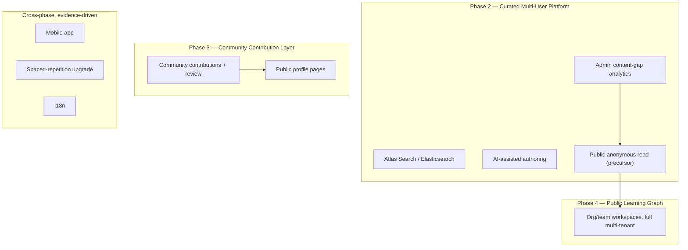

# 18 — Future Roadmap (Post-MVP / Community Platform)

> Scope: the nine post-MVP capabilities named across `01-product-vision.md` §6 (the four-phase long-term vision) and `02-prd.md` §9 (Future Scope), taken one level deeper into *what would actually have to change, technically* — this document is the architecture-level companion to those two product-level sections, not a replacement for them. Nothing described here ships in MVP; `17-development-roadmap.md` (M0–M7) is the complete MVP build, and `03-srs.md` fixes MVP's requirement boundary. Every item below is written against one constraint, stated once here instead of nine times: **it must extend the architecture already fixed in `06-database-design.md` / `07-api-design.md` / `20-adr.md`, never fork it.** That constraint is the literal engineering meaning of "personal-first, community-capable by design" — every ADR in `20-adr.md` was chosen, in part, because the growth paths below don't require rewriting it.

## 1. How to Read This Document

Each section follows the same shape: **What** (the capability, concretely), **Why it's deferred** (the specific MVP-scoping decision or missing precondition, cross-referenced rather than re-argued), **What changes** (the schema/API/infra sketch — enough to plan against, not a full design), and **Trigger** (the concrete, evidence-based condition that should start the work — never a calendar date, since none of this is scheduled). Nothing here is sized in the S/M/L/XL sense `17-development-roadmap.md` uses for MVP milestones — sizing any of these seriously is itself future work, contingent on decisions (which LLM provider, self-host vs. managed search, and so on) that aren't DevAtlas's to make speculatively today.

## 2. At a Glance

| # | Feature | Vision phase (`01-product-vision.md` §6) | Builds on this MVP seam | Concrete trigger |
|---|---|---|---|---|
| 1 | Public multi-tenant mode | Phase 2 (anonymous read) → Phase 4 (org workspaces) | `attachUserIfPresent`, the `user`/`admin` role model | Content coverage deep enough for a good first impression; confirmed by #10's tooling |
| 2 | AI-assisted authoring | Phase 2 (admin tooling) | `status: draft` on `Knowledge`, admin-only routes | Admin authoring throughput identified as the actual content-growth bottleneck |
| 3 | Atlas Search / Elasticsearch | Phase 2 (explicit in vision §6) | `search.controller.js` as the sole `$text` call site (`20-adr.md` ADR-0005) | Sustained p95 breach under real load, or a documented doc-count threshold |
| 4 | Mobile app | Phase 2+, decoupled from the phase list | JWT `Authorization: Bearer` fallback (`20-adr.md` ADR-0004), the `ApiResponse` envelope | Web retention data shows the Revision loop specifically wants an outside-desktop presence |
| 5 | Public profile pages | Phase 3 (pairs with contribution attribution) | `User.headline`/`bio`/`socialLinks` (already schema'd, not rendered publicly) | Pairs naturally with #6 shipping |
| 6 | Community contributions + review | Phase 3 (explicit in vision §6) | Role model, `status` enum, `06-database-design.md` §13's versioning trigger | Canonical library has a strong enough "voice" to hold submissions to |
| 7 | Spaced-repetition upgrade (SM-2/FSRS) | Cross-phase, evidence-driven | `UserProgress.revision.history[]` (already algorithm-agnostic) | Revision-effectiveness success metric (`01-product-vision.md` §11) trending poorly |
| 8 | Admin content-gap analytics | Phase 2 (admin cohort outgrows informal coordination) | The Dashboard aggregation pattern (`06-database-design.md` §12) | Admin cohort grows past "everyone already knows every card" |
| 9 | i18n | Lowest priority; evidence-driven, no phase lock | None yet — genuinely net-new schema surface | Real, non-speculative demand from a non-English-speaking cohort |

## 3. Public Multi-Tenant Mode

**What.** Two related but separable capabilities: (a) fully public, unauthenticated read access to canonical content (browsing Explore/Practice/Projects with no login), and (b) true multi-tenant organization/team workspaces — a bootcamp or engineering team curating its own card set on the same engine, per `01-product-vision.md` §6's Phase 4.

**Why it's deferred.** MVP requires an authenticated session to read anything at all — `03-srs.md` Constraint C-3 states this explicitly, and `02-prd.md` §12 fixes it as an MVP constraint. There is exactly one implicit tenant (global) today; `Knowledge`, `Category`, and `Company` carry no tenant/workspace scoping field.

**What changes.** The two halves are genuinely different-sized changes:
- *Public read* is the smaller lift: relax the routes currently gated by `attachUserIfPresent` so `GET /knowledge`, `GET /knowledge/:slug`, `GET /categories`, `GET /search` serve `status:"published"` content to anonymous callers, while every personal-state route (`/progress`, `/annotations`) stays `verifyJWT`-gated exactly as today. The real work isn't the middleware relaxation — it's the second-order design: rate-limiting anonymous traffic more conservatively than authenticated (`15-security-design.md` §7's tiers currently assume a logged-in `req.user` is always available to key by), and designing a genuine "sign up to bookmark/revise this" conversion moment rather than letting anonymous browsing simply dead-end.
- *True multi-tenancy* is the larger lift: a `Workspace`/`Organization` collection, `Knowledge.workspace` (nullable — `null` means the global public library, non-null scopes a card to one workspace), and `User.workspaces[]` with a per-workspace role. This is also the first point where a role finer-grained than `user`/`admin` becomes legitimate to introduce — `02-prd.md` §12 deliberately reserves that as its own Phase 3+ design pass, not a default to reach for casually.

**Trigger.** Public read: once the canonical library has enough depth that a logged-out visitor's first impression is "substantial reference," not "sparse seed data" — exactly what admin content-gap analytics (§10) is built to answer honestly. Full multi-tenancy: Phase 4, realistically gated on the Phase 3 community layer (§6) proving the curated-trust model holds at more than one admin cohort's scale first.

## 4. AI-Assisted Authoring

**What.** An admin-only "draft assist" tool: paste raw notes — a transcript, a rough outline, a Slack thread — and get back a first-draft `tldr`, a skeleton `explanation`, candidate `tags[]`, a candidate `mermaidSource` diagram, and, the highest-value and hardest-to-get-right output, candidate `relations[]` suggestions against existing cards. The admin reviews and edits every field before anything leaves `status: "draft"`.

**Why it's deferred — explicitly, not just "not built yet."** MVP authoring is 100% human-written Markdown/Mermaid, matching `03-srs.md` Assumption A-4 ("Markdown/Mermaid authored directly, not via a WYSIWYG abstraction"). There is no AI integration point anywhere in the MVP schema, API surface, or admin UI — no stubbed button, no placeholder loading state, no "coming soon" affordance. Faking this in MVP would be worse than not having it: a disabled button or a fake spinner implies a capability that doesn't exist and sets a false expectation for the admin cohort MVP actually depends on.

**What changes.** A new admin-only endpoint (e.g. `POST /admin/ai/draft`) wrapping a call to an LLM API — model-agnostic by design, since whether that's a Claude-class, GPT-class, or self-hosted model is an operating cost/quality trade-off to make at build time, not a commitment made here — taking `{ notes: string, type: KnowledgeType }` and returning a structured suggestion in the *same shape* `createKnowledgeSchema` already expects. Nothing about `Knowledge`'s schema needs to change: an AI-suggested draft is stored in the exact same document shape as a human-typed draft, because `status: draft|published|archived` already exists precisely to mean "not yet trustworthy for readers," regardless of *how* the draft text came to exist. The `relations[]` suggestion is the genuinely hard part — it needs retrieval context over existing cards (most plausibly an embedding-similarity pre-filter over `title`+`tags`, narrowed further by an LLM call), and even then it's a suggestion an admin accepts or rejects one edge at a time, never an auto-applied relation — see `20-adr.md` ADR-0010, which this feature must not weaken.

**Cost note.** This is the one item in this entire document with a recurring per-call operating cost (an LLM API bill) rather than a one-time build/infra cost — a real reason it's sequenced behind proving the manual authoring workflow (`17-development-roadmap.md` M4) is actually the bottleneck worth automating, not a reason to avoid it outright.

**Trigger.** Only once admin authoring throughput is identified as the actual bottleneck to content growth — the same shape of problem the DSA CSV importer already solves for bulk `dsa` ingestion, arriving here for `concept`/`project` authoring once hand-writing each one is demonstrably the slow part. Building this speculatively, before that bottleneck is real, risks optimizing a step that was never the constraint.

## 5. Atlas Search / Elasticsearch Upgrade

**What.** Replace MongoDB's `$text` weighted index with MongoDB Atlas Search (Lucene-based, native to an Atlas-hosted cluster) or a standalone Elasticsearch/OpenSearch deployment — fuzzy/typo-tolerant matching, synonym expansion, BM25-class relevance scoring, and autocomplete-as-you-type.

**Why it's deferred.** Already the fixed, deliberate v1 decision — `20-adr.md` ADR-0005 is the full record of why; `06-database-design.md`, `07-api-design.md` §8, and `16-performance-design.md` §2 all describe the current implementation as this decision's direct consequence. Not re-argued here.

**What changes.** The migration's blast radius is intentionally small by design: `16-performance-design.md` §2 states the load-bearing invariant that `search.controller.js` is the *only* call site in the codebase that ever builds a `$text` query. Swapping the engine means rewriting that one controller (or the `SearchService` extraction `03-srs.md` NFR-SCALE-05 already anticipates) to issue a `$search` aggregation stage instead — no other controller, model, or frontend hook needs to know the engine changed, since `searchApi.js` already only knows the `GET /search` contract, not how it's implemented behind it. **Atlas Search is the recommended default over standalone Elasticsearch specifically because DevAtlas's backup story already assumes an Atlas-hosted cluster** (`15-security-design.md` §14) — Atlas Search lives inside that same cluster with no second data store to keep consistent, whereas Elasticsearch would need a sync pipeline (most plausibly MongoDB Change Streams → ES) that is real, ongoing operational surface Atlas Search avoids entirely. Reach for standalone Elasticsearch only if a requirement Atlas Search genuinely can't meet shows up later — not as a default.

**Trigger.** Any one of: sustained `/search` p95 latency breaching the `16-performance-design.md` §1 budget under *real*, not synthetic, load; published `knowledges` volume crossing roughly 20,000–30,000 documents, where relevance quality (not just latency) visibly degrades; or direct, recurring user feedback that typo-intolerance is a real friction point.

## 6. Mobile App

**What.** A companion app (native or React Native/Expo), deliberately scoped narrower than the web product: Revision queue + reading, not full authoring parity, not the admin console, not annotation-drawing. A "review on the train" companion, not a port.

**Why it's deferred.** `03-srs.md` Assumption A-5 fixes desktop as the primary MVP reading context by design — long-form content, code blocks, and diagrams are genuinely desktop-shaped, and MVP's frontend is responsive-but-not-mobile-optimized, not mobile-first. A dedicated app is a real, separate investment (app-store operations, push infrastructure, offline-sync design) not justified before the web product's core loop is validated.

**What changes.** Less than it might seem, which is the point of building the API the way MVP already has: the `ApiResponse`/`ApiError` envelope, the JWT/cookie auth model, and RTK Query's query/mutation shape all port directly. The one real adaptation is transport — a native client can't rely on browser cookies the way the SPA does, so it would authenticate via the `Authorization: Bearer` header `verifyJWT` already accepts as a fallback today specifically for this future (`20-adr.md` ADR-0004, `15-security-design.md` §4). That's not a new capability to build; it's an already-built one finally getting exercised. Push notifications, if ever added for revision reminders, must still honor the no-guilt-language constraint (`02-prd.md` NFR-8) — an opt-in "these cards are due" digest, never a streak-loss alert; see `20-adr.md` ADR-0007's consequences on this exact point.

**Trigger.** Phase 2+, once web usage data shows specifically the Revision loop (not the whole app) is something users want available outside a desktop session — a narrower, more falsifiable signal than generic "would a mobile app be nice."

## 7. Public Profile Pages

**What.** A shareable, unauthenticated `/u/:username` page: headline/bio/social links (already on `User` today, just not publicly rendered — `06-database-design.md` §2), plus, once community contributions exist (§8 below), the projects and cards a user has authored or contributed to.

**Why it's deferred.** MVP's `ProfilePage` is self-only — `/profile`, gated behind `ProtectedRoute`, no public route exists (`09-frontend-architecture.md` §2.2). `User` has no `username` (only `email`, which must never be exposed publicly) and no visibility flag.

**What changes.** Add `User.username` (unique, slug-safe, user-chosen — deliberately separate from `email`) and `User.isProfilePublic` (default `false`: opt-in, never a default-on flip that surprises a user mid-job-search with an unexpectedly public footprint). A new, narrowly-projected public route (`GET /users/:username/public`) returning only `name`/`headline`/`bio`/`socialLinks`/public authored content — never `email`, never anything from `userprogresses` or `annotations`. That exclusion isn't a detail to get right later; it's `15-security-design.md` §3.2's "no admin bypass on personal data" principle extended one more step to "no public bypass either," and the projection must be designed narrow from its very first draft, not patched afterward.

**Trigger.** Pairs naturally with §8 (Community contributions) — a public profile is what makes "who wrote this case study" worth having once non-admin users can author content that ships publicly under their name.

## 8. Community Contributions + Review Workflow

**What.** Phase 3's central capability (`01-product-vision.md` §6): trusted non-admin users propose new cards or edits to existing ones; an admin reviews, edits if needed, and approves or rejects before anything touches canonical `status:"published"` content. This is the single highest-leverage item in this document — it's what turns "curated by a small team" into "curated at community scale" without abandoning the curated-canonical trust guarantee that's a stated, non-negotiable product principle (`01-product-vision.md` principle 6).

**Why it's deferred.** `03-srs.md` Constraint C-4 fixes MVP as admin-only authoring, no peer-review workflow. "Community-capable" is explicitly named future roadmap, not MVP scope, throughout `01-product-vision.md` and `02-prd.md`.

**What changes — the real design work, sketched rather than pre-decided.**
- **A submission object, not a third role.** Resist the instinct to add `role: "contributor"` to the existing two-value enum — `02-prd.md` §12 explicitly reserves any intermediate role for a dedicated Phase 3 design pass with its own philosophy review, not a default reach. Model it instead as a new, separate `KnowledgeSubmission` collection: a proposed create, or a proposed diff against an existing published card, with its own `status: pending|approved|rejected`, `submittedBy`, `reviewedBy`, `reviewNotes`. An approved submission is *applied* to `knowledges` by an admin action — canonical content stays admin-written in the sense that matters (an admin is always the one who made it live), just admin-written-by-approving-someone-else's-draft as well as from-scratch. This keeps `20-adr.md` ADR-0001/ADR-0002's collection boundaries untouched: a submission is a new, moderation-scoped collection, not a new `Knowledge` discriminator and not a field on `Knowledge` itself — the same reasoning that already keeps `UserProgress` out of `Knowledge` applies here to keep unreviewed contributions out of it too.
- **Diffing becomes load-bearing, not optional.** An edit proposal needs to show a reviewer "what actually changed" against the live card. This is precisely the trigger `06-database-design.md` §13 already names for finally building real content versioning (a `KnowledgeRevisionHistory`-shaped collection), which MVP explicitly and deliberately skips. Reviewing a diff-less "here's an entirely new explanation field" proposal against the current one doesn't scale past a handful of submissions — versioning isn't a nice-to-have companion to this feature, it's close to a precondition for it.
- **Attribution** ties to §7 (Public Profile Pages): an approved submission should credit its contributor without weakening "an admin is accountable for what's published." Whether `Knowledge.author` becomes the contributor (with the approving admin recorded as `lastEditedBy`/reviewer) or stays the admin with contributor credit elsewhere is a genuine product decision to make at design time — flagged here as open, not pre-decided, since it has real implications for how "curated by admins" reads to a public audience.

**Trigger.** Phase 3, and concretely once the admin-curated library has enough coverage and quality bar established that a review queue has a real canonical voice to hold submissions against — opening contributions earlier just produces an inconsistent library with extra process on top.

## 9. Spaced-Repetition Algorithm Upgrade (SM-2 / FSRS)

**What.** Replace or augment MVP's discrete forgot/shaky/confident leveled re-queue (`06-database-design.md` §5: five levels, a fixed interval table) with a real spaced-repetition scheduling algorithm — SM-2 (the classic algorithm behind Anki's original scheduler) or FSRS (Free Spaced Repetition Scheduler, the modern difficulty/stability-modeling successor that has increasingly replaced SM-2 as Anki's own default).

**Why it's deferred — a deliberate trade, not a missing feature.** `06-database-design.md` §5 states outright that the leveled scheme is "deliberately not full SM-2." `02-prd.md` FR-8 and `03-srs.md` FR-PROG-07 both fix the leveled interval scheme as MVP's actual required behavior, not a placeholder for something better. The product's own stated success metric — "% of cards marked confident that stay confident on next resurfacing" (`01-product-vision.md` §11) — is precisely the instrument that should decide whether this upgrade is worth its complexity: if the simple scheme already predicts recall well, a mathematically richer scheduler is complexity without measurable payoff.

**What changes.** `UserProgress.revision` gains algorithm-specific state, additively — SM-2 needs `easinessFactor` (starts at 2.5, adjusted per review), `repetitionCount`, and `intervalDays`; FSRS needs `stability`, `difficulty`, and a `retrievability` estimate computed from elapsed time since last review, both meaningfully richer than today's single `level: 0-4` integer. Critically, this is a field-level addition to the existing `revision` subdocument (`06-database-design.md` §5), never a new collection or a change to *where* personal state lives — `20-adr.md` ADR-0002's collection boundary is untouched. `revision.history[]`'s `{at, result}` shape should be kept exactly as-is regardless of which algorithm eventually lands: it's already algorithm-agnostic raw signal (when did the user say what), which means both SM-2 and FSRS could in principle be *fit retroactively* against existing history if the upgrade happens after real usage data exists — a real argument against slimming down `history[]` prematurely today for storage economy.

**UI impact, flagged so it isn't discovered late.** The three-button forgot/shaky/confident input is a deliberate *product* decision, independent of the scheduling math underneath it — but FSRS specifically is usually paired with Anki's four-button Again/Hard/Good/Easy granularity. Adopting FSRS would likely mean revisiting the rating UI too, not just swapping a backend formula; this is a coupled change, not a backend-only one.

**Trigger.** Evidence-driven: the revision-effectiveness metric trending poorly (users marking `confident` and then demonstrably forgetting on next contact), or recurring feedback that intervals feel wrong at the edges — mastered cards resurfacing too often, or struggling cards not resurfacing often enough. Not "SM-2/FSRS is more legitimate" as an aesthetic upgrade on its own.

## 10. Admin Analytics — Content Gaps, Not User Gamification

**What.** Admin-facing dashboards surfacing *content health*: categories with below-threshold card counts, cards with zero outbound `relations[]` (the graph-density success metric made actionable per-card, not just as a rolled-up vanity number), stale published content (`updatedAt` old, cross-referenced against `viewCount` so high-traffic-but-stale outranks low-traffic-but-stale), a DSA pattern-by-company coverage matrix to guide the next CSV import, and aggregate — never per-user-identifying — annotation density per card as a proxy for what content genuinely resonates.

**A boundary this section exists partly to draw explicitly.** This is analytics *for admins, about content* — it must never become analytics *about users, for competition or engagement*. `01-product-vision.md` §12 permanently excludes vanity analytics and engagement charts from the product; this feature does not reopen that exclusion through an "admin-only" side door. Aggregate annotation density is fine ("this card gets highlighted a lot"); a per-user leaderboard of who annotates most is exactly the kind of thing §11 below says will never exist.

**Why it's deferred.** Already named as future scope in two places without being designed further: `06-database-design.md` §12 ("Admin content-gap view — future scope") and `16-performance-design.md` §8 ("the admin 'content-gap' view... not designed further here"). This section is that follow-through.

**What changes.** New admin-only aggregation endpoints (e.g. `GET /admin/analytics/*`), built on `$group`/`$facet` pipelines over `knowledges` and `activities` — architecturally the *same shape* as the Dashboard aggregations MVP already ships (`06-database-design.md` §12's "aggregation-backed view, no new collection" pattern), just admin-scoped and content-focused instead of user-scoped and personal-progress-focused. At real content/user scale this is exactly the cross-all-users aggregation case `16-performance-design.md` §8 flags as the one shape worth revisiting `allowDiskUse`/caching for — that document's forward pointer, closed out here.

**Trigger.** Once the admin cohort grows past the size where everyone curating content already knows every card by heart — content-gap tooling exists to solve a coordination problem between curators, and that problem doesn't really exist yet at MVP's assumed two-to-three-person admin headcount (`03-srs.md` A-4).

## 11. Internationalization (i18n)

**What.** Multi-language UI chrome, multi-language canonical content, or both.

**Why it's deferred.** Not mentioned anywhere in `01-product-vision.md`, `02-prd.md`, or `03-srs.md` as an MVP concern — content and UI are English-only throughout, and nothing about DevAtlas's stated target persona (`01-product-vision.md` §7–8) currently implies non-English demand. This is the most honestly speculative item in this document, listed for completeness because a future roadmap should name it, not because there's a real signal pulling toward it today.

**What changes — two separable problems, worth not conflating.**
1. **UI chrome i18n** — the standard, lower-risk half: extract hardcoded strings into a resource-bundle layer (`react-i18next` or equivalent). Mechanical, but touches essentially every component, so it's a real, if low-risk, undertaking.
2. **Content i18n** — the harder half, and the one worth a real design decision now rather than an accident later: does a translated card become a *separate* `Knowledge` document (which fractures `relations[]`, `annotations`, and `userprogresses`, all keyed to one card's `_id`, across languages), or does `content` become locale-keyed on the *same* document (`content: Map<locale, ContentBlock>`)? This document leans toward the latter, specifically because `20-adr.md` ADR-0001/ADR-0002/ADR-0010 all depend on one canonical `Knowledge._id` per idea — forking a document per locale would fragment the relations graph and a user's revision/annotation state across languages, undermining the "one engine" premise for exactly the users this feature exists to serve. The one real complication that decision inherits: `Annotation`'s anchoring is already text-quote-based (`09-frontend-architecture.md` §6.2), and a highlight only makes sense against the specific language text a specific user actually read — so `Annotation` would need a `locale` dimension too, not just `Knowledge`.

**Trigger.** Real, non-speculative demand from a non-English-speaking user cohort in Phase 2+. Deliberately the lowest-priority item in this entire document — building it ahead of evidence would be scope creep against a persona that doesn't exist yet.

## 12. What Will Never Appear on This Roadmap

A future roadmap document invites the reading "eventually, everything" — worth closing that door explicitly. The following are **permanent, philosophy-level exclusions** per `01-product-vision.md` §12, not items waiting for a future phase, and no amount of user demand is grounds to revisit them without a deliberate, documented philosophy change to that document first:

- Streaks, XP, coins, levels, badges, leaderboards, or any point-scoring mechanic (`20-adr.md` ADR-0007).
- Motivational quotes, guilt-based notifications ("you haven't studied in 3 days!"), or vanity analytics/engagement charts — including anywhere inside the admin analytics described in §10 above, which is scoped to content health specifically so it never becomes this.
- Stand-alone flashcard decks as a distinct content type — revision stays state layered on existing Knowledge Cards, never a second content system.
- Folder-based navigation — Categories stay inside Explore, never promoted to top-level nav, at any future scale.
- Email/password authentication, under any future requirement, including enterprise SSO requests that assume a password fallback (`20-adr.md` ADR-0003).
- Self-serve admin signup, at any tenant scale introduced by §3 (public multi-tenant mode) — a workspace admin/owner role in a future multi-tenant model is a distinct, new design question, not a loosening of DevAtlas's own platform-level `user`/`admin` roles.

If asked "will DevAtlas eventually add streaks," the answer has exactly one form, permanently: no.
