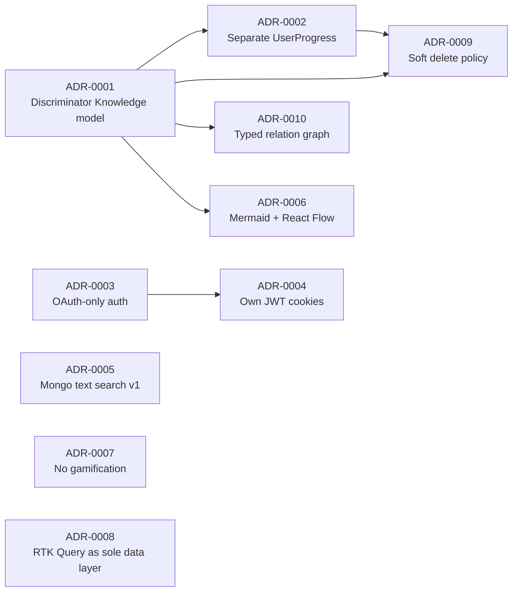

# 20 — Architecture Decision Records

> The log of DevAtlas's contestable-at-the-time architecture decisions, in Michael Nygard's standard ADR shape: **Title, Status, Context, Decision, Consequences**. Every other design document in this suite (`06-database-design.md` through `16-performance-design.md`) describes the *result* of these decisions in implementation detail; this document is the one place that records *why*, so a future engineer questioning "why is personal state a separate collection" or "why no password login" finds a reasoned answer here instead of having to reverse-engineer intent from code or re-litigate a decision that was already made deliberately.
>
> **Numbering.** ADRs are numbered sequentially and never renumbered or reused, even if an ADR is later superseded — a superseded ADR stays in the log with `Status: Superseded by ADR-00XX`, it doesn't get deleted. **Status values used in this log:** `Accepted` (the only status in use today — every decision below is already implemented and load-bearing across the rest of the doc suite), plus `Proposed`, `Deprecated`, and `Superseded` as the standard vocabulary for future entries. **Adding a new ADR:** append it at the next integer, don't renumber existing ones, and cross-reference it from whichever design doc it governs (the existing docs already do this — see e.g. `06-database-design.md` §0's `[[ADR-0001]]`/`[[ADR-0002]]` references).

## Index

| # | Title | Status |
|---|---|---|
| [ADR-0001](#adr-0001--unified-knowledge-card-via-mongoose-discriminators) | Unified Knowledge Card via Mongoose discriminators, instead of separate collections per content type | Accepted |
| [ADR-0002](#adr-0002--separate-userprogress-collection-for-personal-state) | Personal state (bookmark/favorite/pin/revision/notes) in a separate `UserProgress` collection, not embedded in `Knowledge` | Accepted |
| [ADR-0003](#adr-0003--oauth-only-authentication-no-password-login) | OAuth-only authentication (Google + GitHub via Passport), no password login | Accepted |
| [ADR-0004](#adr-0004--devatlas-issued-jwt-accessrefresh-cookies-post-oauth) | DevAtlas-issued JWT access/refresh cookies, minted post-OAuth, instead of relying on provider sessions | Accepted |
| [ADR-0005](#adr-0005--mongodb-weighted-text-index-for-v1-search) | MongoDB weighted text index for v1 search, instead of a dedicated search engine | Accepted |
| [ADR-0006](#adr-0006--react-flow-for-interactive-diagrams--mermaid-for-static-diagrams) | React Flow for interactive diagrams + Mermaid for static diagrams — two rendering paths, one data model | Accepted |
| [ADR-0007](#adr-0007--no-gamification-mechanics-by-product-principle) | No gamification mechanics, by product principle | Accepted |
| [ADR-0008](#adr-0008--redux-toolkit--rtk-query-as-the-single-client-statedata-layer) | Redux Toolkit + RTK Query as the single client state/data-fetching layer | Accepted |
| [ADR-0009](#adr-0009--soft-delete-for-canonicalreferenced-content-hard-delete-for-personal-data) | Soft delete for canonical/referenced content, hard delete for personal/append-only data | Accepted |
| [ADR-0010](#adr-0010--fixed-typed-relationship-graph-instead-of-similarity-based-related-content) | Fixed, typed relationship graph (9 edge types) instead of similarity-based "related content" | Accepted |

---

## ADR-0001 — Unified Knowledge Card via Mongoose Discriminators

**Status:** Accepted — 2026-07-15

### Context

DevAtlas's core philosophy holds that a concept explainer, a DSA problem, an interview question, and a project case study are the same underlying object, differing only in type-specific fields and rendering emphasis (`01-product-vision.md` §3). Concretely:

- The four content types share roughly 80%+ of their field surface: `title`, `slug`, `category`, `tags`, `difficulty`, `status`, `readTimeMinutes`, the entire `content` sub-shape (`tldr`, `explanation`, `visualization`, `codeExamples`, `mistakes`, `interviewQuestions`), `resources[]`, `attachments[]`, `relations[]`, `companies[]`, and author metadata.
- The type-specific residue is genuinely small: `dsa` adds `pattern`/`complexity`/`constraints`/`hints`; `interview` adds `role`/`realProjectExampleRef`; `project` adds the case-study block set; `concept` adds nothing at all.
- Every cross-cutting feature DevAtlas needs — search, the revision queue, the relations graph, "recently viewed," admin taxonomy filtering — must query or aggregate across *all four types uniformly*, in one shot ("give me the 20 cards due for revision, regardless of type"; "search across everything").
- The alternative seriously considered was four separate collections (`concepts`, `dsaQuestions`, `interviewQuestions`, `projects`), each with its own schema.

### Decision

Model everything as one `knowledges` collection, using a single Mongoose base schema plus four Mongoose discriminators (`concept`, `dsa`, `interview`, `project`) keyed on a `type` field, per `06-database-design.md` §4. `type` is required and immutable after create, and is the fixed discriminator key across the schema layer, the Zod validators (sourced from the same `constants.js` enum), and the frontend's RTK Query tag types.

### Consequences

- **Positive:** search, revision queries, relation-graph queries, and "recently updated" all run as a single-collection query or aggregation with no fan-out/`$unionWith` gymnastics; `06-database-design.md` §11's index set (slug, `{type,status,category}`, tags, `relations.knowledge`, weighted text) covers all four types from one index plan. Adding a fifth type later, if ever needed, is "add a discriminator," not "stand up a new collection plus new search/revision/relation wiring for it" — the direct target of `03-srs.md` NFR-MAINT-02.
- **Positive:** the frontend gets the identical benefit at the component level — one `KnowledgeDetailPage`/skeleton component tree renders all four types, enforcing `01-product-vision.md`'s "same skeleton, no exceptions" principle at the data-model level, not just as UI discipline.
- **Negative:** the base schema carries fields that are semantically empty for some types (a `concept` card has zero discriminator-specific fields at all). Accepted because it's cheap — a handful of unused optional fields per document — against the real cost of the rejected alternative: four schemas to keep in sync, and four sets of cross-cutting query logic to maintain in lockstep.
- **Negative:** a Mongoose discriminator model puts a real ceiling on how divergent a "type" can be from the base shape before the model strains. This is accepted as a *feature*, not merely tolerated: `01-product-vision.md`'s risk register treats "a content type that doesn't fit the fixed page skeleton" as a signal to reconsider the type, never the architecture (mirrored in `02-prd.md` §10's Risks table).
- **Negative:** every schema change to the shared base (e.g. a new field on `content`) touches all four types at once, whether they need it or not. Mitigated by the content shape having been stable since `06-database-design.md` was authored, and by any genuinely type-specific field having an obvious home in that type's own discriminator schema.
- **Follow-on:** this is the direct ancestor of ADR-0002 (personal state must *not* go here) and the shared mechanism ADR-0006 and ADR-0010 both build on top of.

---

## ADR-0002 — Separate `UserProgress` Collection for Personal State

**Status:** Accepted — 2026-07-15

### Context

Every card can carry per-user state: bookmarked, favorited, pinned, a personal note, a revision level and history, a completion status. This state is fundamentally different in shape and access pattern from canonical content — it's per-`(user, card)`, comparatively write-heavy against canonical content's read-heavy/rarely-written nature, and it must never be visible to any other user, not even an admin (`15-security-design.md` §3.2's "no admin bypass" rule).

The alternative seriously considered — embedding an array of `{user, bookmarked, ...}` subdocuments directly on the `Knowledge` document — was rejected as soon as the access pattern was stated plainly: a popular card read by thousands of users would carry a proportionally huge array inside the one canonical document *everyone* fetches just to read the content, making every card read pay a cost proportional to its total readership, and turning every personal-state write into a contested update on a document an admin owns, not the reading user.

### Decision

Model personal state as its own `userprogresses` collection, one document per `(user, knowledge)` pair, enforced by a unique compound index (`06-database-design.md` §5). A row is created lazily on first interaction, never pre-provisioned for every `(user, card)` pair. Revision re-queue state (`level`, `nextRevisionAt`, `history[]`) and personal notes both live here, never on `Knowledge`.

### Consequences

- **Positive:** `Knowledge.findOne({slug})` for a card read stays O(card size) regardless of how many users have interacted with it — canonical read latency never degrades as the user base grows, which is exactly `03-srs.md` NFR-SCALE-03's O(1) personal-state lookup guarantee, and directly protects NFR-PERF-01's 300ms read budget.
- **Positive:** the "no admin bypass" privacy guarantee is structurally enforced, not policy-enforced — there is no query path from any admin-scoped controller into another user's `userprogresses` row, because no admin route ever joins into this collection by anything other than the caller's own `req.user._id`.
- **Positive:** this is what makes the Revision view (`GET /progress/revision/due`) a single, fully index-covered `find` (`06-database-design.md` §11's `{user, revision.isMarkedForRevision, revision.nextRevisionAt}` compound), rather than a join into `Knowledge` for state that was never content to begin with.
- **Negative:** every card-detail render now needs a second query (`GET /progress/:knowledgeId` alongside `GET /knowledge/:slug`) to know "is this bookmarked, what's my note" for the logged-in viewer — an accepted extra round trip in exchange for the isolation properties above.
- **Negative:** cross-collection consistency needs an explicit answer — "delete this `Knowledge` card, what happens to the `userprogresses` rows pointing at it." DevAtlas's answer is that `Knowledge` soft-deletes (see ADR-0009), so a `userprogresses` row pointing at a soft-deleted card simply resolves to a card the UI marks unavailable, with no cascading delete required.
- **Related, not a separate ADR:** `Annotation` (per-user text highlights) follows the identical reasoning as its own third, separate collection — span-anchored data has an even more clearly independent lifecycle (its own `PATCH`/`DELETE :id`) than a per-card upsert-shaped document, per `19-coding-standards.md` §4's embedded-vs-own-collection rule. Not restated as its own ADR because it's the same decision applied a second time, not a new one.

---

## ADR-0003 — OAuth-Only Authentication, No Password Login

**Status:** Accepted — 2026-07-15

### Context

DevAtlas's target user — a software engineer — has near-universal Google and/or GitHub account coverage (`03-srs.md` Assumption A-1). Password-based auth carries a permanent, compounding liability surface regardless of implementation care: hashing/rotation policy, credential-stuffing defense, "forgot password" flows (themselves a common account-takeover vector via email) — none of which is core to what DevAtlas is trying to be. DevAtlas's target moment of use is also frequently interview-prep under real time pressure, where login friction (a forgotten password) is a specifically bad experience, versus "Continue with Google" being a single click for a user already signed into their primary identity provider on their own machine.

### Decision

Authentication is OAuth-only, via exactly two providers: Google (`passport-google-oauth20`) and GitHub (`passport-github2`). No password field exists on `User` (`06-database-design.md` §2). No `/register` or `/login` endpoint accepting a request body exists anywhere in the API (`07-api-design.md` §1) — `/auth/google/callback` and `/auth/github/callback` are the only two routes in the entire API that ever issue tokens. This is enforced structurally — no `LocalStrategy` import anywhere in `config/passport.js` (`08-backend-architecture.md` §4) — rather than by a runtime guard, specifically so the constraint can't quietly regress via a "just for testing" password path added later.

### Consequences

- **Positive:** an entire classic vulnerability category — credential stuffing, weak/reused passwords, password-reset-flow abuse — is architecturally absent, not merely defended against.
- **Positive:** account identity is provider-verified (email comes from Google/GitHub's own verified-email claim, `15-security-design.md` §2) rather than self-asserted at signup, which is what makes automatically linking a second provider to the same account by matching email (`findOrCreateOAuthUser`) safe to do without a separate verification step.
- **Negative:** a user without a Google or GitHub account, or unwilling to grant OAuth scopes, cannot use DevAtlas at all. Accepted as low risk given the target persona (`02-prd.md`'s Risks table), but a real exclusion, not a hypothetical one.
- **Negative:** DevAtlas takes on a hard external dependency on two third-party identity providers' uptime and API stability — an outage at either blocks *new* logins, though existing sessions are unaffected, since DevAtlas's own JWT (ADR-0004) is what's actually checked per request.
- **Negative:** this forecloses an entire future feature category (password-fallback-assuming enterprise SSO patterns) without a deliberate, documented reversal. Accepted because `01-product-vision.md` §12 lists this as a *permanent* exclusion, not a v1 shortcut, and `18-future-roadmap.md` §12 restates it as such.
- **Follow-on:** directly motivates ADR-0004 — OAuth-only login still leaves DevAtlas needing to own session lifecycle (refresh, revocation, prompt role propagation), which a provider's own session cookie can't give it.

---

## ADR-0004 — DevAtlas-Issued JWT Access/Refresh Cookies, Post-OAuth

**Status:** Accepted — 2026-07-15

### Context

Once a user completes Google/GitHub OAuth, DevAtlas needs a way to recognize them on every subsequent request without re-running the OAuth handshake each time. Two broad options exist: (a) keep a server-side session (Passport's traditional `session: true` plus a session store), or (b) mint DevAtlas's own stateless JWT pair after the OAuth callback and never touch Passport sessions again. DevAtlas's API is meant to scale horizontally with zero sticky-session infrastructure (`03-srs.md` NFR-SCALE-01) — a server-side session store is exactly the kind of shared state that complicates that. DevAtlas also needs its own concept of `role` (`user`/`admin`) and `isActive` (deactivation) to take effect promptly on the very next request after an admin changes it — a concern entirely orthogonal to "is this person who they say they are," which is all a provider's session actually attests to.

### Decision

Passport strategies run with `session: false` (`08-backend-architecture.md` §4) — Passport's only job is the OAuth code-exchange handshake. Immediately after a successful callback, DevAtlas mints its own short-lived access JWT (15m default) and longer-lived refresh JWT (30d default), both set as `httpOnly`/`Secure`(prod)/`SameSite` cookies (`15-security-design.md` §4–§5). The refresh token is additionally persisted server-side as a sha256 hash on `User.refreshTokenHash`, enabling real revocation (logout, reuse detection) despite the access token itself being fully stateless.

### Consequences

- **Positive:** the API tier is genuinely stateless — any Node instance behind a load balancer can verify any request using only the JWT signature plus a fresh DB read of the current `User` document, satisfying NFR-SCALE-01 without a shared session store.
- **Positive:** role and deactivation changes take effect within one access-token TTL (≤15 minutes) at the absolute worst case, immediately on next refresh — because `verifyRole` always reads a freshly-loaded `User.role` from the DB, never trusting the JWT's embedded role claim for authorization, only for minting (`15-security-design.md` §3.1).
- **Positive:** revocation is real, not cosmetic — logout nulls `refreshTokenHash` server-side, so a copy of an old cookie that somehow survives client-side is provably useless on its next use.
- **Negative:** meaningfully more mechanism than "just use Passport sessions" — DevAtlas owns rotation-on-use, reuse detection, and a two-different-secrets discipline (access vs. refresh) itself, real surface area to get right, including a documented known limitation (a concurrent-multi-tab-refresh race, tracked in `15-security-design.md` §4, not re-litigated here).
- **Negative:** two cookies with two different lifetimes and rotation semantics is inherently more moving parts than one session cookie. Accepted because the payoff — statelessness, fine-grained revocation, and prompt role propagation — matters specifically for a product where an admin promotion or deactivation needs to take effect immediately, not "eventually, once the session store catches up."
- **Related:** this is also why `verifyJWT` accepts an `Authorization: Bearer` fallback today even though the web SPA never uses it (`15-security-design.md` §4) — a stateless, provider-independent token is what makes a future non-browser client a non-event rather than a redesign; see `18-future-roadmap.md` §6 (Mobile App).

---

## ADR-0005 — MongoDB Weighted Text Index for v1 Search

**Status:** Accepted — 2026-07-15

### Context

Search must work across all four Knowledge types on day one, with facet filters (type/category/difficulty/company) and reasonable relevance ranking — a title match should outrank a passing mention buried in another card's explanation. Dedicated search infrastructure (Elasticsearch/OpenSearch, or MongoDB Atlas Search) offers materially better relevance — BM25-class scoring, fuzzy/typo tolerance, synonym expansion — than Mongo's built-in `$text` operator. At MVP's assumed content volume (`03-srs.md` A-2/A-3: tens to low-thousands of cards in year one, hundreds to low-thousands of MAU) and infrastructure budget (`02-prd.md` Business Goal 4: cost proportional to a bootstrapped/small-team budget), standing up and operating a second search-specific service is a disproportionate cost relative to the relevance gap it closes at this scale.

### Decision

Ship v1 search entirely on MongoDB's native weighted `$text` index (`title:10, tags:5, content.tldr:3, content.explanation:1`, `06-database-design.md` §11), queried from a single `search.controller.js` call site, with facet counts computed via a parallel `$group` aggregation in the same request (`16-performance-design.md` §2). No Elasticsearch, no Atlas Search, at MVP.

### Consequences

- **Positive:** zero additional infrastructure — search lives inside the same MongoDB deployment everything else already uses, with no second data store to keep in sync, back up, or reason about consistency for.
- **Positive:** the weight-tuning lever (per-field weights) is legible and sufficient for the stated MVP relevance bar without needing a search-relevance specialist to operate it.
- **Negative, explicitly accepted:** no fuzzy/typo tolerance, no synonym expansion, and relevance quality will visibly plateau as content volume grows well past MVP scale. This is a documented, known limitation (`03-srs.md` FR-SRCH-05: "explicitly out of scope for MVP search; this is documented as a known limitation, not a defect"), not an oversight.
- **Mitigation designed in from day one:** `search.controller.js` is kept as the *only* call site that ever builds a `$text` query anywhere in the codebase (`16-performance-design.md` §2's stated invariant) — this is what keeps a future engine swap contained to one controller (or a `SearchService` extraction) instead of a codebase-wide hunt for scattered inline queries. `03-srs.md` NFR-SCALE-05 states this seam as an explicit architectural requirement, not an incidental nicety.
- **Future:** `18-future-roadmap.md` §5 names the concrete trigger conditions (sustained p95 breach, or a documented content-volume threshold) for revisiting this decision. Unlike philosophy-level ADRs such as ADR-0003 or ADR-0007, this ADR is explicitly written to be revisited once its own named triggers fire, not treated as permanent.

---

## ADR-0006 — React Flow for Interactive Diagrams + Mermaid for Static Diagrams

**Status:** Accepted — 2026-07-15

### Context

The Visualization section of a Knowledge Card needs to communicate structure — a flow, a state machine, an architecture diagram, a traversal — sometimes as a simple, admin-authored static diagram, and sometimes with the specific value of letting a reader drag/rearrange/explore a node graph spatially (e.g. a multi-service architecture diagram). These are genuinely different tools with different strengths: Mermaid renders from a compact text DSL — fast to author, easy to diff/review as plain text, but static output, an SVG, not an interactive canvas. React Flow (`@xyflow/react`) is a full node/edge canvas library — draggable, pannable, zoomable at view time — but authored as structured JSON (`{nodes, edges}`), not a one-line text DSL. Forcing everything through only one of the two would either lose interactivity everywhere (Mermaid-only) or force trivial diagrams through a heavyweight node-graph editor for no reason (React Flow-only).

### Decision

Support both, chosen per-card by the admin author, via one discriminator-shaped field: `content.visualization = { kind: "none"|"mermaid"|"flow", mermaidSource?, flow? }` (`06-database-design.md` §4.1). `kind` is the dispatcher; exactly one of `mermaidSource`/`flow` is populated depending on it. The frontend's `VisualizationBlock.jsx` reads `kind` and renders either `MermaidDiagram` or `FlowDiagram` — never both, never a third bespoke path.

### Consequences

- **Positive:** one field, one section of the fixed skeleton, two admin-choosable rendering strategies — keeping "same skeleton, every card" (`01-product-vision.md`) intact at the data-model level. There is no "cards with Mermaid" versus "cards with React Flow" divergence anywhere above `content.visualization.kind`.
- **Positive:** each library is used for what it's actually good at — Mermaid for fast-to-author, easy-to-diff static diagrams (the majority case), React Flow specifically for the cards where spatial exploration is the point (the reference example: architecture diagrams).
- **Negative:** two rendering libraries means two dependencies, two bundle-size line items, and two sets of edge cases (malformed Mermaid source, a corrupt/empty `flow` JSON) that both must degrade to a contained "diagram unavailable" state without breaking the rest of the card (`03-srs.md` NFR-REL-02), not a shared error-handling shortcut.
- **Negative:** both libraries are non-trivial enough to warrant being kept out of the main JS bundle — mitigated architecturally, not just noted: both are dynamic-imported behind an `IntersectionObserver` gate, as a chunk separate from Card Detail itself (`16-performance-design.md` §4, `09-frontend-architecture.md` §2.5), so a text-only `concept` card — the majority of MVP content — never downloads either library.
- **Negative:** React Flow interactivity is explicitly view-time-only in MVP — a reader's dragged node positions are not persisted per-user (`03-srs.md` FR-CARD-07); the diagram always resets to the admin-authored layout on reload. A deliberate scope cut, not a bug, and not currently scheduled in `18-future-roadmap.md`.
- **Security note, carried by this ADR, detailed elsewhere:** both rendering paths handle admin-authored-but-potentially-compromised-account input, so both must sanitize at render time — Mermaid's `securityLevel: "strict"`, React Flow node labels routed through the same sanitized text path as markdown, never `dangerouslySetInnerHTML` — full rationale in `15-security-design.md` §9.

---

## ADR-0007 — No Gamification Mechanics, by Product Principle

**Status:** Accepted — 2026-07-15

### Context

The dominant pattern in adjacent products — flashcard apps, habit trackers, LeetCode-style trackers — is engagement gamification: streaks, XP, levels, badges, leaderboards, mechanics with a proven track record of increasing daily-open rates. DevAtlas's stated purpose is durable technical understanding, not daily engagement for its own sake, and its target user (an engineer under real interview-prep pressure, `01-product-vision.md` Persona 1) is specifically someone poorly served by guilt-based re-engagement mechanics ("you lost your streak") during an already-stressful period. Gamification metrics also actively distort the signal DevAtlas needs: a streak counter rewards *opening the app*, not *understanding recursion*; a "cards completed" counter rewards *marking things done*, not *retaining them* — directly opposed to what the forgot/shaky/confident revision signal is trying to measure honestly.

### Decision

No streaks, XP, coins, badges, levels, leaderboards, motivational/guilt-based copy, or vanity analytics/engagement charts appear anywhere in the product, in any module, at any phase — not a v1 deferral, a permanent product-principle exclusion (`01-product-vision.md` §12, restated as `02-prd.md` NFR-8: "no notification, modal, or UI copy may use guilt-based or streak-based language"). Progress is surfaced only as honest, factual state — mastered/shaky/not-reviewed, due/overdue counts, plain numbers — never a score.

### Consequences

- **Positive:** every future feature request that smells like "make X more addictive/sticky" has a bright-line answer before design even starts — a real velocity win, since it avoids repeated re-litigation per feature.
- **Positive:** the product's own success metrics are forced to be honest ones instead — `01-product-vision.md` §11 measures revision *effectiveness* (does a confident-marking predict actual retention), graph density, and cross-module traversal, none of which can be gamed by simply opening the app more.
- **Negative:** DevAtlas deliberately forgoes a class of engagement mechanics with a well-documented track record of increasing daily-active-user metrics — a real, accepted trade against a common growth lever, justified by the product's stated thesis that engagement-for-its-own-sake actively undermines the "durable understanding" goal (`01-product-vision.md` §5).
- **Negative:** this constrains even well-intentioned future features — an opt-in revision reminder digest (`18-future-roadmap.md` §6) must be designed as a neutral "these cards are due" notice, never a "don't break your streak" nudge, narrowing the design space for re-engagement features relative to competitors unconstrained by this principle.
- **Enforcement:** unlike most ADRs in this log, this one is explicitly a *design-review* and *copywriting* constraint as much as a code one — `02-prd.md` NFR-8 calls it out as "enforced as a non-functional constraint on copywriting and notification design, not just a feature exclusion," and `03-srs.md` §8.8 names a literal release-checklist item: "zero instances of streak/XP/badge/points UI... verified as an explicit release checklist item, not an assumption."

---

## ADR-0008 — Redux Toolkit + RTK Query as the Single Client State/Data Layer

**Status:** Accepted — 2026-07-15

### Context

The frontend needs both server-state management (fetching/caching Knowledge Cards, progress, search results, and so on) and a small amount of genuinely client-only UI state. DevAtlas's data model is heavily relational at the client too — a card detail view needs its own data, plus this user's progress on it, plus this user's annotations on it, plus related cards' summaries — and mutating any one of those (e.g. submitting a revision) needs to correctly invalidate/refresh exactly the right set of other cached views (e.g. the Dashboard's due-count) without over- or under-invalidating. Alternatives seriously considered: React Query/TanStack Query paired with a separate lightweight client-state library (Zustand/Jotai/Context), or an ad hoc `useEffect` + `fetch` approach with local component state.

### Decision

RTK Query is the *only* data-fetching mechanism in the frontend — every piece of server state goes through an RTK Query endpoint injected into one root `apiSlice` (`09-frontend-architecture.md` §3.2–§3.3). No component performs a bare `fetch`/`axios` call or reaches for a second caching library anywhere. The one hand-written Redux slice (`authSlice`) is deliberately not an independent data source — it's populated exclusively via `extraReducers` matchers against RTK Query's own lifecycle actions, existing only to give a few call sites (`AdminRoute`, sidebar role-gating) a cheap synchronous selector without subscribing to the full query lifecycle. Theme state is kept out of Redux entirely, owned by `next-themes` instead.

### Consequences

- **Positive:** exactly one cache, one invalidation model, one loading/error shape (`{data, isLoading, isFetching, isError}`) for every screen in the app — a new engineer never has to ask "which data-fetching pattern does this page use," because there's only one (`09-frontend-architecture.md` §9's own checklist: "Server data → an RTK Query endpoint... Never a hand-written slice, never a bare fetch").
- **Positive:** RTK Query's tag-based invalidation is expressive enough to model DevAtlas's real cross-feature dependencies precisely — e.g. a revision submission invalidates `Progress`, `ProgressList`, *and* `Dashboard` tags together (`16-performance-design.md` §5.1), a correctness requirement (a stale due-count is a wrong due-count), not just a caching nicety, and one that would need to be hand-rolled under any lower-level fetch approach.
- **Positive:** `setupListeners` gives `refetchOnFocus`/`refetchOnReconnect` globally for free — a backgrounded tab self-heals its cache on refocus with zero per-query configuration, which matters for a reading-heavy app where tabs stay open a long time.
- **Negative:** RTK Query's mental model (tags, endpoint injection, `transformResponse`) is more upfront machinery than "just call fetch in a `useEffect`." Mitigated by `lib/apiHelpers.js`'s `unwrap`/`transformError`/`toQueryString` trio being mandatory on every endpoint (`09-frontend-architecture.md` §3.4), keeping the `ApiResponse`/`ApiError` envelope from ever leaking into component code and centralizing the boilerplate rather than repeating it per-endpoint.
- **Negative:** React's `Suspense`-for-data pattern is explicitly not adopted (`09-frontend-architecture.md` §8) — a deliberate consequence of this choice, since mixing RTK Query's classic hook consumption with `useSuspenseQuery` for only some endpoints would produce two different loading-state idioms in the same app, exactly the inconsistency this ADR exists to prevent.
- **Negative:** server data and ephemeral client UI state now live in conceptually different places (RTK Query cache vs. plain slices vs. component `useState`). Mitigated by a stated, narrow rule for when a new plain slice is ever justified (`09-frontend-architecture.md` §3.2: only client-only state read from a component that didn't trigger it, with no server representation), so "which one do I use" has a documented answer instead of an ad hoc one per feature.

---

## ADR-0009 — Soft Delete for Canonical/Referenced Content, Hard Delete for Personal Data

**Status:** Accepted — 2026-07-15

### Context

DevAtlas has two very different data lifecycles: admin-curated canonical content that other documents reference by ID (`Knowledge`, `Category`, `Company`, `Resource` — referenced from `relations[]`, `Knowledge.category`, `Knowledge.companies`, `Knowledge.resources`), and personal/append-only data with no second document pointing at it (`UserProgress`, `Annotation`, `Activity`, `Attachment`). A hard delete on a referenced document leaves every reference dangling — a `relations[]` entry pointing at a deleted `Knowledge._id`, a category tree with a hole in it. Applying soft-delete uniformly everywhere — the "just add `isDeleted` to everything" shortcut — would also be wrong: a personal note or a highlight has no second document referencing it, so there's no dangling-reference risk to guard against, and indefinitely retaining "deleted" personal data is a worse privacy default than actually deleting it on request.

### Decision

Apply soft-delete (`isDeleted: Boolean` + `deletedAt: Date`) precisely to documents meeting both: (a) something else holds a live reference to it that would dangle, and (b) an admin might plausibly want to restore it. That's exactly `Knowledge`, `Category`, `Company`, `Resource` — all four admin-curated and all four referenced from elsewhere. Everything else hard-deletes: `User` uses `isActive: false` for deactivation instead (a person isn't "restored," an account is reactivated — a deliberately different verb and mechanism), and `UserProgress`/`Annotation`/`Activity`/`Attachment` carry no soft-delete field at all (`19-coding-standards.md` §4).

### Consequences

- **Positive:** every query against soft-deletable collections has one consistent extra predicate (`isDeleted: false`) to remember, and exactly four collections need it — not a codebase-wide convention applied inconsistently.
- **Positive:** personal data genuinely goes away on delete, the correct privacy default, avoiding an ever-growing set of "deleted" rows for data that was never meant to be retained past user intent.
- **Negative:** the four soft-deletable collections now require checking for and rejecting on live references before actually removing anything — e.g. `DELETE /categories/:id` returns `409` if it has non-deleted children or published `Knowledge` docs referencing it (`07-api-design.md` §3) — real, if small, extra logic per admin delete endpoint that a blanket hard-delete-everywhere policy wouldn't need.
- **Negative:** "restore" is not yet a built admin affordance in MVP — the field exists, the UI to un-delete doesn't. Flagged here as a known, small gap rather than a claimed feature.

---

## ADR-0010 — Fixed, Typed Relationship Graph, Instead of Similarity-Based "Related Content"

**Status:** Accepted — 2026-07-15

### Context

Nearly every content platform solves "what else is relevant to what I'm looking at" the cheap way: tag overlap, a "people who viewed this also viewed" collaborative-filter signal, or vector-similarity nearest-neighbor search. All three are correlational, not intentional — they surface things that look statistically related, not things an admin has actually asserted are related, and *how*. DevAtlas's stated differentiator is being a knowledge *graph*, not a wiki with good internal linking (`01-product-vision.md` §3) — its whole thesis is that the connections between concepts, problems, and projects are as valuable as the content itself, and a user should be able to answer "where does this connect to everything else I know" with a real answer, not a guess (`01-product-vision.md` §5). A similarity-based system also can't express *direction* or *kind* of relationship — "React Hooks depends on Closures" and "REST is an alternative to GraphQL" are both "related," but they mean opposite things for how a reader should act on the connection: learn the other one first, versus these are substitutes for each other.

### Decision

Relationships between Knowledge Cards are explicit, directional, admin-authored edges using exactly nine fixed types — `related_to`, `depends_on`, `used_in`, `implements`, `alternative`, `prerequisite`, `example_of`, `part_of`, `referenced_by` (`06-database-design.md` §4.1, `04-information-architecture.md` §7) — stored as `relations[]` on the source document, never inferred from tag overlap, view co-occurrence, or embedding similarity.

### Consequences

- **Positive:** every relationship on a card is intentional and reviewable — an admin looking at a card's Related Topics section is looking at curated editorial judgment, not a black-box recommendation, which matters directly for the trust bar `01-product-vision.md` sets for "what you're revising the night before an interview."
- **Positive:** directionality plus typing is what makes multi-hop, meaningful traversal possible (the worked Promise → async/await → Roomezy example, `04-information-architecture.md` §7.1) — a reader can follow `used_in` specifically to see where a concept gets applied, distinct from following `prerequisite` to see what to learn first, a distinction a flat "related" edge can't express.
- **Negative:** the graph is exactly as good as admin curation makes it — an uncurated card has zero edges and zero discoverability benefit, unlike a similarity-based system that would at least produce *something* automatically. Accepted and actively monitored, not hand-waved: graph density is a named product success metric (`01-product-vision.md` §11), and content-gap tooling surfacing zero-edge cards is explicit future admin-analytics scope (`18-future-roadmap.md` §10).
- **Negative:** authoring relations is real admin work with no shortcut — there is no "auto-suggest related cards" today. Even the future AI-assisted authoring item (`18-future-roadmap.md` §4) is deliberately framed as a *suggestion for admin review*, never an auto-applied edge, specifically to protect this ADR's core guarantee.
- **Negative:** the nine-type enum is a closed set requiring a schema/`constants.js` change plus an admin-UI dropdown update to extend. Accepted per `03-srs.md` NFR-MAINT-04, which requires exactly that and nothing more — no data migration of existing relation documents — precisely because the type lives on each edge, not as a collection-level concept.
